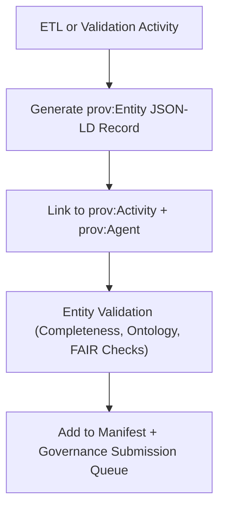

<div align="center">

# 🧱 Kansas Frontier Matrix — **TMP Provenance Staging: Entity Records**  
`data/work/staging/tabular/normalized/tmp/provenance_staging/entities/README.md`

**Purpose:** Define and track all **data entities** created, transformed, or validated within the **TMP Provenance Staging Layer** of the **Kansas Frontier Matrix (KFM)** system.  
Each JSON-LD file in this directory represents a **prov:Entity** object (a data file, record, or artifact) described through **PROV-O** and **CIDOC CRM** ontologies prior to **Governance Ledger registration**.

[](../../../../../../../../../../../../docs/architecture/repo-focus.md)
[]()
[]()
[]()
[]()

</div>

---

## 🗂️ Directory Layout

```plaintext
entities/
├── treaties_2025_10_entities.jsonld         # Normalized treaty datasets (temporary)
├── ai_reports_entities.jsonld               # AI-generated summaries and validation results
├── stac_catalog_entities.jsonld             # STAC metadata entities for geospatial assets
├── provenance_derivatives.jsonld            # Derived entities linked to TMP validation
├── checksum_entities.jsonld                 # Data integrity records for temporary artifacts
├── entity_validation_summary.json           # QA metrics for entity completeness and provenance linkage
└── README.md                                # ← You are here
```

---

## 🧭 Overview

The **Entity Records Directory** stores machine-readable definitions of all **data objects** created or processed during TMP normalization and validation.  
Each record conforms to **W3C PROV-O**, linking entities to their originating **activities** (`prov:wasGeneratedBy`) and **agents** (`prov:wasAttributedTo`), while also mapping conceptually to **CIDOC CRM** (`E28_Conceptual_Object`, `E73_Information_Object`).

These files are **temporary but fully traceable** — they serve as a **snapshot of provenance** before being merged into the final governance chain.  

Every `prov:Entity` record documents:
- Dataset origin (`prov:wasDerivedFrom`)
- Transformation activity (`prov:wasGeneratedBy`)
- Metadata integrity (checksum, validation status)
- FAIR+CARE compliance (ethical handling and openness)
- Temporal context (`prov:generatedAtTime`)

---

## ⚙️ Entity Generation Workflow



---

## 🧩 Example Entity Records

### 1️⃣ Normalized Treaty Entity

**File:** `treaties_2025_10_entities.jsonld`

```json
{
  "@context": "https://www.w3.org/ns/prov#",
  "@id": "urn:kfm:entity:KS_TREATY_1867_03_MEDICINE_LODGE",
  "prov:type": "Dataset",
  "prov:label": "Treaty of Medicine Lodge Creek (1867)",
  "prov:wasDerivedFrom": "data/raw/treaties/1867_medicine_lodge.pdf",
  "prov:wasGeneratedBy": "urn:kfm:activity:normalize_treaty_v6.3",
  "prov:wasAttributedTo": "@kfm-data-engineering",
  "prov:generatedAtTime": "2025-10-25T12:22:00Z",
  "prov:value": "Normalized treaty metadata and tabular record (FAIR+CARE compliant)",
  "checksum": "sha256:7d9b33f2764d53d0cbcc9027df03e31e7eabc99cc875...",
  "crm:equivalentEntity": "E73_Information_Object",
  "crm:P94_has_created": "E7_Activity:normalize_treaty_v6_3"
}
```

---

### 2️⃣ AI Summary Entity

**File:** `ai_reports_entities.jsonld`

```json
{
  "@context": "https://www.w3.org/ns/prov#",
  "@id": "urn:kfm:entity:AI_SUMMARY_1867_MEDICINE_LODGE",
  "prov:type": "AIValidationArtifact",
  "prov:label": "AI-Generated Treaty Summary (Medicine Lodge 1867)",
  "prov:wasDerivedFrom": "data/work/staging/tabular/normalized/treaties/metadata/ai/summaries/KS_TREATY_1867_03_MEDICINE_LODGE.json",
  "prov:wasGeneratedBy": "urn:kfm:activity:ai_summary_generation",
  "prov:wasAttributedTo": "@kfm-ai-lab",
  "prov:generatedAtTime": "2025-10-25T13:05:00Z",
  "prov:value": "Machine-generated summary text validated by human review.",
  "crm:equivalentEntity": "E33_Linguistic_Object",
  "prov:qualifiedAttribution": {
    "prov:agent": "@kfm-validation",
    "prov:role": "Reviewer"
  }
}
```

---

### 3️⃣ Derived Metadata Entity

**File:** `provenance_derivatives.jsonld`

```json
{
  "@context": "https://www.w3.org/ns/prov#",
  "@id": "urn:kfm:entity:TMP_PROVENANCE_DERIVATIVE_2025_10",
  "prov:type": "DerivedMetadata",
  "prov:wasDerivedFrom": [
    "data/work/staging/tabular/normalized/tmp/provenance_staging/activities/stac_validation_batch.jsonld",
    "data/work/staging/tabular/normalized/tmp/provenance_staging/activities/ontology_alignment_check.jsonld"
  ],
  "prov:wasAttributedTo": "@kfm-validation",
  "prov:generatedAtTime": "2025-10-25T14:00:00Z",
  "prov:value": "Consolidated validation metadata entity generated from TMP provenance staging."
}
```

---

## 🧠 Ontology Crosswalk

| PROV-O Property | CIDOC CRM Equivalent | Description |
|------------------|----------------------|--------------|
| `prov:Entity` | `E28_Conceptual_Object` | Represents digital or conceptual datasets. |
| `prov:Agent` | `E39_Actor` | Person or organization responsible for data creation. |
| `prov:wasGeneratedBy` | `P94_has_created` | Activity responsible for dataset generation. |
| `prov:wasDerivedFrom` | `P130_shows_features_of` | Indicates data inheritance from an earlier source. |
| `prov:value` | `P190_has_symbolic_content` | Captures informational content or metadata payload. |

---

## 📈 Entity Validation Metrics

**File:** `entity_validation_summary.json`

```json
{
  "generated_at": "2025-10-25T15:00:00Z",
  "total_entities": 52,
  "entities_with_valid_activity_links": 52,
  "entities_with_agent_association": 51,
  "ontology_alignment_rate": 0.981,
  "checksum_verification_passed": true,
  "governance_submission_ready": 47,
  "reviewed_by": "@kfm-validation"
}
```

---

## 🔒 Governance Integration

All entities are verified for:
- **Checksum integrity** via `/data/work/staging/tabular/normalized/treaties/checksums/archive/`
- **Ontology alignment** with CIDOC CRM/PROV-O
- **FAIR+CARE compliance** (metadata, rights, representation)
- **Human review** via `@kfm-validation` or `@kfm-governance`

Approved entities are merged into `/governance/ledger/validation/YYYY/MM/entities.jsonld`.

### Example Ledger Entry

```json
{
  "@context": "https://www.w3.org/ns/prov#",
  "@id": "urn:kfm:entity:ledger:KS_TREATY_1867_03_MEDICINE_LODGE",
  "prov:wasGeneratedBy": "normalize_treaty_v6.3",
  "prov:wasAttributedTo": "@kfm-data-engineering",
  "prov:generatedAtTime": "2025-10-25T12:22:00Z",
  "prov:value": "Normalized dataset registered in ledger.",
  "prov:used": "treaties_2025_10_entities.jsonld"
}
```

---

## ⚖️ FAIR+CARE & ISO Compliance

| Standard | Implementation | Reference |
|-----------|----------------|------------|
| **FAIR F1-F4** | Persistent URNs identify all TMP entities with global uniqueness. | treaties_2025_10_entities.jsonld |
| **CARE (Ethics)** | Ensures inclusion of Indigenous authorship and custodianship metadata. | ai_reports_entities.jsonld |
| **ISO 19115** | Metadata aligns with spatial and temporal descriptors for treaty events. | stac_catalog_entities.jsonld |
| **ISO 25012** | Data quality (integrity, completeness, accuracy) monitored through checksum verification. | entity_validation_summary.json |
| **MCP-DL v6.3** | Documentation-first provenance strategy enabling transparent reproducibility. | manifest.json |

---

## 🧾 Version History

| Version | Date | Author | Reviewer | Notes |
|----------|------|---------|-----------|--------|
| v2.0.0 | 2025-10-25 | @kfm-data-engineering | @kfm-governance | Added checksum linkage, ontology mapping table, and FAIR+CARE QA metrics. |
| v1.1.0 | 2025-10-24 | @kfm-validation | @kfm-data-engineering | Introduced derived entity structure and validation metrics. |
| v1.0.0 | 2025-10-23 | @kfm-validation | — | Initial entity provenance documentation and directory setup. |

---

<div align="center">

[]()
[]()
[]()
[]()
[]()

</div>

