<div align="center">

# 🧮 Kansas Frontier Matrix — **TMP Validation Scratch Layer (Schema & Provenance Testing)**  
`data/work/staging/tabular/normalized/tmp/validation_scratch/README.md`

**Purpose:** Provide an **isolated sandbox environment** for schema testing, ontology validation, and quality assurance of intermediate datasets before integration into the **normalized tabular repositories** of the **Kansas Frontier Matrix (KFM)** system.  
This directory serves as the **QA kernel** for FAIR+CARE-aligned data transformations and provenance verification under **MCP-DL v6.3** standards.

[](../../../../../../../../../../docs/architecture/repo-focus.md)
[]()
[]()
[]()
[]()

</div>

---

## 🗂️ Directory Layout

```plaintext
validation_scratch/
├── schema_reports/             # JSON validation reports for STAC/DCAT compliance
├── ontology_checks/            # CIDOC CRM / OWL-Time semantic mapping reports
├── provenance_tests/           # Temporary provenance JSON-LD generated from TMP runs
├── audit_flags/                # Validation error logs and manual review notes
├── qa_metrics.json             # QA telemetry metrics summary for this layer
├── validation_manifest.json    # Manifest listing all temporary validation assets
├── README.md                   # ← You are here
└── .gitkeep                    # Placeholder for version control consistency
```

---

## 🧭 Overview

This workspace enables **ETL teams, validators, and ontology curators** to perform **schema conformance tests** and **semantic audits** before finalizing normalized tabular data.  
It acts as the **intermediate verification checkpoint** between:
- `data/work/staging/tabular/normalized/tmp/normalization_buffer/`
- and  
  `data/work/staging/tabular/normalized/treaties/`

Data validated here **does not persist** beyond 48 hours unless explicitly retained for governance or quality regression analysis.

The validation_scratch layer enforces **four core testing principles**:

1. **Isolation** — Prevents unverified data from affecting normalized layers.  
2. **Traceability** — Every validation log is linked to a TMP provenance record.  
3. **Reproducibility** — Each test is deterministic, versioned, and reconstructable.  
4. **Ethical Transparency** — FAIR+CARE metadata ensures validation respects Indigenous data integrity.

---

## ⚙️ Validation Workflow

```mermaid
flowchart TD
    A["ETL Process Initiates TMP Normalization"] --> B["Temporary Files Stored in TMP"]
    B --> C["Schema Validator – stac-validate, jsonschema-cli"]
    C --> D["Ontology Check – CIDOC CRM / OWL-Time Mapping"]
    D --> E["Provenance JSON-LD Auto-Generation"]
    E --> F["Audit Summary + QA Metrics"]
    F --> G["Promotion to Normalized Layer or Flag for Review"]
```



---

## 🧩 Validation Artifacts

| Artifact | Format | Description |
|-----------|---------|-------------|
| **Schema Reports** | JSON | Results of automated schema conformity checks (STAC/DCAT, JSON Schema). |
| **Ontology Checks** | CSV / JSON-LD | Semantic validation of entities against CIDOC CRM and OWL-Time. |
| **Provenance Tests** | JSON-LD | Temporary provenance chains linking normalized TMP data to raw sources. |
| **Audit Flags** | TXT / JSON | Automatically generated error flags (missing metadata, invalid fields). |
| **QA Metrics** | JSON | Aggregate statistics for schema success, error rate, and coverage. |
| **Validation Manifest** | JSON | Metadata index for all files generated in this scratch directory. |

---

## 🧮 Example QA Metric Report

**File:** `qa_metrics.json`

```json
{
  "generated_at": "2025-10-25T14:55:00Z",
  "stac_validations_run": 84,
  "stac_pass_rate": 0.977,
  "ontology_checks_run": 84,
  "ontology_pass_rate": 0.942,
  "provenance_chain_integrity": 1.0,
  "avg_runtime_seconds": 4.8,
  "critical_errors": [
    {"file": "treaty_1853_01_kaw.json", "error": "missing 'date_signed'"},
    {"file": "treaty_1867_03_medicine_lodge.json", "error": "invalid entity mapping to E7_Activity"}
  ],
  "validation_engine_version": "v6.3",
  "validator": "@kfm-validation"
}
```

---

## 🔒 Quality Assurance Controls

| Control | Mechanism | Enforcement |
|----------|------------|-------------|
| **Schema Validation** | JSON Schema + STAC validation | Automatic (via `make stac-validate`) |
| **Ontology Conformance** | CIDOC CRM & OWL-Time alignment | Semi-automated (ontology ruleset) |
| **Provenance Verification** | PROV-O JSON-LD generation | Required for ledger registration |
| **Ethical Safeguards** | CARE principles checklists | Human review before publication |
| **Purge Policy** | TMP cleanup (`make clean-tmp`) | Every 48 hours unless retained |

All tests log outcomes into `validation_manifest.json`, which references both success and failure states.

---

## 🧾 Provenance Example

Example temporary provenance chain for a validated treaty record:

```json
{
  "@context": "https://www.w3.org/ns/prov#",
  "@id": "urn:kfm:validation:tmp:2025-10-25T14:50Z:MEDICINE_LODGE",
  "prov:wasGeneratedBy": "stac_validate.py",
  "prov:wasAttributedTo": "@kfm-validation",
  "prov:used": [
    "data/work/staging/tabular/normalized/tmp/normalization_buffer/KS_TREATY_1867_03_MEDICINE_LODGE.json"
  ],
  "prov:value": "Schema validated and ontology aligned.",
  "prov:generatedAtTime": "2025-10-25T14:50:00Z"
}
```

---

## 📊 Validation Telemetry Metrics

Telemetry from `qa_metrics.json` is periodically aggregated into global dashboards under:  
`data/work/staging/tabular/normalized/treaties/reports/validation/telemetry/`.

| Metric | Description | Target | CI/CD Hook |
|--------|--------------|---------|-------------|
| STAC Schema Pass Rate | Percent of valid STAC/DCAT schema conformance | ≥ 95% | `stac-validate.yml` |
| Ontology Alignment | CIDOC CRM & OWL-Time class mappings success rate | ≥ 90% | `ontology-check.yml` |
| Provenance Completeness | JSON-LD chain linking TMP→Source | 100% | `prov-validate.yml` |
| Critical Error Rate | Number of validation failures / total runs | ≤ 2% | `qa-audit.yml` |

---

## ⚖️ FAIR+CARE & ISO Alignment

| Principle | Implementation |
|------------|----------------|
| **FAIR F1** | Each validation artifact has unique identifiers (`validation_manifest.json`). |
| **FAIR A1** | Accessible internal JSON and JSON-LD artifacts for audit and review. |
| **CARE R** | Respect for Indigenous data review in validation scope. |
| **ISO 25012** | Continuous monitoring of data integrity and validation quality. |
| **ISO 19115** | Geospatial fields validated against standardized metadata schemas. |

---

## 🧾 Version History

| Version | Date | Author | Reviewer | Notes |
|----------|------|---------|-----------|--------|
| v2.0.0 | 2025-10-25 | @kfm-validation | @kfm-qa | Added QA telemetry schema, governance cleanup rules, and CIDOC/FAIR validation linkage. |
| v1.1.0 | 2025-10-24 | @kfm-data-engineering | @kfm-validation | Introduced ontology and schema validation staging. |
| v1.0.0 | 2025-10-23 | @kfm-data-engineering | — | Initial creation of validation scratch layer documentation. |

---

<div align="center">

[]()
[]()
[]()
[]()
[]()

</div>

