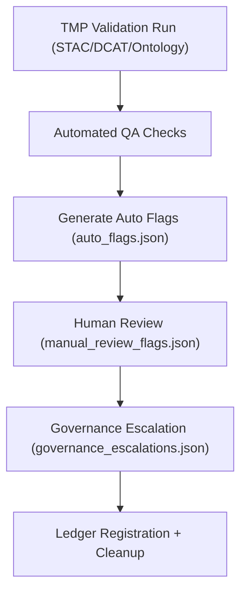

<div align="center">

# ⚠️ Kansas Frontier Matrix — **TMP Validation Scratch: Audit Flags & QA Exception Reports**  
`data/work/staging/tabular/normalized/tmp/validation_scratch/audit_flags/README.md`

**Purpose:** Maintain a **temporary repository of audit flags**, anomaly markers, and human review notes generated during schema and ontology validation for TMP datasets within the **Kansas Frontier Matrix (KFM)**.  
This workspace is where automated QA processes flag inconsistencies or deviations from FAIR+CARE or ISO data quality standards prior to formal governance review.

[](../../../../../../../../../../../docs/architecture/repo-focus.md)
[]()
[]()
[]()
[]()

</div>

---

## 🗂️ Directory Layout

```plaintext
audit_flags/
├── auto_flags.json             # Machine-generated audit flags from validation scripts
├── manual_review_flags.json    # Human-curated QA review notes or overrides
├── governance_escalations.json # Issues escalated to Ethics or Governance councils
├── faircare_flags.json         # FAIR+CARE compliance issues (e.g., access, representation)
├── metrics_summary.json        # QA flag counts and validation performance metrics
├── audit_manifest.json         # Manifest linking flags to schema/ontology reports
└── README.md                   # ← You are here
```

---

## 🧭 Overview

This directory serves as a **staging ground for all validation anomalies** detected in TMP normalization runs.  
Audit flags represent **temporary findings** that must be resolved, justified, or escalated before data promotion to the normalized repository.  
The KFM CI/CD system automatically populates this directory with results from:

- `stac-validate.yml` (schema errors)  
- `ontology-check.yml` (semantic mismatches)  
- `prov-validate.yml` (provenance inconsistencies)  
- `faircare-audit.yml` (ethical and accessibility checks)

Every flag contains a machine ID, timestamp, severity level, affected dataset, and linkage to its corresponding validation artifact.

---

## ⚙️ Audit Workflow


%% END OF MERMAID %%

---

## 🧩 Audit File Specifications

### 1️⃣ Auto-Generated Flags (`auto_flags.json`)

Automatically created by CI during schema or ontology validation.

```json
{
  "timestamp": "2025-10-25T13:45:00Z",
  "validator": "stac-validator@v3.4",
  "flags": [
    {
      "dataset": "KS_TREATY_1867_03_MEDICINE_LODGE",
      "type": "schema_error",
      "description": "Missing STAC field 'providers'.",
      "severity": "minor",
      "file": "stac_validation_reports/KS_TREATY_1867_03_MEDICINE_LODGE_report.json"
    },
    {
      "dataset": "KS_TREATY_1853_01_KAW",
      "type": "ontology_mismatch",
      "description": "CIDOC CRM E52_Time-Span not aligned with OWL-Time interval.",
      "severity": "major",
      "file": "ontology_checks/owl_time_temporal_validation.json"
    }
  ]
}
```

---

### 2️⃣ Manual Review Flags (`manual_review_flags.json`)

Curated by human QA reviewers or data stewards.

```json
{
  "reviewed_by": "@kfm-validation",
  "review_date": "2025-10-25T15:10:00Z",
  "manual_flags": [
    {
      "dataset": "KS_TREATY_1855_02_SHAWNEE",
      "comment": "Time span ambiguity acceptable given historical uncertainty.",
      "action": "Conditionally Passed",
      "ethical_review": false
    },
    {
      "dataset": "KS_TREATY_1836_05_OSAGE_CESSION",
      "comment": "Lacks explicit Indigenous party representation; escalate to CARE audit.",
      "action": "Escalate",
      "ethical_review": true
    }
  ]
}
```

---

### 3️⃣ Governance Escalations (`governance_escalations.json`)

Lists validation issues requiring **Ethics Council** or **Governance Board** oversight.

```json
{
  "escalated_at": "2025-10-25T16:00:00Z",
  "escalated_by": "@kfm-ethics",
  "issues": [
    {
      "dataset": "KS_TREATY_1836_05_OSAGE_CESSION",
      "issue": "Potential omission of tribal perspective in dataset metadata.",
      "severity": "critical",
      "assigned_to": "@kfm-governance"
    }
  ],
  "status": "Under Review"
}
```

---

### 4️⃣ FAIR+CARE Compliance Flags (`faircare_flags.json`)

Identifies issues affecting ethical data management, accessibility, and Indigenous data sovereignty.

```json
{
  "generated_at": "2025-10-25T16:15:00Z",
  "flags": [
    {
      "type": "CARE_Violation",
      "dataset": "KS_TREATY_1867_03_MEDICINE_LODGE",
      "issue": "Missing explicit acknowledgment of Indigenous data source custodians.",
      "severity": "major"
    },
    {
      "type": "FAIR_Access",
      "dataset": "KS_TREATY_1853_01_KAW",
      "issue": "No open-access license defined in DCAT metadata.",
      "severity": "minor"
    }
  ]
}
```

---

## 📊 QA Metrics

**File:** `metrics_summary.json`

```json
{
  "report_generated_at": "2025-10-25T17:00:00Z",
  "total_flags": 7,
  "auto_flags": 4,
  "manual_flags": 2,
  "governance_escalations": 1,
  "faircare_flags": 2,
  "critical_issues": 1,
  "resolved_flags": 3,
  "pending_review": 2,
  "compliance_score": 0.965,
  "validator": "@kfm-validation"
}
```

---

## 🔒 Governance Ledger Integration

All resolved and escalated flags are recorded under:  
`/governance/ledger/validation/YYYY/MM/audit_flags.jsonld`

Example PROV-O ledger entry:

```json
{
  "@context": "https://www.w3.org/ns/prov#",
  "@id": "urn:kfm:validation:audit_flags:2025-10-25",
  "prov:wasGeneratedBy": "qa_audit_v2.0",
  "prov:wasAttributedTo": "@kfm-validation",
  "prov:generatedAtTime": "2025-10-25T17:15:00Z",
  "prov:value": "Critical CARE compliance issue escalated for governance review.",
  "prov:used": "audit_flags/faircare_flags.json"
}
```

---

## ⚖️ FAIR+CARE & ISO Compliance Summary

| Standard | Implementation | Verified Artifact |
|-----------|----------------|-------------------|
| **FAIR F1-F4** | Flags linked to datasets via persistent URNs. | auto_flags.json |
| **CARE R & A** | Ensures Indigenous agency and ethical representation. | faircare_flags.json |
| **ISO 25012** | Tracks accuracy, completeness, and traceability of validation. | metrics_summary.json |
| **ISO 19115** | Metadata completeness cross-validated for flagged datasets. | governance_escalations.json |
| **MCP-DL v6.3** | Validation-first documentation approach enforcing reproducibility. | audit_manifest.json |

---

## 🧾 Version History

| Version | Date | Author | Reviewer | Notes |
|----------|------|---------|-----------|--------|
| v2.0.0 | 2025-10-25 | @kfm-validation | @kfm-governance | Added FAIR+CARE flag handling and escalation schema with governance linkage. |
| v1.1.0 | 2025-10-24 | @kfm-data-engineering | @kfm-validation | Introduced audit manifest and manual review process. |
| v1.0.0 | 2025-10-23 | @kfm-validation | — | Initial audit flag structure and reporting format. |

---

<div align="center">

[]()
[]()
[]()
[]()
[]()

</div>

