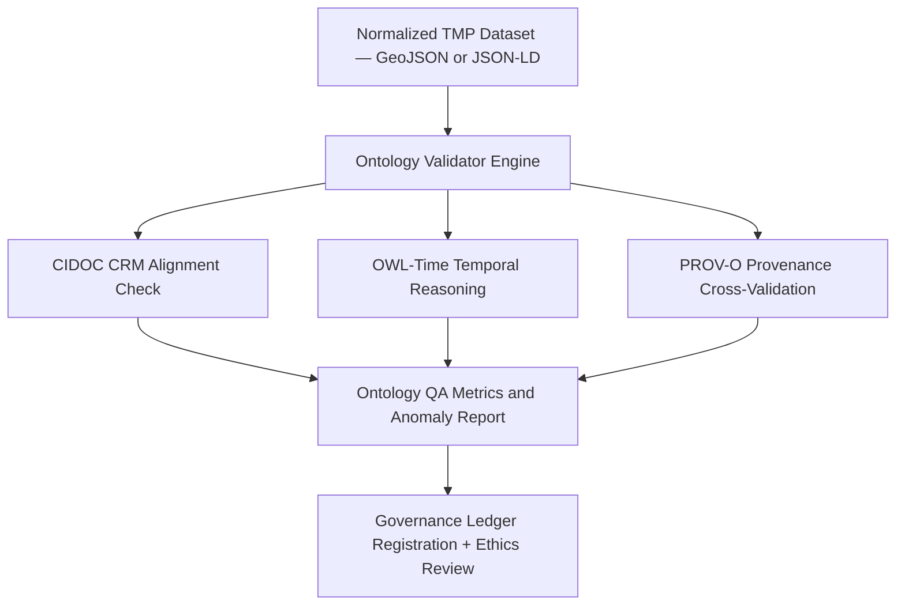

<div align="center">

# 🧬 Kansas Frontier Matrix — **TMP Validation Scratch: Ontology Checks & Semantic Alignment Reports**  
`data/work/staging/tabular/normalized/tmp/validation_scratch/ontology_checks/README.md`

**Purpose:** Validate **semantic and ontological consistency** across all TMP-stage normalized treaty datasets within the **Kansas Frontier Matrix (KFM)**.  
This workspace ensures entities, events, temporal intervals, and relationships conform to **CIDOC CRM**, **OWL-Time**, and **PROV-O** ontologies, maintaining FAIR+CARE-aligned interoperability and reproducibility.

[](../../../../../../../../../../../docs/architecture/repo-focus.md)
[]()
[]()
[]()
[]()

</div>

---

## 🗂️ Directory Layout

```plaintext
ontology_checks/
├── cidoc_alignment_reports.json        # CIDOC CRM entity relationship validation results
├── owl_time_temporal_validation.json   # OWL-Time interval consistency validation output
├── prov_alignment_summary.json         # Cross-check between PROV-O and CIDOC relationships
├── ontology_graph.ttl                  # RDF graph of ontology relationships for current TMP datasets
├── anomaly_report.json                 # Semantic anomalies or inconsistencies detected
├── qa_metrics.json                     # Semantic QA metrics for ontology validation
└── README.md                           # ← You are here
```

---

## 🧭 Overview

Ontology validation ensures that every **entity**, **event**, **place**, and **agent** defined in TMP-normalized data adheres to the KFM’s **semantic ontology stack**, which combines:

| Ontology | Scope | Function |
|-----------|--------|-----------|
| **CIDOC CRM (v7.1.2)** | Cultural heritage conceptual model | Defines historical entities and relationships (`E7_Activity`, `E21_Person`, `E53_Place`). |
| **OWL-Time** | Temporal reasoning ontology | Encodes time intervals, durations, and chronological order. |
| **PROV-O** | Provenance ontology | Links data generation, attribution, and derivation processes. |
| **DCAT 3.0** | Dataset catalog metadata | Ensures dataset discoverability through linked metadata. |

The **ontology_checks** workspace verifies that all TMP-stage transformations, provenance logs, and validation outputs remain **semantically coherent** across these ontologies.

---

## ⚙️ Validation Workflow



---

## 🧩 Core Artifacts

### 1️⃣ CIDOC CRM Alignment Report

**File:** `cidoc_alignment_reports.json`

```json
{
  "generated_at": "2025-10-25T13:45:00Z",
  "datasets_checked": 14,
  "entity_alignments": {
    "E7_Activity": 14,
    "E21_Person": 39,
    "E53_Place": 28
  },
  "relationships_validated": [
    "P14_carried_out_by",
    "P7_took_place_at",
    "P94_has_created"
  ],
  "alignment_accuracy": 0.986,
  "anomalies_detected": 2,
  "reviewed_by": "@kfm-ontology"
}
```

---

### 2️⃣ OWL-Time Temporal Validation Report

**File:** `owl_time_temporal_validation.json`

```json
{
  "timestamp": "2025-10-25T14:00:00Z",
  "datasets_validated": 14,
  "interval_checks": 42,
  "valid_intervals": 41,
  "issues": [
    {
      "dataset": "KS_TREATY_1855_02_SHAWNEE",
      "issue": "Missing end interval for event duration.",
      "severity": "minor"
    }
  ],
  "temporal_alignment_rate": 0.976,
  "ontology": "OWL-Time",
  "validator": "@kfm-validation"
}
```

---

### 3️⃣ PROV Alignment Summary

**File:** `prov_alignment_summary.json`

```json
{
  "prov_entities_checked": 37,
  "cidoc_relationship_mapped": 37,
  "unmapped_relationships": [],
  "cross_schema_integrity": 1.0,
  "notes": "All PROV-O relationships successfully mapped to CIDOC equivalents (P130, P94, P7).",
  "reviewed_by": "@kfm-validation"
}
```

---

### 4️⃣ RDF Ontology Graph

**File:** `ontology_graph.ttl`

```ttl
@prefix prov: <http://www.w3.org/ns/prov#> .
@prefix crm: <http://www.cidoc-crm.org/cidoc-crm/> .
@prefix time: <http://www.w3.org/2006/time#> .

<urn:kfm:treaty:1855_02_shawnee>
    a crm:E7_Activity ;
    crm:P7_took_place_at <urn:kfm:place:shawnee_county> ;
    crm:P14_carried_out_by <urn:kfm:agent:us_government> ;
    time:hasBeginning "1855-02-15T00:00:00Z"^^time:Instant ;
    time:hasEnd "1855-02-28T23:59:00Z"^^time:Instant ;
    prov:wasGeneratedBy <urn:kfm:etl:normalize_treaty_v6_3> .
```

---

### 5️⃣ Anomaly Report

**File:** `anomaly_report.json`

```json
{
  "detected_at": "2025-10-25T14:25:00Z",
  "anomalies": [
    {
      "type": "Temporal Misalignment",
      "dataset": "KS_TREATY_1867_03_MEDICINE_LODGE",
      "detail": "OWL-Time interval overlap inconsistent with CIDOC E7_Activity duration."
    },
    {
      "type": "Missing Ontology Mapping",
      "dataset": "KS_TREATY_1853_01_KAW",
      "detail": "P14_carried_out_by missing for E21_Person (Tribal Representative)."
    }
  ],
  "severity_distribution": {"critical": 1, "minor": 1}
}
```

---

## 📊 Semantic QA Metrics

**File:** `qa_metrics.json`

```json
{
  "generated_at": "2025-10-25T14:30:00Z",
  "total_entities_checked": 94,
  "cidoc_alignment_success_rate": 0.986,
  "temporal_alignment_rate": 0.976,
  "prov_crossmap_success_rate": 1.0,
  "critical_anomalies": 1,
  "minor_anomalies": 1,
  "ontology_validator_version": "v2.0.0",
  "reviewed_by": "@kfm-ontology"
}
```

---

## 🔒 Governance Integration

Each ontology validation run produces a PROV-O linked ledger entry in  
`/governance/ledger/validation/YYYY/MM/ontology_validation.jsonld`.

Example entry:

```json
{
  "@context": "https://www.w3.org/ns/prov#",
  "@id": "urn:kfm:validation:ontology:2025-10-25",
  "prov:wasGeneratedBy": "ontology_validator_v2.0",
  "prov:wasAttributedTo": "@kfm-ontology",
  "prov:generatedAtTime": "2025-10-25T14:35:00Z",
  "prov:value": "Ontology validation completed for 14 TMP datasets.",
  "prov:used": ["cidoc_alignment_reports.json", "owl_time_temporal_validation.json"]
}
```

---

## ⚖️ FAIR+CARE & ISO Compliance

| Standard | Implementation | Example Artifact |
|-----------|----------------|------------------|
| **FAIR F1-F4** | Entity identifiers resolvable via URNs and URI-based ontology references. | ontology_graph.ttl |
| **CARE Principle A** | Indigenous historical entities reviewed for cultural context accuracy. | anomaly_report.json |
| **ISO 19115** | Ontology fields validated against spatial-temporal metadata. | owl_time_temporal_validation.json |
| **ISO 25012** | Data quality attributes (accuracy, consistency, traceability) logged. | qa_metrics.json |
| **MCP-DL v6.3** | Documentation-first validation with schema-to-ontology reproducibility. | cidoc_alignment_reports.json |

---

## 🧾 Version History

| Version | Date | Author | Reviewer | Notes |
|----------|------|---------|-----------|--------|
| v2.0.0 | 2025-10-25 | @kfm-ontology | @kfm-governance | Expanded ontology validation for CIDOC CRM, OWL-Time, and PROV-O alignment. |
| v1.1.0 | 2025-10-24 | @kfm-validation | @kfm-data-engineering | Added RDF export and semantic QA metrics integration. |
| v1.0.0 | 2025-10-23 | @kfm-validation | — | Initial ontology validation scratch directory and structure. |

---

<div align="center">

[]()
[]()
[]()
[]()
[]()

</div>

