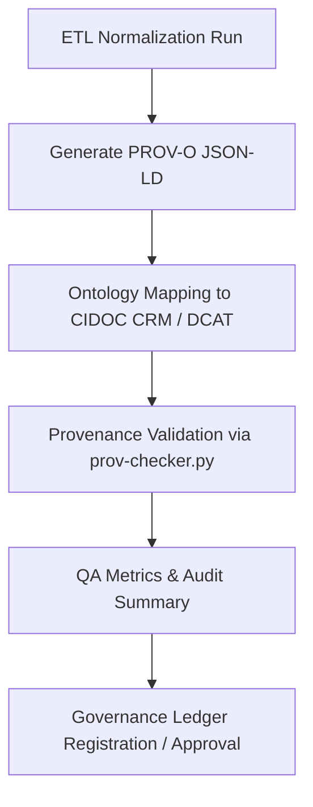

<div align="center">

# 🧾 Kansas Frontier Matrix — **TMP Validation Scratch: Provenance Tests & Lineage Validation**  
`data/work/staging/tabular/normalized/tmp/validation_scratch/provenance_tests/README.md`

**Purpose:** Provide an **automated and human-verifiable testing environment** for validating provenance metadata generated during ETL normalization and schema validation workflows in the **Kansas Frontier Matrix (KFM)**.  
This directory ensures all temporary entities in TMP carry **PROV-O compliant lineage**, cross-referenced to the **Governance Ledger**, enabling full **traceability** and **ethical accountability** in accordance with **FAIR+CARE** and **MCP-DL v6.3** standards.

[](../../../../../../../../../../../docs/architecture/repo-focus.md)
[]()
[]()
[]()
[]()

</div>

---

## 🗂️ Directory Layout

```plaintext
provenance_tests/
├── prov_chain_tmp_2025-10-25.jsonld       # Sample PROV-O JSON-LD generated for TMP dataset
├── prov_audit_summary.json                # Rollup summary of validation coverage and linkage quality
├── provenance_graph.ttl                   # RDF Turtle file representing temporary provenance graph
├── ontology_mappings.json                 # Mapping between PROV-O and CIDOC CRM entities
├── prov_errors.json                       # Validation errors and inconsistencies in provenance chains
├── qa_metrics.json                        # Provenance QA telemetry report
└── README.md                              # ← You are here
```

---

## 🧭 Overview

The **Provenance Tests** subdirectory verifies that all temporary datasets in the TMP layer:
- Contain **complete lineage metadata** describing their derivation, transformations, and validation.  
- Follow **W3C PROV-O**, **CIDOC CRM**, and **DCAT 3.0** semantic standards for machine-readable provenance.  
- Can be linked via **URI-based identifiers** to raw inputs, ETL scripts, AI validators, and human reviewers.  
- Pass validation prior to registration in the **KFM Governance Ledger** and **FAIR repository index**.

Each JSON-LD or RDF file generated here forms part of a **verifiable chain of custody** for each data transformation event.

---

## ⚙️ Provenance Validation Workflow




---

## 🧩 Core Provenance Artifacts

### 1️⃣ PROV-O JSON-LD (Temporary Chain)

**File:** `prov_chain_tmp_2025-10-25.jsonld`

```json
{
  "@context": "https://www.w3.org/ns/prov#",
  "@id": "urn:kfm:tmp:provenance:2025-10-25:KS_TREATY_1867_03_MEDICINE_LODGE",
  "prov:wasGeneratedBy": "normalize_treaty_data_v6.3",
  "prov:wasAttributedTo": "@kfm-data-engineering",
  "prov:used": [
    "data/raw/treaties/1867_medicine_lodge.csv",
    "schemas/normalized_treaty_schema.json"
  ],
  "prov:wasInformedBy": "@kfm-validation",
  "prov:generatedAtTime": "2025-10-25T13:42:00Z",
  "prov:qualifiedAssociation": {
    "prov:agent": "@kfm-validation",
    "prov:role": "Validator"
  },
  "prov:value": "Schema validated and normalized treaty record.",
  "prov:wasDerivedFrom": "data/raw/treaties/archive/us_treaty_docs.pdf"
}
```

---

### 2️⃣ Ontology Mappings (`ontology_mappings.json`)

Defines equivalencies between PROV-O classes and CIDOC CRM concepts for semantic consistency.

```json
{
  "PROV-O_to_CIDOC_CRM": {
    "prov:Activity": "E7_Activity",
    "prov:Entity": "E28_Conceptual_Object",
    "prov:Agent": "E39_Actor",
    "prov:wasDerivedFrom": "P130_shows_features_of",
    "prov:wasGeneratedBy": "P94_has_created"
  },
  "Mappings_Last_Updated": "2025-10-25T14:00:00Z",
  "Mapped_By": "@kfm-ontology"
}
```

---

### 3️⃣ QA Metrics (`qa_metrics.json`)

Summarizes the coverage, completeness, and linkage strength of all provenance chains.

```json
{
  "generated_at": "2025-10-25T14:30:00Z",
  "provenance_files_tested": 47,
  "valid_prov_chains": 47,
  "invalid_links": 1,
  "missing_agents": 0,
  "missing_entities": 0,
  "ontology_alignment_rate": 0.986,
  "prov_completeness_score": 0.994,
  "audit_result": "PASS",
  "reviewed_by": "@kfm-validation"
}
```

---

### 4️⃣ Provenance Error Report (`prov_errors.json`)

Captures inconsistencies or missing references in PROV-O or CIDOC CRM mappings.

```json
{
  "detected_at": "2025-10-25T14:45:00Z",
  "errors": [
    {
      "dataset_id": "KS_TREATY_1853_01_KAW",
      "issue": "prov:wasDerivedFrom missing reference to raw source file.",
      "severity": "critical"
    },
    {
      "dataset_id": "KS_TREATY_1855_02_SHAWNEE",
      "issue": "CIDOC CRM mapping missing for E21_Person.",
      "severity": "warning"
    }
  ]
}
```

---

### 5️⃣ RDF Provenance Graph (`provenance_graph.ttl`)

Generated RDF Turtle representation of TMP provenance chain for SPARQL querying and external system ingestion.

```ttl
@prefix prov: <http://www.w3.org/ns/prov#> .
@prefix crm: <http://www.cidoc-crm.org/cidoc-crm/> .

<urn:kfm:tmp:KS_TREATY_1867_03_MEDICINE_LODGE>
    a prov:Entity ;
    prov:wasGeneratedBy <urn:kfm:activity:normalize_treaty_v6_3> ;
    prov:wasDerivedFrom <data/raw/treaties/1867_medicine_lodge.csv> ;
    prov:wasAttributedTo <@kfm-data-engineering> ;
    crm:P70_documents <E7_Activity:MEDICINE_LODGE_TREATY_SIGNING> .
```

---

## 🔒 Governance & Ledger Registration

Each provenance test is linked to `/governance/ledger/validation/YYYY/MM/provenance_tests.jsonld`.

Example Ledger Entry:

```json
{
  "@context": "https://www.w3.org/ns/prov#",
  "@id": "urn:kfm:validation:provenance:2025-10-25:MEDICINE_LODGE",
  "prov:wasGeneratedBy": "prov_checker_v2.1",
  "prov:wasAttributedTo": "@kfm-validation",
  "prov:wasAssociatedWith": "@kfm-governance",
  "prov:generatedAtTime": "2025-10-25T14:45:00Z",
  "prov:value": "Provenance validation successful — all lineage chains intact."
}
```

---

## 📊 Validation Metrics Summary

| Metric | Target | Description |
|--------|---------|-------------|
| Provenance Completeness | 100% | Each TMP dataset has a full lineage record (used/generated/derived). |
| Ontology Alignment Rate | ≥ 95% | CIDOC CRM + PROV-O mapping completeness. |
| Governance Registration Rate | 100% | All provenance entries registered to Ledger. |
| Ethics Review Coverage | ≥ 90% | CARE-compliant provenance references validated by Ethics Board. |
| Error Rate (Critical) | ≤ 1% | Missing or invalid `prov:wasDerivedFrom` links. |

---

## ⚖️ FAIR+CARE and ISO Compliance

| Standard | Implementation | Reference |
|-----------|----------------|------------|
| **FAIR F1-F4** | Unique, resolvable URIs for all PROV-O entities and activities. | prov_chain_tmp_*.jsonld |
| **CARE Principles** | Provenance metadata includes ethical context of Indigenous materials. | prov_audit_summary.json |
| **ISO 19115** | Spatial and temporal provenance validation via OWL-Time. | ontology_mappings.json |
| **ISO 25012** | Data integrity metrics logged under QA reports. | qa_metrics.json |
| **MCP-DL v6.3** | Documentation-first lineage generation with reproducible workflows. | provenance_graph.ttl |

---

## 🧾 Version History

| Version | Date | Author | Reviewer | Notes |
|----------|------|---------|-----------|--------|
| v2.0.0 | 2025-10-25 | @kfm-validation | @kfm-governance | Added CIDOC-CRM mappings, RDF graph export, and QA metrics integration. |
| v1.1.0 | 2025-10-24 | @kfm-data-engineering | @kfm-validation | Introduced PROV-O JSON-LD validation and ledger integration. |
| v1.0.0 | 2025-10-23 | @kfm-data-engineering | — | Initial provenance validation directory and documentation structure. |

---

<div align="center">

[]()
[]()
[]()
[]()
[]()

</div>

