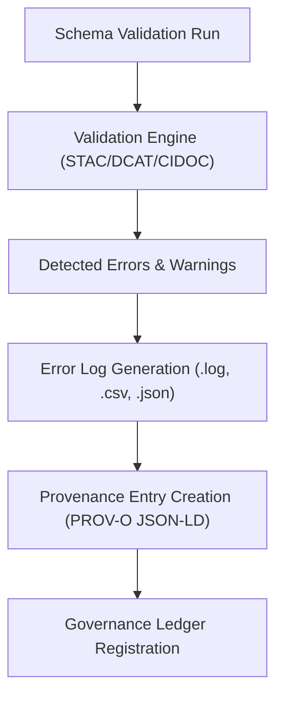

<div align="center">

# 🚨 Kansas Frontier Matrix — **TMP Schema Reports: Validation Error Logs & QA Diagnostics**  
`data/work/staging/tabular/normalized/tmp/validation_scratch/schema_reports/schema_error_logs/README.md`

**Purpose:** Maintain **error logs, anomaly traces, and validation diagnostics** from schema verification processes executed within the **TMP Validation Scratch workspace** of the **Kansas Frontier Matrix (KFM)** system.  
This directory captures **schema validation failures**, **warnings**, and **semantic alignment anomalies**, providing full traceability across STAC, DCAT, CIDOC CRM, and OWL-Time checks.  

[](../../../../../../../../../../../../../../docs/architecture/repo-focus.md)
[]()
[]()
[]()
[]()

</div>

---

## 🗂️ Directory Layout

```plaintext
schema_error_logs/
├── errors_2025-10-25.log              # Raw log of schema validation errors and warnings
├── summary_validation_failures.csv    # Tabular summary of validation failure metrics
├── ontology_alignment_failures.json   # Semantic validation errors (CIDOC CRM / OWL-Time)
├── human_review_notes.txt             # QA notes or overrides by human validators
├── audit_manifest.json                # Manifest linking error logs to validation reports
└── README.md                          # ← You are here
```

---

## 🧭 Overview

This directory functions as the **diagnostic kernel** for all schema validation failures detected in the **TMP staging validation process**.  
The logs here serve three complementary purposes:

1. **Immediate Feedback:** Record structural or semantic schema violations detected by automated tools.  
2. **Governance Oversight:** Enable reproducibility and ethical auditability under FAIR+CARE principles.  
3. **Continuous Improvement:** Allow developers and data stewards to refine ETL normalization, ontology mapping, and schema evolution.

The logs consolidate outputs from the following validators:
- **STAC Validator (stac-validator@v3.4)**  
- **DCAT Validator (dcat-validator@v1.5)**  
- **Ontology Linker (CIDOC CRM / OWL-Time)**  
- **MCP Schema Engine (MCP-DL v6.3)**  

All log artifacts are checksum-verified and cross-linked with the validation manifest in  
`/data/work/staging/tabular/normalized/tmp/validation_scratch/schema_reports/validation_manifest.json`.

---

## ⚙️ Error Logging Workflow



---

## 🧩 Error File Formats

### 1️⃣ Raw Log (`errors_YYYY-MM-DD.log`)

Example excerpt from `errors_2025-10-25.log`:

```text
[2025-10-25 14:55:02] ERROR [STAC]: Invalid 'datetime' format in treaty_1855_02_shawnee.geojson (expected RFC3339).
[2025-10-25 14:55:03] WARNING [DCAT]: Missing 'dct:license' in dataset metadata.
[2025-10-25 14:55:05] INFO [CIDOC CRM]: Misalignment detected between E7_Activity and E52_Time-Span.
[2025-10-25 14:55:09] ERROR [Ontology]: Undefined temporal relationship between treaty event and place node.
```

---

### 2️⃣ Summary of Validation Failures (`summary_validation_failures.csv`)

| dataset_id | schema_type | error_level | message | detected_by | timestamp |
|-------------|--------------|--------------|----------|--------------|------------|
| KS_TREATY_1853_01_KAW | STAC | ERROR | Missing 'providers' field | stac-validator | 2025-10-25T14:52:10Z |
| KS_TREATY_1855_02_SHAWNEE | DCAT | ERROR | Invalid 'license' property | dcat-validator | 2025-10-25T14:53:32Z |
| KS_TREATY_1867_03_MEDICINE_LODGE | CIDOC CRM | WARNING | Unlinked E21_Person entity | ontology-linker | 2025-10-25T14:54:11Z |

---

### 3️⃣ Ontology Alignment Failures (`ontology_alignment_failures.json`)

```json
{
  "report_generated_at": "2025-10-25T15:05:00Z",
  "validator": "ontology-linker@v2.1",
  "ontology_targets": ["CIDOC CRM", "OWL-Time"],
  "failures_detected": [
    {
      "dataset": "KS_TREATY_1867_03_MEDICINE_LODGE",
      "entity": "E52_Time-Span",
      "issue": "Temporal interval lacks start/end precision",
      "severity": "critical"
    },
    {
      "dataset": "KS_TREATY_1855_02_SHAWNEE",
      "entity": "E7_Activity",
      "issue": "Missing temporal overlap mapping (OWL-Time t:intervalDuring)",
      "severity": "warning"
    }
  ]
}
```

---

### 4️⃣ Human Review Notes (`human_review_notes.txt`)

These notes are appended manually by data stewards or QA validators to document reasoning behind exception handling or schema overrides.

Example:

```text
[2025-10-25 16:00:00Z] Reviewer: @kfm-validation  
Comment: CIDOC CRM mapping error for E52_Time-Span is acceptable — source record lacks explicit temporal range.  
Action: Mark as 'Conditionally Passed' and document limitation in QA metrics.
```

---

### 5️⃣ Audit Manifest (`audit_manifest.json`)

Links all error log files to their corresponding schema reports and provenance entries.

```json
{
  "generated_at": "2025-10-25T16:10:00Z",
  "linked_reports": [
    "stac_validation_reports/KS_TREATY_1853_01_KAW_TREATY_report.json",
    "dcat_validation_reports/treaties_dataset_validation.json"
  ],
  "linked_provenance": [
    "governance/ledger/validation/2025/10/stac_validation.jsonld"
  ],
  "total_errors_logged": 5,
  "warnings": 3,
  "reviewer": "@kfm-validation"
}
```

---

## 🔒 Governance and Audit Controls

Each error log is traceable through:
- **Provenance chain:** `/governance/ledger/validation/YYYY/MM/schema_error_logs.jsonld`  
- **Checksum chain:** `/data/work/staging/tabular/normalized/treaties/checksums/archive/treaties_2025_Q4.sha256`  
- **Ethics review linkage:** `/docs/standards/ethics.md`  

All files include metadata headers (`@context`, `prov:wasGeneratedBy`, `prov:used`, `prov:wasAttributedTo`) consistent with **PROV-O** and **MCP-DL**.

Governance policies enforce:
- **Retention:** 90 days (auto-archived to `/logs/ai/archive/`).  
- **Human Review:** Required for critical validation failures.  
- **Immutable Registration:** Digital signature appended upon governance approval.

---

## 📊 QA Metrics Integration

Logs feed into `qa_summary.json` for continuous QA telemetry.

| Metric | Description | Target | Source |
|--------|--------------|---------|---------|
| Critical Error Rate | Number of critical schema violations per batch | ≤ 2% | summary_validation_failures.csv |
| Ontology Alignment Pass | CIDOC CRM/OWL-Time mapping success rate | ≥ 90% | ontology_alignment_failures.json |
| Reviewer Response Rate | % of error logs annotated by human QA | 100% | human_review_notes.txt |
| FAIR+CARE Compliance | Validation of ethical, accessible metadata | ≥ 95% | audit_manifest.json |

---

## ⚖️ FAIR+CARE & ISO Compliance Summary

| Principle | Implementation | Reference Artifact |
|------------|----------------|--------------------|
| **FAIR (Findable)** | Unique dataset identifiers logged in errors CSV. | summary_validation_failures.csv |
| **FAIR (Reusable)** | Logs stored in open JSON/TXT for long-term analysis. | audit_manifest.json |
| **CARE (Responsibility)** | Human-in-the-loop QA required for any override. | human_review_notes.txt |
| **ISO 19115** | Spatial and temporal metadata alignment validated. | ontology_alignment_failures.json |
| **ISO 25012** | Data quality tracked (accuracy, completeness, integrity). | qa_summary.json |

---

## 🧾 Version History

| Version | Date | Author | Reviewer | Notes |
|----------|------|---------|-----------|--------|
| v2.0.0 | 2025-10-25 | @kfm-validation | @kfm-governance | Added ontology alignment JSON, audit manifest schema, and governance ledger integration. |
| v1.1.0 | 2025-10-24 | @kfm-data-engineering | @kfm-validation | Introduced CSV-based error summaries and CIDOC mapping logs. |
| v1.0.0 | 2025-10-23 | @kfm-data-engineering | — | Initial schema error log specification for TMP validation QA. |

---

<div align="center">

[]()
[]()
[]()
[]()
[]()

</div>

