<div align="center">

# 🛰️ Kansas Frontier Matrix — **TMP Schema Reports: STAC Validation Reports Archive**  
`data/work/staging/tabular/normalized/tmp/validation_scratch/schema_reports/stac_validation_reports/README.md`

**Purpose:** Provide an **organized archive of STAC (SpatioTemporal Asset Catalog)** validation reports for all temporary and normalized treaty datasets processed within the **TMP Validation Scratch workspace** of the **Kansas Frontier Matrix (KFM)**.  
These reports confirm geospatial, temporal, and metadata compliance of KFM datasets with **STAC 1.0**, **ISO 19115**, and **MCP-DL v6.3** data quality standards.

[](../../../../../../../../../../../../../../docs/architecture/repo-focus.md)
[]()
[]()
[]()
[]()

</div>

---

## 🗂️ Directory Layout

```plaintext
stac_validation_reports/
├── KS_TREATY_1867_03_MEDICINE_LODGE_report.json
├── KS_TREATY_1853_01_KAW_TREATY_report.json
├── KS_TREATY_1836_05_OSAGE_CESSION_report.json
├── batch_validation_summary.json
├── stac_extension_coverage.json
├── validator_config.yaml
└── README.md
```

---

## 🧭 Overview

The **STAC Validation Reports** subdirectory contains automatically generated validation artifacts produced by KFM’s **STAC Validator Engine** (`src/validation/stac_validator.py`).  
These reports confirm that every dataset staged or normalized through TMP meets the **SpatioTemporal Asset Catalog (STAC 1.0)** standard required for FAIR discoverability and cross-ontology interoperability.

Validation checks include:
- Metadata completeness (titles, IDs, descriptions, and providers).  
- Correct spatiotemporal extents (`bbox`, `interval`).  
- Proper use of STAC extensions (`datetime`, `provenance`, `version`).  
- Valid JSON schema conformance.  
- CIDOC CRM ontology cross-links where applicable.  

Each report is versioned, cryptographically signed, and cross-referenced with a **Provenance JSON-LD entity** in the Governance Ledger.

---

## ⚙️ Validation Workflow

```mermaid
flowchart TD
    A["Normalized TMP Dataset – .geojson / .json"] --> B["STAC Validator Engine"]
    B --> C["Schema Validation – stac-validate"]
    C --> D["Report Generation – .json"]
    D --> E["Batch QA Summary – batch_validation_summary.json"]
    E --> F["Governance Ledger Registration + Checksum Archive"]
```



---

## 🧩 Report Schema

### Example: `KS_TREATY_1867_03_MEDICINE_LODGE_report.json`

```json
{
  "dataset_id": "KS_TREATY_1867_03_MEDICINE_LODGE",
  "file_validated": "data/work/staging/tabular/normalized/tmp/normalization_buffer/KS_TREATY_1867_03_MEDICINE_LODGE.geojson",
  "stac_version": "1.0.0",
  "validation_timestamp": "2025-10-25T14:50:00Z",
  "validation_engine": "stac-validator@v3.4",
  "schema_check": {
    "result": "PASS",
    "errors": [],
    "warnings": ["Optional field 'keywords' not found."],
    "extensions_checked": ["datetime", "provenance", "version"]
  },
  "geospatial_extent": {
    "bbox": [-98.42, 37.25, -97.85, 37.45],
    "temporal_interval": ["1867-10-01T00:00:00Z", "1867-10-25T23:59:59Z"]
  },
  "reviewed_by": "@kfm-validation",
  "checksum": "sha256:cc65e9d7e3b1aa04593e91e0e53cb4aa43552ff5d3faed74d3e1e69f75c53b89"
}
```

---

### Example: `batch_validation_summary.json`

Aggregates validation results from a batch run.

```json
{
  "generated_at": "2025-10-25T15:15:00Z",
  "total_datasets_validated": 12,
  "stac_pass_rate": 0.975,
  "critical_failures": [
    {"dataset_id": "KS_TREATY_1855_02_SHAWNEE_TREATY", "error": "Invalid datetime format (missing timezone offset)."}
  ],
  "validator_version": "v3.4",
  "average_runtime_sec": 3.28,
  "reviewer": "@kfm-validation",
  "linked_checksum_manifest": "data/work/staging/tabular/normalized/treaties/checksums/archive/treaties_2025_Q4.sha256"
}
```

---

## 🧮 STAC Extension Coverage Analysis

**File:** `stac_extension_coverage.json`  
Tracks extension utilization across all validated TMP datasets.

```json
{
  "extensions_summary": {
    "datetime": {"used_by": 100, "required": true},
    "provenance": {"used_by": 87, "required": true},
    "version": {"used_by": 92, "required": true},
    "scientific": {"used_by": 60, "required": false}
  },
  "missing_extensions": ["scientific"],
  "recommendations": [
    "Add 'scientific' extension to AI-generated derivative datasets.",
    "Validate temporal granularity alignment with OWL-Time standard."
  ]
}
```

---

## 🔍 Validator Configuration

**File:** `validator_config.yaml`

Defines validation parameters and execution logic.

```yaml
validator:
  stac_version: "1.0.0"
  ignore_optional_fields: true
  output_format: "json"
  retry_on_failure: 3
  extensions_required:
    - datetime
    - provenance
    - version
  audit_enabled: true
  log_level: INFO
  reviewer: "@kfm-validation"
  ethics_verification: true
  provenance_logging: true
```

---

## 📈 QA Metrics & CI/CD Integration

| Metric | Target | CI Job | Validation Trigger |
|--------|---------|--------|--------------------|
| STAC Schema Conformance | ≥ 95% | `stac-validate.yml` | On new TMP dataset commit |
| Metadata Completeness | ≥ 98% | `metadata-audit.yml` | Daily |
| Provenance Consistency | 100% | `prov-linker.yml` | On successful schema validation |
| Extension Coverage | ≥ 90% | `stac-extension-check.yml` | Weekly |
| Runtime Efficiency | ≤ 4 sec per dataset | `stac-validate.yml` | Continuous |

All results feed into the **KFM Validation Telemetry Dashboard**  
(`data/work/staging/tabular/normalized/treaties/reports/validation/telemetry/metrics/`).

---

## 🔒 Governance & Ledger Registration

Each STAC report is linked to a **PROV-O JSON-LD entity** and registered in the **Governance Ledger** at:  
`/governance/ledger/validation/YYYY/MM/stac_validation.jsonld`

Example ledger snippet:

```json
{
  "@context": "https://www.w3.org/ns/prov#",
  "@id": "urn:kfm:validation:stac:2025-10-25:MEDICINE_LODGE",
  "prov:wasGeneratedBy": "stac_validator_v3.4",
  "prov:wasAttributedTo": "@kfm-validation",
  "prov:generatedAtTime": "2025-10-25T14:50:00Z",
  "prov:value": "STAC schema validation complete.",
  "prov:used": "data/work/staging/tabular/normalized/tmp/normalization_buffer/KS_TREATY_1867_03_MEDICINE_LODGE.geojson"
}
```

---

## 🧾 FAIR+CARE and ISO Compliance

| Standard | Implementation | Artifact |
|-----------|----------------|-----------|
| **FAIR F1–F4** | STAC reports uniquely identify every dataset and validation context. | STAC report JSON |
| **CARE (Ethics)** | Ensures Indigenous metadata integrity and representation accuracy. | Governance Ledger |
| **ISO 19115** | Geospatial metadata fields verified for CRS, extent, and temporal accuracy. | Validation report |
| **ISO 25012** | Quality model parameters (accuracy, integrity, reproducibility). | QA summary metrics |
| **MCP-DL v6.3** | Documentation-first validation approach linking schema + provenance. | Entire directory |

---

## 🧾 Version History

| Version | Date | Author | Reviewer | Notes |
|----------|------|---------|-----------|--------|
| v2.0.0 | 2025-10-25 | @kfm-validation | @kfm-governance | Added STAC extension coverage analysis, validator config, and FAIR+CARE audit integration. |
| v1.1.0 | 2025-10-24 | @kfm-data-engineering | @kfm-validation | Introduced batch summary and checksum linkage. |
| v1.0.0 | 2025-10-23 | @kfm-data-engineering | — | Initial STAC validation directory specification. |

---

<div align="center">

[]()
[]()
[]()
[]()
[]()

</div>

