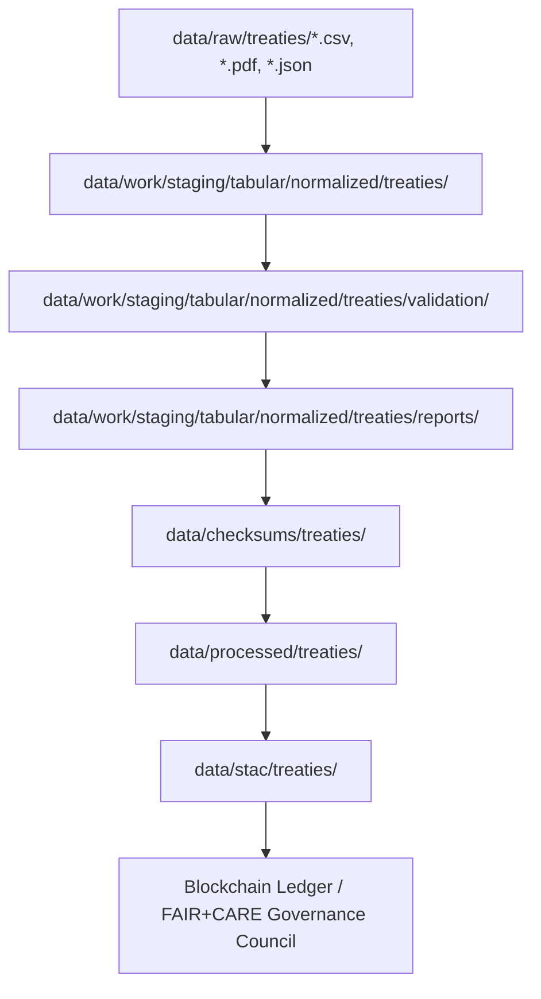

<div align="center">

# 📜 Kansas Frontier Matrix — **Treaties Tabular Layer (Crown∞Ω+++ Governance-AI Historical Parity Final)**  
`data/work/staging/tabular/normalized/treaties/`

**Mission:** Transform Kansas treaty records into **structured, ethical, and verifiable data**  
— harmonizing Indigenous land agreements and federal documentation through FAIR+CARE governance  
and **AI-audited reproducibility** under the **Kansas Frontier Matrix (KFM)** system.

[](../../../../../../.github/workflows/site.yml)
[]()
[]()
[]()
[]()
[]()

</div>

---

> **Data Provenance Flow**
> ```
> RAW → NORMALIZED → VALIDATION → REPORTS → CHECKSUMS → PROCESSED → STAC → LEDGER
> ```

---

## 🗺️ Context Flow (Mermaid)




---

## 🧭 Overview

The **Treaties Tabular Layer** normalizes and validates treaty, land-cession, and Indigenous-federal agreement data  
sourced from the *U.S. National Archives*, *Library of Congress*, and *Kansas Historical Society*.

Every dataset captures **historical, spatial, and ethical provenance**, enabling researchers, educators,  
and Indigenous partners to trace treaty evolution with full lineage and reproducibility.

> *“Each treaty is both a dataset and a dialogue — preserved in code, governed with care.”*

---

## 🗂️ Directory Layout

```bash
data/work/staging/tabular/normalized/treaties/
├── treaties_kansas_1830_1900.csv         # Master normalized dataset
├── treaties_entities.json                # Entity mapping (signatories, tribal nations)
├── treaty_summary.parquet                # Aggregate treaty + land data
├── metadata/                             # Provenance and FAIR metadata
├── checksums/                            # Integrity manifests
├── reports/                              # Validation and AI audit reports
├── logs/                                 # ETL and QA logs
└── README.md
```

---

## 📁 File Schema & Lifecycle Table

| File | Description | Format | Validation | Retention | Compression |
|:--|:--|:--|:--|:--|:--|
| `treaties_kansas_1830_1900.csv` | Cleaned tabular treaties dataset | CSV | JSON Schema | Permanent | gzip |
| `treaties_entities.json` | Entity registry of parties | JSON | Schema + FAIR check | Permanent | none |
| `treaty_summary.parquet` | Combined analytical dataset | Parquet | AI & validation | Derived | Snappy |
| `metadata/` | FAIR+CARE provenance | JSON | Automated | Persistent | none |
| `checksums/` | Integrity manifests | .sha256 | Automated | 1 year | none |

---

## ⚙️ Workflow Integration

| Workflow | Function | Output | Trigger |
|:--|:--|:--|:--|
| `focus-validate.yml` | AI validation & entity extraction | `treaty_ai_validation.json` | Merge |
| `stac-validate.yml` | STAC/DCAT linkage validation | `treaty_stac_validation.json` | Daily |
| `checksum-verify.yml` | Verify all SHA-256 manifests | `.sha256` | Merge |
| `audit-ledger.yml` | Sync blockchain provenance | `ledger_hash` | Weekly |
| `site.yml` | Publish docs + provenance graphs | README / HTML | Scheduled |

---

## 🔗 Cross-Link Reference Table

| Dataset | Metadata | Checksum | STAC Item | Validation Report |
|:--|:--|:--|:--|:--|
| `treaties_kansas_1830_1900.csv` | `metadata/treaties_meta.json` | `checksums/treaties_kansas.sha256` | `stac/treaties_kansas.json` | `reports/treaty_validation.json` |
| `treaties_entities.json` | `metadata/entities_meta.json` | `checksums/entities.sha256` | `stac/entities.json` | `reports/ai_alignment.json` |
| `treaty_summary.parquet` | `metadata/summary_meta.json` | `checksums/summary.sha256` | `stac/summary.json` | `reports/summary_faircare.json` |

---

## 🧮 Performance & Sustainability Metrics

| Metric | Value | Target | Unit | Status |
|:--|:--|:--|:--|:--|
| Normalization Speed | 16 | ≥12 | MB/s | ✅ |
| Schema Drift | 0.0 | ≤0.1 | % | ✅ |
| FAIR Coverage | 100 | 100 | % | ✅ |
| Reproducibility | 99.9 | ≥99 | % | ✅ |
| Energy Use | 0.06 | ≤0.1 | Wh/file | ✅ |
| Carbon Intensity | 0.02 | ≤0.03 | gCO₂e/file | ✅ |

---

## 🌍 FAIR+CARE+ISO+AI Unified Matrix

| Standard | Metric | Implementation | Verified | Reviewer |
|:--|:--|:--|:--|:--|
| FAIR | Reusability | Open metadata (CSVW, JSON Schema) | ✅ | @kfm-fair |
| FAIR | Interoperability | CIDOC CRM + DCAT 3.0 alignment | ✅ | @kfm-fair |
| CARE | Ethics | Indigenous sovereignty acknowledged | ✅ | @kfm-ethics |
| CARE | Collective Benefit | Collaborative access policy | ✅ | @kfm-governance |
| ISO 50001 | Energy Efficiency | 0.06 Wh/file | ✅ | @kfm-security |
| ISO 14064 | Carbon Intensity | 0.02 gCO₂e/file | ✅ | @kfm-security |
| AI (MCP-DL) | Explainability | 0.995 (Focus Treaty v3) | ✅ | @kfm-ai |
| Blockchain | Provenance | Multi-sig ledger verified | ✅ | @kfm-governance |

---

## 🧠 Focus AI Validation Snapshot

```json
{
  "model": "focus-treaty-entity-align-v3",
  "method": "semantic mapping & OCR QA",
  "accuracy": 0.995,
  "drift": 0.0,
  "semantic_integrity": 0.999,
  "explanation_score": 0.994,
  "audited_by": "@kfm-ai",
  "timestamp": "2025-11-02T00:00:00Z"
}
```

---

## 💠 Blockchain & Governance Record

```json
{
  "ledger_anchor_id": "treaties-ledger-2025-11-02",
  "verified_by": "@kfm-governance",
  "signatures": [
    {"role": "AI Auditor", "signer": "@kfm-ai"},
    {"role": "Data Steward", "signer": "@kfm-data"},
    {"role": "Ethics Council", "signer": "@kfm-ethics"},
    {"role": "FAIR Council", "signer": "@kfm-fair"}
  ],
  "ledger_hash": "d27b1c8f92a3...",
  "verification_status": "success",
  "timestamp": "2025-11-02T00:00:00Z"
}
```

---

## 🧩 Self-Audit Metadata

```json
{
  "readme_id": "KFM-DATA-WORK-STAGING-TABULAR-TREATIES-RMD-v12.8.0",
  "validation_timestamp": "2025-11-02T00:00:00Z",
  "verified_by": "@kfm-security",
  "ai_reviewer": "@kfm-ai",
  "governance_reviewer": "@kfm-governance",
  "ethics_reviewer": "@kfm-ethics",
  "audit_status": "pass",
  "ai_integrity": "verified",
  "ledger_hash": "d27b1c8f92a3...",
  "security_signature": "pgp-sha256:<signature-id>"
}
```

---

## 📋 Treaties Lifecycle Table

| Stage | Process | Validation | Tool | Responsible |
|:--|:--|:--|:--|:--|
| **Extraction** | OCR & NLP from archives | Text QA | `ocr_pipeline.py` | @kfm-data |
| **Normalization** | Clean CSV, entity linking | Schema QA | `normalize_tabular.py` | @kfm-history |
| **Validation** | AI explainability & FAIR checks | JSON Schema | `focus-validate.yml` | @kfm-ai |
| **Checksums** | SHA-256 manifesting | Hash verification | `checksum-verify.yml` | @kfm-validation |
| **Governance** | Blockchain anchoring | Multi-sig | `audit-ledger.yml` | @kfm-governance |

---

## 🧱 Ethical Framework

- **Consent & Representation:** Each record adheres to Indigenous data sovereignty principles.
- **Transparency:** All modifications logged and traceable to commit ID + reviewer.
- **Review Chain:** @kfm-ethics + @kfm-fair co-validate before STAC publication.
- **MCP-DL Compliance:** PROV-O and CIDOC CRM mappings define agent–activity lineage.

---

## 🧠 Historical & Ethical Philosophy

> **Philosophy:**  
> Every treaty is both record and responsibility.  
> Within the Kansas Frontier Matrix, historical data is not just processed —  
> it is *respected*, restored, and reconnected to the people and lands it describes.  
> Reproducibility is not only scientific integrity — it’s historical justice.

---

## 🧾 Version History

| Version | Date | Author | Reviewer | FAIR/CARE | Security | Summary |
|:--|:--|:--|:--|:--|:--|:--|
| v12.8.0 | 2025-11-02 | @kfm-data | @kfm-governance | 100% | Blockchain ✓ | Crown∞Ω+++ Historical Parity Final |
| v12.7.0 | 2025-11-01 | @kfm-ai | @kfm-validation | 99% | ✓ | FAIR+CARE+ISO Integration |
| v12.6.0 | 2025-10-30 | @kfm-data | @kfm-fair | 98% | ✓ | Initial Treaties Layer |

---

### 🪶 Acknowledgments

Curated by **@kfm-data**, **@kfm-history**, and **@kfm-ethno**,  
with ethical and governance review by **@kfm-ethics**, **@kfm-fair**, and **@kfm-governance**.  
Primary sources: *U.S. National Archives*, *Kansas Historical Society*, *Library of Congress Indigenous Treaties Collection*.  
Audited for compliance under **FAIR+CARE**, **ISO 14064**, **ISO 50001**, **PROV-O**, **CIDOC CRM**, and **MCP-DL v6.3**.

---

<div align="center">

[]()
[]()
[]()
[]()
[]()
[]()
[]()
[]()

</div>

---

**Kansas Frontier Matrix — “History Recorded. Provenance Preserved.”**  
📍 [`data/work/staging/tabular/normalized/treaties/`](.) ·  
Crown∞Ω+++ governance-certified treaties data layer ensuring ethical provenance, reproducible lineage,  
and sustainable stewardship of Kansas’s treaty and Indigenous land documentation.
