<div align="center">

# 🗄️ Kansas Frontier Matrix — **AI Log Archive for Treaty Summarization & Validation**  
`data/work/staging/tabular/normalized/treaties/logs/ai/archive/README.md`

**Purpose:** Serve as the immutable, long-term **AI log preservation vault** for all machine and human validation processes related to treaty summarization and semantic enrichment in the **Kansas Frontier Matrix (KFM)**.  
This directory ensures **scientific reproducibility**, **FAIR+CARE traceability**, and **ISO-compliant archival permanence** for all inference and review events.

[](../../../../../../../../../../../docs/architecture/repo-focus.md)
[]()
[]()
[]()
[]()

</div>

---

## 🗂️ Directory Layout

```plaintext
logs/ai/archive/
├── 2025/
│   ├── 10/
│   │   ├── KS_TREATY_1867_03_MEDICINE_LODGE.jsonld
│   │   ├── KS_TREATY_1853_01_KAW_TREATY.jsonld
│   │   ├── KS_TREATY_1836_05_OSAGE_CESSION.jsonld
│   │   └── summary_metrics_2025-10.json
│   ├── 09/
│   │   ├── KS_TREATY_1863_11_POTTAWATOMIE_TREATY.jsonld
│   │   └── batch_log_v1.1.2.zip
│   └── README.md
├── 2024/
│   ├── 12/
│   │   ├── archive_index_v1.0.json
│   │   ├── telemetry_snapshot.json
│   │   └── checksum_manifest.sha256
└── manifest/
    ├── ai_archive_manifest.json
    ├── provenance_chain.json
    └── STAC_collection.json
```

---

## 🧭 Overview

This folder is the **permanent archival repository** for AI summarization and validation logs.  
It stores **PROV-O compliant JSON-LD** files documenting each AI run, human review, ethical audit, and telemetry snapshot, grouped chronologically and versioned by release.

Each entry:
- Represents a **closed and validated summarization cycle**.  
- Includes the **raw inference**, **safety report**, **bias metrics**, and **signed governance attestation**.  
- Is cryptographically hashed and immutable once added to the archive (checked by CI/CD).  

The archive operates as a **cold ledger** (append-only, read-only after signing), adhering to **MCP-DL reproducibility doctrine** and **ISO 16363 Trusted Digital Repository (TDR)** practices.

---

## ⚙️ Archival Workflow

```mermaid
flowchart TD
    A[AI Inference Run] --> B[Validation Reports + Provenance Logs]
    B --> C[Governance Review + Ethics Signoff]
    C --> D[Archive Packaging → /logs/ai/archive/YYYY/MM/]
    D --> E[Checksum Verification + Immutable Storage]
    E --> F[Governance Ledger Index Update]
    F --> G[STAC + DCAT Catalog Publication]
```


%% END OF MERMAID %%

---

## 🧩 Archival File Structure

Each archived log bundle must contain the following standardized artifacts:

| File | Type | Description |
|------|------|-------------|
| `*.jsonld` | JSON-LD | PROV-O based provenance file for AI summarization run. |
| `summary_metrics_YYYY-MM.json` | JSON | Aggregated accuracy, bias, clarity, and confidence data for month. |
| `checksum_manifest.sha256` | Text | SHA-256 checksum for all files in archive to ensure integrity. |
| `telemetry_snapshot.json` | JSON | Runtime, token count, and model performance metrics at archive time. |
| `batch_log_vX.Y.Z.zip` | ZIP | Compressed logs from batch validation runs for archival efficiency. |
| `governance_signature.asc` | ASCII-armored signature of Ethics Council attestation. |
| `ai_archive_manifest.json` | JSON | Machine-readable index for batch restoration and reproducibility testing. |

---

## 🔒 Immutable Governance and Compliance

All files are governed under the **KFM Data Provenance and Ethics Charter** (rev. 3.4).  
Once archived:
- Files are **write-protected** (immutable flag set).  
- Metadata updates (e.g., post-audit corrections) occur via **overlay manifests**, never overwriting originals.  
- Each `.jsonld` entry is digitally signed and included in the **Governance Ledger** `/governance/ledger/ai/`.  
- Audit trails reference **signatories**, **model versions**, and **checksum proofs**.

### Example Governance Ledger Linkage

```json
{
  "ledger_entry": "ledger/ai/2025/10/KS_TREATY_1867_03_MEDICINE_LODGE.jsonld",
  "prov:wasGeneratedBy": "hf:kfm-summarizer-v3.2",
  "prov:wasValidatedBy": "@kfm-validation",
  "prov:wasApprovedBy": "@kfm-ethics",
  "checksum": "sha256:00b3fe993ad...",
  "ledger_signature": "sig:base64-4d7b..."
}
```

---

## 🧾 Reproducibility & Restoration

**Purpose:** Guarantee that every archived AI inference can be **reconstructed bit-for-bit** from original data and metadata.

Restoration workflow:
1. Retrieve `ai_archive_manifest.json` for target year/month.  
2. Verify file integrity with `checksum_manifest.sha256`.  
3. Cross-reference metadata with `/data/sources/` and `/prompts/config.json`.  
4. Reconstruct environment using the container image hash (`ai_environment_ref`) from manifest.  
5. Execute `make ai-restore treaty_id=<ID> version=<X.Y>`.

This regenerates the original output, logs, and telemetry — validating the **scientific permanence** of KFM’s AI work.

---

## 🧮 Metadata Crosswalk

| Schema | Implementation |
|---------|----------------|
| **PROV-O** | Entity-Activity-Agent relationships for all AI processes. |
| **DCAT 3.0** | Descriptive metadata for datasets and derived AI outputs. |
| **STAC 1.0** | Geospatial temporal indexing of treaty summaries. |
| **ISO 25012** | Data Quality dimensions logged (accuracy, integrity, traceability). |
| **MCP-DL** | Documentation-first reproducibility logging (v6.3 compliance). |

---

## 📈 Archival Integrity Validation (CI/CD)

Automated integrity checks ensure archive validity:

| CI Workflow | Description | Trigger |
|--------------|-------------|----------|
| `archive-validate.yml` | Runs `sha256sum` verification and schema validation. | On PR merge or scheduled monthly |
| `ledger-linker.yml` | Confirms every archive item links to Governance Ledger entry. | On ledger commit |
| `faircare-audit.yml` | Evaluates CARE + FAIR compliance for new archives. | Quarterly ethics audit |
| `metadata-sync.yml` | Regenerates STAC/DCAT catalog with new archived items. | Post-validation |

---

## 🧭 FAIR+CARE Alignment Summary

| Principle | Implementation |
|------------|----------------|
| **Findable** | Indexed via STAC + DCAT metadata in `/manifest/STAC_collection.json`. |
| **Accessible** | Openly licensed under CC-BY 4.0 for research use. |
| **Interoperable** | JSON-LD & RDF-based for semantic linkage. |
| **Reusable** | Immutable, versioned datasets with provenance. |
| **Collective Benefit** | Ethical co-curation with Indigenous historians. |
| **Authority to Control** | Access management aligned with CARE guidelines. |
| **Responsibility** | Ethical review required for publication to archive. |
| **Ethics** | Culturally respectful, traceable AI summaries only. |

---

## 🧾 Version History

| Version | Date | Author | Reviewer | Notes |
|----------|------|---------|-----------|--------|
| v2.0.0 | 2025-10-25 | @kfm-ai-lab | @kfm-governance | Added CI/CD workflows, governance integration, and reproducibility restoration protocol. |
| v1.1.0 | 2025-10-24 | @kfm-ai-lab | @kfm-validation | Enhanced PROV-O schema linkage and checksum manifest inclusion. |
| v1.0.0 | 2025-10-23 | @kfm-ai-lab | — | Initial archival directory specification and metadata index design. |

---

<div align="center">

[]()
[]()
[]()
[]()
[]()

</div>

