<div align="center">

# 📜 Kansas Frontier Matrix — **AI Archive Manifest & Provenance Chain Specification**  
`data/work/staging/tabular/normalized/treaties/logs/ai/archive/manifest/README.md`

**Purpose:** Document the structure, schema, and verification rules of all **AI archive manifest files** used in the **Kansas Frontier Matrix (KFM)** system.  
This manifest ensures that each archived AI summarization or validation event is **discoverable**, **traceable**, and **verifiable** through cross-linked metadata under **FAIR+CARE** and **ISO 16363** standards.

[](../../../../../../../../../../../../docs/architecture/repo-focus.md)
[]()
[]()
[]()
[]()

</div>

---

## 🗂️ Directory Layout

```plaintext
logs/ai/archive/manifest/
├── ai_archive_manifest.json      # Canonical manifest listing all archived AI runs
├── provenance_chain.json         # Linked PROV-O entities connecting AI ↔ Human ↔ Source
├── STAC_collection.json          # STAC 1.0 catalog of archived treaty datasets
├── DCAT_dataset_catalog.json     # DCAT 3.0 compatible dataset description
├── checksums.sha256              # Integrity hash list for all manifest files
└── README.md                     # ← You are here
```

---

## 🧭 Overview

This directory anchors the **meta-level provenance registry** for AI archival operations.  
It provides a **structured, machine-readable index** of every stored AI log in `/logs/ai/archive/`, mapping it to:
- The **source data**, **model**, **prompt**, and **validation documents** used.
- The **human reviewers** and **ethics approvers** involved.
- The **checksum chain** verifying file integrity.
- The **FAIR+CARE + MCP-DL crosswalk**, ensuring every AI event is audit-ready.

Each manifest component—`ai_archive_manifest.json`, `provenance_chain.json`, and `STAC_collection.json`—is synchronized automatically by CI workflows, ensuring **no orphaned logs**, **no missing provenance**, and **no checksum drift**.

---

## ⚙️ Manifest Relationship Diagram

```mermaid
flowchart LR
    A["AI Run Log – raw/validation"] --> B["ai_archive_manifest.json"]
    B --> C["provenance_chain.json"]
    C --> D["STAC_collection.json"]
    D --> E["DCAT_dataset_catalog.json"]
    E --> F["Governance Ledger – ledger/ai/YYYY/MM/"]
    F --> G["Immutable Archive Records"]
```


---

## 🧩 Manifest Specifications

### 1️⃣ `ai_archive_manifest.json`
This is the **canonical registry** of all archived AI summaries and validations.

```json
{
  "manifest_version": "2.1.0",
  "generated_at": "2025-10-25T15:00:00Z",
  "governance_ledger_ref": "ledger/ai/2025/10/",
  "records": [
    {
      "treaty_id": "KS_TREATY_1867_03_MEDICINE_LODGE",
      "archive_path": "logs/ai/archive/2025/10/KS_TREATY_1867_03_MEDICINE_LODGE.jsonld",
      "model_id": "hf:kfm-summarizer-v3.2",
      "prompt_id": "TREATY_SUMMARY_V6_3_STANDARD",
      "checksum": "sha256:983c7aa6f9a1d3f...",
      "reviewed_by": "@kfm-validation",
      "approved_by": "@kfm-ethics",
      "archived_by": "@kfm-ai-lab",
      "confidence": 0.93,
      "status": "archived"
    }
  ]
}
```

**Validation Rules:**
- All fields must pass schema check via `/tools/schema/manifest_schema.json`.
- Each `archive_path` must correspond to a valid `.jsonld` PROV-O entity.
- Every manifest record must reference at least one human reviewer.

---

### 2️⃣ `provenance_chain.json`
Defines the **linked data structure** connecting AI actions, human oversight, and source materials.

```json
{
  "provenance_chain": {
    "entity": "KS_TREATY_1867_03_MEDICINE_LODGE_SUMMARY",
    "generated_by": "hf:kfm-summarizer-v3.2",
    "validated_by": "@kfm-validation",
    "approved_by": "@kfm-ethics",
    "derived_from": [
      "data/raw/treaties/1867_medicine_lodge.pdf",
      "prompts/summarization_prompt.md"
    ],
    "governance_ledger_entry": "ledger/ai/2025/10/KS_TREATY_1867.jsonld",
    "hash_chain": [
      "sha256:a9023ef9...",
      "sha256:b5324eaa..."
    ]
  }
}
```

Each entry forms part of the **ledger-attested hash chain**, ensuring that all dependencies can be cryptographically verified in sequence.

---

### 3️⃣ `STAC_collection.json`
Defines the **spatiotemporal catalog** for treaty datasets and AI artifacts using the STAC 1.0 specification.

```json
{
  "stac_version": "1.0.0",
  "id": "kfm_treaty_ai_logs",
  "description": "STAC collection for Kansas Frontier Matrix treaty AI summarization archives.",
  "extent": {
    "spatial": {"bbox": [-102.05, 36.99, -94.61, 40.00]},
    "temporal": {"interval": [["1830-01-01T00:00:00Z", "1950-12-31T23:59:59Z"]]}
  },
  "links": [
    {"rel": "self", "href": "./STAC_collection.json"},
    {"rel": "manifest", "href": "./ai_archive_manifest.json"},
    {"rel": "provenance", "href": "./provenance_chain.json"}
  ]
}
```

---

### 4️⃣ `DCAT_dataset_catalog.json`
Maps STAC and PROV-O data to **W3C DCAT 3.0** for open data interoperability.

```json
{
  "@context": "https://www.w3.org/ns/dcat3#",
  "@id": "urn:kfm:dataset:treaty_ai_summaries",
  "dct:title": "Kansas Treaty Summarization Dataset (AI-Reviewed)",
  "dct:description": "FAIR+CARE dataset of AI-generated treaty summaries with human validation metadata.",
  "dcat:distribution": [
    {
      "dcat:accessURL": "https://github.com/bartytime4life/Kansas-Frontier-Matrix/data/work/staging/tabular/normalized/treaties/logs/ai/archive/",
      "dcat:mediaType": "application/ld+json",
      "dcat:byteSize": 15000000
    }
  ],
  "dct:conformsTo": ["ISO 19115", "PROV-O", "STAC 1.0", "MCP-DL v6.3"]
}
```

---

## 🔒 Governance and CI/CD Enforcement

### Automatic Validation Workflows
| Workflow | Description | Trigger |
|-----------|--------------|----------|
| `manifest-validate.yml` | Validates JSON schemas for all manifests (DCAT, STAC, PROV-O). | On every PR affecting `/logs/ai/archive/manifest/` |
| `checksum-verify.yml` | Regenerates `checksums.sha256` and validates hashes. | Nightly |
| `ledger-linker.yml` | Confirms all manifest entries reference valid Governance Ledger files. | On merge to `main` |
| `metadata-sync.yml` | Synchronizes DCAT & STAC metadata for FAIR indexing. | Weekly |

All pipelines emit signed reports under `/logs/ai/telemetry/audit/`.

---

## 🧾 FAIR+CARE & ISO Alignment Table

| Standard | Compliance Notes | Reference File |
|-----------|------------------|----------------|
| **FAIR Principle F1** | Every record has globally unique ID. | ai_archive_manifest.json |
| **FAIR Principle R1.3** | Metadata adheres to DCAT and PROV-O standards. | DCAT_dataset_catalog.json |
| **CARE Principle A** | Access and authority governed by Indigenous review boards. | provenance_chain.json |
| **ISO 19115** | Geospatial metadata via STAC collection extent. | STAC_collection.json |
| **ISO 25012** | Data quality and provenance attributes (accuracy, traceability). | checksums.sha256 |

---

## 🧾 Version History

| Version | Date | Author | Reviewer | Notes |
|----------|------|---------|-----------|--------|
| v2.1.0 | 2025-10-25 | @kfm-ai-lab | @kfm-governance | Added DCAT catalog, checksum registry, and CI/CD sync workflows. |
| v2.0.0 | 2025-10-24 | @kfm-ai-lab | @kfm-validation | Expanded STAC & PROV-O mappings with governance ledger links. |
| v1.0.0 | 2025-10-23 | @kfm-ai-lab | — | Initial creation of manifest and provenance index structure. |

---

<div align="center">

[]()
[]()
[]()
[]()
[]()

</div>

