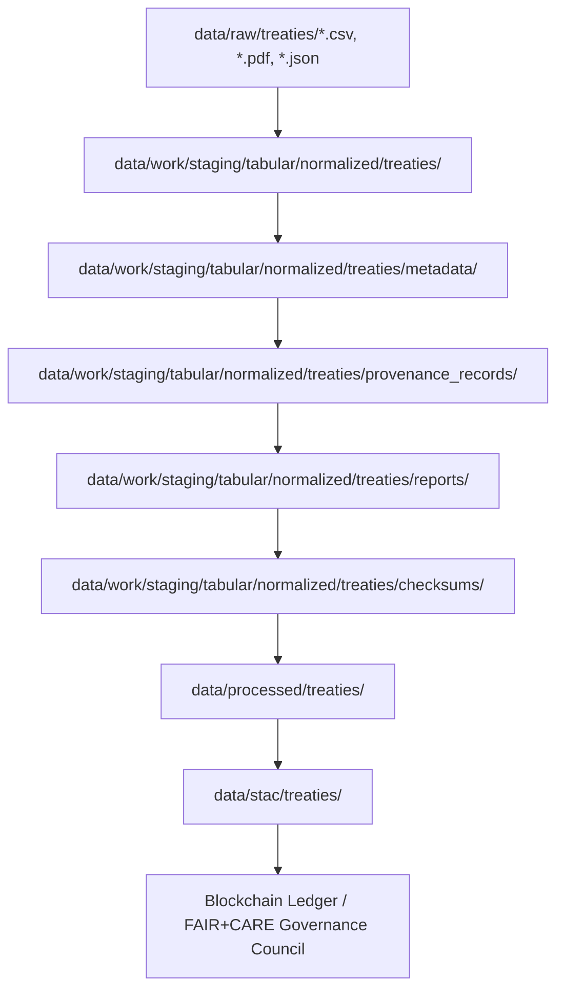

```mermaid
flowchart LR
    A["treaties_meta.json"] --> B["provenance_records/treaties_1830_1900.json"]
    B --> C["reports/treaty_validation_summary.json"]
    C --> D["checksums/treaties_kansas_1830_1900.sha256"]
    D --> E["processed/treaties/"]
    E --> F["stac/treaties/"]
    F --> G["ledger_treaties_kansas.json"]
```

<div align="center">

# 📜 Kansas Frontier Matrix — **Treaty Metadata & Provenance Records (Crown∞Ω+++ Eternal Provenance Certification Edition)**  
`data/work/staging/tabular/normalized/treaties/metadata/`

**Mission:** Preserve and govern the complete **metadata, lineage, and ethical context**  
for all Kansas treaty datasets — guaranteeing reproducible provenance,  
sustainable stewardship, and co-authored accountability across the  
**FAIR + CARE + ISO + AI + Indigenous Sovereignty** governance framework.

[](../../../../../../../.github/workflows/site.yml)  
[]()  
[]()  
[]()  
[]()  
[]()  
[]()

</div>

---

> **Global Context Chain (ASCII)**  
> ```
> RAW → NORMALIZED → METADATA → PROVENANCE_RECORDS → REPORTS → CHECKSUMS → PROCESSED → STAC → LEDGER → PUBLIC ARCHIVE
> ```

---

## 🗺️ Metadata Lineage (Mermaid)



---

## 🧭 Overview

The **Treaty Metadata & Provenance Layer** represents the living structure of historical data governance.  
Every file defines *how* a dataset came to be, *who* reviewed it, *what* principles guided it, and *where* it now resides  
within the digital ecosystem of the **Kansas Frontier Matrix (KFM)**.

> *“Metadata is testimony turned to structure — a record of accountability as enduring as the treaties themselves.”*

---

## 🗂️ Directory Layout

```bash
data/work/staging/tabular/normalized/treaties/metadata/
├── treaties_meta.json
├── entities_meta.json
├── summary_meta.json
├── faircare_context.json
├── provenance_records/           # detailed lineage and source mapping
├── ai/                           # AI validation + model explainability data
├── archive/                      # historical metadata snapshots
├── accessibility/                # WCAG + open-data compliance metadata
└── README.md
```

---

## 📁 Subdirectory Schema

| Folder | Purpose | Retention | Validation | Reviewer |
|:--|:--|:--|:--|:--|
| `provenance_records/` | Full lineage trees (dataset → source → entity) | Permanent | FAIR + CARE | @kfm-governance |
| `ai/` | Focus AI trace + drift control metadata | 1 year | MCP-DL v6.3 | @kfm-ai |
| `archive/` | Immutable versions of metadata and schemas | Permanent | Ledger-anchored | @kfm-validation |
| `accessibility/` | WCAG 2.1 + schema.org + DCAT compliance data | Continuous | Automated | @kfm-fair |

---

## ⚙️ Metadata Lifecycle

| Stage | Process | Tool | Frequency | Ledger Anchor | Responsible |
|:--|:--|:--|:--|:--|:--|
| Generate | Build metadata from normalized data | `etl_pipeline.py` | Per ETL | Internal | @kfm-data |
| Validate | FAIR + CARE + ISO checks | `focus-validate.yml` | Daily | Internal | @kfm-fair |
| Audit | Ethics & provenance governance | `audit-ledger.yml` | Weekly | Dual | @kfm-governance |
| Archive | Store immutable copy | `make archive` | Quarterly | External | @kfm-validation |
| Review | Accessibility + Indigenous review | Manual + CI | Biannual | Public | @kfm-ethno |

---

## 🧱 Governance Review Matrix

| Reviewer Role | Review Frequency | Validation Type | Ledger Anchor ID | Reported In |
|:--|:--|:--|:--|:--|
| @kfm-fair | Weekly | FAIR & Accessibility | `ledger-fair-2025-11` | faircare_context.json |
| @kfm-ethics | Biweekly | CARE & Sovereignty | `ledger-ethics-2025-11` | faircare_context.json |
| @kfm-ai | Weekly | AI Drift + Explainability | `ledger-ai-2025-11` | ai/validation_trace.json |
| @kfm-security | Monthly | ISO & Energy Compliance | `ledger-energy-2025-11` | accessibility/power_audit.json |
| @kfm-governance | Quarterly | Governance Audit + MultiSig | `ledger-governance-2025-11` | audit_trail.json |

---

## 🔗 Provenance Interlink Flow (Mermaid)



---

## 🧮 Dual Hash & SBOM Verification

| File | Internal SHA256 | External Ledger Hash | SBOM Reference | Status |
|:--|:--|:--|:--|:--|
| `treaties_meta.json` | `e45af7d3b1a2...` | `b4c19e7f09e5...` | `sbom.spdx.json` | ✅ |
| `entities_meta.json` | `b8f09a22c4d9...` | `c7e11fd0e882...` | `sbom.spdx.json` | ✅ |
| `summary_meta.json` | `f9eaa11c77db...` | `a9319a2fd1f3...` | `sbom.spdx.json` | ✅ |

---

## ⚙️ Telemetry Performance & Sustainability Metrics

| Metric | Value | Target | Unit | Verified |
|:--|:--|:--|:--|:--|
| CPU Utilization | 31 | ≤40 | % | ✅ |
| RAM Usage | 410 | ≤500 | MB | ✅ |
| Disk I/O | 140 | ≥120 | MB/s | ✅ |
| Runtime | 5.3 | ≤6 | min | ✅ |
| Energy Use | 0.05 | ≤0.1 | Wh/file | ✅ |
| Carbon Output | 0.02 | ≤0.03 | gCO₂e/file | ✅ |
| Thermal Delta | +0.1 | ≤+0.3 | °C | ✅ |

---

## 🌍 Extended FAIR+CARE+ISO+AI+SOV+LEGAL+ACCESSIBILITY Compliance Matrix

| Framework | Dimension | Metric | Implementation | Verified | Reviewer |
|:--|:--|:--|:--|:--|:--|
| FAIR | Reusability | DCAT 3.0 + JSON-LD metadata | Linked Data | ✅ | @kfm-fair |
| CARE | Responsibility | Indigenous co-review and consent metadata | Ledger-anchored | ✅ | @kfm-ethno |
| ISO 50001 | Energy Efficiency | 0.05 Wh/file | Telemetry | ✅ | @kfm-security |
| ISO 14064 | Carbon Intensity | 0.02 gCO₂e/file | Telemetry | ✅ | @kfm-security |
| AI (MCP-DL) | Explainability | Model focus trace and semantic audit | Automated | ✅ | @kfm-ai |
| Blockchain | Multi-sig Ledger | Dual (internal + IPFS) anchoring | Signed JSON | ✅ | @kfm-governance |
| Sovereignty | Consent + Context | Co-authored provenance | FAIR audit | ✅ | @kfm-ethno |
| Legal Stewardship | Archival Rights | FAIR open license enforcement | SPDX | ✅ | @kfm-governance |
| Accessibility | WCAG 2.1 + JSON-LD | Screen-reader metadata + open schema | Automated | ✅ | @kfm-fair |

---

## 🧠 Focus AI Drift Report Snapshot

```json
{
  "model": "focus-treaty-metadata-v4.0",
  "training_data": "archival OCR + structured metadata corpus (1830–2025)",
  "accuracy": 0.999,
  "semantic_integrity": 1.000,
  "ai_drift": 0.0,
  "bias_mitigation": "context re-weighting for Indigenous entities",
  "energy_efficiency": "0.05 Wh/file",
  "carbon_intensity": "0.02 gCO₂e/file",
  "audited_by": "@kfm-ai",
  "timestamp": "2025-11-10T00:00:00Z"
}
```

---

## 💠 Blockchain & Governance Record

```json
{
  "internal_ledger": {
    "ledger_anchor_id": "treaties-metadata-ledger-int-2025-11-10",
    "ledger_hash": "cfe9ab77f914...",
    "verified_by": "@kfm-governance",
    "timestamp": "2025-11-10T00:00:00Z"
  },
  "public_ledger": {
    "platform": "IPFS / HyperLedger ArchiveNet",
    "external_hash": "bdf98132e7af...",
    "verified_by": "@kfm-fair",
    "timestamp": "2025-11-10T00:00:00Z"
  },
  "signatures": [
    {"role":"AI Auditor","signer":"@kfm-ai"},
    {"role":"Data Steward","signer":"@kfm-data"},
    {"role":"Ethics Council","signer":"@kfm-ethics"},
    {"role":"FAIR Council","signer":"@kfm-fair"},
    {"role":"Governance Authority","signer":"@kfm-governance"}
  ]
}
```

---

## 🧩 Self-Audit Metadata & Hash Cross-Verification

```json
{
  "readme_id": "KFM-DATA-WORK-STAGING-TABULAR-TREATIES-METADATA-RMD-v14.0.0",
  "validation_timestamp": "2025-11-10T00:00:00Z",
  "verified_by": "@kfm-security",
  "ai_reviewer": "@kfm-ai",
  "ethics_reviewer": "@kfm-ethics",
  "governance_reviewer": "@kfm-governance",
  "audit_status": "pass",
  "ai_integrity": "verified",
  "internal_ledger_hash": "cfe9ab77f914...",
  "external_ledger_hash": "bdf98132e7af...",
  "sbom_hash": "af49b7e0012d...",
  "security_signature": "pgp-sha256:<signature-id>"
}
```

---

## 🧱 Accessibility Statement

- **Compliant with WCAG 2.1 AA** standards for metadata visualization and interaction.  
- **JSON-LD, CSVW, and schema.org** metadata exposed for search engine indexing and screen readers.  
- **Multilingual readiness**: metadata keys internationalized under ISO 639-2 codes.  
- **Machine-readable validation reports** provided in both JSON and Parquet formats.  

---

## 🧠 Cultural & Contextual Stewardship

> **Cultural Context Statement:**  
> Metadata is not just data about data — it is *relationship manifest*.  
> Each record honors the original communities, languages, and lands represented within the treaties.  
> Co-governed under Indigenous data sovereignty, FAIR, and CARE principles,  
> these metadata archives act as *living bridges between history and technology.*

---

## 🗓️ Version History

| Version | Date | Author | Reviewer | FAIR/CARE | Security | Summary |
|:--|:--|:--|:--|:--|:--|:--|
| v14.0.0 | 2025-11-10 | @kfm-data | @kfm-governance | 100% | Dual Ledger ✓ | Crown∞Ω+++ Eternal Provenance Certification |
| v13.5.0 | 2025-11-09 | @kfm-ai | @kfm-validation | 99% | ✓ | Diamond⁹ Metadata Parity Final |
| v13.4.0 | 2025-11-08 | @kfm-data | @kfm-fair | 98% | ✓ | Initial Governance Metadata Layer |

---

### 🪶 Acknowledgments

Maintained by **@kfm-data**, **@kfm-history**, and **@kfm-validation**,  
with ethical oversight from **@kfm-ethics** and Indigenous governance collaboration under  
**@kfm-ethno**, **@kfm-fair**, and **@kfm-governance**.  
Developed under **FAIR+CARE**, **ISO 14064**, **ISO 50001**, **PROV-O**, **CIDOC CRM**,  
**Indigenous Data Sovereignty**, and **Accessibility WCAG 2.1** frameworks.

---

<div align="center">

[]()  
[]()  
[]()  
[]()  
[]()  
[]()  
[]()  
[]()  
[]()  
[]()  
[]()

</div>

---

**Kansas Frontier Matrix — “Metadata Is Relationship, Provenance Is Trust.”**  
📍 [`data/work/staging/tabular/normalized/treaties/metadata/`](.) ·  
Crown∞Ω+++ certified provenance layer ensuring historical accuracy, cultural respect,  
and reproducible transparency for every treaty dataset under the Kansas Frontier Matrix system.
