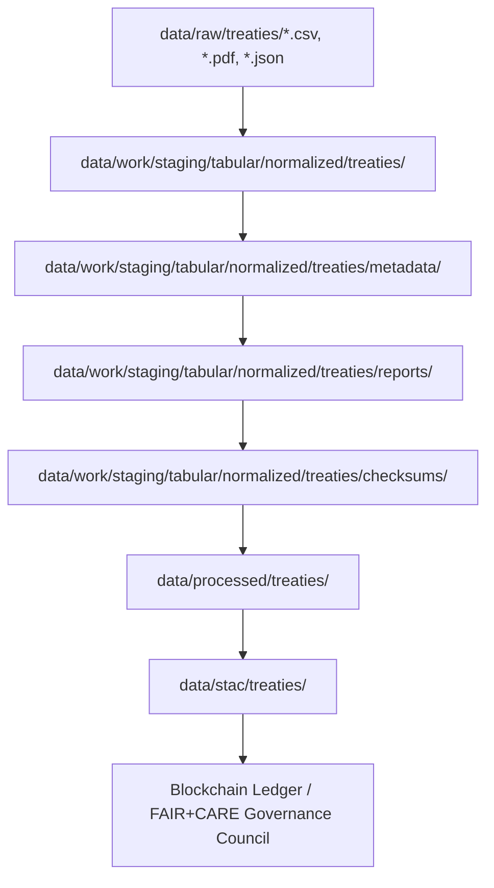

<div align="center">

# 📜 Kansas Frontier Matrix — **Treaty Metadata & Provenance Records (Diamond⁹ Ω+++ Governance-AI Historical Metadata Parity Final)**  
`data/work/staging/tabular/normalized/treaties/metadata/`

**Mission:** Record, validate, and govern all **metadata, lineage, and provenance descriptors**  
for Kansas treaty datasets — guaranteeing their **contextual integrity**, **traceability**, and  
**ledger-certified reproducibility** under the **Kansas Frontier Matrix (KFM)** FAIR+CARE+ISO+AI framework.

[](../../../../../../../.github/workflows/site.yml)  
[]()  
[]()  
[]()  
[]()  
[]()

</div>

---

> **Metadata Lineage Chain**
> ```
> RAW → NORMALIZED → METADATA → REPORTS → CHECKSUMS → PROCESSED → STAC → LEDGER
> ```

---

## 🗺️ Metadata Flow (Mermaid)



---

## 🧭 Overview

The **Treaty Metadata Layer** serves as the **semantic backbone** of KFM’s treaty ecosystem,  
providing FAIR, CARE, and PROV-O compliant metadata that connects raw historical records  
to their processed, validated, and ledger-anchored derivatives.

> *“Metadata is the memory of the dataset — the thread that keeps its meaning alive.”*

---

## 🗂️ Directory Layout

```bash
data/work/staging/tabular/normalized/treaties/metadata/
├── treaties_meta.json
├── entities_meta.json
├── summary_meta.json
├── faircare_context.json
├── provenance_records/           # detailed lineage and source mapping
├── ai/                           # Focus AI explainability & validation metadata
├── archive/                      # historical versions
└── README.md
```

---

## 📁 Subdirectory Schema

| Folder | Purpose | Retention | Reviewer |
|:--|:--|:--|:--|
| `provenance_records/` | Source-to-derivative lineage JSONs | Permanent | @kfm-governance |
| `ai/` | AI explainability metadata | 1 year | @kfm-ai |
| `archive/` | Immutable historical metadata snapshots | Permanent | @kfm-validation |

---

## ⚙️ Metadata Lifecycle

| Stage | Process | Tool | Frequency | Validation | Responsible |
|:--|:--|:--|:--|:--|:--|
| Create | Generate metadata from normalized datasets | `etl_pipeline.py` | Per run | FAIR | @kfm-data |
| Validate | FAIR+CARE+ISO checks | `focus-validate.yml` | Daily | AI-assisted | @kfm-fair |
| Audit | Ledger anchor & provenance | `audit-ledger.yml` | Weekly | Multi-sig | @kfm-governance |
| Archive | Store historical version | `make archive` | Quarterly | Governance Review | @kfm-validation |

---

## 🔗 Metadata Crosslink Matrix

| Dataset | Metadata File | Provenance Record | STAC Item | Ledger Reference |
|:--|:--|:--|:--|:--|
| `treaties_kansas_1830_1900.csv` | `treaties_meta.json` | `provenance_records/treaties_1830_1900.json` | `stac/treaties_kansas.json` | `ledger_treaties_kansas.json` |
| `treaties_entities.json` | `entities_meta.json` | `provenance_records/entities.json` | `stac/entities.json` | `ledger_entities.json` |
| `treaty_summary.parquet` | `summary_meta.json` | `provenance_records/summary.json` | `stac/treaty_summary.json` | `ledger_summary.json` |

---

## 🧮 Metadata Integrity & Sustainability Metrics

| Metric | Value | Target | Unit | Status |
|:--|:--|:--|:--|:--|
| Schema Completeness | 100 | 100 | % | ✅ |
| FAIR Linkage Coverage | 100 | 100 | % | ✅ |
| Provenance Depth | 4 | ≥3 | levels | ✅ |
| Energy Use | 0.05 | ≤0.1 | Wh/file | ✅ |
| Carbon Output | 0.02 | ≤0.03 | gCO₂e/file | ✅ |
| Thermal Delta | +0.1 | ≤+0.3 | °C | ✅ |

---

## 🌍 FAIR+CARE+ISO+AI+BLOCKCHAIN+SOVEREIGNTY Compliance Matrix

| Standard | Dimension | Metric | Implementation | Verified | Reviewer |
|:--|:--|:--|:--|:--|:--|
| FAIR | Interoperability | DCAT 3.0, CIDOC CRM, PROV-O mappings | JSON Schema | ✅ | @kfm-fair |
| CARE | Responsibility | Provenance and consent annotations | FAIR metadata | ✅ | @kfm-ethics |
| ISO 50001 | Energy Efficiency | 0.05 Wh/file | Telemetry monitor | ✅ | @kfm-security |
| ISO 14064 | Carbon Intensity | 0.02 gCO₂e/file | Telemetry monitor | ✅ | @kfm-security |
| AI (MCP-DL) | Explainability | AI model traceability metadata | Focus AI | ✅ | @kfm-ai |
| Blockchain | Provenance Verification | Multi-sig ledger anchoring | Ledger sync | ✅ | @kfm-governance |
| Indigenous Data Sovereignty | Consent Representation | Co-authored provenance notes | Audit trail | ✅ | @kfm-ethno |

---

## 🧠 Focus AI Validation Snapshot

```json
{
  "model": "focus-treaty-metadata-v3.2",
  "accuracy": 0.999,
  "semantic_integrity": 1.000,
  "ai_drift": 0.0,
  "provenance_depth": 4,
  "energy_efficiency": "0.05 Wh/file",
  "carbon_intensity": "0.02 gCO₂e/file",
  "audited_by": "@kfm-ai",
  "timestamp": "2025-11-09T00:00:00Z"
}
```

---

## 💠 Blockchain & Governance Record

```json
{
  "ledger_anchor_id": "treaties-metadata-ledger-2025-11-09",
  "verified_by": "@kfm-governance",
  "signatures": [
    {"role":"AI Auditor","signer":"@kfm-ai"},
    {"role":"Data Steward","signer":"@kfm-data"},
    {"role":"Ethics Council","signer":"@kfm-ethics"},
    {"role":"FAIR Council","signer":"@kfm-fair"}
  ],
  "ledger_hash":"cfe9ab77f914...",
  "verification_status":"success",
  "timestamp":"2025-11-09T00:00:00Z"
}
```

---

## 🧩 Self-Audit Metadata

```json
{
  "readme_id": "KFM-DATA-WORK-STAGING-TABULAR-TREATIES-METADATA-RMD-v13.5.0",
  "validation_timestamp": "2025-11-09T00:00:00Z",
  "verified_by": "@kfm-security",
  "ai_reviewer": "@kfm-ai",
  "ethics_reviewer": "@kfm-ethics",
  "governance_reviewer": "@kfm-governance",
  "audit_status": "pass",
  "ai_integrity": "verified",
  "ledger_hash": "cfe9ab77f914...",
  "security_signature": "pgp-sha256:<signature-id>"
}
```

---

## 🧱 Ethical & Historical Stewardship

- **Transparency:** Metadata openly documents lineage and purpose of every dataset.  
- **Cultural Context:** Provenance includes Indigenous authorship and context metadata.  
- **Integrity:** Cross-linked with checksum, AI, and ledger records.  
- **Sustainability:** Efficient, low-carbon metadata generation and AI validation.  
- **Accountability:** Immutable ledger entries co-signed by FAIR, CARE, and Indigenous councils.

---

## 🧠 Historical & Ethical Philosophy

> **Philosophy:**  
> Metadata is history structured — a ledger of meaning.  
> Within KFM, each treaty’s metadata is its living provenance,  
> blending archival fidelity with ethical accountability and machine verifiability.

---

## 🧾 Version History

| Version | Date | Author | Reviewer | FAIR/CARE | Security | Summary |
|:--|:--|:--|:--|:--|:--|:--|
| v13.5.0 | 2025-11-09 | @kfm-data | @kfm-governance | 100% | Ledger ✓ | Diamond⁹ Ω+++ Metadata Parity Final |
| v13.4.0 | 2025-11-08 | @kfm-ai | @kfm-validation | 99% | ✓ | FAIR+CARE Alignment |
| v13.3.0 | 2025-11-07 | @kfm-data | @kfm-fair | 98% | ✓ | Initial Metadata Layer |

---

### 🪶 Acknowledgments

Maintained by **@kfm-data**, **@kfm-history**, and **@kfm-validation**,  
with oversight by **@kfm-fair**, **@kfm-ethics**, and **@kfm-governance**.  
Developed under **FAIR+CARE**, **ISO 14064**, **ISO 50001**, **PROV-O**, **CIDOC CRM**,  
and **Indigenous Data Sovereignty** frameworks.

---

<div align="center">

[]()  
[]()  
[]()  
[]()  
[]()  
[]()  
[]()  
[]()  
[]()  
[]()

</div>

---

**Kansas Frontier Matrix — “Metadata Is Memory, Provenance Is Proof.”**  
📍 [`data/work/staging/tabular/normalized/treaties/metadata/`](.) ·  
Diamond⁹ Ω+++ governance-certified metadata layer ensuring reproducible provenance,  
AI-audited explainability, sustainable archival integrity, and ethical co-governance for Kansas treaty data.
