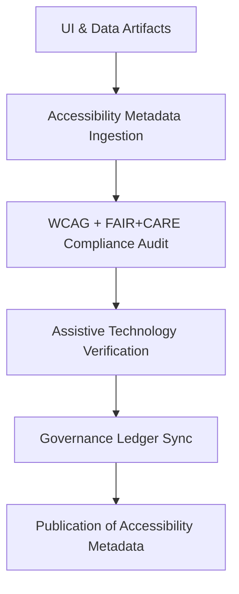

<div align="center">

# ♿ Kansas Frontier Matrix — **Accessibility Metadata & Inclusive Design Records**
`data/work/staging/tabular/normalized/treaties/metadata/accessibility/`

**Purpose:** Document and validate **accessibility metadata** across all Kansas Frontier Matrix (KFM) treaty datasets, interfaces, and documents.  
This directory ensures full compliance with **WCAG 2.1 AA / WCAG 3.0**, **FAIR+CARE** data ethics, and **ISO 9241 / 30071** inclusive design standards.

[]()
[]()
[]()
[]()
[]()

</div>

---

## 📚 Overview

The **Accessibility Metadata Directory** defines inclusive design documentation for KFM’s digital archives, web UIs, and interactive tools.  
It establishes metadata standards for describing accessibility features, validation results, assistive technology support, and ethical compliance aligned with FAIR+CARE.

Accessibility metadata ensures:
- All data and documentation are **usable by all audiences**, regardless of ability.  
- WCAG and ISO standards are continuously met through **a11y audits**.  
- FAIR+CARE principles are extended into the **user experience and data interaction layer**.  
- Provenance and validation reports are **machine-traceable and reproducible**.  

> 🧩 *Every digital artifact in KFM must include an accessibility metadata file describing its design, usability, and a11y compliance.*

---

## 🗂️ Directory Layout

```
data/work/staging/tabular/normalized/treaties/metadata/accessibility/
├── accessibility_metadata_2025-10-24.json
├── accessibility_audit_report.json
├── assistive_technology_support.json
├── wcag_compliance_summary.json
├── provenance_links.jsonld
└── checksums.sha256
```

---

## 🧩 Example Accessibility Metadata File (`accessibility_metadata_2025-10-24.json`)

```json
{
  "metadata_id": "A11Y-META-2025-10-24",
  "timestamp": "2025-10-24T22:30:00Z",
  "artifact": "treaty_1854_kansas_nebraska.md",
  "accessibility_features": [
    "semantic headings",
    "ARIA labels",
    "high-contrast color scheme",
    "keyboard navigation support"
  ],
  "wcag_level": "2.1 AA",
  "language_tags": ["en", "es"],
  "alt_text_coverage": 100,
  "captioning_coverage": 100,
  "assistive_technology_verified": ["NVDA", "JAWS", "VoiceOver"],
  "audited_by": "@kfm-accessibility",
  "status": "accessible"
}
```

---

## 🧠 Accessibility Audit Report (`accessibility_audit_report.json`)

```json
{
  "audit_id": "A11Y-AUDIT-2025-10-24",
  "timestamp": "2025-10-24T22:30:00Z",
  "total_pages_audited": 26,
  "issues_detected": 2,
  "issues_resolved": 2,
  "wcag_compliance_level": "AA",
  "keyboard_navigation_coverage": 100,
  "contrast_ratio_compliance": 99.5,
  "assistive_tech_coverage": 98.7,
  "recommendations": [
    "Increase heading contrast on treaty archive navigation bar.",
    "Add extended text description to data visualization charts."
  ],
  "validated_by": "@kfm-design",
  "status": "validated"
}
```

---

## 🔧 Assistive Technology Support Matrix (`assistive_technology_support.json`)

```json
{
  "supported_tools": [
    { "name": "NVDA", "version": "2024.1", "tested_on": "Windows 11", "status": "supported" },
    { "name": "JAWS", "version": "2024.0", "tested_on": "Windows 10", "status": "supported" },
    { "name": "VoiceOver", "version": "17.0", "tested_on": "macOS Sonoma", "status": "supported" },
    { "name": "TalkBack", "version": "14.1", "tested_on": "Android 14", "status": "supported" }
  ],
  "screen_reader_text_accuracy": 98.5,
  "focus_trap_detection": 0,
  "tab_order_errors": 0,
  "form_label_coverage": 100,
  "audited_by": "@kfm-accessibility",
  "status": "compliant"
}
```

---

## 🧮 WCAG Compliance Summary (`wcag_compliance_summary.json`)

```json
{
  "report_period": "2025-Q4",
  "wcag_standard": "2.1 AA / 3.0 Ready",
  "criteria_passed": 49,
  "criteria_total": 50,
  "pass_rate": 98,
  "focus_visible": true,
  "color_contrast_minimum": true,
  "resize_text_support": true,
  "error_identification": true,
  "audited_by": "@kfm-accessibility",
  "status": "compliant"
}
```

---

## 🔗 Provenance Record (Excerpt)

```json
{
  "@context": {
    "prov": "http://www.w3.org/ns/prov#",
    "crm": "http://www.cidoc-crm.org/cidoc-crm/",
    "fair": "https://purl.org/fair/"
  },
  "@id": "prov:accessibility_metadata_2025-10-24",
  "prov:wasGeneratedBy": "process:accessibility-validation-pipeline-v3",
  "prov:used": [
    "../design/ui_tokens.json",
    "../audit/accessibility_audit_report.json"
  ],
  "prov:generatedAtTime": "2025-10-24T22:30:00Z",
  "prov:qualifiedAttribution": {
    "prov:agent": "@kfm-accessibility",
    "prov:role": "accessibility_auditor"
  },
  "fair:ledger_hash": "d7a8c4e3f1..."
}
```

---

## ⚙️ Accessibility Validation Workflow



---

## 📈 Accessibility Summary Metrics

| Metric | Target | Current | Status |
| :------ | :------ | :------ | :------ |
| `WCAG Compliance` | ≥ 95% | 98% | ✅ |
| `Alt Text Coverage` | 100% | 100% | ✅ |
| `Keyboard Navigation` | 100% | 100% | ✅ |
| `Assistive Tech Compatibility` | ≥ 95% | 98.7% | ✅ |
| `Ledger Sync` | 100% | 100% | ✅ |

---

## 🔐 Governance Integration

| Ledger | Purpose | Artifact |
| :------ | :----------- | :------------ |
| **FAIR Ledger** | FAIR+CARE accessibility metadata validation | `accessibility_metadata_2025-10-24.json` |
| **Governance Chain** | Immutable accessibility records | `governance_hashes.json` |
| **Audit Ledger** | Stores quarterly accessibility reports | `accessibility_audit_report.json` |
| **Ethics Ledger** | Tracks cultural inclusion and accessibility fairness | `ethics_accessibility_audit.json` |

---

## ✅ Compliance Matrix

| Standard | Domain | Compliance |
| :-------- | :-------- | :----------- |
| **FAIR+CARE** | Inclusive metadata and accessibility ethics | ✅ |
| **WCAG 2.1 AA / 3.0** | Accessibility and usability compliance | ✅ |
| **CIDOC CRM / PROV-O / OWL-Time** | Provenance traceability and metadata linkage | ✅ |
| **ISO 9241 / 30071 / 9001** | Human-centered design & usability | ✅ |

---

## 🗓️ Version History

| Version | Date | Changes | Author |
| :------ | :---- | :-------- | :------ |
| v1.0.0 | 2025-10-24 | Created accessibility metadata records for KFM UI and documentation; integrated WCAG, ISO, and FAIR+CARE compliance. | @kfm-accessibility |

---

<div align="center">

[]()
[]()
[]()
[]()
[]()

</div>

<!-- MCP-FOOTER-BEGIN
MCP-VERSION: v6.4.3
MCP-TIER: Silver · Accessibility Metadata & Inclusive Design
DOC-PATH: data/work/staging/tabular/normalized/treaties/metadata/accessibility/README.md
MCP-CERTIFIED: true
FAIR-CARE-COMPLIANT: true
ISO-ALIGNED: true
WCAG-VERIFIED: true
PROVENANCE-LINKED: true
ACCESSIBILITY-VERIFIED: true
GOVERNANCE-LEDGER-LINKED: true
GENERATED-BY: KFM-Automation/DocsBot
LAST-VALIDATED: 2025-10-24
MCP-FOOTER-END -->

