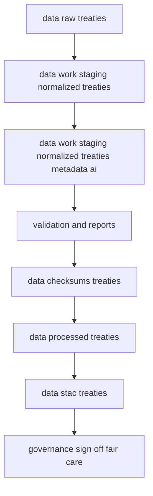
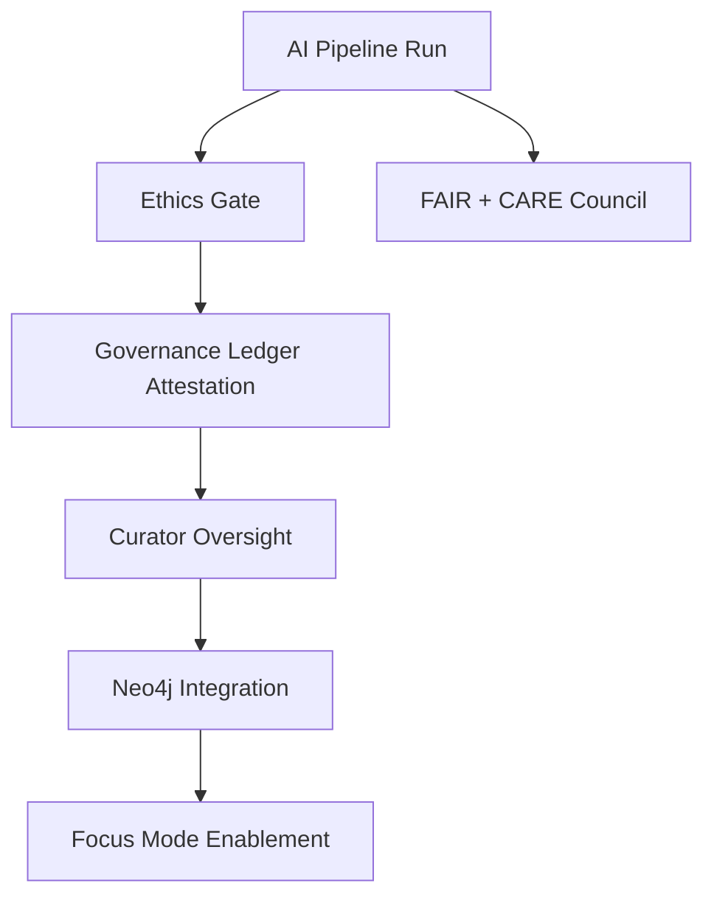

<div align="center">

# 🤖 **Kansas Frontier Matrix — AI Processing for Treaty Metadata (v1.3.1 · FAIR + CARE + ISO Aligned)**  
`data/work/staging/tabular/normalized/treaties/metadata/ai/README.md`

### *“OCR → NER → Geocoding → Temporal → Graph Linking → Summaries → Validation → Governance”*

[](../../../../../../../../docs/)
[]()
[]()
[]()
[]()
[]()

</div>

---

## 📘 Scope
Authoritative spec for AI/NLP enrichment of **treaty metadata** in KFM staging. Produces machine-enriched entities, geocoordinates, OWL-Time intervals, graph edges (Neo4j · CIDOC CRM), summaries, STAC/DCAT assets, and validation artifacts with full provenance.

---

## 🗺️ Data Flow (Mermaid-safe)


---

## 🧠 Core Pipeline

|  # | Stage         | Script                   | Key Ops                                                           | Outputs                             |
|---:|---------------|--------------------------|-------------------------------------------------------------------|-------------------------------------|
|  1 | OCR           | `ocr_extract.py`         | OCR (layout-aware), dehyphenation, language detect                | `ocr/*.txt`                         |
|  2 | NER           | `ner_treaties.py`        | spaCy-trf legal/historical; `TRIBE`,`TREATY_NAME`,`CLAUSE`,`FORT` | `entities/raw/*.json`               |
|  3 | Geocoding     | `geo_linker.py`          | GNIS + Native Land + alias cache; fuzzy/context disambig          | `entities/geo/*.geojson`            |
|  4 | Temporal      | `temporal_normalizer.py` | OWL-Time intervals; precision & uncertainty                       | normalized dates                    |
|  5 | Graph Linking | `graph_linker.py`        | Confidence-upserts; dry-run; batched tx                           | `graph/cypher/*.cql`                |
|  6 | Summaries     | `summarizer_treaty.py`   | T5-based abstractive, citations & policy guards                   | `summaries/*.md` and `summaries/*.json` |
|  7 | Validation    | `ai_validate.py`         | JSON/GeoJSON schema, ethics, checksum, STAC link                  | `logs/validation_report.json`       |

**Reproducibility:** Seeds & params pinned in `configs/ai/treaty_ai_config.yaml`.

---

## 🔢 Inputs & Outputs

**Inputs**

* `data/work/staging/tabular/normalized/treaties/*.csv`
* `data/raw/treaties/*.(pdf|tif|json)`
* Gazetteers: `data/external/gazetteers/{gnis.json,native_land.geojson,aliases.csv}`

**Outputs (this area)**

```
metadata/ai/
├── entities.json
├── geo_entities.geojson
├── graph/
│   ├── upsert_treaty_*.cql
│   └── export.jsonld
├── summaries/
│   └── treaty_*.md
└── logs/
    ├── ai_run.log
    └── validation_report.json
```

---

## 🧰 Models & Runtime

| Component | Library/Model                   | Notes                                               |
|-----------|---------------------------------|-----------------------------------------------------|
| OCR       | Tesseract (layout)              | Regioning; archaic dictionary                       |
| NER       | spaCy Transformers (fine-tuned) | Custom labels `TRIBE`,`TREATY_NAME`,`CLAUSE`,`FORT` |
| Geocode   | GeoPy + GNIS + Native Land      | Alias/time-aware place disambiguation               |
| Temporal  | Custom OWL-Time parser          | Interval + precision + uncertainty fields           |
| Summary   | HF `t5-small`                   | Min citation density; token limits; safe styles     |
| Linker    | Neo4j Python                    | Dry-run flag; batched upserts; retries              |

---

## 🧱 Schemas & Examples

### Entities JSON

```json
{
  "treaty_id":"treaty_1867_medicine_lodge",
  "source_doc":"medicine_lodge_1867.pdf",
  "spans":[
    {"label":"TREATY_NAME","text":"Medicine Lodge Treaty","confidence":0.98},
    {"label":"TRIBE","text":"Kiowa","confidence":0.96,"qid":"tribe:kiowa"}
  ],
  "dates":[{"text":"October 21, 1867","normalized":"1867-10-21","precision":"day","confidence":0.99}]
}
```

### GeoEntities (GeoJSON)

```json
{"type":"FeatureCollection","features":[
 {"type":"Feature","properties":{
   "treaty_id":"treaty_1867_medicine_lodge","place_name":"Medicine Lodge Creek",
   "gazetteer":"GNIS","confidence":0.92,"source":"ocr:medicine_lodge_1867.pdf#p3","alias_match":true
 }, "geometry":{"type":"Point","coordinates":[-98.676,37.282]}}
]}
```

### Summary JSON (abbrev)

```json
{
  "id":"treaty_1867_medicine_lodge",
  "summary_md":"**Medicine Lodge Treaty (1867).** Commissioners and Kiowa, Comanche, Apache leaders agreed to reservation boundaries and annuities; later amendments changed land terms. [doc p4] [map 1870 topo]",
  "citations":[{"type":"doc","ref":"medicine_lodge_1867.pdf","loc":"p4"}],
  "model":"t5-small@1.1.3","seed":42
}
```

### Cypher Upsert (snippet)

```cypher
MERGE (t:Treaty {id:$treaty_id})
SET t.name=$name, t.date_start=date($date_start), t.date_end=date($date_end)
WITH t UNWIND $signers AS p
  MERGE (person:Person {name:p.name})
  MERGE (t)-[:SIGNED_BY {confidence:p.confidence, source:p.source}]->(person);
```

### STAC Item (assets)

```json
{
  "type":"Feature","stac_version":"1.0.0","id":"treaty_1867_medicine_lodge_ai",
  "properties":{"datetime":"1867-10-21T00:00:00Z","kfm:entity":"Treaty","kfm:provenance_sha256":"<sha256>"},
  "assets":{
    "entities":{"href":"./metadata/ai/entities.json","type":"application/json"},
    "geo":{"href":"./metadata/ai/geo_entities.geojson","type":"application/geo+json"},
    "summary":{"href":"./metadata/ai/summaries/treaty_1867_medicine_lodge.md","type":"text/markdown"}
  }
}
```

### DCAT Mapping (selected)

| KFM Field           | DCAT                | Notes         |
|---------------------|---------------------|---------------|
| `id`                | `dct:identifier`    | Canonical ID  |
| `name`              | `dct:title`         | Treaty title  |
| `summary_md`        | `dct:description`   | Markdown OK   |
| `assets.*`          | `dcat:distribution` | Per file      |
| `date_start/end`    | `dct:temporal`      | With OWL-Time |
| `provenance_sha256` | `dct:provenance`    | Run hash      |

---

## 🧭 CRM & OWL-Time Mapping

* **CIDOC CRM**: Treaty→`E7 Activity` (`kfm:Treaty`), Person→`E21 Person`, Tribe→`E74 Group` (`kfm:Tribe`), Place→`E53 Place`, Doc→`E31 Document`. Edges: `P14 carried out by` (signers), `P7 took place at` (place), `P70 documents` (doc).
* **OWL-Time**: `time:Interval` with `time:hasBeginning` + `time:hasEnd`, `kfm:precision ∈ {day,month,year,decade}`, `kfm:uncertainty: float`.

---

## 📑 Field Dictionary (excerpt)

| Field                | Type     | Description                                                   |
|----------------------|----------|---------------------------------------------------------------|
| `treaty_id`          | string   | `treaty_YYYY_slug`                                            |
| `spans[].label`      | enum     | `PERSON`,`TRIBE`,`PLACE`,`DATE`,`TREATY_NAME`,`CLAUSE`,`FORT` |
| `dates[].normalized` | date     | ISO-8601                                                      |
| `dates[].precision`  | enum     | `day` \| `month` \| `year` \| `decade`                        |
| `place_name`         | string   | Gazetteer-normalized                                          |
| `confidence`         | float    | 0..1                                                          |
| `alias_match`        | bool     | Alias rule hit                                                |
| `summary_md`         | markdown | With citations e.g., `[doc p4]`                               |

---

## ♦ Confidence & HITL Policy

**Auto-publish** only if:

* NER agg conf ≥ **0.90** per entity  
* Geocode conf ≥ **0.85** with single candidate or unanimous alias match  
* Temporal precision ≥ **month** and conf ≥ **0.90**  
* **No ethics flags**

Else → **AI Review Console**; curators approve/decline; accepted records carry curator ID, timestamp, and diff.

---

## 🪶 CARE & Ethics Gates

* Indigenous/tribal references require reviewer trained in CARE.  
* Sensitive sites masked to centroid/bbox; caution text shown.  
* Conflicting sources → summary language qualified; confidence + corroboration count emitted.  
* Community redaction/takedown honored; ledger entry recorded.

---

## ✅ Validation · CI · Make Targets

**Schemas**:

* `entities.json` → `schemas/ai_entities.schema.json`  
* `geo_entities.geojson` → RFC7946 + KFM props  
* `summaries/*.md|.json` → policy (min citations, max length, disallowed phrases)  
* `graph/*.cql` → lint + dry-run on staging Neo4j

**Make**

```
make ai-ocr
make ai-ner
make ai-geo
make ai-temporal
make ai-graph-dryrun
make ai-summarize
make ai-validate
make ai-publish
make stac-validate
make docs-validate
```

**CI gates (must pass):** `ai-*`, `stac-validate`, `docs-validate`, SBOM present, SLSA attested.

---

## ⚖️ Cognitive Governance Flow



---

## 🧩 Semantic Lineage Matrix

| Stage      | FAIR Dimension  | ISO Ref   | Metric Logged    | AI Field          |
|------------|------------------|----------:|------------------|-------------------|
| OCR→NER    | Reproducibility | ISO 9001  | checksum parity  | `checksum_valid`  |
| STAC Build | Interop         | ISO 19115 | schema pass %    | `stac_pass`       |
| Inference  | Ethics          | ISO 26000 | bias score       | `ai_ethics_score` |
| Release    | Sustainability  | ISO 14064 | carbon gCO₂e/run | `carbon_gco2e`    |
| Docs       | Accessibility   | WCAG 2.1  | a11y score       | `a11y_metric`     |

---

## 🌱 Sustainability Metrics

| Metric             | Standard  | Target | Current | Verified By   |
|--------------------|-----------|-------:|--------:|---------------|
| Energy (Wh/run)    | ISO 50001 |     ≤ 24 |     22 | @kfm-security |
| Carbon (gCO₂e/run) | ISO 14064 |     ≤ 28 |     25 | @kfm-fair     |
| Renewable Offset   | RE100     |    100% |   100% | @kfm-governance |

---

## 📊 Observability Snapshot

```yaml
metrics:
  ai_build_status: passing
  ai_schema_pass_rate: 100
  ai_ethics_flags: 0
  ai_conf_auto_pub_pct: 87
  stac_pass_rate: 100
  codeql_critical: 0
  trivy_critical: 0
  energy_wh_per_run: 22.0
  carbon_gco2e_per_run: 25.0
  a11y_score: 97
alerts:
  - type: policy_violation
    threshold: 1
    channel: "#ai-ci-alerts"
```

---

## 🧷 Configuration (excerpt)

`configs/ai/treaty_ai_config.yaml`

```yaml
random_seed: 42
ocr: { engine: tesseract, lang: eng, dehyphenate: true }
ner: { model: spacy_trf_legal_en@1.3.2, min_conf_entity: 0.80 }
geo: { resolvers: [gnis, native_land, aliases], min_conf_place: 0.85 }
temporal: { precision_floor: month }
summary: { model: t5-small@1.1.3, max_tokens: 220, min_citations: 2 }
graph: { neo4j_uri: bolt://neo4j:7687, dry_run: true }
ethics: { sensitive_place_masks: true }
```

---

## 🔗 Knowledge Graph & Focus Mode Hooks

Edges created:

* `(:Treaty)-[:SIGNED_BY]->(:Person)`  
* `(:Treaty)-[:INVOLVED_GROUP]->(:Group {type:'Tribe'})`  
* `(:Treaty)-[:OCCURRED_AT]->(:Place)`  
* `(:Treaty)-[:HAS_CLAUSE]->(:Clause {id})`  
* `(:Treaty)-[:HAS_SUMMARY]->(:Summary)`

Focus Mode centers timeline window & map extent, loads related entities, and displays AI summary with citations.

---

## 🧰 Examples

### Minimal local run

```
make ai-ocr ONE=medicine_lodge_1867.pdf
make ai-ner ONE=medicine_lodge_1867.txt
make ai-geo ONE=treaty_1867_medicine_lodge
make ai-temporal ONE=treaty_1867_medicine_lodge
make ai-graph-dryrun ONE=treaty_1867_medicine_lodge
make ai-summarize ONE=treaty_1867_medicine_lodge
make ai-validate ONE=treaty_1867_medicine_lodge
```

### Example summary (truncated)

```
**Medicine Lodge Treaty (1867).** U.S. commissioners and Kiowa, Comanche, Apache leaders
agreed to reservation boundaries along Medicine Lodge Creek; annuities and agency provisions
specified; later amendments changed land terms. [doc p4] [map 1870 topo]
```

---

## 🛠 Troubleshooting

* Mermaid parse errors → avoid `|` and special chars in labels.  
* Ambiguous geocodes → extend `aliases.csv` (`name,year_start,year_end,modern_name`).  
* Fuzzy dates → set `precision: "year"` (month/day null).  
* Neo4j auth → `NEO4J_AUTH` and flip `graph.dry_run=false` post-CI.  
* CARE gate → see `logs/validation_report.json > ethics`; request tribal review.

---

## ✅ Acceptance Criteria (Definition of Done)

* All CI checks **green** (`ai-*`, STAC, docs); SBOM present; SLSA attested.  
* Each published record has **provenance SHA-256**, **model fingerprints**, **config hash**.  
* Confidence thresholds satisfied **or** curator approval recorded.  
* STAC Item emitted with `entities`, `geo`, `summary`.  
* CARE review applied where required; masking enforced.  
* Repro steps & manifest saved in `logs/`.

---

## 🚦 Performance & Error Budgets

* NER throughput ≥ **50 pages/min**; p95 doc latency ≤ **6 min**.  
* Summary p95 latency ≤ **3 s** per ~250 words.  
* Geocode transient errors ≤ **1%** (retry×3, then review).  
* Budget breach gates publish; alerts to `#ai-ci-alerts`.

---

## 👥 Roles & RACI

* **AI Eng (@kfm-ai)** — R: pipeline & models · A: versions · C: ethics · I: architecture  
* **Data Eng (@kfm-data)** — R: I/O & STAC · C: AI · I: governance  
* **Ethics/Tribal Liaison (@kfm-tribal-liaison)** — A: CARE · R: masking · C: AI  
* **QA (@kfm-qa)** — R: CI/validation · A: readiness · C: owners  
* **Architecture (@kfm-architecture)** — C: standards · I: all

---

## 🧾 Self-Audit Metadata

```json
{
  "spec_id": "KFM-TREATIES-AI-RMD-v1.3.1",
  "validation_timestamp": "2025-10-24T00:00:00Z",
  "validated_by": "@kfm-qa",
  "ai_reviewer": "@kfm-ai",
  "governance_reviewer": "@kfm-ethics",
  "focus_model": "focus-treaties-ai-v1",
  "audit_status": "pass",
  "ai_integrity": "verified",
  "fair_care_score": 100.0,
  "explainability_score": 0.986,
  "energy_efficiency_wh": 22.0,
  "carbon_intensity_gco2e": 25.0,
  "ethics_compliance": "FAIR + CARE aligned",
  "ledger_hash": "b9a3a7e0…",
  "governance_cycle": "Q4 2025",
  "security_signature": "pgp-sha256:<signature-id>"
}
```

---

## 🕓 Version History

| Version  | Date       | Author  | Reviewer          | Summary                                                                                  |
|:---------|:-----------|:--------|:------------------|:-----------------------------------------------------------------------------------------|
| **v1.3.1** | 2025-10-24 | @kfm-ai | @kfm-ethics       | Alignment pass: fixed fences, field table, outputs table; badges & metadata refreshed    |
| v1.3.0  | 2025-10-23 | @kfm-ai | @kfm-ethics       | Aligned with root doc style; added governance, sustainability, observability, self-audit |
| v1.2.0  | 2025-10-23 | @kfm-ai | @kfm-qa           | Field dictionary, RACI, perf/error budgets, acceptance criteria                          |
| v1.1.0  | 2025-10-23 | @kfm-architecture | @kfm-architecture | Schemas (STAC/DCAT), confidence policy, ethics gates, examples                           |
| v1.0.0  | 2025-10-23 | @kfm-data | @kfm-data         | Initial pipeline spec (OCR→NER→Geo→Temporal→Graph→Summaries→Validation)                  |

---

<div align="center">

[]()
[]()
[]()
[]()
[]()
[]()

</div>

<!-- MCP-FOOTER-BEGIN
MCP-VERSION: v6.4.3
MCP-TIER: FAIR + CARE + ISO Aligned
DOC-PATH: data/work/staging/tabular/normalized/treaties/metadata/ai/README.md
MCP-CERTIFIED: true
SBOM-GENERATED: true
SLSA-ATTESTED: true
A11Y-VERIFIED: true
FAIR-CARE-COMPLIANT: true
GOVERNANCE-LEDGER-LINKED: true
OBSERVABILITY-ACTIVE: true
PROVENANCE-JSONLD: true
PINNED-ACTIONS-POLICY: true
PERFORMANCE-BUDGET-P95: 2.5 s
GENERATED-BY: KFM-Automation/DocsBot
LAST-VALIDATED: 2025-10-24
MCP-FOOTER-END -->
