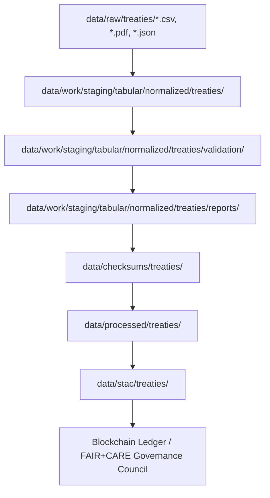

<div align="center">

# 🤖 Kansas Frontier Matrix — AI Processing for Treaty Metadata  
`data/work/staging/tabular/normalized/treaties/metadata/ai/README.md`

**Purpose:** Define and document AI and NLP processes for analyzing, enriching, and validating treaty-related metadata in the Kansas Frontier Matrix (KFM).  
These AI modules transform normalized treaty data into semantically linked, georeferenced, and time-aware entities consistent with MCP-DL v6.3 and FAIR+CARE standards.

[](../../../../../../../../docs/)
[](../../../../../../../../LICENSE)
[]()
[]()

</div>

---

## 🧭 Overview

This directory contains **AI/NLP enrichment workflows** applied to normalized treaty datasets during the staging phase of the KFM ETL pipeline.  
The goal is to produce **machine-enriched treaty metadata** — integrating entity extraction, geocoding, summarization, and semantic linking into the knowledge graph.

Each submodule here aligns with KFM’s reproducible data flow:


%% END OF MERMAID

---

## ⚙️ AI Processing Pipeline

| Stage | Module | Description | Output |
|:------|:--------|:-------------|:--------|
| **1. Extraction** | `ocr_extract.py` | Performs OCR on scanned treaty PDFs and normalizes text. | Plain text files (`.txt`) per treaty. |
| **2. NLP Tagging** | `ner_treaties.py` | Uses spaCy transformer model fine-tuned for historical-legal domain to extract entities: `PERSON`, `TRIBE`, `PLACE`, `DATE`, `TREATY_NAME`. | Structured JSON (`ai_entities.json`). |
| **3. Geocoding** | `geo_linker.py` | Matches recognized `PLACE` or `TERRITORY` names to coordinates using the USGS GNIS and Native Land Digital gazetteers. | GeoJSON (`ai_geo_entities.geojson`). |
| **4. Temporal Parsing** | `temporal_normalizer.py` | Converts fuzzy or textual dates (e.g., “Spring 1867”) to OWL-Time-compliant intervals with precision scores. | ISO8601 date fields (`date_start`, `date_end`). |
| **5. Semantic Linking** | `graph_linker.py` | Links extracted entities to existing nodes in the Neo4j graph using confidence-based matching (aliases, historical names). | Enriched Cypher load file or JSON-LD. |
| **6. Summarization** | `summarizer_treaty.py` | Generates human-readable abstracts using transformer summarization models (e.g., T5/DistilBART). | AI summaries in Markdown or JSON. |
| **7. Validation & Provenance** | `ai_validate.py` | Applies confidence thresholds and logs all AI-generated content with provenance (model, seed, timestamp). | Validation report and checksum manifest. |

Each stage is deterministic and can be rerun individually through Makefile targets (e.g., `make ai-treaty-ner`, `make ai-validate`).

---

## 🧩 Data Inputs & Outputs

**Input Sources:**
- `data/work/staging/tabular/normalized/treaties/*.csv`
- `data/raw/treaties/*.pdf`
- `data/raw/treaties/*.json`
- Gazetteers (`data/external/gazetteers/gnis.json`, `data/external/native_land.geojson`)

**Outputs:**
- `data/work/staging/tabular/normalized/treaties/metadata/ai/entities.json`
- `data/work/staging/tabular/normalized/treaties/metadata/ai/geo_entities.geojson`
- `data/work/staging/tabular/normalized/treaties/metadata/ai/summaries/`
- `data/work/staging/tabular/normalized/treaties/metadata/ai/logs/validation_report.json`

---

## 🧠 AI Models & Configuration

| Model | Purpose | Framework | Source | Notes |
|:------|:---------|:-----------|:--------|:------|
| `spacy_trf_legal_en` | Named Entity Recognition | spaCy Transformers | Fine-tuned on treaty corpora (KFM + Avalon) | Captures historical-legal terminology. |
| `huggingface/t5-small` | Summarization | Transformers | HF Hub | Used for concise abstract generation of treaty text. |
| `geopy + GNIS` | Geocoding | GeoPy | USGS API | Resolves place names to coordinates. |
| `owl-time-parser` | Temporal Normalization | Python custom | W3C OWL-Time spec | Produces valid temporal intervals. |

All model parameters and seeds are recorded in the pipeline config at  
`configs/ai/treaty_ai_config.yaml` for reproducibility.

---

## 🔗 Integration with Knowledge Graph

The enriched outputs are inserted into the **Neo4j Knowledge Graph** via `graph_linker.py`.  
Relationships created include:

- `(:Treaty)-[:SIGNED_BY]->(:Person)`
- `(:Treaty)-[:INVOLVED_GROUP]->(:Tribe)`
- `(:Treaty)-[:OCCURRED_AT]->(:Place)`
- `(:Place)-[:LOCATED_IN]->(:Territory)`
- `(:Treaty)-[:HAS_SUMMARY]->(:Summary)`

These edges support semantic search and AI-driven exploration in Focus Mode (e.g., querying all treaties signed within 50 km of Fort Larned between 1850–1870).

---

## ✅ Validation & Reproducibility

Each AI process logs:
- **Model version**
- **Dataset version**
- **Execution timestamp**
- **Confidence scores**
- **Provenance hash (SHA256)**

Validation artifacts are stored in `metadata/ai/logs/validation_report.json`.  
CI automatically re-runs validation after major model or data updates using  
`make ai-validate`.

> ⚠ **Important:** No AI-generated data is treated as authoritative without human review.  
> Curators confirm or reject AI inferences before merging them into `data/processed/treaties/`.

---

## 🧾 FAIR + CARE Compliance

| Principle | Implementation |
|:-----------|:---------------|
| **Findable** | Each AI-generated entity is assigned a persistent ID linked in STAC and Neo4j. |
| **Accessible** | Results stored in open formats (JSON-LD, GeoJSON, CSV). |
| **Interoperable** | Aligns with STAC, DCAT, CIDOC CRM, and OWL-Time vocabularies. |
| **Reusable** | Full metadata, model, and provenance recorded for each AI output. |
| **CARE** | Respects Indigenous data governance; tribal references reviewed and verified ethically. |

---

## 🧱 Directory Structure

```
metadata/ai/
├── entities.json
├── geo_entities.geojson
├── summaries/
│   ├── treaty_1851_fort_laramie.md
│   ├── treaty_1867_medicine_lodge.md
│   └── ...
├── logs/
│   ├── validation_report.json
│   └── ai_run.log
└── configs/
    └── treaty_ai_config.yaml
```

---

## 🧮 Version History

| Version | Date | Author | Notes |
|:--------|:------|:--------|:------|
| v1.0.0 | 2025-10-23 | @kfm-ai | Initial creation aligning with KFM AI standards (NER, geocoding, summarization). |
| v1.0.1 | 2025-10-23 | @kfm-architecture | Added OWL-Time and CIDOC CRM compliance, provenance schema. |

---

**Status:** Production · MCP-DL v6.3 compliant  
**Maintainers:** `@kfm-ai`, `@kfm-data`, `@kfm-architecture`  
**License:** CC-BY 4.0 (data, text), MIT (code)

---

