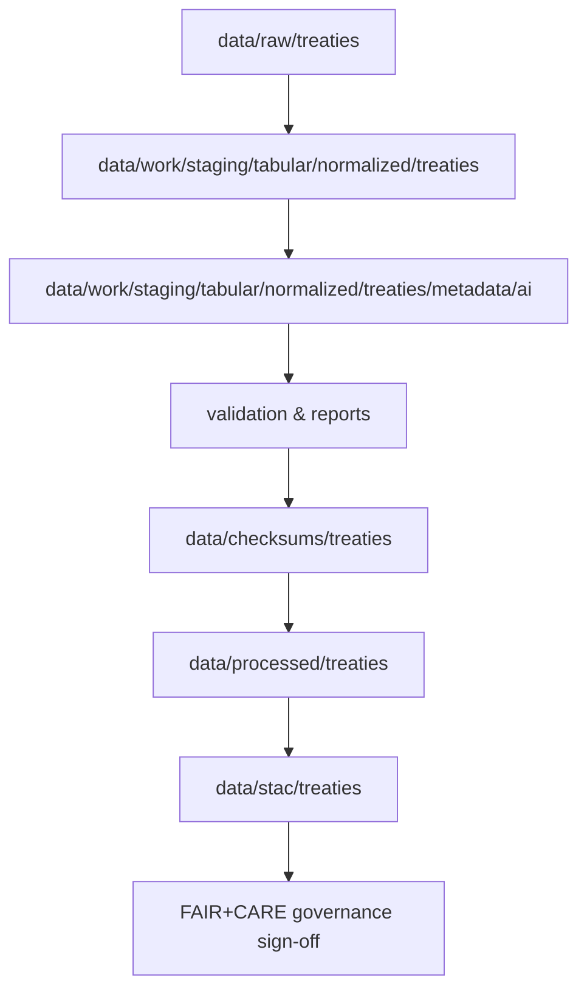

````
<div align="center">

# 🤖 Kansas Frontier Matrix — **AI Processing for Treaty Metadata**  
`data/work/staging/tabular/normalized/treaties/metadata/ai/README.md`

**Purpose:** Authoritative spec for AI/NLP enrichment of normalized treaty records — from OCR → NER/temporal/geocoding → semantic linking → validation — with **MCP-DL v6.3**, **FAIR+CARE**, **CIDOC CRM**, **OWL-Time**, **STAC/DCAT** alignment.

[](../../../../../../../../docs/)
[](../../../../../../../../LICENSE)
[]()
[]()

</div>

---

```yaml
---
title: "AI Processing for Treaty Metadata"
path: "data/work/staging/tabular/normalized/treaties/metadata/ai/README.md"
template: "KFM Platinum README v7.1"
version: "v1.1.0"
last_updated: "2025-10-23"
owners: ["@kfm-ai","@kfm-data","@kfm-architecture"]
license: ["MIT (code)","CC-BY 4.0 (data/text)"]
standards: ["MCP-DL v6.3","FAIR+CARE","CIDOC CRM","OWL-Time","STAC 1.0","DCAT 3.0"]
data_sensitivity: "Historical; includes Indigenous references — CARE review required"
---
````

## 📌 What this covers (at a glance)

* **Deterministic AI pipeline** (OCR → NER → geocoding → temporal → graph linking → summaries → validation)
* **Schemas** for I/O (entities JSON, GeoJSON, summaries, Cypher load, STAC Item, DCAT mapping)
* **Config** & seeds for reproducibility
* **Confidence policy** & curator review (HITL)
* **CARE & ethics** gating for tribal content
* **CI checks** & Make targets
* **Examples** (end-to-end mini run + sample files)
* **Integration hooks** (Knowledge Graph, Focus Mode, STAC catalog)
* **Troubleshooting** & **Versioning**

---

## 🧭 Overview & Flow

Mermaid-safe (no `|` chars in labels):



**Objectives**

1. Convert text-bearing artifacts to canonical text
2. Extract & normalize **People, Tribes, Places, Dates, Treaty names, Clauses**
3. **Geocode** places, **temporalize** dates (with precision), **link** to graph (Neo4j)
4. Generate **abstractive summaries** with citations/provenance
5. Validate, score, and gate with **HITL** for production

---

## ⚙️ Pipeline Stages

|  # | Stage         | Script                   | Key Ops                                                                           | Outputs                       |        |
| -: | ------------- | ------------------------ | --------------------------------------------------------------------------------- | ----------------------------- | ------ |
|  1 | OCR           | `ocr_extract.py`         | PDF/image OCR (layout aware), language detection, dehyphenation                   | `ocr/*.txt`                   |        |
|  2 | NER           | `ner_treaties.py`        | spaCy-trf legal/historical model; custom labels: `TRIBE`, `TREATY_NAME`, `CLAUSE` | `entities/raw/*.json`         |        |
|  3 | Geocoding     | `geo_linker.py`          | GNIS + Native Land Digital + local historical aliases; fuzzy + context            | `entities/geo/*.geojson`      |        |
|  4 | Temporal      | `temporal_normalizer.py` | OWL-Time intervals; precision & uncertainty scoring                               | normalized date fields        |        |
|  5 | Graph Linking | `graph_linker.py`        | Alias match, context window, Levenshtein; Cypher upsert                           | `graph/cypher/*.cql`          |        |
|  6 | Summaries     | `summarizer_treaty.py`   | T5/DistilBART; cite spans; length/policy guards                                   | `summaries/*.md               | .json` |
|  7 | Validation    | `ai_validate.py`         | Schemas, confidence policy, checksum, ethics gates                                | `logs/validation_report.json` |        |

**Reproducibility**: all stage seeds & params recorded in `configs/ai/treaty_ai_config.yaml`.

---

## 🧩 Inputs & Outputs

**Inputs**

* Normalized rows: `data/work/staging/tabular/normalized/treaties/*.csv`
* Source artifacts: `data/raw/treaties/*.(pdf|tif|json)`
* Gazetteers: `data/external/gazetteers/{gnis.json,native_land.geojson,aliases.csv}`

**Primary Outputs (this folder)**

```
metadata/ai/
├── entities.json                    # consolidated NER entities
├── geo_entities.geojson             # places with coordinates + provenance
├── summaries/                       # abstractive summaries (+citations)
├── graph/                           # Cypher files, JSON-LD exports
├── logs/
│   ├── validation_report.json
│   └── ai_run.log
└── configs/
    └── treaty_ai_config.yaml
```

---

## 🧠 Models & Runtime

| Component | Lib/Model                                       | Notes                                                   |
| --------- | ----------------------------------------------- | ------------------------------------------------------- |
| OCR       | Tesseract + layout                              | Page regioning; dictionary for archaic words            |
| NER       | spaCy Transformers (legal/historical fine-tune) | Custom labels: `TRIBE`, `TREATY_NAME`, `CLAUSE`, `FORT` |
| Geo       | GeoPy + GNIS + Native Land API/cache            | Alias & time-aware disambiguation                       |
| Temporal  | Custom OWL-Time parser                          | Maps fuzzy expressions to intervals + precision         |
| Summary   | HF `t5-small` (length-guided)                   | Min-citation density; safety guards                     |
| Linker    | Neo4j Python driver                             | Confidence-based upsert with dry-run mode               |

All model versions, seeds, and checkpoints are pinned in `configs/ai/treaty_ai_config.yaml`.

---

## 🧱 Schemas

### 1) Entities JSON (NER → normalized)

```json
{
  "treaty_id": "treaty_1867_medicine_lodge",
  "source_doc": "medicine_lodge_1867.pdf",
  "spans": [
    {"label":"TREATY_NAME","text":"Medicine Lodge Treaty","start":12,"end":34,"confidence":0.98},
    {"label":"TRIBE","text":"Kiowa","start":112,"end":117,"confidence":0.96,"qid":"tribe:kiowa"},
    {"label":"PERSON","text":"William S. Harney","confidence":0.88}
  ],
  "dates": [
    {"text":"October 21, 1867","normalized":"1867-10-21","precision":"day","confidence":0.99}
  ]
}
```

### 2) GeoEntities (GeoJSON FeatureCollection)

```json
{
  "type":"FeatureCollection",
  "features":[
    {
      "type":"Feature",
      "properties":{
        "treaty_id":"treaty_1867_medicine_lodge",
        "place_name":"Medicine Lodge Creek",
        "gazetteer":"GNIS",
        "confidence":0.92,
        "source":"ocr:medicine_lodge_1867.pdf#p3",
        "alias_match": true
      },
      "geometry":{"type":"Point","coordinates":[-98.676,37.282]}
    }
  ]
}
```

### 3) Summary JSON

```json
{
  "id":"treaty_1867_medicine_lodge",
  "summary_md":"**Medicine Lodge Treaty (1867)** established reservations for Kiowa, Comanche, and Apache... [1][2]",
  "citations":[
    {"type":"doc","ref":"medicine_lodge_1867.pdf","loc":"p4"},
    {"type":"map","ref":"usgs_topo_1870.tif","loc":"tile:10/345/512"}
  ],
  "model":"t5-small@1.1.3",
  "seed":42
}
```

### 4) Cypher Upsert (snippet)

```cypher
MERGE (t:Treaty {id:$treaty_id})
SET t.name = $name, t.date_start = date($date_start), t.date_end = date($date_end)
WITH t
UNWIND $signers AS p
  MERGE (person:Person {name:p.name})
  MERGE (t)-[:SIGNED_BY {confidence:p.confidence, source:p.source}]->(person)
WITH t
UNWIND $tribes AS tr
  MERGE (tribe:Group {name:tr.name, type:'Tribe'})
  MERGE (t)-[:INVOLVED_GROUP {confidence:tr.confidence}]->(tribe)
WITH t
UNWIND $places AS pl
  MERGE (place:Place {name:pl.name})
  SET place.lon = pl.lon, place.lat = pl.lat
  MERGE (t)-[:OCCURRED_AT {confidence:pl.confidence}]->(place);
```

### 5) STAC Item (raster or derived layer)

```json
{
  "type":"Feature",
  "stac_version":"1.0.0",
  "id":"treaty_1867_medicine_lodge_ai",
  "properties":{
    "datetime":"1867-10-21T00:00:00Z",
    "kfm:entity":"Treaty",
    "kfm:provenance_sha256":"<sha256>",
    "kfm:confidence_min":0.80
  },
  "geometry": null,
  "assets": {
    "entities": {"href":"./metadata/ai/entities.json","type":"application/json"},
    "geo": {"href":"./metadata/ai/geo_entities.geojson","type":"application/geo+json"},
    "summary": {"href":"./metadata/ai/summaries/treaty_1867_medicine_lodge.md","type":"text/markdown"}
  },
  "links":[]
}
```

### 6) DCAT Mapping (selected)

| KFM Field           | DCAT                | Notes                 |
| ------------------- | ------------------- | --------------------- |
| `id`                | `dct:identifier`    | Canonical ID          |
| `name`              | `dct:title`         | Treaty title          |
| `summary_md`        | `dct:description`   | Markdown allowed      |
| `assets.*`          | `dcat:distribution` | Per file/format       |
| `date_start/end`    | `dct:temporal`      | With OWL-Time support |
| `provenance_sha256` | `dct:provenance`    | Hash of run inputs    |

---

## ♦ Confidence & HITL Policy

* **Auto-publish** when all hold:

  * NER **min conf ≥ 0.90** aggregated per entity
  * Geocode **conf ≥ 0.85** and resolves to a single candidate or unanimous alias match
  * Temporal **precision ≥ month** and **conf ≥ 0.90**
  * No ethics flags
* **Queue for review** otherwise; curators accept/deny per item in the **AI Review Console**.
* All promoted records are stamped with **curator ID**, date, and stored diffs.

---

## 🪶 CARE & Ethics Gates

* **Tribal data**: require reviewer with Indigenous data governance training.
* Suppress publication of **sensitive locations** (e.g., burials, ceremonial sites): only show generalized centroids / bounding boxes with caveats.
* Summaries must **avoid definitive claims** where historical sources conflict; include **confidence** and **multi-source corroboration**.

---

## 🧪 Validation & CI

**Schema checks**

* `entities.json` → JSON Schema: `schemas/ai_entities.schema.json`
* `geo_entities.geojson` → RFC 7946 + extended props
* Summaries → policy regex (length, citations)
* Cypher → lints; dry-run against staging Neo4j

**CI pipeline** (pseudotargets)

```
make ai-ocr             # stage 1
make ai-ner             # stage 2
make ai-geo             # stage 3
make ai-temporal        # stage 4
make ai-graph-dryrun    # stage 5 (no-write)
make ai-summarize       # stage 6
make ai-validate        # stage 7 (schema+policy+checksums)
make ai-publish         # write to processed + STAC
```

Artifacts: `logs/validation_report.json`, run manifest with sha256 for inputs/outputs.

---

## 🧷 Configuration (excerpt)

`configs/ai/treaty_ai_config.yaml`

```yaml
random_seed: 42
ocr:
  engine: tesseract
  lang: eng
  dehyphenate: true
ner:
  model: spacy_trf_legal_en@1.3.2
  min_conf_entity: 0.80
geo:
  resolvers: [gnis, native_land, aliases]
  min_conf_place: 0.85
temporal:
  precision_floor: month
summary:
  model: t5-small@1.1.3
  max_tokens: 220
  min_citations: 2
graph:
  neo4j_uri: bolt://neo4j:7687
  dry_run: true
ethics:
  sensitive_place_masks: true
```

---

## 🔗 Knowledge Graph & Focus Mode Hooks

Edges created:

* `(:Treaty)-[:SIGNED_BY]->(:Person)`
* `(:Treaty)-[:INVOLVED_GROUP]->(:Group {type:'Tribe'})`
* `(:Treaty)-[:OCCURRED_AT]->(:Place)`
* `(:Treaty)-[:HAS_CLAUSE]->(:Clause {id})`
* `(:Treaty)-[:HAS_SUMMARY]->(:Summary)`

**Focus Mode** (UI) reads these relationships to center time window and map extent on the selected treaty, show related people/tribes/places, and surface the AI summary and citations.

---

## 🧰 Examples

### A) Minimal local run (single PDF)

```
make ai-ocr ONE=medicine_lodge_1867.pdf
make ai-ner ONE=medicine_lodge_1867.txt
make ai-geo ONE=treaty_1867_medicine_lodge
make ai-temporal ONE=treaty_1867_medicine_lodge
make ai-graph-dryrun ONE=treaty_1867_medicine_lodge
make ai-summarize ONE=treaty_1867_medicine_lodge
make ai-validate ONE=treaty_1867_medicine_lodge
```

### B) Sample summary (truncated)

```
**Medicine Lodge Treaty (1867).** U.S. commissioners and Kiowa, Comanche, and Apache leaders
agreed to reservation boundaries along Medicine Lodge Creek; annuities and agency provisions
were specified; subsequent amendments altered land terms. [doc p4][map 1870 topo]
```

---

## 🛠 Troubleshooting

* **Mermaid parse errors**: Avoid `|` inside node labels; keep labels simple.
* **Ambiguous geocodes**: Add alias rows to `data/external/gazetteers/aliases.csv` with `name,year_start,year_end,modern_name`.
* **Temporal fuzziness**: If only year known, set `precision:"year"`; month/day null.
* **Neo4j auth**: Ensure `NEO4J_AUTH` env and `graph.dry_run=false` only after CI green.
* **CARE gate triggered**: View `logs/validation_report.json > ethics` and request Indigenous review.

---

## 🗂 Directory Map (this area)

```
ai/
├── configs/
│   └── treaty_ai_config.yaml
├── entities.json
├── geo_entities.geojson
├── graph/
│   ├── upsert_treaty_*.cql
│   └── export.jsonld
├── summaries/
│   └── treaty_*.md
└── logs/
    ├── ai_run.log
    └── validation_report.json
```

---

## 🧾 Versioning & Provenance

| Field                    | Meaning                              |
| ------------------------ | ------------------------------------ |
| `kfm:provenance_sha256`  | hash of concatenated inputs & config |
| `kfm:run_id`             | unique run UUID                      |
| `kfm:model_fingerprints` | model names + digests                |
| `curation`               | reviewer id, decision, timestamp     |

**Version History**

| Version | Date       | Author            | Notes                                                                 |
| ------- | ---------- | ----------------- | --------------------------------------------------------------------- |
| v1.1.0  | 2025-10-23 | @kfm-ai           | Added schemas (STAC/DCAT), confidence policy, ethics gates, examples. |
| v1.0.1  | 2025-10-23 | @kfm-architecture | OWL-Time and CIDOC CRM compliance notes.                              |
| v1.0.0  | 2025-10-23 | @kfm-ai           | Initial creation (NER, geo, temporal, summaries, graph, CI).          |

---

<div align="center">

**Maintainers:** `@kfm-ai` · `@kfm-data` · `@kfm-architecture`
**Docs:** MCP-DL v6.3 · **Standards:** FAIR+CARE · CIDOC CRM · OWL-Time · STAC/DCAT

[]()
[]()
[]()

</div>
```
