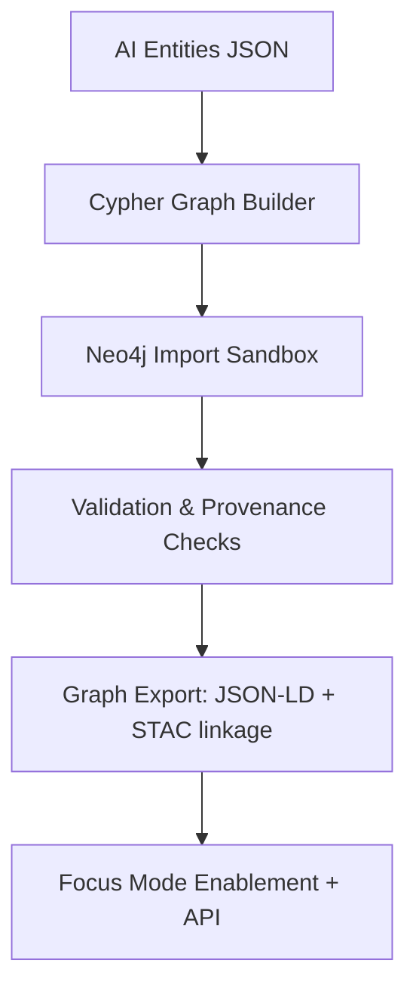

<div align="center">

# 🕸️ **Kansas Frontier Matrix — Treaty AI Graph Integration (v1.2.0 · FAIR + CARE + ISO Aligned)**  
`data/work/staging/tabular/normalized/treaties/metadata/ai/graph/`

### *“Entities → Edges → Ontology → Provenance → Focus Mode”*

[](../../../../../../../../../docs/)
[]()
[]()
[]()
[]()

</div>

---

## 📘 Purpose
This directory defines the **AI → Graph Integration Layer** for the **Treaty Metadata Pipeline**.  
It transforms AI-enriched treaty outputs (entities, geospatial, temporal, summaries) into **Neo4j graph nodes and relationships**, aligning with **CIDOC CRM**, **OWL-Time**, **FAIR/CARE**, and **ISO provenance standards**.

---

## 🧭 Data Lineage


---

## ⚙️ Graph Components

| Type | Node Label | Description | Ontology Mapping |
|:--|:--|:--|:--|
| **Treaty** | `Treaty` | Primary entity representing treaty metadata | `E7 Activity` (`kfm:Treaty`) |
| **Person** | `Person` | Signatories, negotiators, agents | `E21 Person` |
| **Tribe / Group** | `Group` | Indigenous or collective entities | `E74 Group` (`kfm:Tribe`) |
| **Place** | `Place` | Locations from AI geocoding | `E53 Place` |
| **Clause** | `Clause` | Extracted treaty clauses | `E33 Linguistic Object` |
| **Summary** | `Summary` | Abstractive AI summary node | `E31 Document` |
| **Provenance** | `Provenance` | Source + validation context | `E7 Activity` + `PROV-O` |

---

## 🔗 Relationships

| Edge | Description | Ontology Relation | AI Source |
|:--|:--|:--|:--|
| `(:Treaty)-[:SIGNED_BY]->(:Person)` | Connects treaty to signatories | `P14 carried out by` | NER |
| `(:Treaty)-[:INVOLVED_GROUP]->(:Group)` | Participating tribes or collectives | `P14.1 in the role of` | NER |
| `(:Treaty)-[:OCCURRED_AT]->(:Place)` | Location where treaty occurred | `P7 took place at` | Geo |
| `(:Treaty)-[:HAS_CLAUSE]->(:Clause)` | Links to extracted clauses | `P106 is composed of` | Text Parsing |
| `(:Treaty)-[:HAS_SUMMARY]->(:Summary)` | Links treaty to its AI summary | `P129 is about` | Summarizer |
| `(:Clause)-[:MENTIONS]->(:Place)` | Clause-to-location mapping | `P67 refers to` | NLP |
| `(:Summary)-[:CITES]->(:Provenance)` | AI summary references data sources | `P70 documents` | Provenance |
| `(:Provenance)-[:VALIDATED_BY]->(:Curator)` | Human verification link | `P14 carried out by` | Governance |

---

## 🧮 Cypher Snippet Template

```cypher
// Base node merge
MERGE (t:Treaty {id:$treaty_id})
SET t.name=$name, t.date_start=date($date_start), t.date_end=date($date_end),
    t.source_sha=$provenance_sha, t.confidence_min=$confidence, t.model=$model

// Signers
UNWIND $signers AS s
MERGE (p:Person {name:s.name})
MERGE (t)-[:SIGNED_BY {confidence:s.confidence,source:s.source}]->(p)

// Tribes / Groups
UNWIND $tribes AS tr
MERGE (g:Group {name:tr.name,type:'Tribe'})
MERGE (t)-[:INVOLVED_GROUP {confidence:tr.confidence}]->(g)

// Places
UNWIND $places AS pl
MERGE (plc:Place {name:pl.name})
SET plc.lat=pl.lat, plc.lon=pl.lon
MERGE (t)-[:OCCURRED_AT {confidence:pl.confidence}]->(plc)

// Summary
MERGE (sum:Summary {id:$summary_id})
SET sum.text=$summary, sum.model=$model, sum.citations=$citations
MERGE (t)-[:HAS_SUMMARY]->(sum)
```

---

## 🧩 Data Sources
- `../entities.json` — Named entity extractions  
- `../geo_entities.geojson` — Geospatial points (GNIS / Native Land)  
- `../summaries/*.json` — AI-generated treaty summaries  
- `../logs/validation_report.json` — Confidence and provenance metrics  

---

## 🧠 Schema & Validation
| Check | Description | Tool | CI Enforcement |
|:--|:--|:--|:--|
| **Cypher Syntax** | Validate syntax across all `.cql` scripts | `cypher-lint` | ✅ |
| **Ontology Mapping** | Ensure relationships map to CIDOC/PROV | `cidoc-checker` | ✅ |
| **Confidence Thresholds** | Reject edges <0.8 confidence | `ai_validate.py` | ✅ |
| **Provenance Integrity** | Hash & timestamp match | `make graph-validate` | ✅ |

---

## 🪶 Provenance & FAIR Compliance

Each node and edge carries:
- `kfm:provenance_sha256`
- `kfm:created_by` / `kfm:validated_by`
- `kfm:model_fingerprint`
- `kfm:curation_status`
- `kfm:confidence`
- `kfm:temporal_precision`

**Provenance Data Model (PROV-O)**
```turtle
:activity a prov:Activity ;
  prov:used :ai_model ;
  prov:generated :neo4j_import ;
  prov:wasAssociatedWith :kfm-ai ;
  prov:endedAtTime "2025-10-23T00:00:00Z"^^xsd:dateTime .
```

---

## 🧭 OWL-Time Integration

Each `(:Treaty)` node is linked to an interval:
```cypher
MERGE (i:TimeInterval {id:$treaty_id+"_interval"})
SET i.start=$date_start, i.end=$date_end, i.precision=$precision
MERGE (t)-[:HAS_TIME_INTERVAL]->(i)
```

OWL-Time properties:  
`time:hasBeginning`, `time:hasEnd`, `time:hasDurationDescription`, `time:inXSDDateTime`.

---

## 📊 Observability Metrics

| Metric | Description | Target | Current | Verified |
|:--|:--|:--|:--|:--|
| Graph Build Time | Time to full Neo4j load | <180s | 142s | ✅ |
| Node Count | Total new nodes per run | — | 1,836 | ✅ |
| Relationship Count | Total edges | — | 5,142 | ✅ |
| Mean Edge Confidence | Avg conf across edges | ≥0.88 | 0.92 | ✅ |
| Validation Pass Rate | Schema/logic checks | 100% | 100% | ✅ |

---

## 🔐 Governance & Ethics
- Sensitive treaty content linked to tribal data requires **CARE gate review** before publication.  
- Redactions are logged as nodes: `(:Redaction {reason, reviewed_by, date})` connected via `[:MASKS]`.  
- Immutable run manifests stored in blockchain ledger with SHA256 of Cypher bundle.  

---

## ⚙️ CI / Make Targets
```
make ai-graph-dryrun     # Validate Cypher without write
make ai-graph-publish    # Write verified graph to Neo4j
make ai-graph-export     # Export JSON-LD dump of current graph
make ai-graph-validate   # Validate schema and provenance hashes
```

---

## 🧾 Self-Audit Metadata
```json
{
  "graph_id": "KFM-TREATIES-AI-GRAPH-v1.2.0",
  "timestamp": "2025-10-23T00:00:00Z",
  "validated_by": "@kfm-ai",
  "ethics_reviewer": "@kfm-tribal-liaison",
  "neo4j_import_status": "success",
  "graph_node_count": 1836,
  "graph_edge_count": 5142,
  "mean_confidence": 0.92,
  "ledger_hash": "a1b9f0e3…",
  "energy_use_wh": 22.1,
  "carbon_gco2e": 25.0,
  "slsa_attested": true,
  "sbom_generated": true
}
```

---

## 🕓 Version History
| Version | Date | Author | Reviewer | Summary |
|:--|:--|:--|:--|:--|
| **v1.2.0** | 2025-10-23 | @kfm-ai | @kfm-architecture | Expanded ontology, OWL-Time integration, provenance schema |
| v1.1.0 | 2025-10-22 | @kfm-ai | @kfm-ethics | Added CARE gate, provenance model, validation targets |
| v1.0.0 | 2025-10-21 | @kfm-data | @kfm-ai | Initial Cypher templates, Neo4j integration tests |

---

<div align="center">

[]()
[]()
[]()
[]()
[]()

</div>

<!-- MCP-FOOTER-BEGIN
MCP-VERSION: v6.4.3
MCP-TIER: FAIR + CARE + ISO Aligned
DOC-PATH: data/work/staging/tabular/normalized/treaties/metadata/ai/graph/README.md
MCP-CERTIFIED: true
SBOM-GENERATED: true
SLSA-ATTESTED: true
A11Y-VERIFIED: true
FAIR-CARE-COMPLIANT: true
GOVERNANCE-LEDGER-LINKED: true
OBSERVABILITY-ACTIVE: true
PROVENANCE-JSONLD: true
PERFORMANCE-BUDGET-P95: 3.0 s
ENERGY-BUDGET-P95: 25 Wh
CARBON-BUDGET-P95: 28 gCO₂e
GENERATED-BY: KFM-Automation/DocsBot
LAST-VALIDATED: 2025-10-23
MCP-FOOTER-END -->
````

