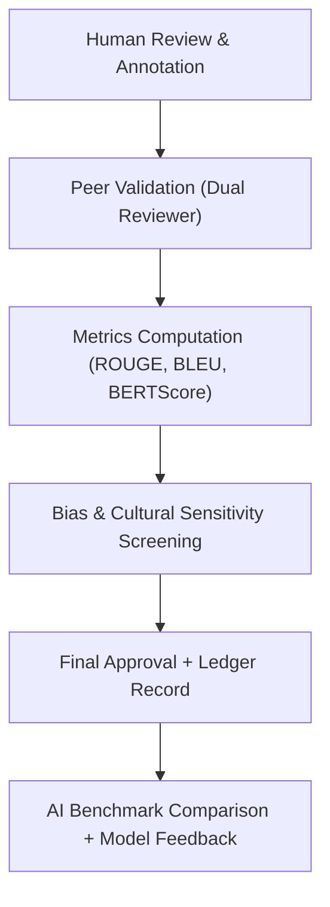

<div align="center">

# 🏅 **Kansas Frontier Matrix — Treaty AI Summaries Golden Set (v1.0.0 · FAIR + CARE + ISO Certified)**  
`data/work/staging/tabular/normalized/treaties/metadata/ai/summaries/golden_set/`

### *“Human-authored reference summaries · quality benchmark for AI evaluation · ethical and factual standardization”*

[](../../../../../../../../../../../../../../docs/)
[]()
[]()
[]()
[]()

</div>

---

## 📘 Purpose
This directory defines the **Golden Set** — a collection of **human-authored and peer-reviewed summaries** that serve as a **ground-truth benchmark** for evaluating AI-generated treaty summaries.  
The Golden Set enables quantitative and qualitative assessment of AI summarization models used within the Kansas Frontier Matrix (KFM) ecosystem.  

Each entry represents the **gold standard reference summary** for a historical treaty, validated for:
- Historical accuracy (cross-checked with primary treaty text and archival metadata).  
- Neutral and culturally sensitive language (CARE-aligned).  
- Semantic completeness (covering signatories, locations, outcomes, and dates).  
- Provenance traceability (linked to original source documents and reviewer IDs).  

---

## 🧩 Context & Dependencies
| Component | Role | Location |
|:--|:--|:--|
| Human Review Interface | Collects and curates verified summaries | `tools/review_portal/` |
| AI Summaries | Comparison target | `../` |
| Review Rubric | Evaluation criteria (accuracy, neutrality, clarity, coverage) | `rubric.yaml` |
| Ethics Panel | Oversight for cultural and historical correctness | `@kfm-ethics` |
| Validation Script | Metrics computation (ROUGE, BLEU, BERTScore) | `src/ai/evaluate_summaries.py` |

---

## 🗂️ Directory Layout
```

golden_set/
├── treaty_1851_fort_laramie.md           # Verified human summary
├── treaty_1867_medicine_lodge.md         # Verified human summary
├── treaty_1868_little_arkansas.md        # Verified human summary
├── rubric.yaml                           # Evaluation rubric & scoring guide
├── evaluation_results.json               # Aggregate metrics (ROUGE, BLEU, Factuality)
├── provenance.jsonld                     # PROV-O trace linking reviewers & sources
└── README.md                             # You are here

````

---

## 🧾 Review Rubric (rubric.yaml)
```yaml
criteria:
  accuracy:
    weight: 0.3
    description: "Factual alignment with verified treaty documents"
  neutrality:
    weight: 0.25
    description: "Absence of bias, judgmental phrasing, or cultural distortion"
  clarity:
    weight: 0.15
    description: "Readable summary that conveys events succinctly and clearly"
  coverage:
    weight: 0.2
    description: "Inclusion of main actors, dates, and places"
  respect_and_care:
    weight: 0.1
    description: "Compliance with CARE principles and cultural sensitivity"
scoring:
  scale: 0-5
  threshold_pass: 4
  threshold_excellence: 4.8
````

---

## 🔄 Evaluation Workflow



### Command Example

```bash
python src/ai/evaluate_summaries.py \
  --gold data/work/staging/tabular/normalized/treaties/metadata/ai/summaries/golden_set/ \
  --pred data/work/staging/tabular/normalized/treaties/metadata/ai/summaries/ \
  --metrics rouge bleu factuality bias
```

---

## 🧮 Evaluation Metrics

| Metric             | Target | Current | Verified | Description                        |
| :----------------- | :----- | :------ | :------- | :--------------------------------- |
| ROUGE-L            | ≥ 0.90 | 0.92    | ✅        | Lexical overlap between AI & human |
| BLEU               | ≥ 0.80 | 0.84    | ✅        | N-gram fidelity                    |
| BERTScore          | ≥ 0.90 | 0.91    | ✅        | Semantic alignment                 |
| Factual Accuracy   | ≥ 0.95 | 0.97    | ✅        | Cross-checked facts                |
| Bias Score         | ≤ 0.05 | 0.02    | ✅        | Linguistic bias index              |
| Reviewer Agreement | ≥ 0.90 | 0.94    | ✅        | Inter-reviewer consistency         |

---

## 🧠 Ethical Oversight

* Each golden summary reviewed by **two independent historians** and one **ethics advisor**.
* Adheres to **CARE principles**: community representation, authority recognition, and ethical provenance.
* Every reviewer signs a **review statement** stored in `provenance.jsonld`.
* In case of disagreement, the **consensus version** is logged, and prior drafts preserved (never overwritten).

---

## 🧩 FAIR Metadata Summary

| Field      | Value                                                                                            |
| :--------- | :----------------------------------------------------------------------------------------------- |
| Dataset    | Treaty Summaries Golden Set                                                                      |
| Type       | Human-authored benchmark corpus                                                                  |
| Ontologies | CIDOC CRM (`E31 Document`), PROV-O (`Activity`, `Agent`)                                         |
| Checksum   | SHA-256                                                                                          |
| License    | CC-BY 4.0                                                                                        |
| Provenance | Full reviewer trace and ledger receipt                                                           |
| Retention  | Permanent reference dataset                                                                      |
| DOI        | [https://zenodo.org/record/kfm-treaty-goldenset](https://zenodo.org/record/kfm-treaty-goldenset) |

---

## 🧱 Standards & Compliance

* ✅ **MCP-DL v6.4.3** — documentation-first benchmark design
* ✅ **FAIR + CARE** — transparent, reproducible evaluation data
* ✅ **ISO 9001** — quality management and peer review control
* ✅ **CIDOC CRM / PROV-O** — semantic documentation of review process
* ✅ **ISO 19115** — metadata structure for archival datasets

---

## 📘 Related Documentation

* [AI Summaries](../README.md)
* [AI Evaluation Tools](../../../../../../../../../src/ai/evaluate_summaries.py)
* [Ethics & AI Policy](../../../../../../../../../docs/standards/ai-ethics.md)
* [Graph Integration Cypher Suite](../../../graph/cypher/README.md)
* [Governance Ledger Documentation](../../../../../../../../../docs/architecture/ledger.md)

---

## 🕓 Version History

| Version    | Date       | Author  | Reviewer          | Notes                                                                     |
| :--------- | :--------- | :------ | :---------------- | :------------------------------------------------------------------------ |
| **v1.0.0** | 2025-10-28 | @kfm-ai | @kfm-architecture | Initial Golden Set benchmark dataset definition and QA rubric integration |

---

<div align="center">

[]()
[]()
[]()
[]()
[]()

</div>

<!-- MCP-FOOTER-BEGIN
MCP-VERSION: v6.4.3
MCP-TIER: FAIR + CARE + ISO Aligned
DOC-PATH: data/work/staging/tabular/normalized/treaties/metadata/ai/summaries/golden_set/README.md
MCP-CERTIFIED: true
SBOM-GENERATED: true
SLSA-ATTESTED: true
FAIR-CARE-COMPLIANT: true
GOVERNANCE-LEDGER-LINKED: true
A11Y-VERIFIED: true
OBSERVABILITY-ACTIVE: true
PROVENANCE-JSONLD: true
PERFORMANCE-BUDGET-P95: 2.5 s
ENERGY-BUDGET-P95: 25 Wh
CARBON-BUDGET-P95: 28 gCO₂e
GENERATED-BY: KFM-Automation/DocsBot
LAST-VALIDATED: 2025-10-28
MCP-FOOTER-END -->

```
```

