<div align="center">

# 🤖 Kansas Frontier Matrix — **AI Reviewer Prompts for Treaty Summaries**  
`data/work/staging/tabular/normalized/treaties/metadata/ai/summaries/prompts/reviewer_prompts.md`

**Purpose:** Define and govern the official **AI Reviewer Prompt Set** used to validate treaty summaries within the *Kansas Frontier Matrix (KFM)* knowledge graph system.

[](../../../../../../../../../../../docs/architecture/repo-focus.md)
[](../../../../../../../../../../../LICENSE)
[]()
[]()
[]()

</div>

---

## 🧭 Overview

This document defines **review prompts** that both AI agents and human historians use to evaluate the integrity and interpretive quality of treaty summaries in KFM.  
Each prompt targets a distinct *validation dimension*—accuracy, clarity, entity linkage, chronology, and bias neutrality—ensuring reproducible, ethical validation within the MCP-DL framework.

---

## 🗂 Directory Layout

| Directory | Description |
|------------|-------------|
| `metadata/ai/summaries/prompts/` | Houses prompt specifications and schemas. |
| ├── `reviewer_prompts.md` | ← This document, defines validation prompt logic. |
| ├── `generator_prompts.md` | Template set for summary generation. |
| └── `scoring_schema.json` | Defines weights and thresholds for evaluation metrics. |
| `reports/validation/reports/` | Stores AI review JSON results and human audit logs. |
| `metadata/ai/` | Base directory for machine learning metadata and provenance. |

---

## 🎯 Purpose & Scope

| Parameter | Description |
|------------|-------------|
| **Objective** | Standardize and document prompts that guide evaluation of AI-generated treaty summaries. |
| **Coverage** | Treaties under `data/work/staging/tabular/normalized/treaties/`. |
| **Consumers** | AI reviewer agents, human validators, governance council auditors. |
| **Dependencies** | Neo4j Knowledge Graph, CIDOC CRM + OWL-Time ontologies, FAIR+CARE compliance scripts. |
| **Outputs** | Structured JSON reviews stored under `reports/validation/reports/summary_reviews/`. |

---

## ⚙️ AI Reviewer Workflow

```mermaid
flowchart TD
    A[Generate Treaty Summary] --> B[Apply Reviewer Prompts]
    B --> C[AI Validation Engine]
    C --> D[Produce JSON Reviews]
    D --> E[Human Audit & Cross-Check]
    E --> F[Final Verdict → Governance Ledger]
```


%% END OF MERMAID %%

---

## 🧠 Reviewer Prompts

### 1️⃣ Factual Accuracy
```text
Compare the AI-generated summary to the canonical treaty text.

Checklist:
- Dates, signatories, and clauses match original records.
- No fabricated or omitted content.
- Chronological order aligns with historical metadata.

Output: reasoning, verdict {PASS|FAIL|PARTIAL}, confidence score.
```

### 2️⃣ Semantic Clarity
```text
Assess readability and flow.

- Language is clear, concise, and neutral.
- Logical progression from context → event → impact.
- Rate clarity (1–5) and suggest improvement in one line.
```

### 3️⃣ Entity Linking
```text
Validate named entity consistency with graph nodes.

- Confirm each PERSON, PLACE, and GROUP maps to Neo4j node IDs.
- Identify alias errors or missing entities.
- Verdict {PASS|PARTIAL|FAIL} with missing list.
```

### 4️⃣ Historical Alignment
```text
Check temporal/geographic consistency.

- Event fits within validated OWL-Time interval.
- Geography matches historical map layers.
- Detect anachronisms or misplaced entities.
```

### 5️⃣ Bias and Representation
```text
Evaluate neutrality and representation.

- Balanced portrayal of all parties.
- Detect colonial or ethnocentric bias.
- Verdict: "Balanced" | "Skewed" | "Inadequate".
```

---

## 📊 Example Output

```json
{
  "treaty_id": "KS_TREATY_1867_03_MEDICINE_LODGE",
  "review": {
    "accuracy": {"verdict": "PASS", "confidence": 0.94},
    "clarity": {"score": 4.6},
    "linkage": {"verdict": "PARTIAL", "missing_entities": ["Osage Nation"]},
    "historicity": {"verdict": "PASS"},
    "bias": {"verdict": "Balanced"}
  },
  "reviewed_by": "AI + Human Validator",
  "timestamp": "2025-10-25T15:30:00Z"
}
```

---

## 📈 Validation Metrics

| Metric | Definition | Target |
|--------|-------------|---------|
| **Accuracy Agreement** | % of factual matches confirmed by reviewers | ≥ 95% |
| **Entity Linking Precision** | Correctly resolved entities / total mentions | ≥ 0.90 |
| **Temporal Consistency** | Event-time conformity to OWL-Time | ≥ 0.92 |
| **Bias Detection Recall** | Detected biased samples / total biased samples | ≥ 0.85 |
| **Readability Score (avg)** | Mean clarity rating by reviewers | ≥ 4.5 |

---

## 🧾 Governance & Provenance

| Artifact | Format | Location |
|-----------|---------|----------|
| Reviewer Prompts | Markdown | `/metadata/ai/summaries/prompts/` |
| Summary Outputs | JSON | `/metadata/ai/summaries/output/` |
| Review Logs | JSON | `/reports/validation/reports/` |
| Audit Trail | JSON-LD | `/governance/ledger/` |

All outputs are registered with the **Governance Ledger** and verified via SHA-256 hashes.  
This ensures MCP-DL audit compliance and FAIR+CARE traceability for each reviewed artifact.

---

## 🔍 FAIR+CARE Compliance

| Principle | Implementation |
|------------|----------------|
| **Findable** | Indexed via STAC + DCAT metadata. |
| **Accessible** | Openly available under CC-BY 4.0. |
| **Interoperable** | Uses standardized JSON/YAML schemas. |
| **Reusable** | Parameterized prompts reusable in other domains. |
| **Collective Benefit (CARE)** | Includes fairness evaluation to preserve Indigenous representation. |

---

## 📚 References

- CIDOC CRM & OWL-Time Temporal Ontologies  
- FAIR+CARE Data Ethics Framework  
- MCP-DL v6.3 Master Coder Protocol  
- KFM AI System Developer Documentation (`src/nlp/reviewer_agent.py`)  
- Treaty Metadata Catalog (`data/work/staging/tabular/normalized/treaties/metadata/`)  

---

## 🧾 Version History

| Version | Date | Author | Reviewer | Notes |
|----------|------|---------|-----------|-------|
| v1.1.0 | 2025-10-25 | @kfm-ai-lab | @kfm-validation | Refined directory layout, added governance and compliance tables, appended footer badges. |
| v1.0.0 | 2025-10-24 | @kfm-ai-lab | — | Initial version of reviewer prompt templates. |

---

<div align="center">

[](../../../../../../../../../../../docs/architecture/repo-focus.md)
[]()
[]()
[]()
[]()

</div>
