<div align="center">

# 🧠 Kansas Frontier Matrix — **AI Summarization Prompt Template for Treaty Texts**  
`data/work/staging/tabular/normalized/treaties/metadata/ai/summaries/prompts/summarization_prompt.md`

**Purpose:** Define the standardized **prompt schema**, **instruction set**, and **metadata structure** for AI models generating human-readable treaty summaries in the **Kansas Frontier Matrix (KFM)**.  
This prompt template ensures reproducible, ethical, and context-aware summarization aligned with **MCP-DL v6.3** and **FAIR+CARE** standards.

[](../../../../../../../../../../../docs/architecture/repo-focus.md)
[]()
[]()
[]()
[]()

</div>

---

## 🗂️ Directory Layout

```plaintext
prompts/
├── summarization_prompt.md      # Core summarization template (this file)
├── safety_instructions.md       # Ethical safeguards and prohibited behaviors
├── reviewer_prompts.md          # Post-generation validation templates
├── bias_tests.yaml              # Lexical and semantic bias tests
├── config.json                  # Token, temperature, and max-context parameters
├── metrics.json                 # AI performance telemetry data
└── README.md                    # Prompt family index, version, schema, and STAC mapping
```

---

## 🧭 Overview

This document defines the **canonical summarization prompt** used by all KFM AI pipelines (`src/nlp/summary_generator.py`).  
It governs how language models convert raw treaty text into structured, culturally balanced summaries.

Goals:
- Guarantee **factual accuracy** and **cultural neutrality** in treaty summarization.  
- Maintain **semantic alignment** with the CIDOC CRM ontology and OWL-Time intervals.  
- Enforce deterministic, reproducible outputs (seeded inference).  
- Integrate with **AI Reviewer Prompts** for validation and bias detection.  
- Document all inputs, outputs, and context metadata for traceability under **MCP-DL v6.3**.

---

## ⚙️ Prompt Structure Schema

```yaml
prompt_id: "TREATY_SUMMARY_V6_3_STANDARD"
context:
  domain: "Historical Treaties · Kansas Frontier Matrix"
  ontology_alignment: ["CIDOC CRM", "OWL-Time", "PROV-O"]
  cultural_safeguards_ref: "./safety_instructions.md"
  reviewer_template_ref: "./reviewer_prompts.md"
  bias_tests_ref: "./bias_tests.yaml"
instructions:
  objective: |
    Summarize the provided historical treaty text faithfully and clearly,
    preserving cultural context, factual precision, and source integrity.
  input_type: "Canonical Treaty Text (OCR / Transcribed)"
  output_type: "Structured Summary JSON + Human-readable Text"
  structure_requirements:
    - "Capture purpose, date, location, signatories, and main terms."
    - "Include Indigenous perspective and treaty impact statement."
    - "Cite source identifiers and reference metadata in the output."
  prohibited_actions:
    - "No speculation about intent or motives."
    - "No emotional or moral interpretation."
    - "Do not modernize or paraphrase historical names or terms."
  stylistic_guidelines:
    - "Neutral, archival tone suitable for a digital heritage record."
    - "Use short declarative sentences and avoid interpretation."
metadata_output:
  include:
    - treaty_id
    - title
    - date_signed
    - location
    - participants
    - summary_paragraph
    - key_clauses
    - impacts
    - source_refs
```

---

## 🧩 Instruction Hierarchy

Each summarization prompt has three sections:

1. **Header Context Block** — defines dataset, ontology, and ethical constraints.  
2. **Summarization Task** — the main prompt to the AI model.  
3. **Output Template** — JSON schema for structured storage and downstream analysis.

### Example Full Prompt Template (As Delivered to Model)

```yaml
# === HEADER CONTEXT ===
You are a historical language model specializing in treaty document summarization.
Your task is to summarize text from the Kansas Frontier Matrix archive while preserving
historical accuracy, Indigenous representation, and provenance traceability.

Follow the FAIR+CARE principles and MCP-DL v6.3 standards.

# === TASK PROMPT ===
Summarize the following treaty text faithfully:

"{{TREATY_TEXT}}"

### Your Summary Must:
1. Identify key treaty metadata:
   - Treaty name and canonical identifier.
   - Date signed, ratified, and enacted.
   - Primary location (geocoordinates if available).
   - All parties (U.S., tribal nations, representatives).
2. Describe main clauses, terms, and implications succinctly.
3. Capture Indigenous perspectives or recorded reactions if present.
4. Avoid conjecture, modern reinterpretation, or moral language.
5. Include a brief “Impact Summary” describing long-term outcomes when explicitly mentioned.

# === OUTPUT TEMPLATE (JSON + TEXT) ===
{
  "treaty_id": "{{TREATY_ID}}",
  "title": "{{TREATY_NAME}}",
  "date_signed": "{{YYYY-MM-DD}}",
  "location": "{{PLACE_NAME}}",
  "signatories": ["{{NAME_1}}", "{{NAME_2}}"],
  "clauses": [
    {"section": 1, "summary": "Transfer of specified lands..."},
    {"section": 2, "summary": "Guarantee of annuities..."}
  ],
  "impact_summary": "The treaty marked the relocation of several tribes and established Fort X.",
  "indigenous_perspective": "Records from the Kaw Nation describe the treaty as...",
  "confidence": 0.94,
  "source_refs": ["treaty_ocr_1867_pg3", "archive_khs_0214"]
}
```

---

## 🧮 Example Input & Output Pair

**Input:**  
> *“This treaty, concluded at Medicine Lodge Creek in October 1867, established peace between the U.S. government and several Plains tribes. The Kiowa, Comanche, Apache, and Arapaho Nations agreed to relocate to reservations in Indian Territory in exchange for rations, schools, and annuities...”*

**Output:**

```json
{
  "treaty_id": "KS_TREATY_1867_03_MEDICINE_LODGE",
  "title": "Treaty of Medicine Lodge Creek",
  "date_signed": "1867-10-21",
  "location": "Medicine Lodge Creek, Kansas",
  "signatories": [
    "Kiowa Nation",
    "Comanche Nation",
    "Apache Nation",
    "Arapaho Nation",
    "United States Government"
  ],
  "clauses": [
    {"section": 1, "summary": "Established peace between the U.S. and several Plains tribes."},
    {"section": 2, "summary": "Tribes agreed to relocation to designated reservations."},
    {"section": 3, "summary": "Government guaranteed rations, schools, and protection."}
  ],
  "impact_summary": "The treaty initiated the consolidation of Plains tribes and laid groundwork for reservation systems.",
  "indigenous_perspective": "Later tribal accounts describe the treaty as an enforced peace under duress.",
  "confidence": 0.92,
  "source_refs": [
    "archive_KHS_TREATIES_VOL2_1867",
    "LOC_ocr_pg004"
  ]
}
```

---

## 🧩 Integration Pipeline

```mermaid
flowchart TD
    A["Raw Treaty Text – OCR/Transcribed"] --> B["Summarization Prompt Template"]
    B --> C["AI Summarizer Engine – src/nlp/summary_generator.py"]
    C --> D["Safety + Ethics Validator – safety_instructions.md"]
    D --> E["Reviewer Validation Layer – reviewer_prompts.md"]
    E --> F["Storage → data/work/staging/tabular/normalized/treaties/summaries/"]
    F --> G["Graph Loader → Neo4j / FAIR+CARE Ledger"]
```



---

## 🧠 Prompt Performance Controls

| Parameter | Description | Default | Range |
|------------|--------------|----------|--------|
| **max_tokens** | Token limit per generation. | 1600 | 512–3000 |
| **temperature** | Creativity/randomness. | 0.25 | 0.0–1.0 |
| **top_p** | Nucleus sampling cutoff. | 0.9 | 0.7–1.0 |
| **presence_penalty** | Penalizes repetition of terms. | 0.1 | 0–2 |
| **frequency_penalty** | Reduces redundancy. | 0.2 | 0–2 |
| **stop_sequence** | Prevents AI drift. | ["###", "END_OF_SUMMARY"] | — |

All parameters are logged in `prompts/config.json` and cross-validated by `prompts/metrics.json`.

---

## 🧾 FAIR+CARE and Ontological Alignment

| Framework | Application |
|------------|--------------|
| **FAIR Principles** | Treaties are indexed and retrievable via STAC/DCAT metadata. |
| **CARE Principles** | Indigenous data and language are treated under stewardship protocols. |
| **CIDOC CRM** | Treaty events mapped to E7_Activity, signatories to E21_Person / E74_Group. |
| **OWL-Time** | Dates encoded as TimeInterval entities with start/end precision. |
| **PROV-O** | Summaries linked to source documents through prov:wasDerivedFrom. |

---

## 🔍 Validation Metrics

| Metric | Target | Validation Mechanism |
|--------|---------|----------------------|
| Factual Accuracy | ≥ 95% | Reviewer + NER crosscheck |
| Ontology Alignment | 100% | CIDOC CRM schema validator |
| Indigenous Representation | ≥ 90% | CARE-compliance lexicon audit |
| Style Consistency | ≥ 98% | NLP grammar + tone check |
| Traceability | 100% | Provenance audit via PROV-O linkage |

---

## 🧾 Version History

| Version | Date | Author | Reviewer | Notes |
|----------|------|---------|-----------|--------|
| v2.0.0 | 2025-10-25 | @kfm-ai-lab | @kfm-validation | Added ontology crosswalks, FAIR+CARE audit tables, and example JSON schema. |
| v1.1.0 | 2025-10-24 | @kfm-ai-lab | @kfm-ethics | Refined prompt hierarchy and template sections. |
| v1.0.0 | 2025-10-23 | @kfm-ai-lab | — | Initial definition of summarization prompt structure. |

---

<div align="center">

[]()
[]()
[]()
[]()
[]()

</div>

