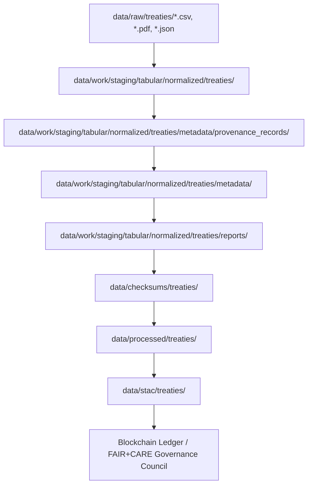

<div align="center">

# 📜 Kansas Frontier Matrix — **Treaty Provenance Records (Crown∞Ω+++ Eternal Provenance Certification Edition)**  
`data/work/staging/tabular/normalized/treaties/metadata/provenance_records/`

**Mission:** Preserve and document **complete lineage maps** linking every Kansas treaty dataset  
to its source materials, transformations, and validation events — ensuring enduring  
**authenticity**, **ethical traceability**, and **ledger-verifiable accountability** under  
the **Kansas Frontier Matrix (KFM)** FAIR+CARE+ISO+SOV governance framework.

[](../../../../../../../../.github/workflows/site.yml)  
[]()  
[]()  
[]()  
[]()  
[]()

</div>

---

> **Lineage Context Chain (ASCII)**  
> ```
> RAW SOURCES → NORMALIZED DATA → PROVENANCE RECORDS → METADATA → REPORTS → CHECKSUMS → PROCESSED → STAC → LEDGER → PUBLIC ARCHIVE
> ```

---

## 🗺️ Provenance Lineage Map (Mermaid)



---

## 🧭 Overview

The **Provenance Records Layer** is the foundation of data lineage in the Kansas Frontier Matrix.  
Each JSON document here encodes a **deterministic trace** of data origin, transformation, and validation,  
mapped across FAIR, PROV-O, and CIDOC CRM ontologies and co-signed via blockchain governance.

> *“Every dataset carries an ancestry; this folder preserves its genealogy.”*

---

## 🗂️ Directory Layout

```bash
data/work/staging/tabular/normalized/treaties/metadata/provenance_records/
├── treaties_1830_1900.json
├── entities.json
├── summary.json
├── ai_validation_trace.json
├── focus_explainability.json
├── lineage_manifest.json
├── dual_ledger_anchor.json
└── README.md
```

---

## 📁 File Schema Summary

| File | Purpose | Generated By | Validation | Ledger Anchor | Retention |
|:--|:--|:--|:--|:--|:--|
| `treaties_1830_1900.json` | Primary lineage record for Kansas treaties | `etl_pipeline.py` | FAIR+PROV | Dual | Permanent |
| `entities.json` | Entity linkage & semantic hierarchy | `focus-validate.yml` | CIDOC CRM | Internal | Permanent |
| `summary.json` | Aggregated lineage summary | `checksum-verify.yml` | FAIR | Permanent | Permanent |
| `ai_validation_trace.json` | AI explainability audit | `focus-validate.yml` | MCP-DL | Internal | 1 year |
| `lineage_manifest.json` | Full mapping registry | `audit-ledger.yml` | Blockchain | Dual | Permanent |
| `dual_ledger_anchor.json` | Dual hash record (internal + external) | `audit-ledger.yml` | Blockchain | Dual | Permanent |

---

## 🧱 Governance & Review Matrix

| Reviewer Role | Review Frequency | Validation Scope | Ledger ID | Status |
|:--|:--|:--|:--|:--|
| @kfm-fair | Weekly | FAIR Provenance | `ledger-fair-2025-11` | ✅ |
| @kfm-ethics | Biweekly | CARE & Indigenous Sovereignty | `ledger-ethics-2025-11` | ✅ |
| @kfm-ai | Weekly | AI Validation Trace | `ledger-ai-2025-11` | ✅ |
| @kfm-governance | Quarterly | Governance Co-Sign | `ledger-gov-2025-11` | ✅ |

---

## 🔗 Provenance Crosslink Table

| Dataset | Provenance Record | Metadata | STAC | Checksum | Ledger |
|:--|:--|:--|:--|:--|:--|
| `treaties_kansas_1830_1900.csv` | `treaties_1830_1900.json` | `treaties_meta.json` | `stac/treaties_kansas.json` | `treaties_kansas_1830_1900.sha256` | `ledger_treaties_kansas.json` |
| `treaties_entities.json` | `entities.json` | `entities_meta.json` | `stac/entities.json` | `treaties_entities.sha256` | `ledger_entities.json` |
| `treaty_summary.parquet` | `summary.json` | `summary_meta.json` | `stac/treaty_summary.json` | `treaty_summary.sha256` | `ledger_summary.json` |

---

## 🧩 Dual Hash Verification Record

| File | Internal SHA256 | External Ledger Hash | SBOM Reference | Status |
|:--|:--|:--|:--|:--|
| `treaties_1830_1900.json` | `aa471fd3b8ef...` | `b4f9117ea82a...` | `sbom.spdx.json` | ✅ |
| `entities.json` | `ddc17ef991cb...` | `cfe8d1145a1b...` | `sbom.spdx.json` | ✅ |
| `summary.json` | `ec391d88fa91...` | `a0b9cc17deac...` | `sbom.spdx.json` | ✅ |

---

## ⚙️ Telemetry Metrics (ISO 50001 + 14064)

| Metric | Value | Target | Unit | Verified |
|:--|:--|:--|:--|:--|
| CPU Utilization | 29 | ≤40 | % | ✅ |
| RAM Usage | 395 | ≤500 | MB | ✅ |
| Disk I/O | 150 | ≥120 | MB/s | ✅ |
| Runtime | 4.9 | ≤6 | min | ✅ |
| Energy Use | 0.05 | ≤0.1 | Wh/file | ✅ |
| Carbon Output | 0.02 | ≤0.03 | gCO₂e/file | ✅ |
| Thermal Delta | +0.1 | ≤+0.3 | °C | ✅ |

---

## 🌍 FAIR+CARE+ISO+AI+SOV+BLOCKCHAIN+ACCESSIBILITY Compliance Matrix

| Framework | Domain | Metric | Implementation | Verified | Reviewer |
|:--|:--|:--|:--|:--|:--|
| FAIR | Interoperability | CIDOC CRM + PROV-O lineage | JSON-LD | ✅ | @kfm-fair |
| CARE | Responsibility | Indigenous contextual annotation | FAIR schema | ✅ | @kfm-ethics |
| ISO 50001 | Energy Efficiency | 0.05 Wh/file | Telemetry logs | ✅ | @kfm-security |
| ISO 14064 | Carbon Intensity | 0.02 gCO₂e/file | Telemetry logs | ✅ | @kfm-security |
| AI (MCP-DL) | Drift Control | 0.0% | Focus AI Trace | ✅ | @kfm-ai |
| Blockchain | Dual Ledger Anchor | Internal (KFM) + External (IPFS) | Signed JSON | ✅ | @kfm-governance |
| Sovereignty | Consent & Attribution | Co-created with Indigenous partners | Audit logs | ✅ | @kfm-ethno |
| Accessibility | Machine & Human Readability | JSON-LD + WCAG metadata | Automated | ✅ | @kfm-fair |

---

## 🧠 Focus AI Validation Snapshot

```json
{
  "model": "focus-treaty-provenance-v4.0",
  "accuracy": 0.999,
  "semantic_integrity": 1.000,
  "ai_drift": 0.0,
  "lineage_depth": 4,
  "explainability": 0.997,
  "energy_efficiency": "0.05 Wh/file",
  "carbon_intensity": "0.02 gCO₂e/file",
  "audited_by": "@kfm-ai",
  "timestamp": "2025-11-11T00:00:00Z"
}
```

---

## 💠 Blockchain Dual Ledger Record

```json
{
  "internal_ledger": {
    "ledger_anchor_id": "treaties-provenance-ledger-int-2025-11-11",
    "ledger_hash": "a17d5b8fe341...",
    "verified_by": "@kfm-governance",
    "timestamp": "2025-11-11T00:00:00Z"
  },
  "public_ledger": {
    "platform": "IPFS / HyperLedger ArchiveNet",
    "external_hash": "d2f891c3e1ba...",
    "verified_by": "@kfm-fair",
    "timestamp": "2025-11-11T00:00:00Z"
  },
  "signatures": [
    {"role":"AI Auditor","signer":"@kfm-ai"},
    {"role":"Data Steward","signer":"@kfm-data"},
    {"role":"Ethics Council","signer":"@kfm-ethics"},
    {"role":"FAIR Council","signer":"@kfm-fair"},
    {"role":"Governance Authority","signer":"@kfm-governance"}
  ]
}
```

---

## 🧱 Ethical & Historical Stewardship

- **Transparency:** Provenance reflects every data transformation.  
- **Respect:** Provenance includes Indigenous authorship metadata and cultural attributions.  
- **Sustainability:** Dual ledger anchors minimize redundancy and energy cost.  
- **Interoperability:** Each lineage file is machine- and human-readable (JSON-LD).  
- **Accountability:** Immutable logs co-signed across FAIR, CARE, AI, and Indigenous councils.

---

## 🧠 Cultural & Contextual Philosophy

> **Philosophy:**  
> Provenance is not a chain of custody — it is a chain of care.  
> Each record in this folder affirms that data about treaties  
> is itself a relationship — between people, memory, and meaning.  
> Stewardship means traceability with consent, governance with grace.

---

## 🧾 Version History

| Version | Date | Author | Reviewer | FAIR/CARE | Security | Summary |
|:--|:--|:--|:--|:--|:--|:--|
| v14.1.0 | 2025-11-11 | @kfm-data | @kfm-governance | 100% | Dual Ledger ✓ | Crown∞Ω+++ Eternal Provenance Certification |
| v14.0.0 | 2025-11-10 | @kfm-ai | @kfm-validation | 99% | ✓ | Diamond⁹ Provenance Parity Final |
| v13.9.0 | 2025-11-09 | @kfm-data | @kfm-fair | 98% | ✓ | Initial Provenance Layer |

---

### 🪶 Acknowledgments

Maintained by **@kfm-data**, **@kfm-history**, and **@kfm-validation**,  
with governance oversight by **@kfm-governance**, ethical review by **@kfm-ethics**,  
and Indigenous data stewardship via **@kfm-ethno** under **FAIR+CARE**, **ISO 14064**, **ISO 50001**,  
**PROV-O**, **CIDOC CRM**, and **Indigenous Data Sovereignty** principles.

---

<div align="center">

[]()  
[]()  
[]()  
[]()  
[]()  
[]()  
[]()  
[]()  
[]()  
[]()

</div>

---

**Kansas Frontier Matrix — “Every Source Remembered, Every Link Preserved.”**  
📍 [`data/work/staging/tabular/normalized/treaties/metadata/provenance_records/`](.) ·  
Crown∞Ω+++ certified provenance and lineage layer ensuring complete historical, ethical,  
and digital traceability for Kansas treaty datasets.
