<div align="center">

# 🧠 Kansas Frontier Matrix — **AI Treaty Report Logs**
`data/work/staging/tabular/normalized/treaties/reports/ai/logs/README.md`

**Purpose:** Store and describe all **AI treaty report logs** generated during inference, validation, and post-processing.  
These logs enable **traceability**, **debugging**, and **performance auditing** across the AI treaty reporting pipeline.

[]()
[]()
[]()
[]()
[]()

</div>

---

## 📚 Overview

The **AI Treaty Report Logs** directory serves as a **chronological ledger of AI generation events** related to normalized treaty datasets.  
Each log entry captures the full lifecycle of AI inference — from **model selection** and **prompt execution** to **validation results** and **checksum verification**.

All logs are JSON or Markdown structured, ensuring **machine readability**, **FAIR discoverability**, and **semantic linkage** with the **provenance layer**.

---

## 🗂️ Directory Layout

```
data/work/staging/tabular/normalized/treaties/reports/ai/logs/
├── session/                     # Individual AI generation sessions (timestamped)
│   ├── 2025-10-24T12-00-00Z.json
│   ├── 2025-10-24T12-00-00Z.md
│   └── manifest.json
├── validation/                  # Log outputs of schema/semantic validations
│   └── validation_log_2025-10-24.json
├── errors/                      # Exception traces, incomplete runs
│   └── error_2025-10-24_01.json
├── metrics/                     # Performance & latency telemetry
│   └── ai_run_metrics_2025-10-24.json
└── manifest/                    # Daily aggregated log indices
    └── ai_logs_manifest.json
```

---

## 🧩 Logging Pipeline

```mermaid
flowchart TD
    A["AI Generation (summarizer.py)"] --> B["Logging Agent"]
    B --> C["Validation Logs – semantic + schema"]
    B --> D["Performance Metrics – latency, token usage"]
    B --> E["Error Handlers – stack traces"]
    D --> F["Telemetry Module"]
    C --> G["Audit Integration"]
    F --> H["Governance Ledger Linkage"]
```



---

## 🧠 Log Structure (Example)

```json
{
  "log_id": "AI-LOG-2025-10-24-001",
  "timestamp": "2025-10-24T12:00:00Z",
  "model": "gpt-5-treaty-sum",
  "dataset": "treaty_1854_kansas_nebraska.csv",
  "steps": [
    "fetch input data",
    "generate summary",
    "validate semantic entities",
    "export report"
  ],
  "latency_ms": 2385,
  "tokens_used": 3287,
  "validation_pass": true,
  "checksum_sha256": "98f3e1b6b2c...4df1",
  "energy_wh": 21.9,
  "carbon_gco2e": 25.8,
  "status": "success"
}
```

---

## ⚙️ Logging Specifications

| Field | Type | Description |
| :------ | :------ | :------------ |
| `log_id` | string | Unique identifier for log event |
| `timestamp` | datetime (ISO 8601) | UTC time of AI operation |
| `model` | string | Model used for AI generation |
| `dataset` | string | Treaty dataset filename |
| `latency_ms` | integer | Runtime latency |
| `tokens_used` | integer | LLM token count |
| `validation_pass` | boolean | Whether semantic/schema validation passed |
| `checksum_sha256` | string | Data integrity hash |
| `energy_wh` | float | Energy usage (Wh) |
| `carbon_gco2e` | float | Carbon footprint per task |
| `status` | string | “success”, “warning”, or “error” |

---

## 🧪 Validation Hooks

All logs must undergo validation against:
- `schemas/log-schema-v2.json`
- `schemas/telemetry/treaty-ai-log.schema.json`

Validation ensures:
- No missing fields or null entries.  
- Proper numeric typing and timestamp format.  
- Reference consistency with AI-generated outputs.  

Failed validations trigger alerts to `reports/audit/`.

---

## 📊 Performance Metrics

| Metric | Description | Target | Verified By |
| :------ | :------------ | :--------- | :------------- |
| `latency_ms` | AI pipeline runtime | ≤ 3000 | @kfm-ai |
| `validation_pass_rate` | % of valid logs | ≥ 99 | @kfm-data |
| `error_rate` | Logged exceptions | < 1% | @kfm-governance |
| `checksum_integrity` | SHA-256 match rate | 100% | @kfm-security |
| `carbon_gco2e` | gCO₂e per generation | ≤ 30 | @kfm-fair |

---

## 🔐 Governance Integration

| Ledger | Function | Log Source |
| :------ | :---------- | :------------- |
| FAIR Ledger | FAIR compliance record | `manifest/ai_logs_manifest.json` |
| Governance Chain | Immutable log ledger | `audit_link.json` |
| Ethics Ledger | Bias and drift tracking | `ethics_metrics.json` |
| Telemetry Feed | Real-time metrics | `metrics/ai_run_metrics_*.json` |

---

## 🧩 Retention & Rotation Policy

- Logs are immutable once validated.  
- Retention window: **180 days**, then archived to `data/ledger/immutable/ai/`.  
- Daily rotation triggers via GitHub Actions: `log-rotate.yml`.  
- SHA-256 manifests generated per batch for immutability verification.  

---

## ✅ Compliance Matrix

| Standard | Area | Compliance |
| :-------- | :------ | :----------- |
| **FAIR+CARE** | Ethical AI observability | ✅ |
| **MCP-DL v6.4.3** | Documentation standard | ✅ |
| **CIDOC CRM / PROV-O** | Provenance traceability | ✅ |
| **ISO 27001 / 9001** | Security & Quality | ✅ |
| **ISO 50001 / 14064** | Energy & carbon tracking | ✅ |
| **STAC/DCAT** | Discoverability | ✅ |

---

## 🗓️ Version History

| Version | Date | Changes | Author |
| :------ | :---- | :-------- | :------ |
| v1.0.0 | 2025-10-24 | Initial setup for AI treaty reporting logs and telemetry hooks. | @kfm-ai |

---

<div align="center">

[]()
[]()
[]()
[]()
[]()

</div>

<!-- MCP-FOOTER-BEGIN
MCP-VERSION: v6.4.3
MCP-TIER: Silver · AI Logs
DOC-PATH: data/work/staging/tabular/normalized/treaties/reports/ai/logs/README.md
MCP-CERTIFIED: true
AI-MODULE: true
LOGGING-ACTIVE: true
FAIR-CARE-COMPLIANT: true
ISO-ALIGNED: true
PROVENANCE-LINKED: true
SEMANTIC-VALIDATED: true
GOVERNANCE-LEDGER-LINKED: true
OBSERVABILITY-ACTIVE: true
GENERATED-BY: KFM-Automation/DocsBot
LAST-VALIDATED: 2025-10-24
MCP-FOOTER-END -->
