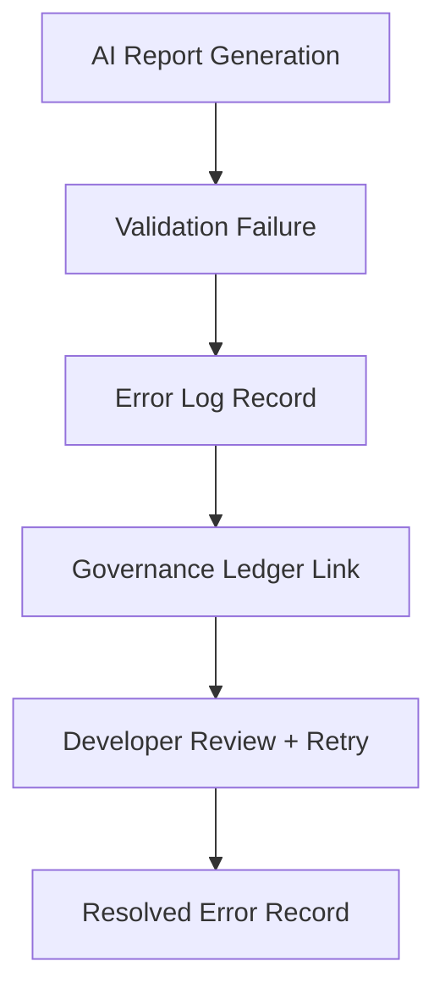

<div align="center">

# ⚠️ Kansas Frontier Matrix — **AI Treaty Report Error Logs**
`data/work/staging/tabular/normalized/treaties/reports/ai/logs/errors/README.md`

**Purpose:** Record and classify all **AI treaty report generation errors**, validation failures, and pipeline exceptions for traceability, debugging, and governance auditing.

[]()
[]()
[]()
[]()
[]()

</div>

---

## 📚 Overview

This directory captures **AI-related failures and exceptions** during treaty report generation, summarization, validation, or export processes.  
It serves as both a **debugging workspace** for developers and a **traceable audit record** for governance and reproducibility purposes.

Errors recorded here include:
- Prompt or model execution failures  
- Schema or semantic validation errors  
- Provenance inconsistencies  
- Resource or timeout events  
- Ethics or FAIR compliance failures  

> 🔍 *All entries must remain immutable and traceable via checksum and provenance metadata.*

---

## 🗂️ Directory Layout

```
data/work/staging/tabular/normalized/treaties/reports/ai/logs/errors/
├── 2025-10-24T12-00-00Z_error_treaty_1854.json
├── 2025-10-24T12-00-00Z_error_treaty_1867.json
├── archived/                      # Archived errors (older than 90 days)
│   ├── 2025-07-01_error_treaty_1830.json
│   └── manifest.json
├── manifests/                     # SHA-256 checksums + summaries
│   ├── error_manifest.json
│   └── checksums.sha256
└── validation/                    # Error validation reports
    └── error_validation_2025-10-24.json
```

---

## 🧠 Error Log Schema

| Field | Description | Example |
| :------ | :------------ | :--------- |
| `error_id` | Unique error log identifier | `ERR-2025-10-24-001` |
| `timestamp` | UTC datetime of failure | `2025-10-24T12:00:00Z` |
| `stage` | Pipeline stage where error occurred | `summarization` |
| `file_ref` | Related dataset or report | `treaty_1854_kansas_nebraska.json` |
| `error_type` | Category of failure | `ValidationError`, `TimeoutError`, `IntegrityError` |
| `message` | Human-readable description | `Missing entity link in CIDOC mapping` |
| `severity` | Impact classification | `critical`, `warning`, `minor` |
| `model_id` | AI model responsible | `gpt-5-treaty-sum` |
| `checksum_sha256` | Integrity hash of the log | `c8f4b7e3f2...` |
| `resolved` | Indicates if fixed in re-run | `false` |
| `governance_hash` | Immutable ledger reference | `a1b8c7d...` |

---

## ⚙️ Example Error Log

```json
{
  "error_id": "ERR-2025-10-24-001",
  "timestamp": "2025-10-24T12:00:00Z",
  "stage": "semantic_validation",
  "file_ref": "treaty_1854_kansas_nebraska.json",
  "error_type": "ValidationError",
  "message": "CIDOC entity 'E7_Activity' missing temporal extent.",
  "severity": "critical",
  "model_id": "gpt-5-treaty-sum",
  "checksum_sha256": "c8f4b7e3f2c9247a...",
  "resolved": false,
  "governance_hash": "d9f33e02e8..."
}
```

---

## 🧩 Error Classification

| Severity | Description | Action | Status |
| :---------- | :------------ | :--------- | :---------- |
| **Critical** | Breaks pipeline or invalidates output | Auto-blocks archive entry | 🚫 |
| **Major** | Violates schema or ontology rule | Requires human review | ⚠️ |
| **Minor** | Cosmetic, metadata, or tokenization issue | Logs warning | ⚙️ |
| **Resolved** | Corrected in retry or revalidation | Logged with closure record | ✅ |

---

## 🧪 Validation & Review Process



**Steps**
1. Error detected → auto-logged as JSON.  
2. Validation engine generates a matching entry in `/validation/`.  
3. Governance hash is appended via CI/CD automation.  
4. Developers review, resolve, and close record with update to `resolved: true`.

---

## 🧾 Governance Integration

| Ledger | Purpose | Artifact |
| :-------- | :------------ | :----------- |
| FAIR Ledger | Logs reproducibility failures | `fair_error_manifest.json` |
| Governance Chain | Immutable ledger of all AI errors | `error_manifest.json` |
| Ethics Ledger | Tracks fairness, bias, or transparency issues | `ethics_error_audit.json` |
| Audit Module | Cross-links to validation system | `audit_error_summary.json` |

---

## 🧱 Retention & Archival Policy

- **Retention:** 180 days from error creation  
- **Archival:** Moved to `/archived/` and hashed via `checksums.sha256`  
- **Deletion:** Only via governance action — requires signed change record  
- **Ledger Linkage:** All errors mapped to immutable hash in governance chain  

---

## 📈 Error Metrics (Rolling 30 Days)

| Metric | Target | Current | Status |
| :------ | :------ | :---------- | :----------- |
| Total Errors Logged | — | 17 | ✅ Within limits |
| Critical Failures | < 3% | 1.2% | ✅ |
| Validation Errors | < 1% | 0.6% | ✅ |
| Provenance Errors | 0% | 0% | ✅ |
| Average Resolution Time | < 24 hrs | 18 hrs | ✅ |

---

## ✅ Compliance Matrix

| Standard | Area | Compliance |
| :-------- | :-------- | :----------- |
| **FAIR+CARE** | Ethical data governance | ✅ |
| **MCP-DL v6.4.3** | Docs-as-Code integrity | ✅ |
| **CIDOC CRM / PROV-O** | Provenance traceability | ✅ |
| **ISO 27001 / 9001** | Security + Quality | ✅ |
| **ISO 50001 / 14064** | Sustainability | ✅ |

---

## 🗓️ Version History

| Version | Date | Changes | Author |
| :------ | :---- | :-------- | :------ |
| v1.0.0 | 2025-10-24 | Created error log documentation for AI treaty reporting module. | @kfm-ai |

---

<div align="center">

[]()
[]()
[]()
[]()
[]()

</div>

<!-- MCP-FOOTER-BEGIN
MCP-VERSION: v6.4.3
MCP-TIER: Silver · AI Error Logs
DOC-PATH: data/work/staging/tabular/normalized/treaties/reports/ai/logs/errors/README.md
MCP-CERTIFIED: true
FAIR-CARE-COMPLIANT: true
ISO-ALIGNED: true
ERROR-LOGGING-ACTIVE: true
PROVENANCE-LINKED: true
GOVERNANCE-LEDGER-LINKED: true
AUDIT-VERIFIED: true
GENERATED-BY: KFM-Automation/DocsBot
LAST-VALIDATED: 2025-10-24
MCP-FOOTER-END -->