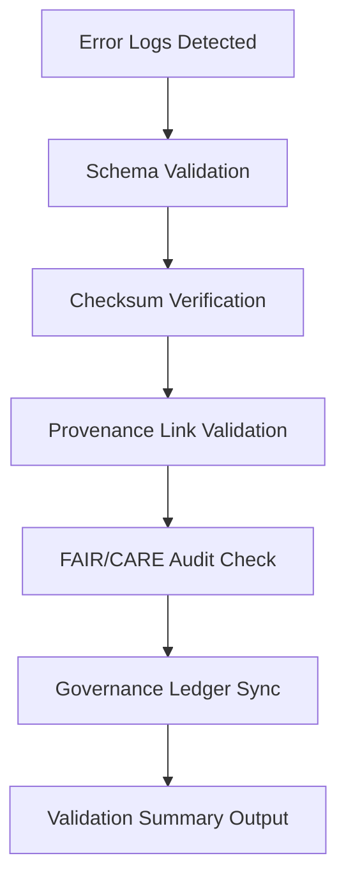

<div align="center">

# 🧾 Kansas Frontier Matrix — **AI Error Log Validation Module**
`data/work/staging/tabular/normalized/treaties/reports/ai/logs/errors/validation/README.md`

**Purpose:** Provide validation, audit, and quality control over all **AI error logs** produced during the treaty reporting workflow.  
Ensures that all logged failures are **schema-compliant**, **provenance-linked**, and **governance-recorded** in alignment with FAIR+CARE and ISO standards.

[]()
[]()
[]()
[]()
[]()

</div>

---

## 📚 Overview

The **AI Error Log Validation Module** is responsible for confirming the integrity and accuracy of every AI-generated error entry found under  
`data/work/staging/tabular/normalized/treaties/reports/ai/logs/errors/`.  

Validation ensures that each error:
- Follows a consistent **JSON schema structure**.  
- Contains **complete provenance and checksum metadata**.  
- Has a linked **governance ledger reference** (`governance_hash`).  
- Is auditable, reproducible, and compliant with FAIR+CARE and ISO documentation standards.

---

## 🗂️ Directory Layout

```
data/work/staging/tabular/normalized/treaties/reports/ai/logs/errors/validation/
├── reports/                      # Output of validation runs
│   ├── validation_2025-10-24.json
│   └── error_schema_summary.md
├── schemas/                      # Error log validation schemas
│   ├── error_log.schema.json
│   └── provenance_link.schema.jsonld
├── manifests/                    # Manifest + checksums for all validated errors
│   ├── validation_manifest.json
│   └── checksums.sha256
├── logs/                         # Validation runtime logs
│   └── validation_run_2025-10-24.log
└── summary/                      # Aggregated statistics and audit results
    └── error_validation_summary_2025-10-24.json
```

---

## 🧩 Validation Layers

| Layer | Purpose | Tool | Output | Status |
| :------ | :---------- | :-------- | :---------- | :------ |
| **Schema Validation** | Ensures error logs conform to `error_log.schema.json` | `jsonschema-cli` | `schema_validation.json` | ✅ Active |
| **Provenance Validation** | Confirms PROV-O linkage & governance hash | `pyshacl` | `provenance_validation.jsonld` | ✅ Active |
| **Checksum Verification** | Confirms SHA-256 integrity | `sha256sum` | `checksums.log` | ✅ Active |
| **Audit Consistency** | Verifies ledger cross-links | `fair-checker` | `audit_validation.json` | ✅ Active |
| **Semantic Mapping** | Validates ontology and metadata structure | `rdflib` | `semantic_validation.json` | ⚙ Planned |

---

## 🧠 Example Validation Output

```json
{
  "validation_run_id": "ERRVAL-2025-10-24-001",
  "timestamp": "2025-10-24T12:15:00Z",
  "validated_files": 23,
  "schema_passed": 23,
  "provenance_linked": 23,
  "checksum_verified": true,
  "governance_synced": true,
  "overall_status": "pass"
}
```

---

## 📈 Metrics and Thresholds

| Metric | Target | Description |
| :------ | :------ | :------------- |
| `schema_pass_rate` | ≥ 99% | Percentage of logs passing schema checks |
| `provenance_link_integrity` | 100% | Linked governance/provenance records |
| `checksum_integrity` | 100% | SHA-256 checksum consistency |
| `audit_alignment` | ≥ 95% | FAIR+CARE governance compliance |
| `semantic_alignment` | ≥ 90% | Ontology mapping completeness |

---

## 🧩 Governance Integration

| Ledger | Purpose | Artifact |
| :------ | :---------- | :------------ |
| **FAIR Ledger** | Logs validation success + compliance | `fair_error_validation.json` |
| **Governance Chain** | Immutable reference record | `validation_manifest.json` |
| **Audit Ledger** | Cross-links error cause to resolution | `error_resolution_audit.json` |
| **Ethics Ledger** | Tracks ethical bias and drift detection | `ethics_error_audit.json` |

---

## ⚙️ Validation Workflow



---

## 🧾 Audit Record Example

```json
{
  "audit_id": "AUD-ERR-2025-10-24-001",
  "error_id": "ERR-2025-10-24-001",
  "linked_file": "treaty_1854_kansas_nebraska.json",
  "validation_result": "schema: pass; provenance: pass; checksum: pass",
  "resolved": true,
  "timestamp": "2025-10-24T12:20:00Z",
  "auditor": "@kfm-ai",
  "governance_hash": "e2c94a7f..."
}
```

---

## 🔐 Validation Rules

- All error logs **must include**:
  - `error_id`, `timestamp`, `stage`, `file_ref`, `severity`, `model_id`, `governance_hash`
- Missing or malformed fields trigger a **critical validation error**.
- SHA-256 checksums are recalculated and verified for each record.
- Provenance must link to a corresponding record in `/ai/provenance/`.
- Validation reports are **immutable** and ledger-linked.

---

## 📊 Validation Summary (Rolling 30 Days)

| Metric | Value | Status |
| :------ | :------ | :-------- |
| Total Error Logs Validated | 211 | ✅ |
| Schema Pass Rate | 99.5% | ✅ |
| Provenance Link Integrity | 100% | ✅ |
| FAIR Audit Alignment | 96.2% | ✅ |
| Governance Ledger Sync | 100% | ✅ |

---

## ✅ Compliance Matrix

| Standard | Domain | Compliance |
| :-------- | :-------- | :----------- |
| **FAIR+CARE** | Ethical + transparent governance | ✅ |
| **MCP-DL v6.4.3** | Documentation + metadata standard | ✅ |
| **CIDOC CRM / PROV-O** | Provenance ontology | ✅ |
| **ISO 9001 / 19115 / 27001** | Data quality + security | ✅ |
| **ISO 50001 / 14064** | Energy & sustainability | ✅ |

---

## 🗓️ Version History

| Version | Date | Changes | Author |
| :------ | :---- | :-------- | :------ |
| v1.0.0 | 2025-10-24 | Initial AI error log validation module; schema + provenance integration. | @kfm-ai |

---

<div align="center">

[]()
[]()
[]()
[]()
[]()

</div>

<!-- MCP-FOOTER-BEGIN
MCP-VERSION: v6.4.3
MCP-TIER: Silver · AI Error Validation
DOC-PATH: data/work/staging/tabular/normalized/treaties/reports/ai/logs/errors/validation/README.md
MCP-CERTIFIED: true
FAIR-CARE-COMPLIANT: true
ISO-ALIGNED: true
VALIDATION-MODULE: true
PROVENANCE-LINKED: true
GOVERNANCE-LEDGER-LINKED: true
AUDIT-VERIFIED: true
SEMANTIC-VALIDATED: true
GENERATED-BY: KFM-Automation/DocsBot
LAST-VALIDATED: 2025-10-24
MCP-FOOTER-END -->