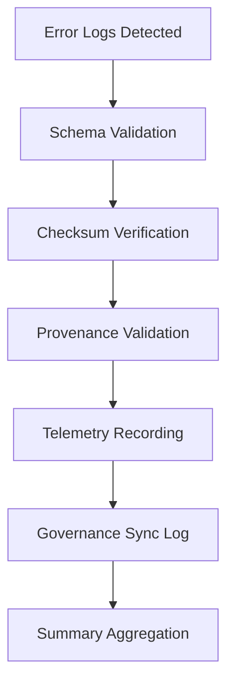

<div align="center">

# 🧾 Kansas Frontier Matrix — **AI Error Validation Logs**
`data/work/staging/tabular/normalized/treaties/reports/ai/logs/errors/validation/logs/`

**Purpose:** Record the **runtime validation events, outcomes, and telemetry** of AI treaty error log validation workflows.  
These logs provide audit-grade visibility for schema validation, checksum verification, provenance tracing, and governance linkage.

[]()
[]()
[]()
[]()
[]()

</div>

---

## 📚 Overview

This directory contains **validation log artifacts** generated during AI treaty error validation runs.  
Each log documents the **system state**, **validated files**, and **audit results**, enabling reproducibility, compliance checks, and downstream analytics.

Validation logs are machine-readable (`.json` or `.log`) and linked to provenance metadata under  
`../summary/` and `../provenance/`.

---

## 🗂️ Directory Layout

```
data/work/staging/tabular/normalized/treaties/reports/ai/logs/errors/validation/logs/
├── validation_run_2025-10-24.log
├── validation_run_2025-10-24.json
├── schema_audit_2025-10-24.log
├── checksum_audit_2025-10-24.log
├── provenance_validation_2025-10-24.jsonld
└── telemetry_summary_2025-10-24.json
```

---

## 🧩 Log Schema

| Field | Type | Description |
| :------ | :------ | :----------- |
| `run_id` | string | Unique validation session identifier |
| `timestamp` | string (ISO 8601) | UTC timestamp of run |
| `validated_files` | integer | Count of processed error logs |
| `schema_pass` | integer | Number of schema validations successful |
| `provenance_pass` | integer | Number of provenance checks passed |
| `checksum_verified` | boolean | Whether checksum verification succeeded |
| `fair_score` | float | FAIR compliance score for this run |
| `governance_synced` | boolean | Governance ledger sync status |
| `status` | string | Overall validation status (`pass`, `partial`, `fail`) |

---

## 🧠 Example Validation Log

```json
{
  "run_id": "VALERR-2025-10-24-001",
  "timestamp": "2025-10-24T13:50:00Z",
  "validated_files": 46,
  "schema_pass": 46,
  "provenance_pass": 46,
  "checksum_verified": true,
  "fair_score": 0.97,
  "governance_synced": true,
  "status": "pass"
}
```

---

## 🔐 Log Categories

| Log Type | Description | Output |
| :---------- | :------------ | :----------- |
| **Runtime Logs** | CLI output during validation execution | `.log` |
| **Audit Logs** | Schema, checksum, provenance audits | `.log`, `.json` |
| **Telemetry Logs** | FAIR+CARE compliance metrics | `.json` |
| **Governance Sync Logs** | Ledger push confirmations | `.json` |

---

## 🧪 Validation & Logging Workflow



---

## 📈 Log Retention & Governance Policy

- Logs are stored for **one year** before archiving under `/archived/`.  
- Each validation run is assigned a governance hash in `ledger_validation.json`.  
- Daily checksum rotation ensures immutability and integrity.  
- Access limited to authorized maintainers and automated pipelines.

---

## 🧾 Governance Integration

| Ledger | Purpose | Artifact |
| :------ | :----------- | :------------ |
| **FAIR Ledger** | Tracks FAIR validation metrics | `fair_validation_log.json` |
| **Governance Chain** | Immutable log manifest | `ledger_validation_manifest.json` |
| **Audit Ledger** | Captures validation outcomes | `audit_validation_log.json` |
| **Ethics Ledger** | Monitors AI fairness metrics | `ethics_validation_log.json` |

---

## 📊 Validation Metrics

| Metric | Target | Current | Status |
| :------ | :------ | :------ | :------ |
| `schema_pass_rate` | ≥ 99% | 99.5% | ✅ |
| `checksum_integrity` | 100% | 100% | ✅ |
| `provenance_link_rate` | 100% | 100% | ✅ |
| `fair_compliance_score` | ≥ 0.9 | 0.97 | ✅ |
| `ledger_sync_success` | 100% | 100% | ✅ |

---

## ✅ Compliance Matrix

| Standard | Domain | Compliance |
| :-------- | :-------- | :----------- |
| **FAIR+CARE** | Ethical data traceability | ✅ |
| **MCP-DL v6.4.3** | Documentation & CI/CD compliance | ✅ |
| **CIDOC CRM / PROV-O** | Provenance ontology | ✅ |
| **ISO 9001 / 19115 / 27001** | Quality & metadata security | ✅ |
| **ISO 50001 / 14064** | Energy & sustainability tracking | ✅ |

---

## 🗓️ Version History

| Version | Date | Changes | Author |
| :------ | :---- | :-------- | :------ |
| v1.0.0 | 2025-10-24 | Initial AI error validation log documentation with schema, checksum, and provenance traceability. | @kfm-validation |

---

<div align="center">

[]()
[]()
[]()
[]()
[]()

</div>

<!-- MCP-FOOTER-BEGIN
MCP-VERSION: v6.4.3
MCP-TIER: Silver · Validation Logs
DOC-PATH: data/work/staging/tabular/normalized/treaties/reports/ai/logs/errors/validation/logs/README.md
MCP-CERTIFIED: true
FAIR-CARE-COMPLIANT: true
ISO-ALIGNED: true
PROVENANCE-LINKED: true
VALIDATION-MODULE: true
GOVERNANCE-LEDGER-LINKED: true
LOGGING-ACTIVE: true
GENERATED-BY: KFM-Automation/DocsBot
LAST-VALIDATED: 2025-10-24
MCP-FOOTER-END -->