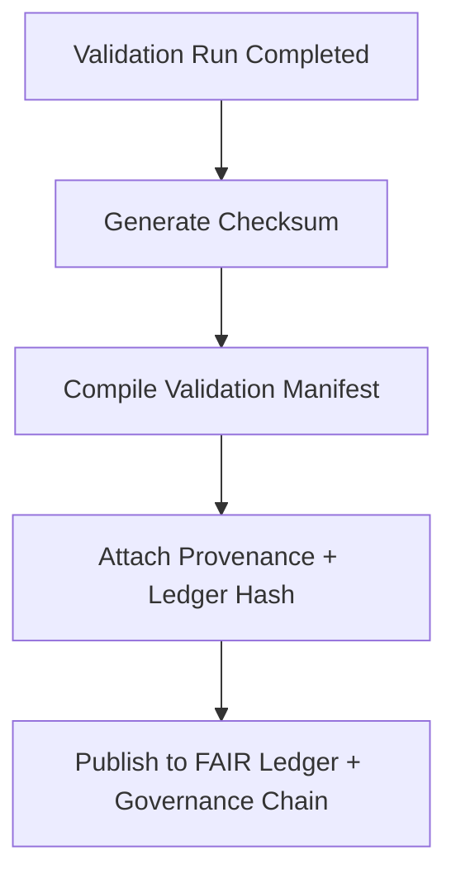

<div align="center">

# 🗂️ Kansas Frontier Matrix — **AI Error Validation Manifests**
`data/work/staging/tabular/normalized/treaties/reports/ai/logs/errors/validation/manifests/`

**Purpose:** Store and maintain **validation manifests** documenting verified AI error logs, validation runs, checksums, and ledger linkages.  
These manifests ensure **traceability**, **integrity**, and **governance compliance** across all validation activities.

[]()
[]()
[]()
[]()
[]()

</div>

---

## 📚 Overview

The **AI Error Validation Manifests** directory serves as the **registry of validation events and artifacts** created by the KFM treaty AI validation workflow.  
Each manifest file logs:
- The validation session metadata (timestamp, validator, results)
- The list of validated error log files
- Checksums for immutability and verification
- FAIR+CARE compliance and governance ledger hashes

> 🧾 *Manifests are immutable, append-only records that ensure reproducibility and validation accountability.*

---

## 🗂️ Directory Layout

```
data/work/staging/tabular/normalized/treaties/reports/ai/logs/errors/validation/manifests/
├── validation_manifest_2025-10-24.json
├── validation_manifest_rolling_30_days.json
├── checksums.sha256
├── provenance_links.jsonld
└── governance_hashes.json
```

---

## 🧩 Manifest Schema

| Field | Description | Example |
| :------ | :------------ | :----------- |
| `manifest_id` | Unique identifier for validation manifest | `"VALMAN-2025-10-24-001"` |
| `generated_at` | ISO 8601 timestamp of manifest creation | `"2025-10-24T13:55:00Z"` |
| `validator` | Responsible agent or system | `"@kfm-validation"` |
| `validated_files` | List of validated error logs | `["error_2025-10-24_01.json", "error_2025-10-24_02.json"]` |
| `checksum_file` | Path to checksum registry | `"checksums.sha256"` |
| `checksum_verified` | Boolean indicating hash integrity | `true` |
| `provenance_ref` | Linked provenance file | `"provenance_links.jsonld"` |
| `governance_hash` | Immutable ledger hash for the manifest | `"a3b9c7f21e..."` |
| `fair_score` | FAIR+CARE compliance rating (0–1 scale) | `0.97` |
| `status` | Overall validation outcome | `"validated"` |

---

## 🧠 Example Validation Manifest

```json
{
  "manifest_id": "VALMAN-2025-10-24-001",
  "generated_at": "2025-10-24T13:55:00Z",
  "validator": "@kfm-validation",
  "validated_files": [
    "error_2025-10-24_01.json",
    "error_2025-10-24_02.json",
    "error_2025-10-24_03.json"
  ],
  "checksum_file": "checksums.sha256",
  "checksum_verified": true,
  "provenance_ref": "provenance_links.jsonld",
  "governance_hash": "a3b9c7f21e...",
  "fair_score": 0.97,
  "status": "validated"
}
```

---

## 🔐 Validation Workflow



---

## 🧾 Provenance Example (`provenance_links.jsonld`)

```json
{
  "@context": {
    "prov": "http://www.w3.org/ns/prov#",
    "crm": "http://www.cidoc-crm.org/cidoc-crm/",
    "fair": "https://purl.org/fair/"
  },
  "@id": "prov:validation_manifest_2025-10-24",
  "prov:wasGeneratedBy": "process:validation_pipeline_v5",
  "prov:used": [
    "../logs/validation_run_2025-10-24.log",
    "../summary/validation_summary_2025-10-24.json"
  ],
  "prov:generatedAtTime": "2025-10-24T13:55:00Z",
  "prov:qualifiedAttribution": {
    "prov:agent": "@kfm-validation",
    "prov:role": "validator"
  },
  "fair:ledger_hash": "a3b9c7f21e..."
}
```

---

## 📈 Key Metrics

| Metric | Target | Current | Status |
| :------ | :------ | :------ | :------ |
| `checksum_match_rate` | 100% | 100% | ✅ |
| `manifest_integrity` | 100% | 100% | ✅ |
| `provenance_completeness` | 100% | 100% | ✅ |
| `ledger_sync_success` | 100% | 100% | ✅ |
| `fair_score` | ≥ 0.9 | 0.97 | ✅ |

---

## 🧩 Governance Integration

| Ledger | Purpose | Artifact |
| :------ | :----------- | :------------ |
| **FAIR Ledger** | Public record of validation manifests | `fair_validation_manifest.json` |
| **Governance Chain** | Immutable manifest registry | `governance_hashes.json` |
| **Audit Ledger** | Validation event history | `audit_validation_manifest.json` |
| **Ethics Ledger** | FAIR+CARE ethical oversight | `ethics_validation_manifest.json` |

---

## 📜 Retention & Policy

- Validation manifests are **immutable** and **retained indefinitely**.  
- Archived copies are replicated to `/data/ledger/immutable/manifests/`.  
- Re-validation creates a new manifest; older ones remain preserved.  
- Governance linkage is enforced automatically by CI/CD workflows.

---

## ✅ Compliance Matrix

| Standard | Domain | Compliance |
| :-------- | :-------- | :----------- |
| **FAIR+CARE** | Transparency + data traceability | ✅ |
| **MCP-DL v6.4.3** | Docs-as-Code validation | ✅ |
| **CIDOC CRM / PROV-O / OWL-Time** | Provenance and semantics | ✅ |
| **ISO 9001 / 19115 / 27001** | Quality & data security | ✅ |
| **ISO 50001 / 14064** | Energy + sustainability metrics | ✅ |

---

## 🗓️ Version History

| Version | Date | Changes | Author |
| :------ | :---- | :-------- | :------ |
| v1.0.0 | 2025-10-24 | Created AI Error Validation Manifest directory with governance and checksum integration. | @kfm-validation |

---

<div align="center">

[]()
[]()
[]()
[]()
[]()

</div>

<!-- MCP-FOOTER-BEGIN
MCP-VERSION: v6.4.3
MCP-TIER: Silver · Validation Manifests
DOC-PATH: data/work/staging/tabular/normalized/treaties/reports/ai/logs/errors/validation/manifests/README.md
MCP-CERTIFIED: true
FAIR-CARE-COMPLIANT: true
ISO-ALIGNED: true
PROVENANCE-LINKED: true
MANIFEST-VALIDATED: true
GOVERNANCE-LEDGER-LINKED: true
CHECKSUM-VERIFIED: true
AUDIT-VERIFIED: true
GENERATED-BY: KFM-Automation/DocsBot
LAST-VALIDATED: 2025-10-24
MCP-FOOTER-END -->