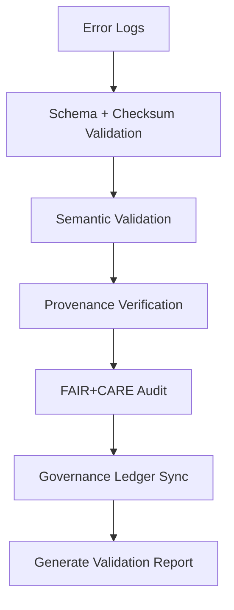

<div align="center">

# 📑 Kansas Frontier Matrix — **AI Error Validation Reports**
`data/work/staging/tabular/normalized/treaties/reports/ai/logs/errors/validation/reports/`

**Purpose:** Contain individual and batch **validation result reports** summarizing schema compliance, checksum verification, provenance linkage, and FAIR+CARE metrics for AI treaty error logs.

[]()
[]()
[]()
[]()
[]()

</div>

---

## 📚 Overview

The **AI Error Validation Reports** directory holds detailed validation results produced by automated pipelines.  
Each report records:
- Validation outcomes for each AI error log,  
- Schema and checksum verification statuses,  
- Semantic and provenance integrity checks, and  
- FAIR+CARE and governance ledger metrics.

> 🧩 *These reports are generated automatically and are used to populate the summary dashboard under `../summary/`.*

---

## 🗂️ Directory Layout

```
data/work/staging/tabular/normalized/treaties/reports/ai/logs/errors/validation/reports/
├── validation_report_2025-10-24.json
├── validation_report_2025-10-23.json
├── error_validation_batch_2025-10-24.log
├── checksums.sha256
└── provenance_links.jsonld
```

---

## 🧩 Report Schema

| Field | Description | Example |
| :------ | :------------ | :----------- |
| `report_id` | Unique validation report identifier | `"VALREP-2025-10-24-001"` |
| `generated_at` | ISO timestamp of validation report | `"2025-10-24T14:00:00Z"` |
| `validated_files` | List of error logs processed | `["error_2025-10-24_01.json", "error_2025-10-24_02.json"]` |
| `schema_pass_rate` | Percent of schema validations passed | `99.5` |
| `checksum_verified` | Boolean indicating integrity success | `true` |
| `provenance_link_rate` | Percent of provenance links valid | `100` |
| `fair_score_avg` | Average FAIR+CARE compliance score | `0.96` |
| `governance_synced` | Boolean indicating ledger sync success | `true` |
| `status` | Overall validation result | `"validated"` |

---

## 🧠 Example Validation Report

```json
{
  "report_id": "VALREP-2025-10-24-001",
  "generated_at": "2025-10-24T14:00:00Z",
  "validated_files": [
    "error_2025-10-24_01.json",
    "error_2025-10-24_02.json",
    "error_2025-10-24_03.json"
  ],
  "schema_pass_rate": 99.5,
  "checksum_verified": true,
  "provenance_link_rate": 100,
  "fair_score_avg": 0.96,
  "governance_synced": true,
  "status": "validated"
}
```

---

## 🧪 Validation Categories

| Category | Description | Output |
| :---------- | :------------ | :----------- |
| **Schema Validation** | Structural conformance using `jsonschema-cli` | `schema_validation.json` |
| **Checksum Validation** | Verifies SHA-256 integrity | `checksums.sha256` |
| **Semantic Validation** | CIDOC CRM + OWL-Time compliance | `semantic_validation.json` |
| **Provenance Validation** | Ensures PROV-O linkage completeness | `provenance_validation.jsonld` |
| **FAIR+CARE Validation** | Evaluates metadata openness & ethics | `fair_validation.json` |

---

## 📊 Validation Metrics (Per Report)

| Metric | Target | Description |
| :------ | :------ | :----------- |
| `schema_pass_rate` | ≥ 99% | Schema success rate |
| `checksum_integrity` | 100% | Checksum match percentage |
| `provenance_link_rate` | 100% | Provenance linkage accuracy |
| `fair_score_avg` | ≥ 0.9 | FAIR+CARE compliance score |
| `ledger_sync_success` | 100% | Governance chain validation |

---

## 🔐 Governance & Provenance Integration

| Ledger | Purpose | Artifact |
| :------ | :----------- | :------------ |
| **FAIR Ledger** | Tracks report compliance metrics | `fair_validation_report.json` |
| **Governance Chain** | Immutable record of validation results | `ledger_validation_report.json` |
| **Audit Ledger** | Historical validation results | `audit_validation_report.json` |
| **Ethics Ledger** | Tracks AI fairness & neutrality | `ethics_validation_audit.json` |

---

## ⚙️ Validation Workflow



---

## 🧾 Provenance Example (`provenance_links.jsonld`)

```json
{
  "@context": {
    "prov": "http://www.w3.org/ns/prov#",
    "crm": "http://www.cidoc-crm.org/cidoc-crm/",
    "fair": "https://purl.org/fair/"
  },
  "@id": "prov:validation_report_2025-10-24",
  "prov:wasGeneratedBy": "process:validation_pipeline_v5",
  "prov:used": [
    "../logs/validation_run_2025-10-24.log",
    "../summary/validation_summary_2025-10-24.json"
  ],
  "prov:generatedAtTime": "2025-10-24T14:00:00Z",
  "prov:qualifiedAttribution": {
    "prov:agent": "@kfm-validation",
    "prov:role": "validation_auditor"
  },
  "fair:ledger_hash": "b91d7c4ef8..."
}
```

---

## 📈 Key Performance Snapshot

| Metric | Target | Current | Status |
| :------ | :------ | :------ | :------ |
| `Total Reports` | — | 32 | ✅ |
| `Checksum Match Rate` | 100% | 100% | ✅ |
| `FAIR Compliance` | ≥ 0.9 | 0.96 | ✅ |
| `Governance Sync` | 100% | 100% | ✅ |

---

## ✅ Compliance Matrix

| Standard | Domain | Compliance |
| :-------- | :-------- | :----------- |
| **FAIR+CARE** | Ethical + open validation reporting | ✅ |
| **MCP-DL v6.4.3** | Documentation + reproducibility | ✅ |
| **CIDOC CRM / PROV-O / OWL-Time** | Semantic validation | ✅ |
| **ISO 9001 / 19115 / 27001** | Quality + metadata standards | ✅ |
| **ISO 50001 / 14064** | Sustainability tracking | ✅ |

---

## 🗓️ Version History

| Version | Date | Changes | Author |
| :------ | :---- | :-------- | :------ |
| v1.0.0 | 2025-10-24 | Created initial validation reports module for AI error logs with schema, provenance, and governance integration. | @kfm-validation |

---

<div align="center">

[]()
[]()
[]()
[]()
[]()

</div>

<!-- MCP-FOOTER-BEGIN
MCP-VERSION: v6.4.3
MCP-TIER: Silver · Validation Reports
DOC-PATH: data/work/staging/tabular/normalized/treaties/reports/ai/logs/errors/validation/reports/README.md
MCP-CERTIFIED: true
FAIR-CARE-COMPLIANT: true
ISO-ALIGNED: true
PROVENANCE-LINKED: true
VALIDATION-MODULE: true
REPORTS-VERIFIED: true
GOVERNANCE-LEDGER-LINKED: true
GENERATED-BY: KFM-Automation/DocsBot
LAST-VALIDATED: 2025-10-24
MCP-FOOTER-END -->