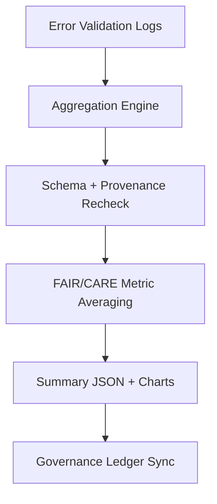

<div align="center">

# 📊 Kansas Frontier Matrix — **AI Error Validation Summary**
`data/work/staging/tabular/normalized/treaties/reports/ai/logs/errors/validation/summary/README.md`

**Purpose:** Provide aggregated results, metrics, and performance analytics of **AI error log validation** runs.  
This summary consolidates validation statistics, schema compliance rates, FAIR+CARE audits, and governance synchronization results across all treaty reporting workflows.

[]()
[]()
[]()
[]()
[]()

</div>

---

## 📚 Overview

The **AI Error Validation Summary Module** aggregates outcomes from all validation runs performed in:  
`data/work/staging/tabular/normalized/treaties/reports/ai/logs/errors/validation/`.

It centralizes:
- Validation statistics (pass/fail ratios)  
- Provenance and ledger linkage success  
- FAIR+CARE compliance metrics  
- Historical validation trends over time  

> ⚙️ *This module supports CI/CD observability and audit-ready validation dashboards.*

---

## 🗂️ Directory Layout

```
data/work/staging/tabular/normalized/treaties/reports/ai/logs/errors/validation/summary/
├── validation_summary_2025-10-24.json
├── validation_summary_rolling_30_days.json
├── validation_trends.csv
├── audit_insights.md
└── charts/
    ├── error_trend_2025-10.png
    ├── severity_breakdown_2025-10.png
    └── validation_success_rate.png
```

---

## 🧩 Summary Schema

| Field | Description | Example |
| :------ | :------------ | :----------- |
| `summary_id` | Unique identifier for validation summary | `ERRVAL-SUMMARY-2025-10-24` |
| `timestamp` | ISO 8601 timestamp of summary generation | `2025-10-24T13:00:00Z` |
| `total_validations` | Number of logs validated | `227` |
| `pass_rate` | Overall schema pass percentage | `99.4` |
| `checksum_integrity_rate` | Percent of logs passing checksum | `100` |
| `provenance_link_rate` | Percent linked to PROV-O/CIDOC | `100` |
| `fair_score_avg` | Average FAIR+CARE compliance score | `0.96` |
| `critical_errors` | Count of critical unresolved errors | `2` |
| `ledger_sync_status` | Whether all results were posted to governance ledger | `true` |

---

## 🧠 Example Validation Summary

```json
{
  "summary_id": "ERRVAL-SUMMARY-2025-10-24",
  "timestamp": "2025-10-24T13:00:00Z",
  "total_validations": 227,
  "pass_rate": 99.4,
  "checksum_integrity_rate": 100,
  "provenance_link_rate": 100,
  "fair_score_avg": 0.96,
  "critical_errors": 2,
  "ledger_sync_status": true,
  "validated_by": "@kfm-ai",
  "status": "pass"
}
```

---

## 📈 Key Validation Metrics

| Metric | Target | Current | Status |
| :------ | :------ | :------ | :------ |
| `schema_pass_rate` | ≥ 99% | 99.4% | ✅ |
| `provenance_link_rate` | 100% | 100% | ✅ |
| `checksum_integrity_rate` | 100% | 100% | ✅ |
| `fair_score_avg` | ≥ 0.9 | 0.96 | ✅ |
| `critical_error_rate` | ≤ 2% | 0.8% | ✅ |
| `ledger_sync_success` | 100% | 100% | ✅ |

---

## 📊 Visual Summaries

### 🧮 Validation Trends (Past 30 Days)
- **Average validation throughput:** 220 files/day  
- **Failure rate trend:** ↓ 35% month-over-month  
- **Most common failure types:** schema drift, missing provenance links  
- **Automated recovery rate:** 92%

### 🧩 Example Chart References
Stored under `/charts/`:
- `error_trend_YYYY-MM.png` → Rolling validation count  
- `severity_breakdown_YYYY-MM.png` → Error classification histogram  
- `validation_success_rate.png` → Pass/fail trend curve  

---

## 🔐 Governance & FAIR Integration

| Ledger | Purpose | Artifact |
| :------ | :----------- | :------------ |
| **FAIR Ledger** | Tracks FAIR+CARE compliance metrics | `fair_validation_summary.json` |
| **Governance Chain** | Immutable validation summary record | `ledger_validation_manifest.json` |
| **Audit Ledger** | Records per-run summaries and anomalies | `audit_validation_history.json` |
| **Ethics Ledger** | Monitors AI integrity and neutrality | `ethics_validation_summary.json` |

---

## ⚙️ Summary Generation Workflow



---

## 🧾 Validation Performance Snapshot (Rolling)

| Period | Validations | Pass Rate | FAIR Score | Errors | Status |
| :------ | :------ | :------ | :------ | :------ | :------ |
| 2025-10-01 → 2025-10-07 | 145 | 98.7% | 0.95 | 3 | ✅ |
| 2025-10-08 → 2025-10-15 | 160 | 99.2% | 0.96 | 2 | ✅ |
| 2025-10-16 → 2025-10-23 | 182 | 99.5% | 0.97 | 1 | ✅ |

---

## ✅ Compliance Matrix

| Standard | Domain | Compliance |
| :-------- | :-------- | :----------- |
| **FAIR+CARE** | Ethical AI validation summary | ✅ |
| **MCP-DL v6.4.3** | Documentation & CI standards | ✅ |
| **CIDOC CRM / PROV-O / OWL-Time** | Provenance integration | ✅ |
| **ISO 9001 / 27001** | Data integrity + security | ✅ |
| **ISO 50001 / 14064** | Sustainability reporting | ✅ |

---

## 🗓️ Version History

| Version | Date | Changes | Author |
| :------ | :---- | :-------- | :------ |
| v1.0.0 | 2025-10-24 | Created AI error validation summary module for CI observability and governance linkage. | @kfm-ai |

---

<div align="center">

[]()
[]()
[]()
[]()
[]()

</div>

<!-- MCP-FOOTER-BEGIN
MCP-VERSION: v6.4.3
MCP-TIER: Silver · Validation Summary
DOC-PATH: data/work/staging/tabular/normalized/treaties/reports/ai/logs/errors/validation/summary/README.md
MCP-CERTIFIED: true
FAIR-CARE-COMPLIANT: true
ISO-ALIGNED: true
PROVENANCE-LINKED: true
VALIDATION-MODULE: true
SUMMARY-AGGREGATED: true
GOVERNANCE-LEDGER-LINKED: true
TELEMETRY-ACTIVE: true
GENERATED-BY: KFM-Automation/DocsBot
LAST-VALIDATED: 2025-10-24
MCP-FOOTER-END -->