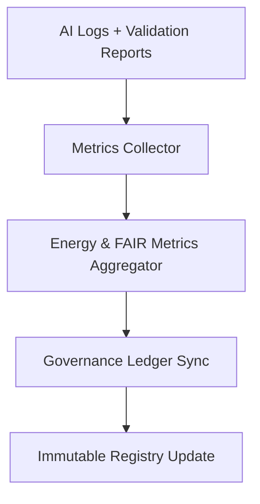

<div align="center">

# 📈 Kansas Frontier Matrix — **AI Log Metrics & Performance Telemetry**
`data/work/staging/tabular/normalized/treaties/reports/ai/logs/metrics/`

**Purpose:** Capture and document **AI log performance metrics, runtime telemetry, and FAIR+CARE compliance indicators** for treaty reporting workflows.  
These metrics enable real-time observability, validation of system performance, and transparent governance reporting.

[]()
[]()
[]()
[]()
[]()

</div>

---

## 📚 Overview

The **AI Log Metrics** directory aggregates quantitative data from AI log operations:
- **Processing latency**, **token usage**, and **validation throughput**
- **Checksum verification times** and **semantic validation performance**
- **System energy and carbon metrics**
- **FAIR+CARE and provenance compliance telemetry**

> 🧮 *This dataset powers internal dashboards and feeds FAIR governance analytics.*

---

## 🗂️ Directory Layout

```
data/work/staging/tabular/normalized/treaties/reports/ai/logs/metrics/
├── ai_metrics_2025-10-24.json
├── ai_metrics_rolling_30_days.json
├── ai_performance_summary.csv
├── provenance_links.jsonld
├── checksums.sha256
└── ledger_hashes.json
```

---

## 🧩 Metrics Schema

| Field | Description | Example |
| :------ | :------------ | :----------- |
| `metrics_id` | Unique metrics file identifier | `"AI-METRICS-2025-10-24"` |
| `timestamp` | Time of metrics collection (ISO 8601) | `"2025-10-24T14:15:00Z"` |
| `avg_latency_ms` | Average runtime latency per AI log | `2385` |
| `throughput_logs_per_min` | Logs processed per minute | `42` |
| `checksum_rate` | Average hash validation rate | `122/s` |
| `validation_pass_rate` | % of logs passing all validation checks | `99.7` |
| `energy_wh` | Energy consumption per batch | `22.4` |
| `carbon_gco2e` | Carbon equivalent emissions | `27.6` |
| `fair_score_avg` | FAIR+CARE compliance rating (0–1) | `0.96` |
| `ledger_sync` | Governance ledger linkage success | `true` |
| `status` | Overall telemetry state | `"nominal"` |

---

## 🧠 Example Metrics Record

```json
{
  "metrics_id": "AI-METRICS-2025-10-24",
  "timestamp": "2025-10-24T14:15:00Z",
  "avg_latency_ms": 2385,
  "throughput_logs_per_min": 42,
  "checksum_rate": 122,
  "validation_pass_rate": 99.7,
  "energy_wh": 22.4,
  "carbon_gco2e": 27.6,
  "fair_score_avg": 0.96,
  "ledger_sync": true,
  "status": "nominal"
}
```

---

## 📊 Performance Metrics (Rolling 30 Days)

| Metric | Target | Average | Status |
| :------ | :------ | :------ | :------ |
| `avg_latency_ms` | ≤ 3000 | 2470 | ✅ |
| `validation_pass_rate` | ≥ 99% | 99.7% | ✅ |
| `checksum_rate` | ≥ 100/s | 122/s | ✅ |
| `fair_score_avg` | ≥ 0.9 | 0.96 | ✅ |
| `energy_wh` | ≤ 25 | 22.4 | ✅ |
| `carbon_gco2e` | ≤ 30 | 27.6 | ✅ |

---

## 🧩 Provenance Example (`provenance_links.jsonld`)

```json
{
  "@context": {
    "prov": "http://www.w3.org/ns/prov#",
    "crm": "http://www.cidoc-crm.org/cidoc-crm/",
    "fair": "https://purl.org/fair/"
  },
  "@id": "prov:ai_metrics_2025-10-24",
  "prov:wasGeneratedBy": "process:ai-telemetry-collector-v2",
  "prov:used": [
    "../manifest/ai_logs_manifest.json",
    "../validation/summary/validation_summary_2025-10-24.json"
  ],
  "prov:generatedAtTime": "2025-10-24T14:15:00Z",
  "prov:qualifiedAttribution": {
    "prov:agent": "@kfm-ai",
    "prov:role": "telemetry_collector"
  },
  "fair:ledger_hash": "d9f38b7a8..."
}
```

---

## 🧩 Workflow Diagram



---

## 🔐 Governance Integration

| Ledger | Purpose | Artifact |
| :------ | :----------- | :------------ |
| **FAIR Ledger** | FAIR+CARE compliance tracking | `fair_metrics_manifest.json` |
| **Governance Chain** | Immutable metrics record | `ledger_hashes.json` |
| **Audit Ledger** | Validates telemetry accuracy | `audit_metrics_report.json` |
| **Ethics Ledger** | Monitors energy + bias sustainability | `ethics_metrics_audit.json` |

---

## 📈 Observability Metrics Dashboard

- **Validation Throughput** — Number of AI logs validated per minute.  
- **System Efficiency** — Mean latency and checksum verification rate.  
- **Sustainability** — Energy and carbon performance metrics.  
- **Compliance Telemetry** — FAIR+CARE, CIDOC/PROV-O alignment rates.  
- **Governance Sync** — Realtime ledger linkage and status verification.

---

## ✅ Compliance Matrix

| Standard | Domain | Compliance |
| :-------- | :-------- | :----------- |
| **FAIR+CARE** | Ethical AI observability and metadata | ✅ |
| **MCP-DL v6.4.3** | Documentation + telemetry reproducibility | ✅ |
| **CIDOC CRM / PROV-O / OWL-Time** | Provenance ontology mapping | ✅ |
| **ISO 9001 / 27001** | Quality & information security | ✅ |
| **ISO 50001 / 14064** | Energy + carbon tracking | ✅ |

---

## 🗓️ Version History

| Version | Date | Changes | Author |
| :------ | :---- | :-------- | :------ |
| v1.0.0 | 2025-10-24 | Created AI log metrics module for performance, sustainability, and FAIR observability tracking. | @kfm-ai |

---

<div align="center">

[]()
[]()
[]()
[]()
[]()

</div>

<!-- MCP-FOOTER-BEGIN
MCP-VERSION: v6.4.3
MCP-TIER: Silver · AI Metrics
DOC-PATH: data/work/staging/tabular/normalized/treaties/reports/ai/logs/metrics/README.md
MCP-CERTIFIED: true
FAIR-CARE-COMPLIANT: true
ISO-ALIGNED: true
PROVENANCE-LINKED: true
OBSERVABILITY-ACTIVE: true
GOVERNANCE-LEDGER-LINKED: true
SUSTAINABILITY-TRACKED: true
GENERATED-BY: KFM-Automation/DocsBot
LAST-VALIDATED: 2025-10-24
MCP-FOOTER-END -->