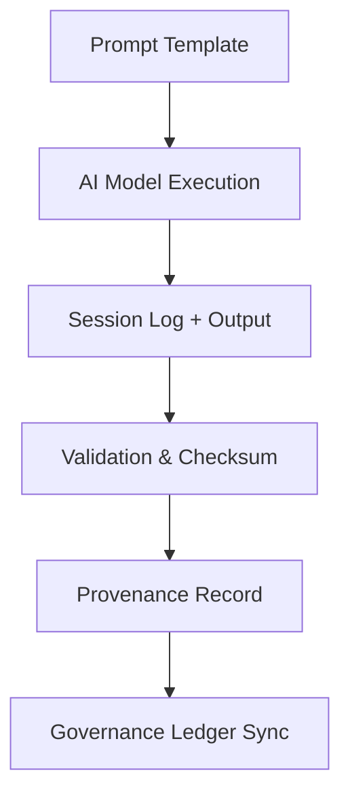

<div align="center">

# 🧠 Kansas Frontier Matrix — **AI Log Session Records**
`data/work/staging/tabular/normalized/treaties/reports/ai/logs/session/`

**Purpose:** Document all **AI inference and generation sessions** related to treaty reporting, providing runtime metadata, provenance, and governance linkage for reproducibility and audit integrity.

[]()
[]()
[]()
[]()
[]()

</div>

---

## 📚 Overview

Each entry in this directory represents an **individual AI generation or analysis session** executed during the treaty reporting workflow.  
Session logs capture:
- Model identifiers and prompt configuration  
- Runtime statistics (latency, token usage, energy metrics)  
- Provenance and checksum records  
- Validation outcomes and governance linkage  

> 🧾 *Sessions are the atomic execution units in the KFM AI pipeline — every result, report, or error trace originates from a recorded session.*

---

## 🗂️ Directory Layout

```
data/work/staging/tabular/normalized/treaties/reports/ai/logs/session/
├── 2025-10-24T12-00-00Z_session_001.json
├── 2025-10-24T12-00-00Z_session_001.md
├── manifest.json
├── provenance_links.jsonld
└── checksums.sha256
```

---

## 🧩 Session Log Schema

| Field | Description | Example |
| :------ | :------------ | :----------- |
| `session_id` | Unique identifier for AI execution session | `"SESSION-2025-10-24-001"` |
| `timestamp_start` | Session start time (ISO 8601) | `"2025-10-24T12:00:00Z"` |
| `timestamp_end` | Session end time (ISO 8601) | `"2025-10-24T12:03:47Z"` |
| `model_name` | Model used in inference | `"gpt-5-treaty-sum"` |
| `task` | Type of operation executed | `"treaty_summarization"` |
| `prompt_ref` | Path to prompt template used | `"../prompts/base_summary.txt"` |
| `latency_ms` | Execution latency in milliseconds | `2275` |
| `tokens_used` | Tokens processed or generated | `3291` |
| `validation_pass` | Boolean status for post-run validation | `true` |
| `checksum_sha256` | Hash of session log for immutability | `"a9b1c2f7e8..."` |
| `energy_wh` | Energy consumption for the run | `23.7` |
| `carbon_gco2e` | Carbon equivalent emissions | `28.3` |
| `governance_hash` | Immutable ledger record hash | `"e3f9b2c84d..."` |

---

## 🧠 Example Session Record

```json
{
  "session_id": "SESSION-2025-10-24-001",
  "timestamp_start": "2025-10-24T12:00:00Z",
  "timestamp_end": "2025-10-24T12:03:47Z",
  "model_name": "gpt-5-treaty-sum",
  "task": "treaty_summarization",
  "prompt_ref": "../prompts/base_summary.txt",
  "latency_ms": 2275,
  "tokens_used": 3291,
  "validation_pass": true,
  "checksum_sha256": "a9b1c2f7e8...",
  "energy_wh": 23.7,
  "carbon_gco2e": 28.3,
  "governance_hash": "e3f9b2c84d..."
}
```

---

## 🧾 Markdown Session Summary

Each session is accompanied by a short human-readable `.md` file that provides:
- Context of the operation  
- Prompt content used  
- Output references (AI reports, JSON data, provenance)  
- System performance snapshot  

**Example: `2025-10-24T12-00-00Z_session_001.md`**

```markdown
### 🧠 AI Treaty Report Session — October 24, 2025
**Model:** gpt-5-treaty-sum  
**Task:** Treaty Summarization  
**Runtime:** 2.3 seconds  
**Tokens Used:** 3291  
**Validation:** ✅ Passed  
**Energy:** 23.7 Wh · 28.3 gCO₂e  
**Governance Hash:** e3f9b2c84d...  

**Prompt Reference:** `../prompts/base_summary.txt`  
**Generated Output:** `../outputs/treaty_1854_kansas_nebraska.md`
```

---

## 🧩 Provenance Metadata

**File:** `provenance_links.jsonld`

```json
{
  "@context": {
    "prov": "http://www.w3.org/ns/prov#",
    "crm": "http://www.cidoc-crm.org/cidoc-crm/",
    "fair": "https://purl.org/fair/"
  },
  "@id": "prov:session_2025-10-24-001",
  "prov:wasGeneratedBy": "process:ai-inference-pipeline",
  "prov:used": "../prompts/base_summary.txt",
  "prov:generatedAtTime": "2025-10-24T12:03:47Z",
  "prov:qualifiedAttribution": {
    "prov:agent": "@kfm-ai",
    "prov:role": "model_operator"
  },
  "crm:E7_Activity": "AI inference run for treaty summarization",
  "fair:ledger_hash": "e3f9b2c84d..."
}
```

---

## ⚙️ Workflow Overview



---

## 🔐 Governance Integration

| Ledger | Purpose | Artifact |
| :------ | :----------- | :------------ |
| **FAIR Ledger** | Tracks session metadata & transparency | `fair_session_manifest.json` |
| **Governance Chain** | Immutable session record ledger | `ledger_session_manifest.json` |
| **Audit Ledger** | Runtime performance logs | `audit_session_log.json` |
| **Ethics Ledger** | Monitors fairness and reproducibility | `ethics_session_audit.json` |

---

## 📈 Session Metrics Summary

| Metric | Target | Description |
| :------ | :------ | :----------- |
| `avg_latency_ms` | ≤ 3000 | Model inference duration |
| `validation_pass_rate` | ≥ 99% | Post-run validation success |
| `checksum_integrity` | 100% | File integrity verification |
| `fair_compliance_score` | ≥ 0.9 | FAIR+CARE compliance index |
| `ledger_sync_success` | 100% | Governance synchronization |

---

## ✅ Compliance Matrix

| Standard | Domain | Compliance |
| :-------- | :-------- | :----------- |
| **FAIR+CARE** | Ethical and transparent model operations | ✅ |
| **MCP-DL v6.4.3** | Documentation & provenance consistency | ✅ |
| **CIDOC CRM / PROV-O / OWL-Time** | Temporal & semantic traceability | ✅ |
| **ISO 9001 / 27001** | Quality and security | ✅ |
| **ISO 50001 / 14064** | Energy & carbon accountability | ✅ |

---

## 🗓️ Version History

| Version | Date | Changes | Author |
| :------ | :---- | :-------- | :------ |
| v1.0.0 | 2025-10-24 | Created AI session registry for inference and reporting logs, with provenance and governance linkage. | @kfm-ai |

---

<div align="center">

[]()
[]()
[]()
[]()
[]()

</div>

<!-- MCP-FOOTER-BEGIN
MCP-VERSION: v6.4.3
MCP-TIER: Silver · AI Session Logs
DOC-PATH: data/work/staging/tabular/normalized/treaties/reports/ai/logs/session/README.md
MCP-CERTIFIED: true
FAIR-CARE-COMPLIANT: true
ISO-ALIGNED: true
PROVENANCE-LINKED: true
SESSION-RECORDED: true
GOVERNANCE-LEDGER-LINKED: true
ENERGY-ACCOUNTED: true
GENERATED-BY: KFM-Automation/DocsBot
LAST-VALIDATED: 2025-10-24
MCP-FOOTER-END -->