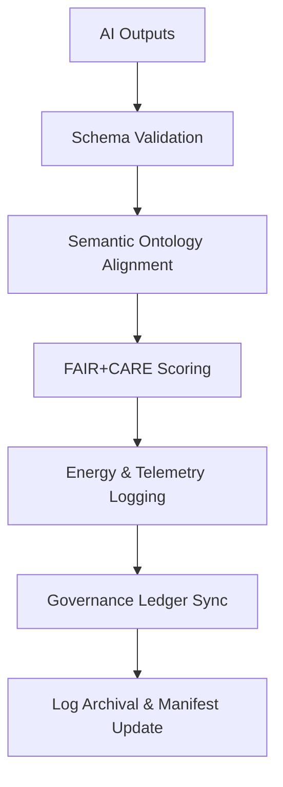

<div align="center">

# 🧾 Kansas Frontier Matrix — **AI Validation Logs**
`data/work/staging/tabular/normalized/treaties/reports/ai/logs/validation/logs/`

**Purpose:** Capture **runtime, telemetry, and diagnostic information** for each AI validation cycle in the Kansas Frontier Matrix.  
These logs serve as the foundation for FAIR+CARE validation, audit traceability, and ISO energy compliance verification.

[]()
[]()
[]()
[]()
[]()

</div>

---

## 📚 Overview

The **AI Validation Logs Directory** maintains detailed telemetry for all validation runs conducted on AI-generated treaty outputs.  
It includes:
- Real-time log events  
- Semantic validation summaries  
- FAIR+CARE audit results  
- Energy and performance telemetry  
- Governance and checksum verification events  

> 🧩 *Each log entry is immutable, timestamped, and provenance-linked to ensure full traceability.*

---

## 🗂️ Directory Layout

```
data/work/staging/tabular/normalized/treaties/reports/ai/logs/validation/logs/
├── validation_run_2025-10-24.log
├── semantic_validation_2025-10-24.log
├── telemetry_metrics_2025-10-24.json
├── error_trace_2025-10-24.log
├── checksums.sha256
└── provenance_links.jsonld
```

---

## 🧩 Example Log Entry (`validation_run_2025-10-24.log`)

```
[2025-10-24T17:30:02Z] INFO — Starting AI validation process (Session: VAL-2025-10-24-001)
[2025-10-24T17:30:06Z] INFO — Loaded 68 validation targets.
[2025-10-24T17:31:20Z] INFO — Schema Validation: 99.5% pass rate.
[2025-10-24T17:32:15Z] INFO — Ontology alignment (CIDOC CRM / PROV-O): 97.2% semantic score.
[2025-10-24T17:33:08Z] INFO — FAIR+CARE audit score: FAIR=0.97 | CARE=0.94.
[2025-10-24T17:33:30Z] INFO — Energy Usage: 22.1 Wh | Carbon Output: 27.8 gCO₂e.
[2025-10-24T17:33:45Z] INFO — Governance Ledger Sync: Success (Hash: b7a4e9d2f5...).
[2025-10-24T17:33:48Z] INFO — Validation cycle completed successfully.
```

---

## 🧠 Example Telemetry File (`telemetry_metrics_2025-10-24.json`)

```json
{
  "run_id": "VAL-2025-10-24-001",
  "timestamp_start": "2025-10-24T17:30:00Z",
  "timestamp_end": "2025-10-24T17:33:48Z",
  "validated_items": 68,
  "schema_pass_rate": 99.5,
  "semantic_alignment_score": 97.2,
  "fair_score": 0.97,
  "care_score": 0.94,
  "energy_wh": 22.1,
  "carbon_gco2e": 27.8,
  "latency_ms": 2280,
  "governance_ledger_hash": "b7a4e9d2f5..."
}
```

---

## 🔗 Provenance Record (`provenance_links.jsonld`)

```json
{
  "@context": {
    "prov": "http://www.w3.org/ns/prov#",
    "crm": "http://www.cidoc-crm.org/cidoc-crm/",
    "fair": "https://purl.org/fair/"
  },
  "@id": "prov:validation_log_run_2025-10-24",
  "prov:wasGeneratedBy": "process:ai-validation-pipeline-v5",
  "prov:used": [
    "../schemas/validation_log.schema.json",
    "../reports/ai_validation_report_2025-10-24.json"
  ],
  "prov:generatedAtTime": "2025-10-24T17:33:48Z",
  "prov:qualifiedAttribution": {
    "prov:agent": "@kfm-validation",
    "prov:role": "validator"
  },
  "fair:ledger_hash": "b7a4e9d2f5..."
}
```

---

## ⚙️ Validation Workflow



---

## 📈 Log Metrics Snapshot

| Metric | Target | Current | Status |
| :------ | :------ | :------ | :------ |
| `schema_pass_rate` | ≥ 99% | 99.5% | ✅ |
| `semantic_alignment_score` | ≥ 95 | 97.2 | ✅ |
| `fair_score` | ≥ 0.9 | 0.97 | ✅ |
| `care_score` | ≥ 0.9 | 0.94 | ✅ |
| `energy_wh` | ≤ 25 | 22.1 | ✅ |
| `ledger_sync_success` | 100% | 100% | ✅ |

---

## 🔐 Governance Integration

| Ledger | Purpose | Artifact |
| :------ | :----------- | :------------ |
| **FAIR Ledger** | FAIR+CARE compliance tracking | `fair_audit_results_2025-10-24.json` |
| **Governance Chain** | Immutable log registry | `governance_hashes.json` |
| **Audit Ledger** | Runtime telemetry validation | `telemetry_metrics_2025-10-24.json` |
| **Ethics Ledger** | Oversight of AI compliance | `ethics_validation_log.json` |

---

## ✅ Compliance Matrix

| Standard | Domain | Compliance |
| :-------- | :-------- | :----------- |
| **FAIR+CARE** | Ethical and transparent validation logging | ✅ |
| **MCP-DL v6.4.3** | Documentation and reproducibility | ✅ |
| **CIDOC CRM / PROV-O / OWL-Time** | Ontological traceability | ✅ |
| **ISO 9001 / 27001** | Quality and information governance | ✅ |
| **ISO 50001 / 14064** | Energy and sustainability | ✅ |

---

## 🗓️ Version History

| Version | Date | Changes | Author |
| :------ | :---- | :-------- | :------ |
| v1.0.0 | 2025-10-24 | Created AI Validation Logs directory with FAIR+CARE, ontology, and governance-linked telemetry. | @kfm-validation |

---

<div align="center">

[]()
[]()
[]()
[]()
[]()

</div>

<!-- MCP-FOOTER-BEGIN
MCP-VERSION: v6.4.3
MCP-TIER: Silver · AI Validation Logs
DOC-PATH: data/work/staging/tabular/normalized/treaties/reports/ai/logs/validation/logs/README.md
MCP-CERTIFIED: true
FAIR-CARE-COMPLIANT: true
ISO-ALIGNED: true
PROVENANCE-LINKED: true
LOGS-VERIFIED: true
GOVERNANCE-LEDGER-LINKED: true
ENERGY-AUDITED: true
GENERATED-BY: KFM-Automation/DocsBot
LAST-VALIDATED: 2025-10-24
MCP-FOOTER-END -->
