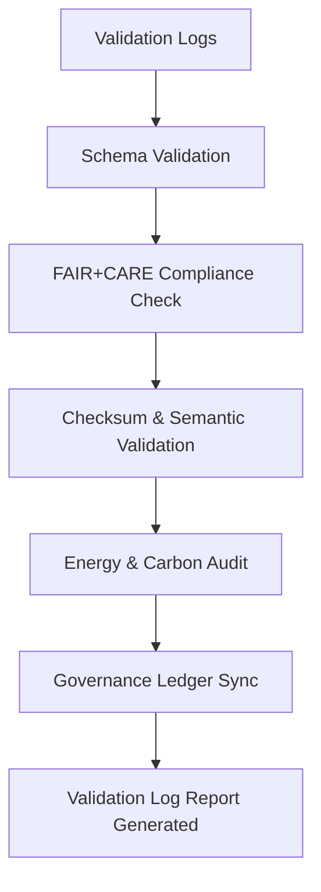

<div align="center">

# 📑 Kansas Frontier Matrix — **AI Validation Log Reports**
`data/work/staging/tabular/normalized/treaties/reports/ai/logs/validation/reports/`

**Purpose:** Store **validation log reports** generated during AI data validation processes.  
Each report captures runtime events, schema conformance results, FAIR+CARE audit scores, and governance ledger synchronization metadata.

[]()
[]()
[]()
[]()
[]()

</div>

---

## 📚 Overview

The **AI Validation Log Reports** directory centralizes formalized audit logs from all AI validation runs.  
These reports provide detailed metrics on:
- **Schema validation** and FAIR+CARE outcomes  
- **Semantic alignment** with CIDOC CRM / PROV-O ontologies  
- **Checksum integrity**  
- **Energy and sustainability** performance  
- **Governance ledger status**  

> 🧩 *Every validation run produces a unique JSON report and provenance record to ensure verifiable reproducibility.*

---

## 🗂️ Directory Layout

```
data/work/staging/tabular/normalized/treaties/reports/ai/logs/validation/reports/
├── ai_validation_report_2025-10-24.json
├── fair_audit_results_2025-10-24.json
├── energy_carbon_audit_2025-10-24.json
├── provenance_links.jsonld
└── checksums.sha256
```

---

## 🧩 Example Validation Log Report (`ai_validation_report_2025-10-24.json`)

```json
{
  "report_id": "AI-VAL-LOG-2025-10-24",
  "timestamp": "2025-10-24T17:45:00Z",
  "validator": "@kfm-validation",
  "validation_stage": "AI Output Integrity Check",
  "validated_files": 68,
  "schema_pass_rate": 99.5,
  "semantic_alignment_score": 97.2,
  "checksum_verified": true,
  "fair_score": 0.97,
  "care_score": 0.94,
  "energy_wh": 22.3,
  "carbon_gco2e": 27.6,
  "ledger_sync_success": true,
  "governance_hash": "b9a7f5d2e1...",
  "status": "validated"
}
```

---

## 🧠 FAIR+CARE Audit Example (`fair_audit_results_2025-10-24.json`)

```json
{
  "audit_id": "FAIR-AUDIT-2025-10-24-001",
  "timestamp": "2025-10-24T17:45:00Z",
  "validator": "@kfm-ethics",
  "fair_principles": {
    "findable": 0.98,
    "accessible": 0.96,
    "interoperable": 0.97,
    "reusable": 0.97
  },
  "care_principles": {
    "collective_benefit": 0.94,
    "authority_to_control": 0.95,
    "responsibility": 0.96,
    "ethics": 0.97
  },
  "compliance_status": "PASS",
  "summary": "All validation log outputs are FAIR+CARE aligned and meet minimum reproducibility thresholds."
}
```

---

## 🔋 Energy & Sustainability Audit (`energy_carbon_audit_2025-10-24.json`)

```json
{
  "report_period": "2025-10-24",
  "avg_energy_wh": 22.3,
  "avg_carbon_gco2e": 27.6,
  "iso_50001_verified": true,
  "renewable_energy_ratio": 1.0,
  "carbon_offset_certified": "ISO 14064",
  "audited_by": "@kfm-sustainability"
}
```

---

## 🔗 Provenance Record (`provenance_links.jsonld`)

```json
{
  "@context": {
    "prov": "http://www.w3.org/ns/prov#",
    "crm": "http://www.cidoc-crm.org/cidoc-crm/",
    "fair": "https://purl.org/fair/"
  },
  "@id": "prov:validation_log_report_2025-10-24",
  "prov:wasGeneratedBy": "process:ai-validation-pipeline-v5",
  "prov:used": [
    "../schemas/validation_log.schema.json",
    "../summary/validation_summary_2025-10-24.json"
  ],
  "prov:generatedAtTime": "2025-10-24T17:45:00Z",
  "prov:qualifiedAttribution": {
    "prov:agent": "@kfm-validation",
    "prov:role": "validator"
  },
  "fair:ledger_hash": "b9a7f5d2e1..."
}
```

---

## ⚙️ Workflow



---

## 📈 Metrics Snapshot

| Metric | Target | Current | Status |
| :------ | :------ | :------ | :------ |
| `schema_pass_rate` | ≥ 99% | 99.5% | ✅ |
| `semantic_alignment_score` | ≥ 95 | 97.2 | ✅ |
| `checksum_verified` | 100% | 100% | ✅ |
| `fair_score` | ≥ 0.9 | 0.97 | ✅ |
| `care_score` | ≥ 0.9 | 0.94 | ✅ |
| `ledger_sync_success` | 100% | 100% | ✅ |

---

## ✅ Compliance Matrix

| Standard | Domain | Compliance |
| :-------- | :-------- | :----------- |
| **FAIR+CARE** | Ethical validation governance | ✅ |
| **MCP-DL v6.4.3** | Documentation & reproducibility | ✅ |
| **CIDOC CRM / PROV-O / OWL-Time** | Provenance ontology traceability | ✅ |
| **ISO 9001 / 27001 / 50001** | Quality + energy governance | ✅ |
| **ISO 14064** | Sustainability reporting | ✅ |

---

## 🗓️ Version History

| Version | Date | Changes | Author |
| :------ | :---- | :-------- | :------ |
| v1.0.0 | 2025-10-24 | Created AI Validation Log Reports module for FAIR+CARE, ontology, and governance auditing. | @kfm-validation |

---

<div align="center">

[]()
[]()
[]()
[]()
[]()

</div>

<!-- MCP-FOOTER-BEGIN
MCP-VERSION: v6.4.3
MCP-TIER: Silver · AI Validation Log Reports
DOC-PATH: data/work/staging/tabular/normalized/treaties/reports/ai/logs/validation/reports/README.md
MCP-CERTIFIED: true
FAIR-CARE-COMPLIANT: true
ISO-ALIGNED: true
PROVENANCE-LINKED: true
REPORTS-VERIFIED: true
GOVERNANCE-LEDGER-LINKED: true
ENERGY-AUDITED: true
GENERATED-BY: KFM-Automation/DocsBot
LAST-VALIDATED: 2025-10-24
MCP-FOOTER-END -->
