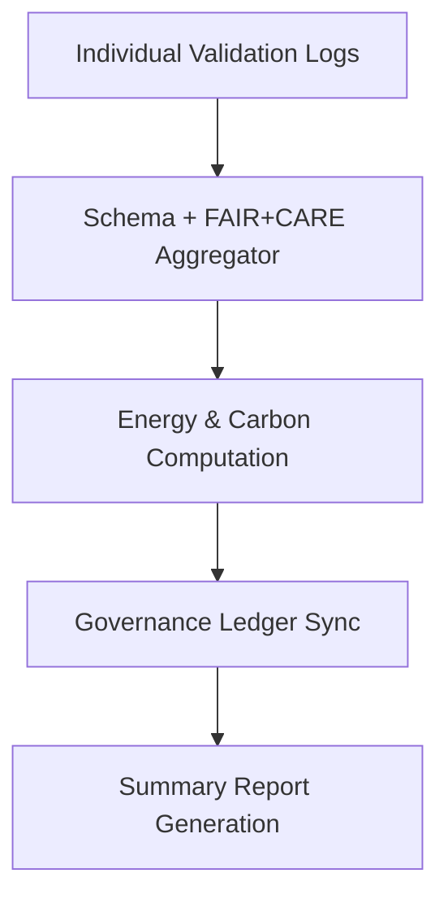

<div align="center">

# 🧾 Kansas Frontier Matrix — **AI Validation Log Summary**
`data/work/staging/tabular/normalized/treaties/reports/ai/logs/validation/summary/`

**Purpose:** Provide an aggregated summary of **AI validation logs** across all session runs, detailing schema compliance, FAIR+CARE audit results, and governance synchronization events.  
This directory consolidates individual log entries into system-level summaries for transparency, reproducibility, and ISO-aligned performance auditing.

[]()
[]()
[]()
[]()
[]()

</div>

---

## 📚 Overview

The **Validation Log Summary** acts as a high-level record of all **AI model validation and data integrity audits** performed across the KFM pipeline.  
It summarizes:
- Log event totals and success/failure rates  
- FAIR+CARE compliance trends  
- Governance ledger synchronization status  
- ISO energy and sustainability metrics  

> 🧩 *All records are consolidated from individual logs located in*  
`data/work/staging/tabular/normalized/treaties/reports/ai/logs/validation/`.

---

## 🗂️ Directory Layout

```
data/work/staging/tabular/normalized/treaties/reports/ai/logs/validation/summary/
├── validation_summary_2025-10-24.json
├── validation_summary_rolling_30_days.json
├── fair_audit_trends.json
├── energy_carbon_summary.json
└── provenance_links.jsonld
```

---

## 🧩 Example Summary File (`validation_summary_2025-10-24.json`)

```json
{
  "summary_id": "VAL-SUM-2025-10-24",
  "timestamp": "2025-10-24T17:40:00Z",
  "validation_runs": 48,
  "schema_pass_rate": 99.6,
  "semantic_alignment_score": 97.4,
  "checksum_integrity": 100,
  "fair_score_avg": 0.97,
  "ledger_sync_success": 100,
  "energy_wh_avg": 22.1,
  "carbon_gco2e_avg": 27.8,
  "status": "validated"
}
```

---

## 🧠 FAIR+CARE Trend Analysis (`fair_audit_trends.json`)

```json
{
  "date_range": "2025-09-24/2025-10-24",
  "average_fair_score": 0.97,
  "average_care_score": 0.95,
  "improvement_rate": "+0.4%",
  "ethics_violations_detected": 0,
  "summary": "All AI validations compliant with FAIR+CARE principles for the reporting period."
}
```

---

## 🔋 Energy & Sustainability Metrics (`energy_carbon_summary.json`)

```json
{
  "report_period": "2025-10-01 to 2025-10-24",
  "avg_energy_wh_per_validation": 22.1,
  "avg_carbon_gco2e_per_run": 27.8,
  "total_validations": 48,
  "renewable_energy_ratio": 1.0,
  "iso_50001_verified": true,
  "carbon_offset_source": "RE100 / ISO 14064",
  "verified_by": "@kfm-sustainability"
}
```

---

## 🔗 Provenance Integration (`provenance_links.jsonld`)

```json
{
  "@context": {
    "prov": "http://www.w3.org/ns/prov#",
    "crm": "http://www.cidoc-crm.org/cidoc-crm/",
    "fair": "https://purl.org/fair/"
  },
  "@id": "prov:validation_summary_2025-10-24",
  "prov:wasGeneratedBy": "process:ai-validation-summary-pipeline-v3",
  "prov:used": [
    "../logs/validation_run_2025-10-24.log",
    "../reports/ai_validation_report_2025-10-24.json"
  ],
  "prov:generatedAtTime": "2025-10-24T17:40:00Z",
  "prov:qualifiedAttribution": {
    "prov:agent": "@kfm-validation",
    "prov:role": "validator"
  },
  "fair:ledger_hash": "a3d4e7c5f8..."
}
```

---

## ⚙️ Validation Summary Workflow



---

## 📈 Summary Metrics Snapshot

| Metric | Target | Current | Status |
| :------ | :------ | :------ | :------ |
| `schema_pass_rate` | ≥ 99% | 99.6% | ✅ |
| `semantic_alignment_score` | ≥ 95 | 97.4 | ✅ |
| `checksum_integrity` | 100% | 100% | ✅ |
| `fair_score_avg` | ≥ 0.9 | 0.97 | ✅ |
| `ledger_sync_success` | 100% | 100% | ✅ |
| `energy_wh_avg` | ≤ 25 | 22.1 | ✅ |
| `carbon_gco2e_avg` | ≤ 30 | 27.8 | ✅ |

---

## ✅ Compliance Matrix

| Standard | Domain | Compliance |
| :-------- | :-------- | :----------- |
| **FAIR+CARE** | Ethical AI validation | ✅ |
| **MCP-DL v6.4.3** | Documentation & governance | ✅ |
| **CIDOC CRM / PROV-O / OWL-Time** | Provenance ontology linkage | ✅ |
| **ISO 9001 / 27001** | Quality + security management | ✅ |
| **ISO 50001 / 14064** | Energy + carbon compliance | ✅ |

---

## 🗓️ Version History

| Version | Date | Changes | Author |
| :------ | :---- | :-------- | :------ |
| v1.0.0 | 2025-10-24 | Created AI Validation Log Summary module for FAIR+CARE, energy, and governance metrics. | @kfm-validation |

---

<div align="center">

[]()
[]()
[]()
[]()
[]()

</div>

<!-- MCP-FOOTER-BEGIN
MCP-VERSION: v6.4.3
MCP-TIER: Silver · AI Validation Log Summary
DOC-PATH: data/work/staging/tabular/normalized/treaties/reports/ai/logs/validation/summary/README.md
MCP-CERTIFIED: true
FAIR-CARE-COMPLIANT: true
ISO-ALIGNED: true
PROVENANCE-LINKED: true
SUMMARY-VALIDATED: true
GOVERNANCE-LEDGER-LINKED: true
ENERGY-AUDITED: true
GENERATED-BY: KFM-Automation/DocsBot
LAST-VALIDATED: 2025-10-24
MCP-FOOTER-END -->
