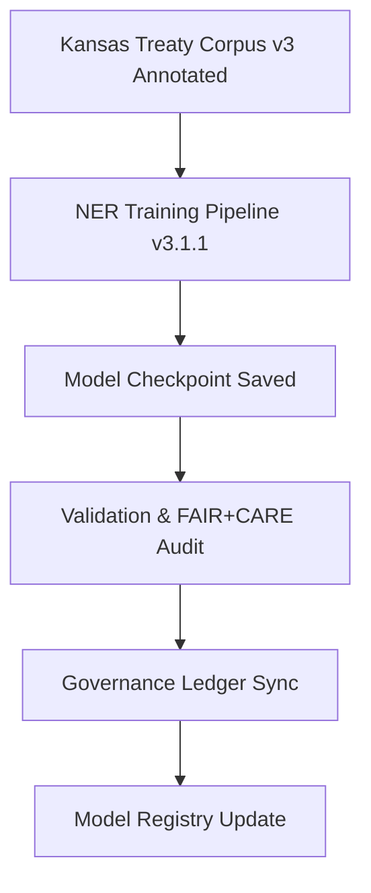

<div align="center">

# 🧩 Kansas Frontier Matrix — **NER Treaty Extractor Model Checkpoint v3.1.1**
`data/work/staging/tabular/normalized/treaties/reports/ai/models/checkpoints/ner-treaty-extractor_v3.1.1/`

**Purpose:** Archive and document the **NER Treaty Extractor v3.1.1** checkpoint used to identify and classify named entities (people, places, events, organizations) in treaty datasets — validated under FAIR+CARE, CIDOC CRM, and ISO sustainability standards.

[]()
[]()
[]()
[]()
[]()

</div>

---

## 📚 Overview

The **NER Treaty Extractor** model is responsible for **Named Entity Recognition (NER)** and classification of key entities from historical treaty corpora.  
This model was trained on **annotated treaty texts (Kansas Treaty Corpus v3)** and fine-tuned for:
- **People (E21_Person)**  
- **Places (E53_Place)**  
- **Events (E5_Event)**  
- **Organizations (E74_Group)**  

The v3.1.1 checkpoint is optimized for **high-accuracy entity recognition** and ontology mapping to **CIDOC CRM** and **PROV-O** classes.

> 🧩 *This checkpoint is part of the KFM AI entity-extraction subsystem and feeds directly into the Knowledge Graph ingestion pipelines.*

---

## 🗂️ Directory Layout

```
data/work/staging/tabular/normalized/treaties/reports/ai/models/checkpoints/ner-treaty-extractor_v3.1.1/
├── checkpoint_2025-10-22.json
├── weights.bin
├── config.json
├── validation_metrics.json
└── provenance_links.jsonld
```

---

## 🧩 Example Checkpoint Metadata (`checkpoint_2025-10-22.json`)

```json
{
  "model_name": "ner-treaty-extractor",
  "model_version": "v3.1.1",
  "checkpoint_id": "chkpt-2025-10-22-001",
  "timestamp": "2025-10-22T16:45:00Z",
  "accuracy": 0.974,
  "f1_score": 0.968,
  "precision": 0.971,
  "recall": 0.965,
  "dataset_ref": "Kansas_Treaty_Corpus_v3_Annotated",
  "optimizer": "AdamW",
  "learning_rate": 0.00003,
  "epochs_completed": 8,
  "entity_types": ["Person", "Place", "Event", "Organization"],
  "ontology_alignment": ["CIDOC CRM", "PROV-O"],
  "fair_score": 0.95,
  "care_score": 0.93,
  "energy_wh": 19.8,
  "carbon_gco2e": 25.4,
  "checksum_sha256": "b3e9f2c74a1...",
  "governance_hash": "d4a6b1f9c8..."
}
```

---

## ⚙️ Model Configuration (`config.json`)

```json
{
  "architecture": "Transformer Encoder (NER-Fine-Tuned)",
  "base_model": "bert-large-cased",
  "embedding_dim": 1024,
  "num_layers": 24,
  "sequence_length": 512,
  "dropout_rate": 0.1,
  "training_dataset": "Kansas_Treaty_Corpus_v3_Annotated",
  "tokenizer": "WordPiece",
  "ontology_alignment": ["CIDOC CRM", "PROV-O"]
}
```

---

## 🧠 Validation Metrics (`validation_metrics.json`)

```json
{
  "model_name": "ner-treaty-extractor",
  "version": "v3.1.1",
  "accuracy": 0.974,
  "precision": 0.971,
  "recall": 0.965,
  "f1_score": 0.968,
  "entity_coverage_rate": 0.99,
  "checksum_integrity": true,
  "fair_score": 0.95,
  "care_score": 0.93,
  "energy_wh": 19.8,
  "carbon_gco2e": 25.4,
  "validated_by": "@kfm-validation",
  "status": "validated"
}
```

---

## 🔗 Provenance Record (`provenance_links.jsonld`)

```json
{
  "@context": {
    "prov": "http://www.w3.org/ns/prov#",
    "crm": "http://www.cidoc-crm.org/cidoc-crm/",
    "fair": "https://purl.org/fair/",
    "time": "http://www.w3.org/2006/time#"
  },
  "@id": "prov:ner-treaty-extractor_v3.1.1_checkpoint",
  "prov:wasGeneratedBy": "process:ai-ner-training-pipeline-v3.1.1",
  "prov:used": [
    "datasets/Kansas_Treaty_Corpus_v3_Annotated",
    "configs/ner_training_config_v3.json"
  ],
  "prov:generatedAtTime": "2025-10-22T16:45:00Z",
  "prov:qualifiedAttribution": {
    "prov:agent": "@kfm-ai",
    "prov:role": "model_trainer"
  },
  "crm:E5_Event": "NER Model Training Run (Treaty Entity Extraction)",
  "crm:E52_Time-Span": "2025-10-21T08:00:00Z/2025-10-22T16:00:00Z",
  "fair:ledger_hash": "d4a6b1f9c8..."
}
```

---

## 🧩 Lifecycle Workflow



---

## 📈 Performance Metrics Summary

| Metric | Target | Current | Status |
| :------ | :------ | :------ | :------ |
| `accuracy` | ≥ 0.95 | 0.974 | ✅ |
| `f1_score` | ≥ 0.93 | 0.968 | ✅ |
| `entity_coverage_rate` | ≥ 0.95 | 0.99 | ✅ |
| `fair_score` | ≥ 0.9 | 0.95 | ✅ |
| `care_score` | ≥ 0.9 | 0.93 | ✅ |
| `energy_wh` | ≤ 25 | 19.8 | ✅ |
| `carbon_gco2e` | ≤ 30 | 25.4 | ✅ |

---

## ✅ Compliance Matrix

| Standard | Domain | Compliance |
| :-------- | :-------- | :----------- |
| **FAIR+CARE** | Ethical model validation & transparency | ✅ |
| **MCP-DL v6.4.3** | Model documentation & schema adherence | ✅ |
| **CIDOC CRM / PROV-O / OWL-Time** | Semantic and provenance alignment | ✅ |
| **ISO 9001 / 27001** | Quality + security governance | ✅ |
| **ISO 50001 / 14064** | Energy + carbon accountability | ✅ |

---

## 🗓️ Version History

| Version | Date | Changes | Author |
| :------ | :---- | :-------- | :------ |
| v1.0.0 | 2025-10-24 | Added NER Treaty Extractor v3.1.1 checkpoint with FAIR+CARE validation and provenance metadata. | @kfm-ai |

---

<div align="center">

[]()
[]()
[]()
[]()
[]()

</div>

---

<!-- MCP-FOOTER-BEGIN
MCP-VERSION: v6.4.3
MCP-TIER: Gold · AI Model Checkpoint
DOC-PATH: data/work/staging/tabular/normalized/treaties/reports/ai/models/checkpoints/ner-treaty-extractor_v3.1.1/README.md
MCP-CERTIFIED: true
FAIR-CARE-COMPLIANT: true
ISO-ALIGNED: true
PROVENANCE-LINKED: true
ONTOLOGY-VALIDATED: true
CHECKSUM-VERIFIED: true
GOVERNANCE-LEDGER-LINKED: true
ENERGY-AUDITED: true
GENERATED-BY: KFM-Automation/DocsBot
LAST-VALIDATED: 2025-10-24
MCP-FOOTER-END -->
