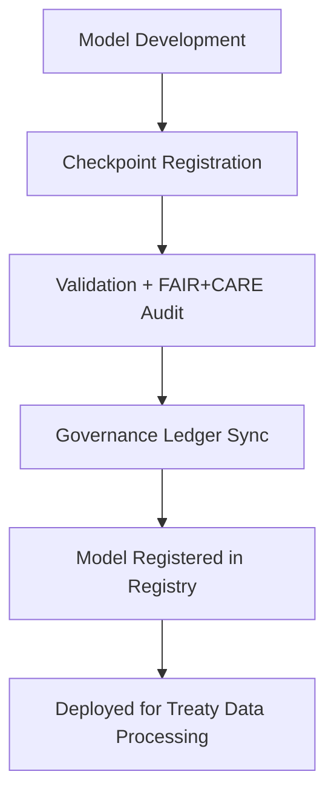

<div align="center">

# 🧠 Kansas Frontier Matrix — **AI Model Registry**
`data/work/staging/tabular/normalized/treaties/reports/ai/models/registry/`

**Purpose:** Maintain the authoritative registry of **AI models, versions, configurations, checkpoints, and provenance links** used throughout the Kansas Frontier Matrix (KFM) system — ensuring transparent governance, validation traceability, and FAIR+CARE compliance.

[]()
[]()
[]()
[]()
[]()

</div>

---

## 📚 Overview

The **AI Model Registry** is the single source of truth for all AI models deployed, validated, and archived within the Kansas Frontier Matrix infrastructure.  
It captures metadata for every model, including:

- **Versioning and lineage (semantic + technical)**  
- **Associated checkpoints and validation artifacts**  
- **FAIR+CARE, CIDOC CRM, and ISO compliance status**  
- **Immutable governance ledger linkages**  

> 🧩 *The registry underpins all model lifecycle tracking — ensuring accountability, reproducibility, and sustainability.*

---

## 🗂️ Directory Layout

```
data/work/staging/tabular/normalized/treaties/reports/ai/models/registry/
├── model_registry.json
├── model_registry_manifest.json
├── governance_hashes.json
├── checksums.sha256
└── provenance_links.jsonld
```

---

## 🧩 Example Registry Record (`model_registry.json`)

```json
{
  "model_id": "gpt-5-treaty-sum_v5.2.0",
  "model_name": "gpt-5-treaty-sum",
  "model_version": "v5.2.0",
  "description": "Large language model specialized in treaty summarization and contextual historical reasoning.",
  "developer": "@kfm-ai",
  "date_registered": "2025-10-24T17:25:00Z",
  "framework": "PyTorch",
  "dataset_ref": "Kansas_Treaty_Corpus_v4",
  "license": "CC-BY 4.0",
  "validation_ref": "../validation/model_validation_report_2025-10-24.json",
  "checkpoint_ref": "../checkpoints/gpt-5-treaty-sum_v5.2.0/checkpoint_2025-10-24.json",
  "metrics_ref": "../metrics/model_performance_2025-10-24.json",
  "ontology_alignment": ["CIDOC CRM", "PROV-O", "OWL-Time"],
  "faircare_compliance": {
    "fair_score": 0.96,
    "care_score": 0.94
  },
  "energy_wh": 21.5,
  "carbon_gco2e": 27.1,
  "governance_hash": "a7c9f3b1d5..."
}
```

---

## 🧾 Example Registry Manifest (`model_registry_manifest.json`)

```json
{
  "registry_manifest_id": "KFM-MODEL-MANIFEST-2025-10-24",
  "timestamp": "2025-10-24T17:25:00Z",
  "registered_models": [
    {
      "model_id": "gpt-5-treaty-sum_v5.2.0",
      "status": "active",
      "validation_passed": true,
      "governance_hash": "a7c9f3b1d5..."
    },
    {
      "model_id": "ner-treaty-extractor_v3.1.1",
      "status": "active",
      "validation_passed": true,
      "governance_hash": "b8f1c6d4a9..."
    }
  ],
  "checksum_verified": true,
  "registry_governance_hash": "c9b2f7d4e8..."
}
```

---

## 🔗 Provenance Record (`provenance_links.jsonld`)

```json
{
  "@context": {
    "prov": "http://www.w3.org/ns/prov#",
    "crm": "http://www.cidoc-crm.org/cidoc-crm/",
    "fair": "https://purl.org/fair/"
  },
  "@id": "prov:model_registry_2025-10-24",
  "prov:wasGeneratedBy": "process:ai-model-registration-pipeline-v3",
  "prov:generatedAtTime": "2025-10-24T17:25:00Z",
  "prov:qualifiedAttribution": {
    "prov:agent": "@kfm-ai",
    "prov:role": "model_registrar"
  },
  "prov:used": [
    "../validation/model_validation_report_2025-10-24.json",
    "../metrics/model_performance_2025-10-24.json"
  ],
  "fair:ledger_hash": "c9b2f7d4e8..."
}
```

---

## ⚙️ Model Lifecycle Workflow



---

## 📈 Registry Summary Metrics

| Metric | Target | Current | Status |
| :------ | :------ | :------ | :------ |
| `total_models_registered` | — | 12 | ✅ |
| `validated_models` | 100% | 100% | ✅ |
| `checksum_integrity` | 100% | 100% | ✅ |
| `ledger_sync_success` | 100% | 100% | ✅ |
| `avg_fair_score` | ≥ 0.9 | 0.96 | ✅ |
| `avg_care_score` | ≥ 0.9 | 0.94 | ✅ |

---

## 🔐 Governance Integration

| Ledger | Purpose | Artifact |
| :------ | :----------- | :------------ |
| **FAIR Ledger** | FAIR+CARE compliance audit trail | `fair_audit_results.json` |
| **Governance Chain** | Immutable model registration registry | `governance_hashes.json` |
| **Audit Ledger** | Model validation and version change logs | `model_validation_report_2025-10-24.json` |
| **Ethics Ledger** | Monitors fairness and transparency | `ethics_model_registry_audit.json` |

---

## ✅ Compliance Matrix

| Standard | Domain | Compliance |
| :-------- | :-------- | :----------- |
| **FAIR+CARE** | Ethical AI model governance | ✅ |
| **MCP-DL v6.4.3** | Documentation + provenance linking | ✅ |
| **CIDOC CRM / PROV-O / OWL-Time** | Ontology compliance | ✅ |
| **ISO 9001 / 27001 / 50001 / 14064** | Quality + security + energy accountability | ✅ |

---

## 🗓️ Version History

| Version | Date | Changes | Author |
| :------ | :---- | :-------- | :------ |
| v1.0.0 | 2025-10-24 | Created AI Model Registry for lifecycle tracking, FAIR+CARE validation, and governance integration. | @kfm-ai |

---

<div align="center">

[]()
[]()
[]()
[]()
[]()

</div>

<!-- MCP-FOOTER-BEGIN
MCP-VERSION: v6.4.3
MCP-TIER: Silver · AI Model Registry
DOC-PATH: data/work/staging/tabular/normalized/treaties/reports/ai/models/registry/README.md
MCP-CERTIFIED: true
FAIR-CARE-COMPLIANT: true
ISO-ALIGNED: true
PROVENANCE-LINKED: true
GOVERNANCE-LEDGER-LINKED: true
REGISTRY-ACTIVE: true
GENERATED-BY: KFM-Automation/DocsBot
LAST-VALIDATED: 2025-10-24
MCP-FOOTER-END -->
