<div align="center">

# 📄 Kansas Frontier Matrix — **AI Treaty Report Outputs**  
`data/work/staging/tabular/normalized/treaties/reports/ai/outputs/README.md`

**Purpose:** Store finalized **AI-generated treaty report outputs** including text summaries, metadata, and structured JSON/JSON-LD exports.  
This directory represents the **deliverable layer** of the AI reporting pipeline — ready for validation, archival, and Focus Mode integration.

[]()
[]()
[]()
[]()
[]()

</div>

---

## 📚 Overview

The **AI Treaty Report Outputs** directory contains **machine-generated reports and structured exports** derived from normalized treaty datasets.  
These outputs represent the final processed layer of the AI inference stage, combining:
- Treaty-level textual summaries (Markdown),
- Structured data representations (JSON),
- Provenance and semantic metadata (JSON-LD),
- STAC/DCAT catalog entries for discoverability.

All outputs undergo schema and semantic validation before entry into the **validation** and **archive** modules.

---

## 🗂️ Directory Layout

```
data/work/staging/tabular/normalized/treaties/reports/ai/outputs/
├── markdown/                      # Human-readable summaries
│   ├── treaty_1854_kansas_nebraska.md
│   ├── treaty_1867_medicine_lodge.md
│   └── treaty_1868_osage.md
├── json/                          # Machine-readable structured outputs
│   ├── treaty_1854_kansas_nebraska.json
│   ├── treaty_1867_medicine_lodge.json
│   └── treaty_1868_osage.json
├── provenance/                    # Provenance records in JSON-LD (PROV-O)
│   ├── treaty_1854_provenance.jsonld
│   └── treaty_1867_provenance.jsonld
├── stac/                          # STAC-compliant metadata items
│   ├── treaty_1854_item.json
│   ├── treaty_1867_item.json
│   └── collection.json
├── validation/                    # Output validation results
│   └── output_validation_2025-10-24.json
└── manifest.json                  # Dataset manifest and metadata references
```

---

## 🧩 Output Types

| Type | Format | Description | Consumer |
| :------ | :-------- | :------------ | :---------- |
| Human-readable Summary | `.md` | AI-generated narrative report | Docs, UI |
| Structured Data | `.json` | Parsed fields: parties, places, events | API, Focus Mode |
| Provenance Record | `.jsonld` | CIDOC CRM + PROV-O linkage | Graph DB |
| Metadata Entry | `.json` | STAC/DCAT-compliant metadata | Catalog |
| Validation Log | `.json` | Schema + checksum validation output | CI/CD |

---

## 🧠 Example Output (Markdown + JSON Pair)

**Markdown Summary**

```markdown
# Treaty of 1854 — Kansas–Nebraska Act  
**Date:** May 30, 1854  
**Location:** Washington, D.C.  
**Signatories:** U.S. Congress, various tribal representatives  

The Treaty of 1854, known as the Kansas–Nebraska Act, established the territories of Kansas and Nebraska.  
It accelerated westward expansion and directly influenced the political tensions leading up to the Civil War.  
This report summarizes the treaty’s provisions, impacts on territorial governance, and its connection to Indigenous land policies.
```

**Structured JSON**

```json
{
  "treaty_id": "treaty_1854_kansas_nebraska",
  "title": "Treaty of 1854 — Kansas–Nebraska Act",
  "date": "1854-05-30",
  "location": "Washington, D.C.",
  "entities": {
    "signatories": ["U.S. Congress", "Tribal Representatives"],
    "affected_groups": ["Kaw Nation", "Osage Nation"]
  },
  "summary": "The Treaty of 1854 established the territories of Kansas and Nebraska...",
  "provenance": "provenance/treaty_1854_provenance.jsonld",
  "checksum_sha256": "d5c0af4b3a9...",
  "validation_status": "pass"
}
```

---

## 🧪 Validation & Provenance

- All `.json` and `.jsonld` outputs must pass validation via:
  - `schemas/treaty_report.schema.json`
  - `schemas/provenance.schema.jsonld`
- Validation logs stored in `/validation/` and aggregated daily.
- Provenance follows **PROV-O** and **CIDOC CRM** linking model:
  - `Entity` → `wasDerivedFrom` → `Source`
  - `Activity` → `used` → `Dataset`
  - `Entity` → `wasGeneratedBy` → `AI Model`

---

## 📊 Metadata Fields (STAC/DCAT Alignment)

| Field | Example | Description |
| :------ | :------ | :----------- |
| `id` | `treaty_1854_kansas_nebraska` | Unique treaty identifier |
| `type` | `Feature` | STAC item type |
| `properties.datetime` | `1854-05-30T00:00:00Z` | Treaty signing date |
| `properties.themes` | `["territory", "legislation", "indigenous lands"]` | Key thematic tags |
| `assets.summary.href` | `./markdown/treaty_1854_kansas_nebraska.md` | Human-readable report |
| `assets.metadata.href` | `./json/treaty_1854_kansas_nebraska.json` | Structured metadata |
| `checksum:sha256` | `d5c0af4b3a9...` | Integrity verification hash |
| `governance:ledger_hash` | `<block_hash>` | Immutable ledger record |

---

## ⚙️ Processing Workflow

```mermaid
flowchart TD
    A[Normalized Treaty Data] --> B[AI Summarization Engine]
    B --> C[NER / Entity Linking]
    C --> D["Output Formatter – MD / JSON / JSON-LD"]
    D --> E[Validation Module]
    E --> F[Governance Ledger + Archive]
```



---

## 🔐 Data Integrity

- Each report includes a **SHA-256 checksum** logged in `/manifest.json`.  
- Validation runs must achieve **100% checksum match** before archival.  
- Immutable ledger integration guarantees historical consistency of results.  
- File naming conventions are deterministic and match `treaty_id`.

---

## 🧩 Governance Integration

| System | Description | Output |
| :-------- | :------------ | :---------- |
| FAIR Ledger | Stores metadata + provenance | `fair_reports_manifest.json` |
| Governance Chain | Immutable output record | `governance_manifest.json` |
| Ethics Ledger | Monitors AI bias and summary framing | `ethics_review.json` |
| Focus Mode Indexer | Consumes `.json` outputs for entity-centric queries | `focus_index.json` |

---

## ✅ Compliance Matrix

| Standard | Area | Status |
| :-------- | :------ | :---------- |
| **FAIR+CARE** | Data ethics + openness | ✅ |
| **MCP-DL v6.4.3** | Docs-as-Code & metadata | ✅ |
| **STAC/DCAT 3.0** | Metadata schema | ✅ |
| **CIDOC CRM / PROV-O** | Provenance ontology | ✅ |
| **ISO 9001 / 19115** | Data quality + metadata | ✅ |
| **ISO 27001 / 50001** | Security + sustainability | ✅ |

---

## 🗓️ Version History

| Version | Date | Changes | Author |
| :------ | :---- | :-------- | :------ |
| v1.0.0 | 2025-10-24 | Created AI Treaty Report Outputs module for finalized reports, metadata, and provenance. | @kfm-ai |

---

<div align="center">

[]()
[]()
[]()
[]()
[]()

</div>

<!-- MCP-FOOTER-BEGIN
MCP-VERSION: v6.4.3
MCP-TIER: Silver · AI Outputs
DOC-PATH: data/work/staging/tabular/normalized/treaties/reports/ai/outputs/README.md
MCP-CERTIFIED: true
AI-MODULE: true
FAIR-CARE-COMPLIANT: true
STAC-ALIGNED: true
PROVENANCE-LINKED: true
ISO-ALIGNED: true
VALIDATED-OUTPUTS: true
GOVERNANCE-LEDGER-LINKED: true
GENERATED-BY: KFM-Automation/DocsBot
LAST-VALIDATED: 2025-10-24
MCP-FOOTER-END -->
