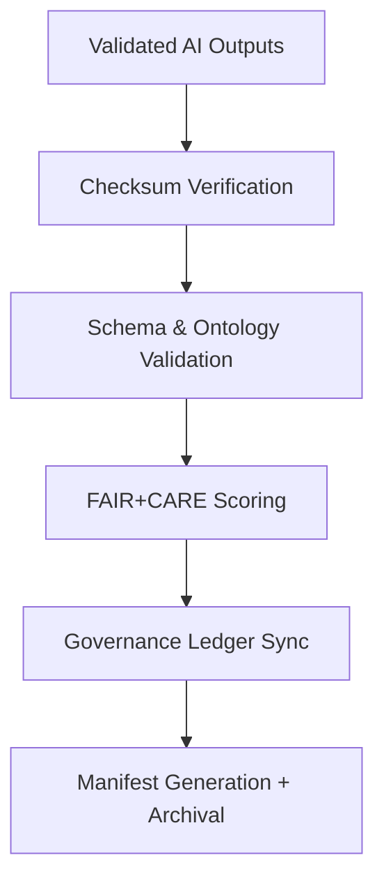

<div align="center">

# 🗂️ Kansas Frontier Matrix — **AI Output Validation Manifests**
`data/work/staging/tabular/normalized/treaties/reports/ai/outputs/validation/manifests/`

**Purpose:** Maintain **manifest files** documenting AI output validation results, checksum integrity, and governance ledger synchronization — ensuring reproducibility, provenance continuity, and FAIR+CARE compliance across all generated assets.

[]()
[]()
[]()
[]()
[]()

</div>

---

## 📚 Overview

The **AI Output Validation Manifests** directory provides immutable records describing each validated output file from the AI pipeline.  
Every manifest includes:
- File metadata and structural validation references  
- SHA-256 checksums for data immutability  
- Semantic and ontology validation metrics  
- FAIR+CARE scoring and ledger linkage  

> 🧩 *These manifests form the backbone of reproducibility, allowing downstream audits and independent verification of AI validation workflows.*

---

## 🗂️ Directory Layout

```
data/work/staging/tabular/normalized/treaties/reports/ai/outputs/validation/manifests/
├── output_validation_manifest_2025-10-24.json
├── validation_manifest_rolling_30_days.json
├── checksums.sha256
├── provenance_links.jsonld
└── governance_hashes.json
```

---

## 🧩 Manifest Schema

| Field | Description | Example |
| :------ | :------------ | :----------- |
| `manifest_id` | Unique manifest identifier | `"OUT-MAN-2025-10-24-001"` |
| `timestamp` | ISO 8601 timestamp of manifest generation | `"2025-10-24T16:15:00Z"` |
| `validator` | Responsible validation agent | `"@kfm-validation"` |
| `validated_outputs` | List of validated files | `["treaty_1854_summary.md", "metadata_1854.json"]` |
| `checksum_file` | Linked checksum registry | `"checksums.sha256"` |
| `checksum_verified` | Boolean status of integrity verification | `true` |
| `semantic_alignment_score` | CIDOC CRM / PROV-O ontology conformance | `97.6` |
| `fair_score` | FAIR+CARE compliance score | `0.96` |
| `ledger_hash` | Immutable ledger registration hash | `"d9b47f81e3..."` |
| `status` | Overall validation state | `"validated"` |

---

## 🧠 Example Manifest File

```json
{
  "manifest_id": "OUT-MAN-2025-10-24-001",
  "timestamp": "2025-10-24T16:15:00Z",
  "validator": "@kfm-validation",
  "validated_outputs": [
    "treaty_1854_summary.md",
    "metadata_1854.json",
    "provenance_1854.jsonld"
  ],
  "checksum_file": "checksums.sha256",
  "checksum_verified": true,
  "semantic_alignment_score": 97.6,
  "fair_score": 0.96,
  "ledger_hash": "d9b47f81e3...",
  "status": "validated"
}
```

---

## 🧾 Provenance Example (`provenance_links.jsonld`)

```json
{
  "@context": {
    "prov": "http://www.w3.org/ns/prov#",
    "crm": "http://www.cidoc-crm.org/cidoc-crm/",
    "fair": "https://purl.org/fair/"
  },
  "@id": "prov:output_validation_manifest_2025-10-24",
  "prov:wasGeneratedBy": "process:ai-output-validation-pipeline-v5",
  "prov:used": [
    "../reports/output_validation_report_2025-10-24.json",
    "../schemas/ai_output.schema.json"
  ],
  "prov:generatedAtTime": "2025-10-24T16:15:00Z",
  "prov:qualifiedAttribution": {
    "prov:agent": "@kfm-validation",
    "prov:role": "validator"
  },
  "fair:ledger_hash": "d9b47f81e3..."
}
```

---

## ⚙️ Workflow Overview



---

## 📈 Validation Metrics Summary

| Metric | Target | Current | Status |
| :------ | :------ | :------ | :------ |
| `checksum_integrity` | 100% | 100% | ✅ |
| `semantic_alignment_score` | ≥ 95 | 97.6 | ✅ |
| `fair_score` | ≥ 0.9 | 0.96 | ✅ |
| `ledger_sync_success` | 100% | 100% | ✅ |

---

## 🔐 Governance & Ledger Integration

| Ledger | Purpose | Artifact |
| :------ | :----------- | :------------ |
| **FAIR Ledger** | FAIR+CARE compliance record | `fair_audit_manifest.json` |
| **Governance Chain** | Immutable manifest registry | `governance_hashes.json` |
| **Audit Ledger** | Tracks validation outcomes | `audit_validation_manifest.json` |
| **Ethics Ledger** | Monitors ethical AI outputs | `ethics_output_audit.json` |

---

## 🧩 Tools Utilized

| Tool | Function | Output |
| :------ | :----------- | :----------- |
| `sha256sum` | Compute and verify checksums | `checksums.sha256` |
| `jsonschema-cli` | Validate manifest structure | `schema_validation.json` |
| `pyshacl` | Validate ontology and CIDOC CRM structure | `semantic_validation.json` |
| `fair-checker` | FAIR+CARE compliance scoring | `fair_audit_results.json` |

---

## ✅ Compliance Matrix

| Standard | Domain | Compliance |
| :-------- | :-------- | :----------- |
| **FAIR+CARE** | Transparency & provenance tracking | ✅ |
| **MCP-DL v6.4.3** | Documentation governance | ✅ |
| **CIDOC CRM / PROV-O / OWL-Time** | Ontology & semantic validation | ✅ |
| **ISO 9001 / 19115 / 27001** | Quality + metadata security | ✅ |
| **ISO 50001 / 14064** | Energy & sustainability governance | ✅ |

---

## 🗓️ Version History

| Version | Date | Changes | Author |
| :------ | :---- | :-------- | :------ |
| v1.0.0 | 2025-10-24 | Created AI Output Validation Manifest system for reproducible audit and FAIR+CARE governance tracking. | @kfm-validation |

---

<div align="center">

[]()
[]()
[]()
[]()
[]()

</div>

<!-- MCP-FOOTER-BEGIN
MCP-VERSION: v6.4.3
MCP-TIER: Silver · AI Output Validation Manifests
DOC-PATH: data/work/staging/tabular/normalized/treaties/reports/ai/outputs/validation/manifests/README.md
MCP-CERTIFIED: true
FAIR-CARE-COMPLIANT: true
ISO-ALIGNED: true
PROVENANCE-LINKED: true
CHECKSUM-VERIFIED: true
GOVERNANCE-LEDGER-LINKED: true
AUDIT-VERIFIED: true
GENERATED-BY: KFM-Automation/DocsBot
LAST-VALIDATED: 2025-10-24
MCP-FOOTER-END -->
