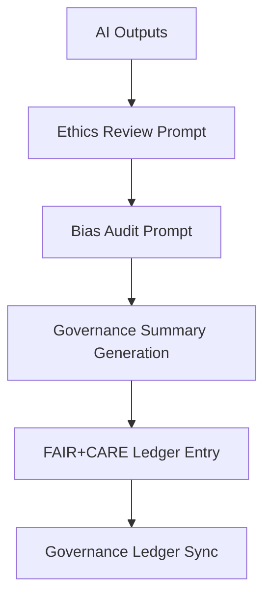

<div align="center">

# 🏛️ Kansas Frontier Matrix — **AI Governance & Ethics Prompt Library**
`data/work/staging/tabular/normalized/treaties/reports/ai/prompts/governance/`

**Purpose:** Define **AI governance, ethics, and accountability prompts** that guide language models in generating, evaluating, and documenting ethical reasoning, data use, and governance actions for the Kansas Frontier Matrix (KFM).

[]()
[]()
[]()
[]()
[]()

</div>

---

## 📚 Overview

The **AI Governance Prompt Library** provides **standardized ethical and procedural templates** used in AI systems auditing, fairness validation, and governance documentation.  
Prompts within this library ensure:
- Ethical alignment with **FAIR+CARE** principles  
- Compliance with **ISO 26000 (Social Responsibility)** and **ISO 27001 (Information Security)**  
- Transparent record-keeping for AI decision-making under **PROV-O** and **CIDOC CRM** frameworks  
- Integration with KFM’s **Governance Ledger** for immutable oversight  

> 🧩 *All governance prompts are version-controlled and reviewed by the KFM Ethics & FAIR Council before deployment.*

---

## 🗂️ Directory Layout

```
data/work/staging/tabular/normalized/treaties/reports/ai/prompts/governance/
├── ethics_review.txt
├── governance_summary.txt
├── bias_audit.txt
├── accountability_statement.txt
├── model_decision_audit.txt
├── prompt_registry.json
└── provenance_links.jsonld
```

---

## 🧠 Example Prompt: `ethics_review.txt`

```
Conduct an ethics review for the following AI-generated output.

Assess against:
- FAIR principles (Findable, Accessible, Interoperable, Reusable)
- CARE principles (Collective Benefit, Authority to Control, Responsibility, Ethics)
- ISO 26000 guidelines on fairness, human rights, and transparency

For each criterion, return:
{
  "category": "",
  "assessment": "PASS | NEEDS REVIEW | FAIL",
  "justification": "",
  "recommendations": ""
}

Output must be in JSON format with a compliance summary.
```

---

## 🧩 Example Prompt: `bias_audit.txt`

```
Perform a bias audit on the following AI model output.

Tasks:
1. Detect potential geographic, cultural, or linguistic bias.
2. Evaluate representation fairness across demographic categories.
3. Report impact severity (Low | Moderate | High).
4. Suggest mitigation strategies in plain, reproducible terms.

Return output as JSON:
{
  "bias_detected": true,
  "bias_category": "cultural",
  "severity": "moderate",
  "recommendation": "Expand corpus with Indigenous-authored treaty commentaries."
}
```

---

## 🧾 Prompt Registry Schema

| Field | Description | Example |
| :------ | :------------ | :----------- |
| `prompt_id` | Unique prompt identifier | `"ethics_review_v1"` |
| `category` | Prompt domain | `"governance"` |
| `model_ref` | Associated AI model | `"gpt-5-ethics-auditor"` |
| `alignment_framework` | Standards referenced | `"FAIR+CARE / ISO 26000 / PROV-O"` |
| `checksum_sha256` | File integrity hash | `"d7c3a1b9e2..."` |
| `ethical_rating` | Governance review result | `"APPROVED"` |
| `governance_ref` | Link to provenance metadata | `"provenance_links.jsonld"` |

---

## 🧾 Example Registry Entry

```json
{
  "prompt_id": "governance_summary_v1",
  "category": "ethics_review",
  "model_ref": "gpt-5-ethics-auditor",
  "alignment_framework": "FAIR+CARE / ISO 26000 / PROV-O",
  "checksum_sha256": "d7c3a1b9e29f...",
  "ethical_rating": "APPROVED",
  "governance_ref": "provenance_links.jsonld"
}
```

---

## 🔗 Provenance Integration

**File:** `provenance_links.jsonld`
```json
{
  "@context": {
    "prov": "http://www.w3.org/ns/prov#",
    "crm": "http://www.cidoc-crm.org/cidoc-crm/",
    "fair": "https://purl.org/fair/"
  },
  "@id": "prov:ai_prompt_governance_library",
  "prov:wasGeneratedBy": "process:ai-ethics-governance-pipeline",
  "prov:generatedAtTime": "2025-10-24T15:55:00Z",
  "prov:qualifiedAttribution": {
    "prov:agent": "@kfm-ethics",
    "prov:role": "governance_auditor"
  },
  "fair:ledger_hash": "a5f79c83d1..."
}
```

---

## ⚖️ Ethical Governance Integration

| Framework | Purpose | Implementation |
| :------ | :------------ | :----------- |
| **FAIR+CARE** | Ensures transparency, inclusivity, accountability | All prompts FAIR-audited |
| **ISO 26000** | Ethical and social responsibility alignment | Audit templates + summaries |
| **ISO 27001** | Data protection and audit logging | Enforced through metadata tracking |
| **PROV-O / CIDOC CRM** | Semantic traceability and agent attribution | JSON-LD provenance records |

---

## 🧩 Governance Workflow



---

## ✅ Compliance Matrix

| Standard | Domain | Compliance |
| :-------- | :-------- | :----------- |
| **FAIR+CARE** | Ethical governance compliance | ✅ |
| **ISO 26000 / 27001 / 9001** | Corporate and information ethics | ✅ |
| **MCP-DL v6.4.3** | Documentation governance | ✅ |
| **CIDOC CRM / PROV-O** | Provenance and traceability | ✅ |

---

## 🗓️ Version History

| Version | Date | Changes | Author |
| :------ | :---- | :-------- | :------ |
| v1.0.0 | 2025-10-24 | Created AI Governance Prompt Library for ethical auditing and FAIR+CARE integration. | @kfm-ethics |

---

<div align="center">

[]()
[]()
[]()
[]()
[]()

</div>

<!-- MCP-FOOTER-BEGIN
MCP-VERSION: v6.4.3
MCP-TIER: Silver · AI Governance Prompts
DOC-PATH: data/work/staging/tabular/normalized/treaties/reports/ai/prompts/governance/README.md
MCP-CERTIFIED: true
FAIR-CARE-COMPLIANT: true
ISO-ALIGNED: true
PROVENANCE-LINKED: true
PROMPT-VALIDATED: true
GOVERNANCE-LEDGER-LINKED: true
ETHICS-AUDITED: true
GENERATED-BY: KFM-Automation/DocsBot
LAST-VALIDATED: 2025-10-24
MCP-FOOTER-END -->