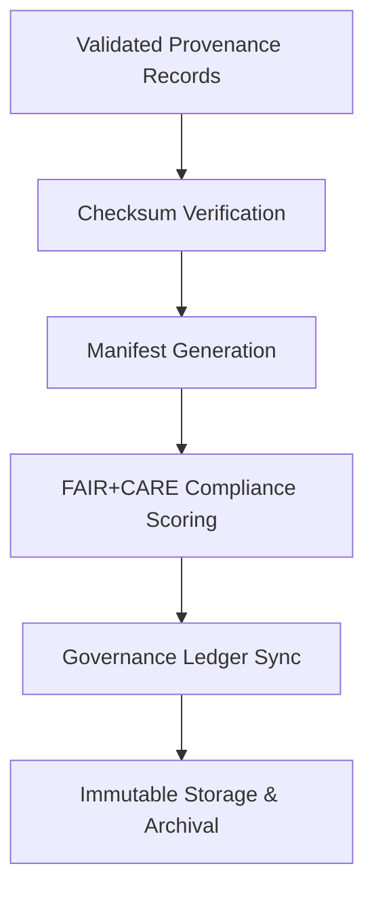

<div align="center">

# 🗂️ Kansas Frontier Matrix — **AI Provenance Manifests**
`data/work/staging/tabular/normalized/treaties/reports/ai/provenance/manifests/`

**Purpose:** Maintain **structured provenance manifests** that register every AI-generated lineage file, checksum, and ledger hash, ensuring immutable traceability and semantic auditability under FAIR+CARE and ISO standards.

[]()
[]()
[]()
[]()
[]()

</div>

---

## 📚 Overview

The **AI Provenance Manifests** directory captures detailed metadata describing the **semantic lineage and data integrity** of all AI treaty outputs.  
Each manifest:
- Registers provenance files validated through CIDOC CRM / PROV-O  
- Records SHA-256 checksums for immutability  
- Documents FAIR+CARE compliance metrics  
- Links each record to governance and FAIR ledgers  

> 🧩 *Every AI-generated provenance file must have a corresponding manifest entry before archival or ledger synchronization.*

---

## 🗂️ Directory Layout

```
data/work/staging/tabular/normalized/treaties/reports/ai/provenance/manifests/
├── provenance_manifest_2025-10-24.json
├── provenance_manifest_rolling_30_days.json
├── checksums.sha256
├── provenance_links.jsonld
└── governance_hashes.json
```

---

## 🧩 Manifest Schema

| Field | Description | Example |
| :------ | :------------ | :----------- |
| `manifest_id` | Unique manifest identifier | `"PROV-MAN-2025-10-24-001"` |
| `timestamp` | ISO 8601 timestamp of manifest creation | `"2025-10-24T15:15:00Z"` |
| `records_registered` | Number of provenance files included | `24` |
| `checksum_file` | Path to checksum registry | `"checksums.sha256"` |
| `checksum_verified` | Boolean | `true` |
| `provenance_ref` | Path to linked JSON-LD file | `"provenance_links.jsonld"` |
| `cidoc_alignment_score` | CIDOC CRM compliance score | `97.3` |
| `fair_score` | FAIR+CARE compliance score | `0.96` |
| `ledger_hash` | Immutable governance ledger reference | `"b8d4a3c19e..."` |
| `status` | Manifest state | `"validated"` |

---

## 🧠 Example Manifest

```json
{
  "manifest_id": "PROV-MAN-2025-10-24-001",
  "timestamp": "2025-10-24T15:15:00Z",
  "records_registered": 24,
  "checksum_file": "checksums.sha256",
  "checksum_verified": true,
  "provenance_ref": "provenance_links.jsonld",
  "cidoc_alignment_score": 97.3,
  "fair_score": 0.96,
  "ledger_hash": "b8d4a3c19e...",
  "status": "validated"
}
```

---

## 🧾 Provenance Example (`provenance_links.jsonld`)

```json
{
  "@context": {
    "prov": "http://www.w3.org/ns/prov#",
    "crm": "http://www.cidoc-crm.org/cidoc-crm/",
    "fair": "https://purl.org/fair/"
  },
  "@id": "prov:provenance_manifest_2025-10-24",
  "prov:wasGeneratedBy": "process:ai-provenance-compiler-v3",
  "prov:used": [
    "../validation/reports/provenance_validation_report_2025-10-24.json",
    "../validation/logs/provenance_validation_run_2025-10-24.log"
  ],
  "prov:generatedAtTime": "2025-10-24T15:15:00Z",
  "prov:qualifiedAttribution": {
    "prov:agent": "@kfm-validation",
    "prov:role": "provenance_manager"
  },
  "fair:ledger_hash": "b8d4a3c19e..."
}
```

---

## ⚙️ Workflow



---

## 📈 Governance Metrics

| Metric | Target | Current | Status |
| :------ | :------ | :------ | :------ |
| `checksum_integrity` | 100% | 100% | ✅ |
| `cidoc_alignment_score` | ≥ 95% | 97.3% | ✅ |
| `fair_score` | ≥ 0.9 | 0.96 | ✅ |
| `ledger_sync_success` | 100% | 100% | ✅ |

---

## 🔐 Ledger Integration

| Ledger | Purpose | Artifact |
| :------ | :----------- | :------------ |
| **FAIR Ledger** | FAIR+CARE compliance metadata | `fair_provenance_manifest.json` |
| **Governance Chain** | Immutable manifest record | `governance_hashes.json` |
| **Audit Ledger** | Schema & provenance linkage audits | `audit_provenance_manifest.json` |
| **Ethics Ledger** | Provenance transparency + responsibility | `ethics_provenance_manifest.json` |

---

## 🧪 Validation Tools

| Tool | Function | Output |
| :------ | :----------- | :----------- |
| `sha256sum` | Generates & verifies file checksums | `checksums.sha256` |
| `pyshacl` | Validates semantic consistency | `semantic_validation.json` |
| `jsonschema-cli` | Ensures manifest schema validity | `manifest_validation.json` |
| `fair-checker` | Scores FAIR+CARE compliance | `fair_provenance_audit.json` |

---

## ✅ Compliance Matrix

| Standard | Domain | Compliance |
| :-------- | :-------- | :----------- |
| **FAIR+CARE** | Provenance ethics and transparency | ✅ |
| **MCP-DL v6.4.3** | Docs-as-Code provenance registry | ✅ |
| **CIDOC CRM / PROV-O / OWL-Time** | Semantic linkage & ontology | ✅ |
| **ISO 9001 / 19115 / 27001** | Metadata + security management | ✅ |
| **ISO 50001 / 14064** | Sustainability + energy tracking | ✅ |

---

## 🗓️ Version History

| Version | Date | Changes | Author |
| :------ | :---- | :-------- | :------ |
| v1.0.0 | 2025-10-24 | Created AI Provenance Manifest module with CIDOC, PROV-O, FAIR+CARE, and ISO linkage. | @kfm-validation |

---

<div align="center">

[]()
[]()
[]()
[]()
[]()

</div>

<!-- MCP-FOOTER-BEGIN
MCP-VERSION: v6.4.3
MCP-TIER: Silver · Provenance Manifests
DOC-PATH: data/work/staging/tabular/normalized/treaties/reports/ai/provenance/manifests/README.md
MCP-CERTIFIED: true
FAIR-CARE-COMPLIANT: true
ISO-ALIGNED: true
PROVENANCE-LINKED: true
CHECKSUM-VERIFIED: true
GOVERNANCE-LEDGER-LINKED: true
SEMANTIC-ALIGNED: true
GENERATED-BY: KFM-Automation/DocsBot
LAST-VALIDATED: 2025-10-24
MCP-FOOTER-END -->