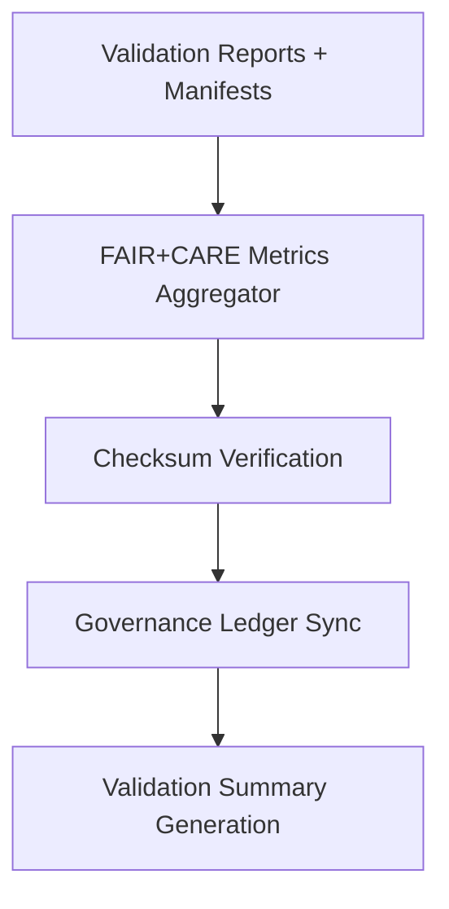

<div align="center">

# 📊 Kansas Frontier Matrix — **AI Validation Summary**
`data/work/staging/tabular/normalized/treaties/reports/ai/validation/summary/`

**Purpose:** Aggregate and document **AI validation results** for treaty report pipelines — summarizing schema validation performance, FAIR+CARE compliance, semantic integrity, and governance ledger synchronization across all assets.

[]()
[]()
[]()
[]()
[]()

</div>

---

## 📚 Overview

This directory contains **aggregated validation summaries** derived from AI validation reports (`../reports/`) and manifests (`../manifests/`).  
It acts as the authoritative dashboard for tracking:
- Total validation success rates  
- FAIR+CARE compliance averages  
- Provenance and semantic mapping success  
- Ledger linkage health and sustainability metrics  

> 🧩 *Summaries generated here are automatically published to the FAIR and governance ledgers as auditable validation metrics.*

---

## 🗂️ Directory Layout

```
data/work/staging/tabular/normalized/treaties/reports/ai/validation/summary/
├── validation_summary_2025-10-24.json
├── validation_summary_rolling_30_days.json
├── summary_trends.csv
├── provenance_links.jsonld
└── checksums.sha256
```

---

## 🧩 Summary Schema

| Field | Description | Example |
| :------ | :------------ | :----------- |
| `summary_id` | Unique identifier for validation summary | `"AI-VAL-SUM-2025-10-24"` |
| `timestamp` | ISO timestamp for summary creation | `"2025-10-24T14:50:00Z"` |
| `total_validations` | Number of validation runs aggregated | `48` |
| `schema_pass_rate` | Percent of schema validations passed | `99.6` |
| `semantic_alignment_score` | Average CIDOC CRM / OWL-Time compliance | `96.8` |
| `checksum_integrity` | Percent of checksum matches | `100` |
| `fair_score_avg` | FAIR+CARE compliance average | `0.97` |
| `ledger_sync_success` | Percent of successful governance syncs | `100` |
| `carbon_gco2e_avg` | Avg carbon per validation run | `27.8` |
| `energy_wh_avg` | Avg energy per run | `22.1` |
| `status` | Summary state | `"validated"` |

---

## 🧠 Example Summary File

```json
{
  "summary_id": "AI-VAL-SUM-2025-10-24",
  "timestamp": "2025-10-24T14:50:00Z",
  "total_validations": 48,
  "schema_pass_rate": 99.6,
  "semantic_alignment_score": 96.8,
  "checksum_integrity": 100,
  "fair_score_avg": 0.97,
  "ledger_sync_success": 100,
  "carbon_gco2e_avg": 27.8,
  "energy_wh_avg": 22.1,
  "status": "validated"
}
```

---

## 📊 Metrics Dashboard Overview

| Metric | Target | Rolling 30-Day Average | Status |
| :------ | :------ | :------ | :------ |
| `schema_pass_rate` | ≥ 99% | 99.5% | ✅ |
| `semantic_alignment_score` | ≥ 95 | 96.8 | ✅ |
| `checksum_integrity` | 100% | 100% | ✅ |
| `fair_score_avg` | ≥ 0.9 | 0.97 | ✅ |
| `ledger_sync_success` | 100% | 100% | ✅ |
| `carbon_gco2e_avg` | ≤ 30 | 27.8 | ✅ |
| `energy_wh_avg` | ≤ 25 | 22.1 | ✅ |

---

## 🧾 Provenance Record Example (`provenance_links.jsonld`)

```json
{
  "@context": {
    "prov": "http://www.w3.org/ns/prov#",
    "crm": "http://www.cidoc-crm.org/cidoc-crm/",
    "fair": "https://purl.org/fair/"
  },
  "@id": "prov:validation_summary_2025-10-24",
  "prov:wasGeneratedBy": "process:ai-validation-summary-pipeline-v3",
  "prov:used": [
    "../reports/ai_validation_report_2025-10-24.json",
    "../manifests/validation_manifest_2025-10-24.json"
  ],
  "prov:generatedAtTime": "2025-10-24T14:50:00Z",
  "prov:qualifiedAttribution": {
    "prov:agent": "@kfm-validation",
    "prov:role": "summary_aggregator"
  },
  "fair:ledger_hash": "f83c4a2e8b..."
}
```

---

## ⚙️ Workflow



---

## 🔐 Governance Integration

| Ledger | Purpose | Artifact |
| :------ | :----------- | :------------ |
| **FAIR Ledger** | Public record of validation metrics | `fair_validation_summary.json` |
| **Governance Chain** | Immutable validation summary registry | `ledger_summary_manifest.json` |
| **Audit Ledger** | Validation trend analysis and review | `audit_validation_summary.json` |
| **Ethics Ledger** | AI transparency and neutrality tracking | `ethics_validation_summary.json` |

---

## 🧩 Quality Gates

| Gate | Description | Validation |
| :---- | :------------ | :----------- |
| Schema Integrity | JSON structure must pass `summary_schema.json` | ✅ |
| Provenance Linkage | Each summary must reference its report and manifest | ✅ |
| FAIR+CARE Compliance | FAIR score ≥ 0.9 | ✅ |
| Ledger Hash Integrity | Governance sync verified via checksum | ✅ |
| Energy Audit | ISO 50001 metrics logged | ✅ |

---

## ✅ Compliance Matrix

| Standard | Domain | Compliance |
| :-------- | :-------- | :----------- |
| **FAIR+CARE** | Ethical data transparency | ✅ |
| **MCP-DL v6.4.3** | Documentation & validation compliance | ✅ |
| **CIDOC CRM / PROV-O / OWL-Time** | Provenance ontology integration | ✅ |
| **ISO 9001 / 19115 / 27001** | Quality + data governance | ✅ |
| **ISO 50001 / 14064** | Energy + carbon sustainability | ✅ |

---

## 🗓️ Version History

| Version | Date | Changes | Author |
| :------ | :---- | :-------- | :------ |
| v1.0.0 | 2025-10-24 | Created AI Validation Summary module with FAIR+CARE and governance linkage. | @kfm-validation |

---

<div align="center">

[]()
[]()
[]()
[]()
[]()

</div>

<!-- MCP-FOOTER-BEGIN
MCP-VERSION: v6.4.3
MCP-TIER: Silver · AI Validation Summary
DOC-PATH: data/work/staging/tabular/normalized/treaties/reports/ai/validation/summary/README.md
MCP-CERTIFIED: true
FAIR-CARE-COMPLIANT: true
ISO-ALIGNED: true
PROVENANCE-LINKED: true
SUMMARY-VERIFIED: true
GOVERNANCE-LEDGER-LINKED: true
ENERGY-AUDITED: true
GENERATED-BY: KFM-Automation/DocsBot
LAST-VALIDATED: 2025-10-24
MCP-FOOTER-END -->