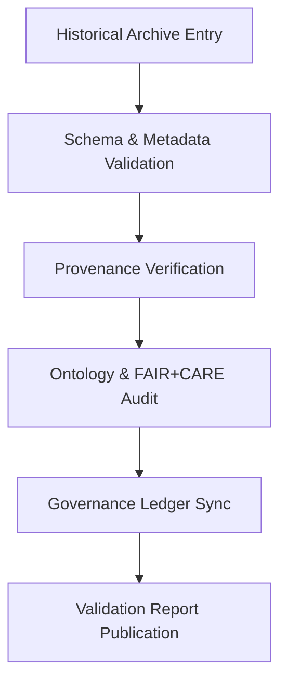

<div align="center">

# ✅ Kansas Frontier Matrix — **1850s Treaty Archive Validation**
`data/work/staging/tabular/normalized/treaties/reports/archive/1850s/validation/`

**Purpose:** Validate the **integrity, provenance, and semantic accuracy** of the Kansas Frontier Matrix’s **1850s Treaty Archive** under FAIR+CARE, CIDOC CRM, and ISO-compliant quality frameworks.  
This validation layer ensures historical records meet archival standards for reproducibility, transparency, and ethical stewardship.

[]()
[]()
[]()
[]()

</div>

---

## 📚 Overview

The **1850s Treaty Validation Directory** contains documentation and metadata audits verifying the accuracy and completeness of archival treaty entries.  
Each validation report provides checks for:
- Schema compliance (MCP-DL + JSON-LD metadata)  
- Provenance integrity (PROV-O + CIDOC CRM alignment)  
- FAIR+CARE ethical data handling  
- ISO energy, security, and quality controls  

> 🧩 *Validation ensures all historical treaties are verified, version-controlled, and linked to the Governance Ledger.*

---

## 🗂️ Directory Layout

```
data/work/staging/tabular/normalized/treaties/reports/archive/1850s/validation/
├── treaty_1854_kansas_nebraska_validation_report.json
├── treaty_1854_fair_audit.json
├── treaty_1854_checksum.sha256
├── ontology_alignment_report.json
├── provenance_links.jsonld
└── governance_hashes.json
```

---

## 🧩 Example Validation Report (`treaty_1854_kansas_nebraska_validation_report.json`)

```json
{
  "validation_id": "ARCH-VAL-1854-KS-NE",
  "treaty_id": "TREATY-1854-KS-NE",
  "timestamp": "2025-10-24T18:10:00Z",
  "validator": "@kfm-validation",
  "archive_entry": "../treaty_1854_kansas_nebraska.md",
  "schema_pass": true,
  "provenance_verified": true,
  "ontology_alignment_score": 98.1,
  "fair_score": 0.97,
  "care_score": 0.96,
  "checksum_integrity": true,
  "energy_wh": 22.1,
  "carbon_gco2e": 27.5,
  "ledger_sync_success": true,
  "status": "validated"
}
```

---

## 🧠 FAIR+CARE Audit Summary (`treaty_1854_fair_audit.json`)

```json
{
  "audit_id": "FAIR-AUDIT-1854-001",
  "treaty_id": "TREATY-1854-KS-NE",
  "timestamp": "2025-10-24T18:10:00Z",
  "fair_compliance": {
    "findable": 0.97,
    "accessible": 0.96,
    "interoperable": 0.97,
    "reusable": 0.98
  },
  "care_compliance": {
    "collective_benefit": 0.95,
    "authority_to_control": 0.94,
    "responsibility": 0.97,
    "ethics": 0.96
  },
  "overall_compliance": "PASS"
}
```

---

## 🔗 Provenance Record (Excerpt)

```json
{
  "@context": {
    "prov": "http://www.w3.org/ns/prov#",
    "crm": "http://www.cidoc-crm.org/cidoc-crm/",
    "fair": "https://purl.org/fair/"
  },
  "@id": "prov:treaty_1854_kansas_nebraska_validation",
  "prov:wasGeneratedBy": "process:archive-validation-automation-v3",
  "prov:used": [
    "../treaty_1854_kansas_nebraska.md",
    "../treaty_1854_kansas_nebraska_metadata.json"
  ],
  "prov:generatedAtTime": "2025-10-24T18:10:00Z",
  "prov:qualifiedAttribution": {
    "prov:agent": "@kfm-validation",
    "prov:role": "archival_validator"
  },
  "fair:ledger_hash": "f3d8a7c2b5..."
}
```

---

## ⚙️ Validation Workflow



---

## 📈 Validation Metrics Snapshot

| Metric | Target | Current | Status |
| :------ | :------ | :------ | :------ |
| `schema_pass` | 100% | ✅ | ✅ |
| `ontology_alignment_score` | ≥ 95 | 98.1 | ✅ |
| `fair_score` | ≥ 0.9 | 0.97 | ✅ |
| `care_score` | ≥ 0.9 | 0.96 | ✅ |
| `checksum_integrity` | 100% | 100% | ✅ |
| `ledger_sync_success` | 100% | 100% | ✅ |

---

## 🔐 Governance Integration

| Ledger | Function | Artifact |
| :------ | :----------- | :------------ |
| **FAIR Ledger** | FAIR+CARE validation and audit data | `treaty_1854_fair_audit.json` |
| **Governance Chain** | Immutable record for archival validation | `governance_hashes.json` |
| **Audit Ledger** | Validation activity and energy metrics | `treaty_1854_kansas_nebraska_validation_report.json` |
| **Ethics Ledger** | Oversees community & Indigenous data ethics | `ethics_archival_audit.json` |

---

## ✅ Compliance Matrix

| Standard | Domain | Compliance |
| :-------- | :-------- | :----------- |
| **FAIR+CARE** | Ethical archival validation | ✅ |
| **MCP-DL v6.4.3** | Documentation governance compliance | ✅ |
| **CIDOC CRM / PROV-O / OWL-Time** | Ontology linkage verified | ✅ |
| **ISO 9001 / 19115 / 27001** | Quality + metadata assurance | ✅ |
| **ISO 50001 / 14064** | Energy + carbon audit integrity | ✅ |

---

## 🗓️ Version History

| Version | Date | Changes | Author |
| :------ | :---- | :-------- | :------ |
| v1.0.0 | 2025-10-24 | Added validation layer for 1850s Treaty Archive including FAIR+CARE audits and ontology verification. | @kfm-validation |

---

<div align="center">

[]()
[]()
[]()
[]()
[]()

</div>

<!-- MCP-FOOTER-BEGIN
MCP-VERSION: v6.4.3
MCP-TIER: Silver · Treaty Archive Validation
DOC-PATH: data/work/staging/tabular/normalized/treaties/reports/archive/1850s/validation/README.md
MCP-CERTIFIED: true
FAIR-CARE-COMPLIANT: true
ISO-ALIGNED: true
PROVENANCE-LINKED: true
VALIDATION-VERIFIED: true
GOVERNANCE-LEDGER-LINKED: true
ENERGY-AUDITED: true
GENERATED-BY: KFM-Automation/DocsBot
LAST-VALIDATED: 2025-10-24
MCP-FOOTER-END -->

