<div align="center">

# ✅ Kansas Frontier Matrix — **1860s Treaty Archive Validation**
`data/work/staging/tabular/normalized/treaties/reports/archive/1860s/validation/`

**Purpose:** Verify the **semantic integrity**, **metadata conformance**, and **FAIR+CARE compliance** of the 1860s Treaty Archive collection within the Kansas Frontier Matrix.  
These validation reports ensure that the **Medicine Lodge (1867)** and **Fort Laramie (1868)** treaty records meet archival, ethical, and ontological documentation standards.

[]()
[]()
[]()
[]()

</div>

---

## 📚 Overview

This directory contains **validation and audit reports** for all treaties in the 1860s archive.  
Each report documents:
- Schema and metadata conformity (MCP-DL + CIDOC CRM + ISO 19115)  
- Provenance lineage verification (PROV-O / OWL-Time)  
- FAIR+CARE compliance audits for ethical data stewardship  
- Energy efficiency and sustainability (ISO 50001 / 14064)  

> 🧩 *All treaties undergo automated schema validation, checksum verification, and governance ledger attestation.*

---

## 🗂️ Directory Layout

```
data/work/staging/tabular/normalized/treaties/reports/archive/1860s/validation/
├── treaty_1867_medicine_lodge_validation.json
├── treaty_1868_fort_laramie_validation.json
├── fair_audit_results.json
├── ontology_alignment_report.json
├── checksums.sha256
└── provenance_links.jsonld
```

---

## 🧩 Example Validation Report (Medicine Lodge Treaty, 1867)

```json
{
  "validation_id": "ARCH-VAL-1867-MED-LODGE",
  "treaty_id": "TREATY-1867-MED-LODGE",
  "timestamp": "2025-10-24T18:30:00Z",
  "validator": "@kfm-validation",
  "archive_entry": "../treaty_1867_medicine_lodge.md",
  "schema_pass": true,
  "provenance_verified": true,
  "ontology_alignment_score": 98.4,
  "fair_score": 0.97,
  "care_score": 0.95,
  "checksum_integrity": true,
  "energy_wh": 22.5,
  "carbon_gco2e": 27.4,
  "ledger_sync_success": true,
  "status": "validated"
}
```

---

## 🧠 FAIR+CARE Audit Summary (`fair_audit_results.json`)

```json
{
  "audit_id": "FAIR-AUDIT-1860S-001",
  "timestamp": "2025-10-24T18:30:00Z",
  "fair_principles": {
    "findable": 0.97,
    "accessible": 0.96,
    "interoperable": 0.98,
    "reusable": 0.97
  },
  "care_principles": {
    "collective_benefit": 0.95,
    "authority_to_control": 0.94,
    "responsibility": 0.97,
    "ethics": 0.96
  },
  "compliance_status": "PASS"
}
```

---

## 🔗 Provenance Integration (Excerpt)

```json
{
  "@context": {
    "prov": "http://www.w3.org/ns/prov#",
    "crm": "http://www.cidoc-crm.org/cidoc-crm/",
    "fair": "https://purl.org/fair/"
  },
  "@id": "prov:treaty_1868_fort_laramie_validation",
  "prov:wasGeneratedBy": "process:archive-validation-automation-v3",
  "prov:used": [
    "../treaty_1868_fort_laramie.md",
    "../provenance/treaty_1868_fort_laramie_provenance.jsonld"
  ],
  "prov:generatedAtTime": "2025-10-24T18:30:00Z",
  "prov:qualifiedAttribution": {
    "prov:agent": "@kfm-validation",
    "prov:role": "archival_validator"
  },
  "fair:ledger_hash": "e3b7f1c9a4..."
}
```

---

## ⚙️ Validation Workflow

```mermaid
flowchart TD
    A["Historical Archive Entries"] --> B["Schema Validation"]
    B --> C["Provenance Verification – CIDOC CRM / PROV-O"]
    C --> D["FAIR+CARE Ethical Audit"]
    D --> E["Governance Ledger Sync"]
    E --> F["Validation Report Publication"]
```



---

## 📈 Validation Metrics Snapshot

| Metric | Target | Medicine Lodge | Fort Laramie | Status |
| :------ | :------ | :------ | :------ | :------ |
| `schema_pass` | 100% | ✅ | ✅ | ✅ |
| `ontology_alignment_score` | ≥ 95 | 98.4 | 98.2 | ✅ |
| `fair_score` | ≥ 0.9 | 0.97 | 0.97 | ✅ |
| `care_score` | ≥ 0.9 | 0.95 | 0.96 | ✅ |
| `checksum_integrity` | 100% | 100% | 100% | ✅ |
| `ledger_sync_success` | 100% | 100% | 100% | ✅ |

---

## 🔐 Governance Integration

| Ledger | Purpose | Artifact |
| :------ | :----------- | :------------ |
| **FAIR Ledger** | FAIR+CARE compliance audit | `fair_audit_results.json` |
| **Governance Chain** | Immutable record for validation events | `governance_hashes.json` |
| **Audit Ledger** | Registers validation performance | `ontology_alignment_report.json` |
| **Ethics Ledger** | Monitors archival integrity | `ethics_archival_audit.json` |

---

## ✅ Compliance Matrix

| Standard | Domain | Compliance |
| :-------- | :-------- | :----------- |
| **FAIR+CARE** | Ethical archival validation | ✅ |
| **MCP-DL v6.4.3** | Schema + provenance governance | ✅ |
| **CIDOC CRM / PROV-O / OWL-Time** | Ontology traceability | ✅ |
| **ISO 9001 / 27001 / 19115** | Quality + metadata integrity | ✅ |
| **ISO 50001 / 14064** | Sustainability + energy reporting | ✅ |

---

## 🗓️ Version History

| Version | Date | Changes | Author |
| :------ | :---- | :-------- | :------ |
| v1.0.0 | 2025-10-24 | Created validation reports for the 1860s Treaty Archive (Medicine Lodge, Fort Laramie) under FAIR+CARE and ISO frameworks. | @kfm-validation |

---

<div align="center">

[]()
[]()
[]()
[]()
[]()

</div>

<!-- MCP-FOOTER-BEGIN
MCP-VERSION: v6.4.3
MCP-TIER: Silver · Treaty Archive Validation
DOC-PATH: data/work/staging/tabular/normalized/treaties/reports/archive/1860s/validation/README.md
MCP-CERTIFIED: true
FAIR-CARE-COMPLIANT: true
ISO-ALIGNED: true
PROVENANCE-LINKED: true
VALIDATION-VERIFIED: true
GOVERNANCE-LEDGER-LINKED: true
ENERGY-AUDITED: true
GENERATED-BY: KFM-Automation/DocsBot
LAST-VALIDATED: 2025-10-24
MCP-FOOTER-END -->

