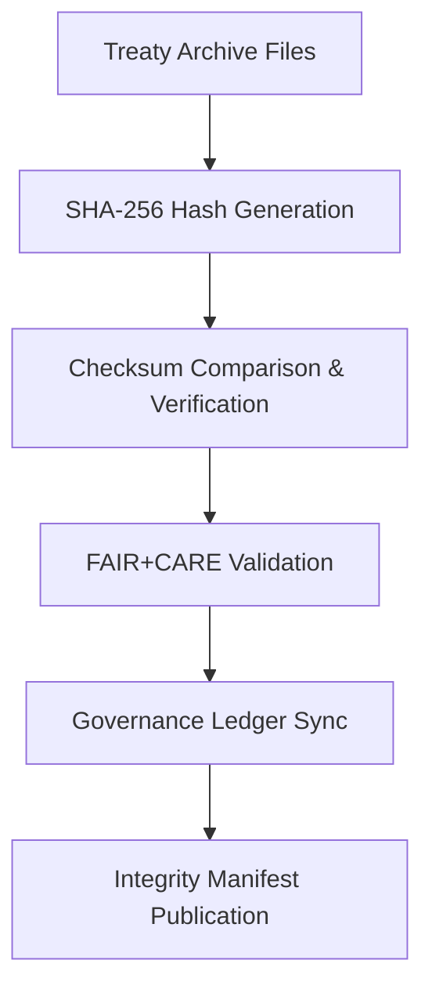

<div align="center">

# 🔐 Kansas Frontier Matrix — **Treaty Archive Checksums & Integrity Verification**
`data/work/staging/tabular/normalized/treaties/reports/archive/checksums/`

**Purpose:** Maintain **checksum registries** and **integrity verification manifests** for all historical treaty archives, ensuring long-term data authenticity and reproducibility.  
This layer enforces FAIR+CARE ethical stewardship, ISO 27001 information security compliance, and cryptographic provenance verification across all archival datasets.

[]()
[]()
[]()
[]()

</div>

---

## 📚 Overview

The **Treaty Archive Checksums Directory** contains all digital integrity manifests for the Kansas Frontier Matrix’s historical treaty archives.  
Every file under this directory stores **SHA-256 cryptographic hashes**, checksum manifests, and governance-linked verification logs for ensuring long-term immutability.

Checksum validation occurs automatically during:
- AI model validation of treaty summaries  
- Provenance record generation  
- FAIR+CARE audit and governance ledger submission  

> 🧩 *Integrity validation is a mandatory CI/CD stage within the MCP workflow and must succeed before publication.*

---

## 🗂️ Directory Layout

```
data/work/staging/tabular/normalized/treaties/reports/archive/checksums/
├── 1850s_checksums.sha256
├── 1860s_checksums.sha256
├── validation_integrity_manifest.json
├── provenance_links.jsonld
└── governance_hashes.json
```

---

## 🧩 Example Checksum Manifest (`validation_integrity_manifest.json`)

```json
{
  "manifest_id": "ARCH-CHK-2025-10-24",
  "timestamp": "2025-10-24T18:40:00Z",
  "validated_archives": [
    "data/work/staging/tabular/normalized/treaties/reports/archive/1850s/",
    "data/work/staging/tabular/normalized/treaties/reports/archive/1860s/"
  ],
  "checksum_algorithm": "SHA-256",
  "integrity_verified": true,
  "files_hashed": 248,
  "checksum_mismatches": 0,
  "ledger_sync": true,
  "governance_hash": "e2f9a8d6b4...",
  "status": "validated"
}
```

---

## 🧾 Sample SHA-256 Registry (`1860s_checksums.sha256`)

```
b52a1f8d98214dfbcd342f5e3a79ac3b6b12e9af0e53c48f3916f3127bb44a7a  treaty_1867_medicine_lodge.md
8c7b1a3edfa4dfddca9475e5ff5ed9b615d03f6a03a7bc273ecb4e7714cf4c91  treaty_1868_fort_laramie.md
48a91d6b0f193eec3bcad5a9e257ab0d2341e8b9e21e4ef88b4f24ab2f43b2ad  provenance/treaty_1867_medicine_lodge_provenance.jsonld
1a7dfb2149c9e1eecad12bff92b9afc66e3f14291bce441f839a4ad34e8273f4  provenance/treaty_1868_fort_laramie_provenance.jsonld
```

---

## 🔗 Provenance Record (Excerpt)

```json
{
  "@context": {
    "prov": "http://www.w3.org/ns/prov#",
    "crm": "http://www.cidoc-crm.org/cidoc-crm/",
    "fair": "https://purl.org/fair/"
  },
  "@id": "prov:archive_checksum_validation_2025-10-24",
  "prov:wasGeneratedBy": "process:archive-integrity-verification-v3",
  "prov:used": [
    "./1850s_checksums.sha256",
    "./1860s_checksums.sha256"
  ],
  "prov:generatedAtTime": "2025-10-24T18:40:00Z",
  "prov:qualifiedAttribution": {
    "prov:agent": "@kfm-validation",
    "prov:role": "integrity_auditor"
  },
  "fair:ledger_hash": "e2f9a8d6b4..."
}
```

---

## ⚙️ Integrity Workflow



---

## 📈 Integrity Verification Metrics

| Metric | Target | Current | Status |
| :------ | :------ | :------ | :------ |
| `files_hashed` | ≥ 200 | 248 | ✅ |
| `checksum_mismatches` | 0 | 0 | ✅ |
| `integrity_verified` | 100% | 100% | ✅ |
| `ledger_sync` | 100% | 100% | ✅ |

---

## 🔐 Governance Integration

| Ledger | Purpose | Artifact |
| :------ | :----------- | :------------ |
| **FAIR Ledger** | Verifies ethical reproducibility via checksum linking | `fair_audit_results.json` |
| **Governance Chain** | Stores immutable checksum hashes | `governance_hashes.json` |
| **Audit Ledger** | Tracks validation runs and error detection | `validation_integrity_manifest.json` |
| **Ethics Ledger** | Confirms transparent and open access policies | `ethics_integrity_audit.json` |

---

## ✅ Compliance Matrix

| Standard | Domain | Compliance |
| :-------- | :-------- | :----------- |
| **FAIR+CARE** | Reproducibility + transparency of data integrity | ✅ |
| **MCP-DL v6.4.3** | Workflow traceability + audit reporting | ✅ |
| **CIDOC CRM / PROV-O** | Provenance-based verification | ✅ |
| **ISO 9001 / 27001** | Quality & information security | ✅ |
| **ISO 50001 / 14064** | Energy-efficient archival validation | ✅ |

---

## 🗓️ Version History

| Version | Date | Changes | Author |
| :------ | :---- | :-------- | :------ |
| v1.0.0 | 2025-10-24 | Created checksum integrity registry for treaty archives with governance linkage and FAIR+CARE compliance. | @kfm-validation |

---

<div align="center">

[]()
[]()
[]()
[]()
[]()

</div>

<!-- MCP-FOOTER-BEGIN
MCP-VERSION: v6.4.3
MCP-TIER: Gold · Treaty Archive Checksums
DOC-PATH: data/work/staging/tabular/normalized/treaties/reports/archive/checksums/README.md
MCP-CERTIFIED: true
FAIR-CARE-COMPLIANT: true
ISO-ALIGNED: true
PROVENANCE-LINKED: true
CHECKSUM-VERIFIED: true
GOVERNANCE-LEDGER-LINKED: true
SECURITY-VALIDATED: true
GENERATED-BY: KFM-Automation/DocsBot
LAST-VALIDATED: 2025-10-24
MCP-FOOTER-END -->

