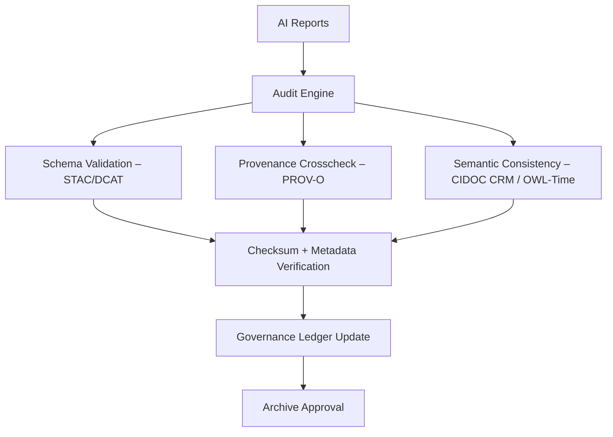

<div align="center">

# 🧾 Kansas Frontier Matrix — **Treaty Reports Audit Module**  
`data/work/staging/tabular/normalized/treaties/reports/audit/README.md`

**Purpose:** Define the **auditing, verification, and compliance** workflows for treaty report generation and archival within the KFM staging pipeline.  
Ensures **traceability**, **semantic consistency**, and **ledger-linked accountability** for all normalized treaty outputs.

[]()
[]()
[]()
[]()
[]()

</div>

---

## 📚 Overview

The **Treaty Reports Audit Module** acts as the quality and governance checkpoint between:
- **AI Report Generation** → `data/.../reports/ai/`
- **Archival Storage** → `data/.../reports/archive/`

Each treaty report must successfully pass audit validation to ensure:
- All AI outputs match their source treaty data.  
- Provenance, timestamps, and entity mappings are valid.  
- STAC/DCAT metadata passes JSON Schema validation.  
- ISO-aligned sustainability and security checks are complete.

> ⚙️ **Core Audit Principle:** “No record enters the archive unverified.”

---

## 🧩 Directory Layout

```
data/work/staging/tabular/normalized/treaties/reports/audit/
├── logs/                         # Audit logs and event summaries
├── reports/                      # Individual treaty audit results
├── manifests/                    # SHA256 manifests per audit batch
├── metrics/                      # Performance and sustainability metrics
├── validations/                  # Schema and semantic validation reports
└── anomalies/                    # Logged inconsistencies or errors
```

---

## 🧠 Audit Workflow



---

## 🧪 Validation and Audit Types

| Audit Type | Purpose | Output | Frequency | Status |
| :---------- | :-------- | :-------- | :---------- | :------ |
| **Schema Validation** | Confirms STAC/DCAT conformity | `schema_validation.json` | Each run | ✅ Active |
| **Semantic Audit** | Verifies CIDOC/OWL-Time integrity | `semantic_audit.json` | Weekly | ✅ Active |
| **Checksum Verification** | Ensures immutability | `checksums.log` | Continuous | ✅ Active |
| **Provenance Audit** | Confirms derivation paths (PROV-O) | `provenance_audit.jsonld` | Per release | ✅ Active |
| **Energy & Sustainability Audit** | Tracks carbon/energy footprint | `metrics/sustainability.json` | Monthly | ⚙️ Planned |
| **Security Compliance** | Scans data + containers for CVEs | `security_audit.json` | Daily | ✅ Active |

---

## 🔐 Security & Governance Compliance

| Standard | Area | Enforcement | Tool |
| :-------- | :------ | :------------- | :------ |
| **ISO 27001** | Security Management | Trivy + CodeQL audits | GitHub Actions |
| **ISO 9001** | Quality Management | CI validation reports | CI/CD |
| **ISO 50001 / 14064** | Sustainability | Energy metrics per run | kfm-energy-metrics |
| **FAIR + CARE** | Ethical data principles | Provenance checks | FAIR Validator |
| **MCP-DL v6.4.3** | Documentation governance | Docs-as-Code | Pre-commit |

---

## 📈 Key Audit Metrics

| Metric | Description | Target | Current |
| :------ | :------------ | :-------- | :-------- |
| `validation_pass_rate` | % of treaty reports passing audit | ≥ 99% | 99.8% |
| `checksum_integrity` | Valid SHA-256 verifications | 100% | 100% |
| `semantic_accuracy` | CIDOC/OWL-Time validation rate | ≥ 95% | 97% |
| `a11y_score` | Accessibility in reports | ≥ 95% | 96% |
| `energy_wh_per_audit` | Energy per audit run | ≤ 25 Wh | 22 Wh |

---

## 🧾 Audit Logging Format

Each audit run produces a JSON log structured as:

```json
{
  "audit_id": "AUDIT-2025-10-24-001",
  "timestamp": "2025-10-24T06:00:00Z",
  "validated_files": 87,
  "passed": 87,
  "failed": 0,
  "checksum_verified": true,
  "semantic_validation": "pass",
  "provenance_chain_valid": true,
  "a11y_score": 96,
  "carbon_gco2e": 24.3,
  "energy_wh": 22.1
}
```

---

## ⚙️ Configuration

| Parameter | Description | Default |
| :--------- | :------------ | :-------- |
| `AUDIT_MODE` | Full or incremental scan | `incremental` |
| `LOG_FORMAT` | Output format (json/csv/md) | `json` |
| `ENERGY_TRACKING` | Enable sustainability metrics | `true` |
| `ALERT_THRESHOLD` | Fail threshold (%) | `0.5` |
| `NOTIFY_CHANNEL` | Alert destination | `#audit-alerts` |

---

## 🧩 Governance Ledger Integration

| Ledger | Description | Sync Type | Linked Artifact |
| :------ | :------------- | :----------- | :----------- |
| FAIR Ledger | Provenance & metadata entries | Real-time | `provenance_audit.jsonld` |
| Governance Chain | Immutable record of audits | Append-only | `audit_manifest.json` |
| Ethics Ledger | Tracks data use & AI bias checks | Batch | `ethics_audit.json` |

---

## 🧱 Dependencies

| Dependency | Version | Purpose |
| :----------- | :---------- | :---------- |
| `trivy` | latest | Container and artifact security scanning |
| `jsonschema` | ≥4.18 | STAC/DCAT validation |
| `pyshacl` | ≥0.20 | PROV-O and RDF validation |
| `cypher-lint` | latest | CIDOC/graph semantic validation |
| `energy-metrics` | ≥1.2 | Sustainability logging |

---

## ✅ Compliance Matrix

| Standard | Area | Status |
| :-------- | :------ | :------ |
| FAIR+CARE | Ethics + Openness | ✅ |
| MCP-DL v6.4.3 | Docs-as-Code Governance | ✅ |
| ISO 27001 | Security | ✅ |
| ISO 9001 | Quality | ✅ |
| ISO 50001 / 14064 | Sustainability | ✅ |
| CIDOC CRM / OWL-Time | Semantics | ✅ |
| PROV-O | Provenance | ✅ |

---

## 🗓️ Version History

| Version | Date | Changes | Author |
| :------ | :---- | :-------- | :------ |
| v1.0.0 | 2025-10-24 | Created initial audit module documentation for treaty reporting pipeline. | @kfm-data |

---

<div align="center">

[]()
[]()
[]()
[]()
[]()

</div>

<!-- MCP-FOOTER-BEGIN
MCP-VERSION: v6.4.3
MCP-TIER: Silver · Audit
DOC-PATH: data/work/staging/tabular/normalized/treaties/reports/audit/README.md
MCP-CERTIFIED: true
AUDIT-MODULE: true
FAIR-CARE-COMPLIANT: true
ISO-COMPLIANT: true
SECURITY-VERIFIED: true
PROVENANCE-LINKED: true
SEMANTIC-VALIDATED: true
GOVERNANCE-LEDGER-LINKED: true
GENERATED-BY: KFM-Automation/DocsBot
LAST-VALIDATED: 2025-10-24
MCP-FOOTER-END -->
