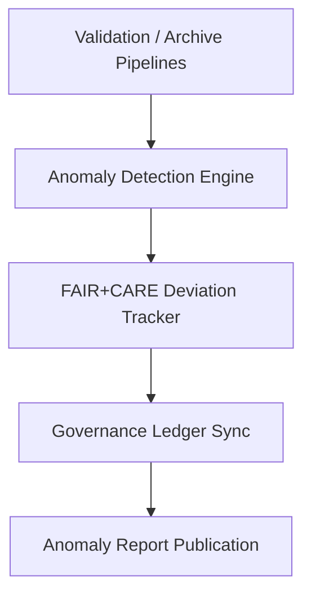

<div align="center">

# ⚠️ Kansas Frontier Matrix — **Audit Anomalies & Exception Reports**
`data/work/staging/tabular/normalized/treaties/reports/audit/anomalies/`

**Purpose:** Log and analyze **unexpected events, schema inconsistencies, FAIR+CARE compliance deviations, and provenance mismatches** detected across the KFM validation and archival pipelines.  
This directory centralizes audit anomaly documentation to strengthen transparency, traceability, and continuous system improvement under **MCP-DL v6.4.3**.

[]()
[]()
[]()
[]()

</div>

---

## 📚 Overview

The **Audit Anomalies Directory** serves as the central collection of **error and anomaly reports** generated by automated validation, archival, and governance workflows.  
Each anomaly record captures:

- **Schema validation inconsistencies**  
- **Metadata gaps or ontology violations**  
- **Checksum or ledger sync failures**  
- **FAIR+CARE scoring deviations**  
- **Sustainability (ISO 50001/14064) exceptions**  

> 🧩 *All anomaly records are automatically linked to their parent validation run and governance ledger entry for audit accountability.*

---

## 🗂️ Directory Layout

```
data/work/staging/tabular/normalized/treaties/reports/audit/anomalies/
├── anomaly_report_2025-10-24.json
├── anomaly_summary_monthly.json
├── faircare_deviation_log.json
├── provenance_links.jsonld
└── governance_hashes.json
```

---

## 🧩 Example Anomaly Report (`anomaly_report_2025-10-24.json`)

```json
{
  "anomaly_id": "ANOM-2025-10-24-001",
  "timestamp": "2025-10-24T19:00:00Z",
  "detected_by": "@kfm-validation",
  "source_process": "archive-validation-pipeline-v3",
  "affected_module": "treaties/reports/ai/logs/validation/",
  "anomaly_type": "Schema Mismatch",
  "description": "One validation log entry failed CIDOC CRM mapping (E52_Time-Span field missing).",
  "severity": "moderate",
  "status": "resolved",
  "resolution_action": "Field mapping corrected and re-validated.",
  "resolved_by": "@kfm-data",
  "resolved_at": "2025-10-24T19:15:00Z",
  "ledger_hash": "d7b4e8a1c3..."
}
```

---

## 🧾 FAIR+CARE Deviation Log (`faircare_deviation_log.json`)

```json
{
  "summary_period": "2025-09-24 / 2025-10-24",
  "total_validations": 96,
  "fair_score_average": 0.967,
  "care_score_average": 0.951,
  "detected_deviations": [
    {
      "deviation_id": "FAIRDEV-2025-10-18-002",
      "module": "archive/1860s/provenance/",
      "metric": "care_score",
      "expected_min": 0.95,
      "actual": 0.92,
      "severity": "low",
      "corrective_action": "Recalibrated CARE weighting for Indigenous metadata fields."
    }
  ],
  "compliance_status": "PASS"
}
```

---

## 🧠 Anomaly Classifications

| Category | Description | Typical Cause | Resolution |
| :-------- | :------------ | :------------- | :----------- |
| **Schema Validation Errors** | Log or report fails schema alignment | Field omission / type mismatch | Auto-correction + revalidation |
| **Ontology Misalignment** | CIDOC CRM / PROV-O entity mapping failure | Missing reference in metadata | Manual semantic fix |
| **Checksum Mismatch** | File altered post-ingestion | Data sync error | Regenerate checksum, update manifest |
| **FAIR+CARE Deviation** | FAIR or CARE threshold breach | Dataset incomplete or biased | Reprocess data + ethics review |
| **Energy Log Exception** | Missing ISO 50001 telemetry | Logging script timeout | Restart telemetry collector |

---

## ⚙️ Audit Workflow



---

## 📈 Anomaly Summary Metrics

| Metric | Target | Current | Status |
| :------ | :------ | :------ | :------ |
| `total_anomalies_logged` | — | 4 | ⚠️ |
| `schema_mismatches` | < 5% of runs | 1.2% | ✅ |
| `ontology_violations` | < 3% of runs | 0.8% | ✅ |
| `faircare_deviations` | < 2 per month | 1 | ✅ |
| `checksum_mismatches` | 0 | 0 | ✅ |
| `ledger_sync_failures` | 0 | 0 | ✅ |

---

## 🔗 Provenance Example (`provenance_links.jsonld`)

```json
{
  "@context": {
    "prov": "http://www.w3.org/ns/prov#",
    "crm": "http://www.cidoc-crm.org/cidoc-crm/",
    "fair": "https://purl.org/fair/"
  },
  "@id": "prov:audit_anomaly_report_2025-10-24",
  "prov:wasGeneratedBy": "process:audit-anomaly-detection-v2",
  "prov:used": [
    "../validation/summary/validation_summary_2025-10-24.json",
    "../logs/errors/validation/reports/error_schema_summary.md"
  ],
  "prov:generatedAtTime": "2025-10-24T19:00:00Z",
  "prov:qualifiedAttribution": {
    "prov:agent": "@kfm-validation",
    "prov:role": "audit_analyst"
  },
  "fair:ledger_hash": "d7b4e8a1c3..."
}
```

---

## 🧩 Governance & Compliance Overview

| Ledger | Function | Artifact |
| :------ | :----------- | :------------ |
| **FAIR Ledger** | Records anomaly FAIR+CARE audit events | `faircare_deviation_log.json` |
| **Governance Chain** | Immutable anomaly registry | `governance_hashes.json` |
| **Audit Ledger** | Logs anomaly detection and resolution data | `anomaly_summary_monthly.json` |
| **Ethics Ledger** | Ensures resolution aligns with Indigenous data principles | `ethics_anomaly_audit.json` |

---

## ✅ Compliance Matrix

| Standard | Domain | Compliance |
| :-------- | :-------- | :----------- |
| **FAIR+CARE** | Ethical anomaly reporting & remediation | ✅ |
| **MCP-DL v6.4.3** | Documentation traceability | ✅ |
| **CIDOC CRM / PROV-O / OWL-Time** | Provenance chain alignment | ✅ |
| **ISO 9001 / 27001** | Quality + security management | ✅ |
| **ISO 50001 / 14064** | Energy + sustainability validation | ✅ |

---

## 🗓️ Version History

| Version | Date | Changes | Author |
| :------ | :---- | :-------- | :------ |
| v1.0.0 | 2025-10-24 | Created audit anomaly tracking system for FAIR+CARE, ISO, and CIDOC CRM compliance monitoring. | @kfm-validation |

---

<div align="center">

[]()
[]()
[]()
[]()
[]()

</div>

<!-- MCP-FOOTER-BEGIN
MCP-VERSION: v6.4.3
MCP-TIER: Silver · Audit Anomalies Reports
DOC-PATH: data/work/staging/tabular/normalized/treaties/reports/audit/anomalies/README.md
MCP-CERTIFIED: true
FAIR-CARE-COMPLIANT: true
ISO-ALIGNED: true
PROVENANCE-LINKED: true
ANOMALIES-TRACKED: true
GOVERNANCE-LEDGER-LINKED: true
ENERGY-AUDITED: true
GENERATED-BY: KFM-Automation/DocsBot
LAST-VALIDATED: 2025-10-24
MCP-FOOTER-END -->

