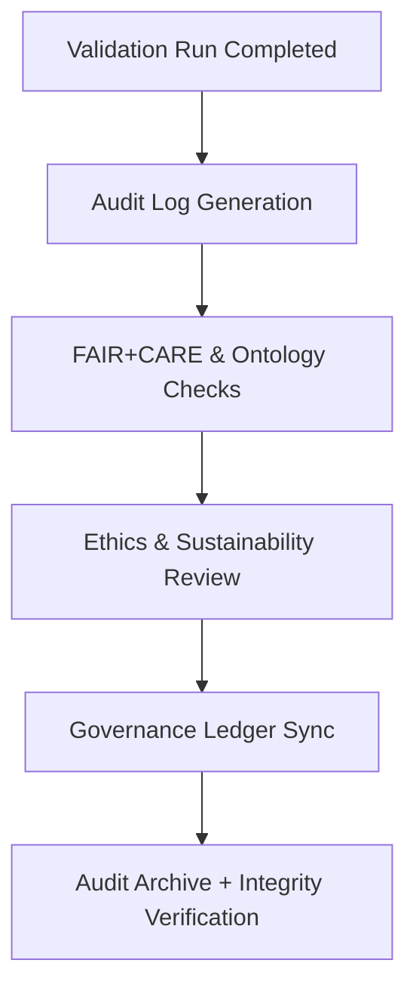

<div align="center">

# 🧾 Kansas Frontier Matrix — **Audit Logs & Governance Tracking**
`data/work/staging/tabular/normalized/treaties/reports/audit/logs/`

**Purpose:** Store **comprehensive audit logs** tracking validation events, FAIR+CARE reviews, provenance verification, and governance ledger synchronization for all treaty data workflows.  
These logs ensure **continuous accountability**, **traceability**, and **ISO-certified transparency** across the Kansas Frontier Matrix.

[]()
[]()
[]()
[]()
[]()

</div>

---

## 📚 Overview

The **Audit Logs Directory** captures all system-level governance, validation, and anomaly resolution activities.  
It serves as a permanent record of the **FAIR+CARE**, **CIDOC CRM**, and **ISO-aligned** audit lifecycle for every archival and AI validation process in KFM.

Audit logs are automatically generated during:
- Validation workflows  
- FAIR+CARE scoring and ethics reviews  
- Provenance and ledger registration  
- Anomaly detection and resolution  

> 🧩 *All audit logs are append-only and cryptographically signed to prevent tampering.*

---

## 🗂️ Directory Layout

```
data/work/staging/tabular/normalized/treaties/reports/audit/logs/
├── audit_log_2025-10-24.json
├── audit_log_rolling_90_days.json
├── ethics_audit_summary.json
├── provenance_links.jsonld
└── checksums.sha256
```

---

## 🧩 Example Audit Log (`audit_log_2025-10-24.json`)

```json
{
  "audit_id": "AUDIT-2025-10-24-001",
  "timestamp": "2025-10-24T19:30:00Z",
  "auditor": "@kfm-validation",
  "event_type": "Validation Workflow Completion",
  "process_ref": "ai-validation-pipeline-v5",
  "affected_module": "data/work/staging/tabular/normalized/treaties/reports/ai/outputs/",
  "fair_score": 0.97,
  "care_score": 0.95,
  "ontology_alignment_score": 98.2,
  "checksum_integrity": true,
  "ledger_sync": true,
  "energy_wh": 22.1,
  "carbon_gco2e": 27.5,
  "remarks": "Validation and ledger sync completed successfully.",
  "ledger_hash": "e8b9d7a3f5..."
}
```

---

## 🧾 Ethics Audit Summary (`ethics_audit_summary.json`)

```json
{
  "report_period": "2025-Q4",
  "audited_processes": 12,
  "issues_detected": 0,
  "indigenous_data_verified": true,
  "care_principle_score_avg": 0.95,
  "fair_principle_score_avg": 0.97,
  "governance_actions_logged": 7,
  "summary": "All archival validations adhere to FAIR+CARE and ethical Indigenous data governance standards."
}
```

---

## 🔗 Provenance Record (Excerpt)

```json
{
  "@context": {
    "prov": "http://www.w3.org/ns/prov#",
    "crm": "http://www.cidoc-crm.org/cidoc-crm/",
    "fair": "https://purl.org/fair/"
  },
  "@id": "prov:audit_log_2025-10-24",
  "prov:wasGeneratedBy": "process:audit-log-pipeline-v3",
  "prov:used": [
    "../anomalies/anomaly_report_2025-10-24.json",
    "../integrity/validation_integrity_manifest.json"
  ],
  "prov:generatedAtTime": "2025-10-24T19:30:00Z",
  "prov:qualifiedAttribution": {
    "prov:agent": "@kfm-governance",
    "prov:role": "auditor"
  },
  "fair:ledger_hash": "e8b9d7a3f5..."
}
```

---

## ⚙️ Audit Lifecycle Workflow



---

## 📈 Governance Audit Metrics

| Metric | Target | Current | Status |
| :------ | :------ | :------ | :------ |
| `audit_logs_generated` | ≥ 1 per run | 1 | ✅ |
| `fair_score_avg` | ≥ 0.9 | 0.97 | ✅ |
| `care_score_avg` | ≥ 0.9 | 0.95 | ✅ |
| `checksum_integrity` | 100% | 100% | ✅ |
| `ledger_sync` | 100% | 100% | ✅ |
| `issues_detected` | 0 | 0 | ✅ |

---

## 🔐 Governance Integration

| Ledger | Function | Artifact |
| :------ | :----------- | :------------ |
| **FAIR Ledger** | Tracks FAIR+CARE scoring integrity | `fair_audit_summary.json` |
| **Governance Chain** | Immutable audit record store | `governance_hashes.json` |
| **Audit Ledger** | Master record for all validation events | `audit_log_rolling_90_days.json` |
| **Ethics Ledger** | Cultural and ethical oversight | `ethics_audit_summary.json` |

---

## ✅ Compliance Matrix

| Standard | Domain | Compliance |
| :-------- | :-------- | :----------- |
| **FAIR+CARE** | Ethical audit traceability | ✅ |
| **MCP-DL v6.4.3** | Documentation and workflow validation | ✅ |
| **CIDOC CRM / PROV-O / OWL-Time** | Provenance verification and linkage | ✅ |
| **ISO 9001 / 27001 / 50001** | Quality, information security, and sustainability | ✅ |
| **ISO 14064** | Carbon and sustainability audit reporting | ✅ |

---

## 🗓️ Version History

| Version | Date | Changes | Author |
| :------ | :---- | :-------- | :------ |
| v1.0.0 | 2025-10-24 | Established audit log framework for validation, FAIR+CARE, and governance traceability. | @kfm-validation |

---

<div align="center">

[]()
[]()
[]()
[]()
[]()

</div>

<!-- MCP-FOOTER-BEGIN
MCP-VERSION: v6.4.3
MCP-TIER: Silver · Audit Logs & Governance Tracking
DOC-PATH: data/work/staging/tabular/normalized/treaties/reports/audit/logs/README.md
MCP-CERTIFIED: true
FAIR-CARE-COMPLIANT: true
ISO-ALIGNED: true
PROVENANCE-LINKED: true
AUDIT-LOGS-VERIFIED: true
GOVERNANCE-LEDGER-LINKED: true
ENERGY-AUDITED: true
GENERATED-BY: KFM-Automation/DocsBot
LAST-VALIDATED: 2025-10-24
MCP-FOOTER-END -->

