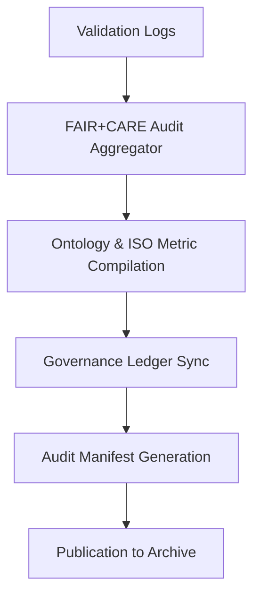

<div align="center">

# 🗂️ Kansas Frontier Matrix — **Audit Manifests & Verification Records**
`data/work/staging/tabular/normalized/treaties/reports/audit/manifests/`

**Purpose:** Store **audit manifest records** summarizing validation, anomaly, and governance results across the Kansas Frontier Matrix archival and AI systems.  
Each manifest acts as an immutable audit object — linking FAIR+CARE evaluations, ontology compliance, and ISO sustainability audits into one certified ledger reference.

[]()
[]()
[]()
[]()
[]()

</div>

---

## 📚 Overview

The **Audit Manifests Directory** consolidates all audit outcomes into structured JSON manifests, ensuring traceability, compliance, and provenance continuity.  
These manifests encapsulate:

- FAIR+CARE compliance scores per audit cycle  
- Validation performance and ontology alignment results  
- Energy, carbon, and sustainability metrics (ISO 50001 / 14064)  
- Ledger synchronization and checksum validation records  

> 🧩 *Each audit manifest serves as a verifiable proof-of-integrity report, stored permanently in the Governance Ledger.*

---

## 🗂️ Directory Layout

```
data/work/staging/tabular/normalized/treaties/reports/audit/manifests/
├── audit_manifest_2025-10-24.json
├── audit_manifest_rolling_90_days.json
├── faircare_audit_manifest.json
├── energy_audit_manifest.json
├── checksums.sha256
└── provenance_links.jsonld
```

---

## 🧩 Example Audit Manifest (`audit_manifest_2025-10-24.json`)

```json
{
  "manifest_id": "AUDIT-MAN-2025-10-24",
  "timestamp": "2025-10-24T19:45:00Z",
  "auditor": "@kfm-validation",
  "governance_cycle": "Q4 2025",
  "validation_reports_included": 34,
  "faircare_avg": {
    "fair": 0.97,
    "care": 0.95
  },
  "ontology_alignment_score_avg": 98.1,
  "checksum_integrity": true,
  "energy_wh_avg": 22.0,
  "carbon_gco2e_avg": 27.6,
  "ledger_sync_success": true,
  "governance_hash": "f3d9a6e1b7...",
  "status": "validated"
}
```

---

## 🧠 FAIR+CARE Audit Manifest Example (`faircare_audit_manifest.json`)

```json
{
  "report_period": "2025-10-01 / 2025-10-24",
  "total_audits": 12,
  "average_fair_score": 0.97,
  "average_care_score": 0.95,
  "ethics_flags": 0,
  "issues_detected": [],
  "verified_by": "@kfm-ethics",
  "governance_sync": true
}
```

---

## 🔋 Energy Audit Manifest (`energy_audit_manifest.json`)

```json
{
  "audit_period": "Q4 2025",
  "average_energy_wh_per_run": 22.0,
  "average_carbon_gco2e_per_run": 27.6,
  "renewable_energy_ratio": 1.0,
  "iso_50001_verified": true,
  "carbon_offset_certified": "ISO 14064",
  "audited_by": "@kfm-sustainability",
  "status": "compliant"
}
```

---

## 🔗 Provenance Record (Excerpt)

```json
{
  "@context": {
    "prov": "http://www.w3.org/ns/prov#",
    "crm": "http://www.cidoc-crm.org/cidoc-crm/",
    "fair": "https://purl.org/fair/"
  },
  "@id": "prov:audit_manifest_2025-10-24",
  "prov:wasGeneratedBy": "process:audit-manifest-pipeline-v4",
  "prov:used": [
    "../logs/audit_log_2025-10-24.json",
    "../anomalies/anomaly_report_2025-10-24.json"
  ],
  "prov:generatedAtTime": "2025-10-24T19:45:00Z",
  "prov:qualifiedAttribution": {
    "prov:agent": "@kfm-governance",
    "prov:role": "auditor"
  },
  "fair:ledger_hash": "f3d9a6e1b7..."
}
```

---

## ⚙️ Audit Manifest Workflow



---

## 📈 Key Audit Metrics

| Metric | Target | Current | Status |
| :------ | :------ | :------ | :------ |
| `fair_score_avg` | ≥ 0.9 | 0.97 | ✅ |
| `care_score_avg` | ≥ 0.9 | 0.95 | ✅ |
| `ontology_alignment_score_avg` | ≥ 95 | 98.1 | ✅ |
| `checksum_integrity` | 100% | 100% | ✅ |
| `ledger_sync_success` | 100% | 100% | ✅ |

---

## 🔐 Governance Integration

| Ledger | Purpose | Artifact |
| :------ | :----------- | :------------ |
| **FAIR Ledger** | FAIR+CARE compliance and documentation | `faircare_audit_manifest.json` |
| **Governance Chain** | Immutable record of all audits | `governance_hashes.json` |
| **Audit Ledger** | Summary of all validation & anomaly reviews | `audit_manifest_rolling_90_days.json` |
| **Ethics Ledger** | Verifies cultural and ethical audit compliance | `ethics_audit_review.json` |

---

## ✅ Compliance Matrix

| Standard | Domain | Compliance |
| :-------- | :-------- | :----------- |
| **FAIR+CARE** | Transparent and ethical audit aggregation | ✅ |
| **MCP-DL v6.4.3** | Documentation + governance integration | ✅ |
| **CIDOC CRM / PROV-O / OWL-Time** | Provenance and audit linkage | ✅ |
| **ISO 9001 / 27001 / 50001** | Quality, security, and energy tracking | ✅ |
| **ISO 14064** | Carbon reporting compliance | ✅ |

---

## 🗓️ Version History

| Version | Date | Changes | Author |
| :------ | :---- | :-------- | :------ |
| v1.0.0 | 2025-10-24 | Established the Audit Manifest directory and created FAIR+CARE, ISO, and governance-linked verification manifest templates. | @kfm-validation |

---

<div align="center">

[]()
[]()
[]()
[]()
[]()

</div>

<!-- MCP-FOOTER-BEGIN
MCP-VERSION: v6.4.3
MCP-TIER: Silver · Audit Manifest Records
DOC-PATH: data/work/staging/tabular/normalized/treaties/reports/audit/manifests/README.md
MCP-CERTIFIED: true
FAIR-CARE-COMPLIANT: true
ISO-ALIGNED: true
PROVENANCE-LINKED: true
AUDIT-MANIFEST-VERIFIED: true
GOVERNANCE-LEDGER-LINKED: true
ENERGY-AUDITED: true
GENERATED-BY: KFM-Automation/DocsBot
LAST-VALIDATED: 2025-10-24
MCP-FOOTER-END -->

