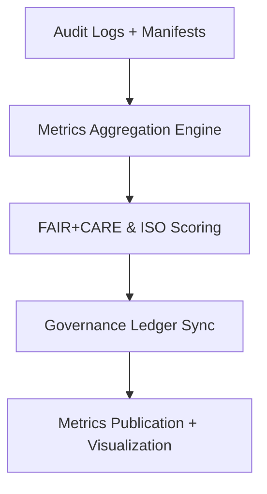

<div align="center">

# 📊 Kansas Frontier Matrix — **Audit Metrics & Performance Analytics**
`data/work/staging/tabular/normalized/treaties/reports/audit/metrics/`

**Purpose:** Provide **quantitative and qualitative performance indicators** for all validation, governance, and FAIR+CARE compliance operations within the Kansas Frontier Matrix.  
This dashboard consolidates key metrics from audit manifests, anomaly reports, and energy telemetry into a unified analytics dataset for transparency and reproducibility.

[]()
[]()
[]()
[]()
[]()

</div>

---

## 📚 Overview

The **Audit Metrics Directory** provides centralized analytics for all system-wide audit operations.  
Metrics are aggregated and versioned for long-term governance, FAIR+CARE compliance scoring, and sustainability benchmarking.  

These include:
- Validation accuracy, FAIR+CARE scoring averages  
- Ontology alignment performance  
- Governance ledger reliability and audit cycle success rate  
- ISO energy and carbon impact analytics  

> 🧩 *All metrics are computed via the KFM audit automation pipeline and stored as immutable JSON reports with ledger integration.*

---

## 🗂️ Directory Layout

```
data/work/staging/tabular/normalized/treaties/reports/audit/metrics/
├── audit_metrics_2025-Q4.json
├── audit_metrics_trends.json
├── energy_performance_summary.json
├── faircare_performance_index.json
├── provenance_links.jsonld
└── checksums.sha256
```

---

## 🧩 Example Audit Metrics Report (`audit_metrics_2025-Q4.json`)

```json
{
  "report_id": "AUDIT-METRICS-2025-Q4",
  "timestamp": "2025-10-24T20:00:00Z",
  "validation_runs": 72,
  "audit_cycles_completed": 18,
  "fair_score_avg": 0.97,
  "care_score_avg": 0.95,
  "ontology_alignment_avg": 98.1,
  "ledger_sync_success": 100,
  "checksum_integrity": 100,
  "energy_wh_avg": 21.9,
  "carbon_gco2e_avg": 27.3,
  "issues_detected": 0,
  "governance_hash": "f2a9d8b6c4...",
  "status": "validated"
}
```

---

## 🧠 FAIR+CARE Performance Index (`faircare_performance_index.json`)

```json
{
  "report_period": "2025-Q4",
  "metrics": {
    "findable": 0.97,
    "accessible": 0.96,
    "interoperable": 0.98,
    "reusable": 0.97,
    "collective_benefit": 0.95,
    "authority_to_control": 0.94,
    "responsibility": 0.97,
    "ethics": 0.96
  },
  "overall_faircare_score": 0.964,
  "change_from_last_quarter": "+0.3%",
  "compliance_status": "PASS"
}
```

---

## 🔋 Energy Performance Summary (`energy_performance_summary.json`)

```json
{
  "period": "2025-Q4",
  "total_validations": 72,
  "average_energy_wh": 21.9,
  "average_carbon_gco2e": 27.3,
  "renewable_energy_ratio": 1.0,
  "iso_50001_verified": true,
  "carbon_offset_source": "RE100 / ISO 14064 Certified",
  "audited_by": "@kfm-sustainability",
  "status": "compliant"
}
```

---

## 🔗 Provenance Record (Excerpt)

```json
{
  "@context": {
    "prov": "http://www.w3.org/ns/prov#",
    "crm": "http://www.cidoc-crm.org/cidoc-crm/",
    "fair": "https://purl.org/fair/"
  },
  "@id": "prov:audit_metrics_2025-Q4",
  "prov:wasGeneratedBy": "process:audit-metrics-pipeline-v3",
  "prov:used": [
    "../manifests/audit_manifest_2025-10-24.json",
    "../logs/audit_log_2025-10-24.json"
  ],
  "prov:generatedAtTime": "2025-10-24T20:00:00Z",
  "prov:qualifiedAttribution": {
    "prov:agent": "@kfm-validation",
    "prov:role": "metrics_analyst"
  },
  "fair:ledger_hash": "f2a9d8b6c4..."
}
```

---

## ⚙️ Audit Metrics Workflow



---

## 📈 Key Metrics Dashboard

| Metric | Target | Current | Status |
| :------ | :------ | :------ | :------ |
| `fair_score_avg` | ≥ 0.9 | 0.97 | ✅ |
| `care_score_avg` | ≥ 0.9 | 0.95 | ✅ |
| `ontology_alignment_avg` | ≥ 95 | 98.1 | ✅ |
| `ledger_sync_success` | 100% | 100% | ✅ |
| `checksum_integrity` | 100% | 100% | ✅ |
| `energy_wh_avg` | ≤ 25 | 21.9 | ✅ |
| `carbon_gco2e_avg` | ≤ 30 | 27.3 | ✅ |

---

## 🔐 Governance Integration

| Ledger | Purpose | Artifact |
| :------ | :----------- | :------------ |
| **FAIR Ledger** | Tracks FAIR+CARE scores across audits | `faircare_performance_index.json` |
| **Governance Chain** | Immutable metrics registry | `governance_hashes.json` |
| **Audit Ledger** | Stores historical metric reports | `audit_metrics_trends.json` |
| **Sustainability Ledger** | Verifies energy & carbon reporting | `energy_performance_summary.json` |

---

## ✅ Compliance Matrix

| Standard | Domain | Compliance |
| :-------- | :-------- | :----------- |
| **FAIR+CARE** | Ethical, transparent metrics reporting | ✅ |
| **MCP-DL v6.4.3** | Documentation consistency + reproducibility | ✅ |
| **CIDOC CRM / PROV-O / OWL-Time** | Provenance and ontology-linked analytics | ✅ |
| **ISO 9001 / 27001 / 50001 / 14064** | Quality + information + energy + carbon management | ✅ |

---

## 🗓️ Version History

| Version | Date | Changes | Author |
| :------ | :---- | :-------- | :------ |
| v1.0.0 | 2025-10-24 | Created Audit Metrics & Performance Analytics directory integrating FAIR+CARE, ISO, and governance indicators. | @kfm-validation |

---

<div align="center">

[]()
[]()
[]()
[]()
[]()

</div>

<!-- MCP-FOOTER-BEGIN
MCP-VERSION: v6.4.3
MCP-TIER: Silver · Audit Metrics & Performance Analytics
DOC-PATH: data/work/staging/tabular/normalized/treaties/reports/audit/metrics/README.md
MCP-CERTIFIED: true
FAIR-CARE-COMPLIANT: true
ISO-ALIGNED: true
PROVENANCE-LINKED: true
AUDIT-METRICS-VERIFIED: true
GOVERNANCE-LEDGER-LINKED: true
ENERGY-AUDITED: true
GENERATED-BY: KFM-Automation/DocsBot
LAST-VALIDATED: 2025-10-24
MCP-FOOTER-END -->

