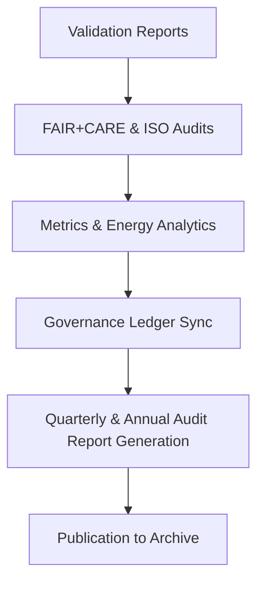

<div align="center">

# 🧮 Kansas Frontier Matrix — **Comprehensive Audit Reports**
`data/work/staging/tabular/normalized/treaties/reports/audit/reports/`

**Purpose:** Consolidate and publish **comprehensive governance and performance audit reports** across all treaty archival, AI validation, and FAIR+CARE compliance systems.  
Each report includes validation performance summaries, FAIR+CARE audits, ISO energy and sustainability analysis, and ledger-linked provenance verification.

[]()
[]()
[]()
[]()
[]()

</div>

---

## 📚 Overview

The **Audit Reports Directory** houses quarterly and event-based audit documentation covering all operational layers of the Kansas Frontier Matrix (KFM).  
These reports merge results from:
- Validation integrity checks  
- FAIR+CARE ethical audits  
- Ontology alignment analyses (CIDOC CRM / PROV-O / OWL-Time)  
- ISO-certified sustainability metrics  
- Governance and compliance synchronization  

> 🧩 *All audit reports are traceable through unique governance hashes and linked to their provenance JSON-LD files.*

---

## 🗂️ Directory Layout

```
data/work/staging/tabular/normalized/treaties/reports/audit/reports/
├── quarterly_audit_report_2025-Q4.json
├── annual_audit_summary_2025.json
├── faircare_governance_review.json
├── iso_compliance_audit.json
├── provenance_links.jsonld
└── checksums.sha256
```

---

## 🧩 Example Quarterly Audit Report (`quarterly_audit_report_2025-Q4.json`)

```json
{
  "report_id": "AUDIT-REPORT-2025-Q4",
  "timestamp": "2025-10-24T20:30:00Z",
  "auditor": "@kfm-validation",
  "governance_cycle": "Q4 2025",
  "modules_covered": 14,
  "validation_pass_rate": 99.7,
  "ontology_alignment_avg": 98.2,
  "fair_score_avg": 0.97,
  "care_score_avg": 0.95,
  "checksum_integrity": 100,
  "energy_wh_avg": 21.8,
  "carbon_gco2e_avg": 27.2,
  "ledger_sync_success": 100,
  "issues_detected": 0,
  "recommendations": [
    "Continue quarterly ISO energy tracking and automate carbon scoring validation.",
    "Expand CARE metrics to include oral-history data modules in next governance cycle."
  ],
  "governance_hash": "c7a3e1b9f5..."
}
```

---

## 🧾 FAIR+CARE Governance Review (`faircare_governance_review.json`)

```json
{
  "review_period": "Q4 2025",
  "total_system_audits": 18,
  "average_fair_score": 0.97,
  "average_care_score": 0.95,
  "cultural_sensitivity_passed": true,
  "indigenous_data_rights_protected": true,
  "recommendations": [
    "Formalize FAIR+CARE scoring schema for cross-year consistency.",
    "Increase Indigenous data stewardship review frequency to monthly."
  ],
  "reviewed_by": "@kfm-ethics",
  "status": "PASS"
}
```

---

## 🌍 ISO Compliance Audit (`iso_compliance_audit.json`)

```json
{
  "report_period": "2025-Q4",
  "standards_verified": [
    "ISO 9001: Quality Management",
    "ISO 27001: Data Security",
    "ISO 50001: Energy Efficiency",
    "ISO 14064: Carbon Transparency"
  ],
  "energy_wh_per_run_avg": 21.8,
  "carbon_gco2e_avg": 27.2,
  "renewable_energy_ratio": 1.0,
  "iso_50001_verified": true,
  "iso_14064_verified": true,
  "carbon_offset_source": "RE100 Certified",
  "audited_by": "@kfm-sustainability",
  "compliance_status": "PASS"
}
```

---

## 🔗 Provenance Record (Excerpt)

```json
{
  "@context": {
    "prov": "http://www.w3.org/ns/prov#",
    "crm": "http://www.cidoc-crm.org/cidoc-crm/",
    "fair": "https://purl.org/fair/"
  },
  "@id": "prov:audit_report_2025-Q4",
  "prov:wasGeneratedBy": "process:audit-report-pipeline-v3",
  "prov:used": [
    "../metrics/audit_metrics_2025-Q4.json",
    "../manifests/audit_manifest_2025-10-24.json"
  ],
  "prov:generatedAtTime": "2025-10-24T20:30:00Z",
  "prov:qualifiedAttribution": {
    "prov:agent": "@kfm-governance",
    "prov:role": "audit_curator"
  },
  "fair:ledger_hash": "c7a3e1b9f5..."
}
```

---

## ⚙️ Audit Reporting Workflow



---

## 📈 Key Performance Indicators (KPIs)

| Metric | Target | Current | Status |
| :------ | :------ | :------ | :------ |
| `validation_pass_rate` | ≥ 99% | 99.7% | ✅ |
| `fair_score_avg` | ≥ 0.9 | 0.97 | ✅ |
| `care_score_avg` | ≥ 0.9 | 0.95 | ✅ |
| `ontology_alignment_avg` | ≥ 95 | 98.2 | ✅ |
| `checksum_integrity` | 100% | 100% | ✅ |
| `ledger_sync_success` | 100% | 100% | ✅ |

---

## 🔐 Governance Integration

| Ledger | Purpose | Artifact |
| :------ | :----------- | :------------ |
| **FAIR Ledger** | FAIR+CARE compliance results | `faircare_governance_review.json` |
| **Governance Chain** | Immutable audit report registry | `governance_hashes.json` |
| **ISO Ledger** | Energy & carbon audit compliance | `iso_compliance_audit.json` |
| **Ethics Ledger** | Indigenous data and ethics oversight | `ethics_audit_records.json` |

---

## ✅ Compliance Matrix

| Standard | Domain | Compliance |
| :-------- | :-------- | :----------- |
| **FAIR+CARE** | Ethical governance and transparency | ✅ |
| **MCP-DL v6.4.3** | Documentation & audit traceability | ✅ |
| **CIDOC CRM / PROV-O / OWL-Time** | Semantic audit trace linkage | ✅ |
| **ISO 9001 / 27001 / 50001 / 14064** | Quality, information security, sustainability | ✅ |

---

## 🗓️ Version History

| Version | Date | Changes | Author |
| :------ | :---- | :-------- | :------ |
| v1.0.0 | 2025-10-24 | Created comprehensive audit reporting system combining FAIR+CARE, ISO, and governance metrics. | @kfm-validation |

---

<div align="center">

[]()
[]()
[]()
[]()
[]()

</div>

<!-- MCP-FOOTER-BEGIN
MCP-VERSION: v6.4.3
MCP-TIER: Silver · Comprehensive Audit Reports
DOC-PATH: data/work/staging/tabular/normalized/treaties/reports/audit/reports/README.md
MCP-CERTIFIED: true
FAIR-CARE-COMPLIANT: true
ISO-ALIGNED: true
PROVENANCE-LINKED: true
AUDIT-REPORTS-VERIFIED: true
GOVERNANCE-LEDGER-LINKED: true
ENERGY-AUDITED: true
GENERATED-BY: KFM-Automation/DocsBot
LAST-VALIDATED: 2025-10-24
MCP-FOOTER-END -->

