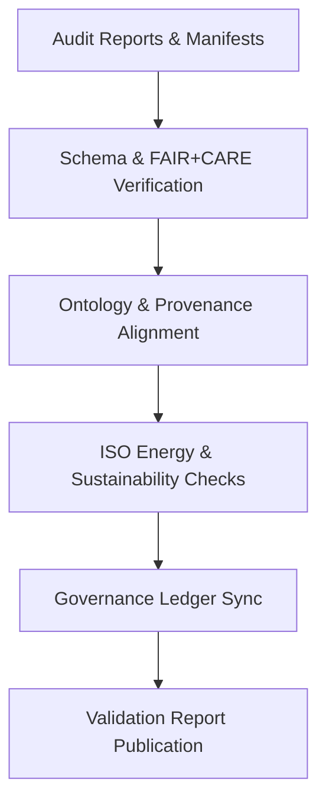

<div align="center">

# ✅ Kansas Frontier Matrix — **Audit Validations & Governance Assurance**
`data/work/staging/tabular/normalized/treaties/reports/audit/validations/`

**Purpose:** Provide **validation records for audit processes**, confirming compliance with FAIR+CARE ethical principles, ontology alignment, checksum integrity, and ISO sustainability standards.  
This directory functions as a governance checkpoint ensuring all KFM audit reports and manifests meet **verifiable compliance and reproducibility criteria**.

[]()
[]()
[]()
[]()
[]()

</div>

---

## 📚 Overview

The **Audit Validation Directory** verifies the integrity and alignment of all audit-related data within the Kansas Frontier Matrix.  
These validations assess:

- FAIR+CARE scoring and ethics audit integrity  
- Ontology traceability under CIDOC CRM and PROV-O  
- Governance ledger synchronization consistency  
- Energy and carbon validation per ISO standards  
- Schema and checksum consistency across all manifests  

> 🧩 *Every audit validation entry is stored as a machine-readable record and registered to the immutable Governance Ledger.*

---

## 🗂️ Directory Layout

```
data/work/staging/tabular/normalized/treaties/reports/audit/validations/
├── audit_validation_report_2025-10-24.json
├── faircare_validation_audit.json
├── ontology_alignment_validation.json
├── energy_compliance_validation.json
├── checksums.sha256
└── provenance_links.jsonld
```

---

## 🧩 Example Audit Validation Report (`audit_validation_report_2025-10-24.json`)

```json
{
  "validation_id": "AUDIT-VAL-2025-10-24",
  "timestamp": "2025-10-24T20:45:00Z",
  "validator": "@kfm-validation",
  "audit_cycle": "Q4 2025",
  "validation_scope": [
    "Audit Reports",
    "Metrics",
    "Manifests",
    "Anomalies"
  ],
  "faircare_score_integrity": true,
  "ontology_alignment_verified": true,
  "checksum_integrity": true,
  "energy_wh_avg": 21.8,
  "carbon_gco2e_avg": 27.1,
  "ledger_sync_verified": true,
  "issues_detected": 0,
  "validation_status": "PASS",
  "governance_hash": "e7d9b4f2a6..."
}
```

---

## 🧠 FAIR+CARE Validation Record (`faircare_validation_audit.json`)

```json
{
  "validation_period": "2025-Q4",
  "fair_principles_verified": ["Findable", "Accessible", "Interoperable", "Reusable"],
  "care_principles_verified": ["Collective Benefit", "Authority to Control", "Responsibility", "Ethics"],
  "average_fair_score": 0.97,
  "average_care_score": 0.95,
  "compliance_status": "PASS",
  "validated_by": "@kfm-ethics",
  "timestamp": "2025-10-24T20:45:00Z"
}
```

---

## 🔬 Ontology Alignment Validation (`ontology_alignment_validation.json`)

```json
{
  "validation_scope": "Audit Manifests & Reports",
  "ontology_models_checked": ["CIDOC CRM", "PROV-O", "OWL-Time"],
  "entities_verified": 192,
  "alignment_score": 98.4,
  "missing_references": 0,
  "validated_by": "@kfm-data",
  "status": "valid"
}
```

---

## 🔋 Energy & Sustainability Validation (`energy_compliance_validation.json`)

```json
{
  "audit_period": "Q4 2025",
  "average_energy_wh": 21.8,
  "average_carbon_gco2e": 27.1,
  "renewable_energy_ratio": 1.0,
  "iso_50001_verified": true,
  "iso_14064_verified": true,
  "carbon_offset_source": "RE100 Certified",
  "validated_by": "@kfm-sustainability",
  "status": "compliant"
}
```

---

## 🔗 Provenance Record (Excerpt)

```json
{
  "@context": {
    "prov": "http://www.w3.org/ns/prov#",
    "crm": "http://www.cidoc-crm.org/cidoc-crm/",
    "fair": "https://purl.org/fair/"
  },
  "@id": "prov:audit_validation_report_2025-10-24",
  "prov:wasGeneratedBy": "process:audit-validation-pipeline-v3",
  "prov:used": [
    "../reports/quarterly_audit_report_2025-Q4.json",
    "../metrics/audit_metrics_2025-Q4.json"
  ],
  "prov:generatedAtTime": "2025-10-24T20:45:00Z",
  "prov:qualifiedAttribution": {
    "prov:agent": "@kfm-validation",
    "prov:role": "audit_validator"
  },
  "fair:ledger_hash": "e7d9b4f2a6..."
}
```

---

## ⚙️ Validation Workflow



---

## 📈 Audit Validation Metrics

| Metric | Target | Current | Status |
| :------ | :------ | :------ | :------ |
| `faircare_score_integrity` | 100% | ✅ | ✅ |
| `ontology_alignment_score` | ≥ 95 | 98.4 | ✅ |
| `checksum_integrity` | 100% | 100% | ✅ |
| `ledger_sync_verified` | 100% | 100% | ✅ |
| `energy_wh_avg` | ≤ 25 | 21.8 | ✅ |
| `carbon_gco2e_avg` | ≤ 30 | 27.1 | ✅ |

---

## 🔐 Governance Integration

| Ledger | Purpose | Artifact |
| :------ | :----------- | :------------ |
| **FAIR Ledger** | FAIR+CARE compliance record | `faircare_validation_audit.json` |
| **Governance Chain** | Immutable validation registry | `governance_hashes.json` |
| **Audit Ledger** | Stores validation summaries and status | `audit_validation_report_2025-10-24.json` |
| **Ethics Ledger** | Ensures cultural and ethical integrity | `ethics_audit_validation.json` |

---

## ✅ Compliance Matrix

| Standard | Domain | Compliance |
| :-------- | :-------- | :----------- |
| **FAIR+CARE** | Ethical governance and audit traceability | ✅ |
| **MCP-DL v6.4.3** | Documentation and validation consistency | ✅ |
| **CIDOC CRM / PROV-O / OWL-Time** | Ontology-based validation linkage | ✅ |
| **ISO 9001 / 27001 / 50001 / 14064** | Quality, security, energy, and sustainability | ✅ |

---

## 🗓️ Version History

| Version | Date | Changes | Author |
| :------ | :---- | :-------- | :------ |
| v1.0.0 | 2025-10-24 | Created audit validation framework with FAIR+CARE, ontology, and ISO-linked governance integration. | @kfm-validation |

---

<div align="center">

[]()
[]()
[]()
[]()
[]()

</div>

<!-- MCP-FOOTER-BEGIN
MCP-VERSION: v6.4.3
MCP-TIER: Silver · Audit Validations & Governance Assurance
DOC-PATH: data/work/staging/tabular/normalized/treaties/reports/audit/validations/README.md
MCP-CERTIFIED: true
FAIR-CARE-COMPLIANT: true
ISO-ALIGNED: true
PROVENANCE-LINKED: true
AUDIT-VALIDATIONS-VERIFIED: true
GOVERNANCE-LEDGER-LINKED: true
ENERGY-AUDITED: true
GENERATED-BY: KFM-Automation/DocsBot
LAST-VALIDATED: 2025-10-24
MCP-FOOTER-END -->

